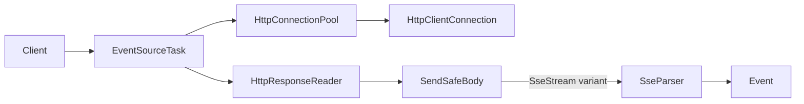
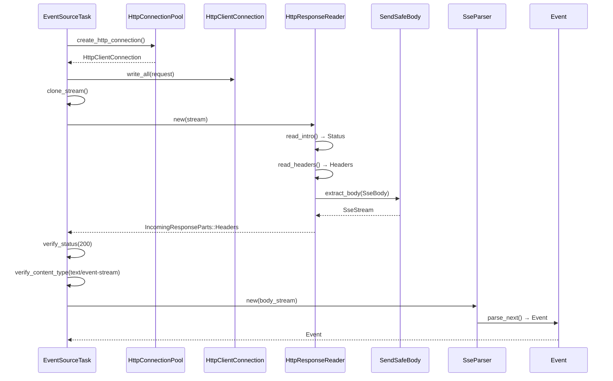

# Overview

Fix the SSE (Server-Sent Events) client in `foundation_core` to properly parse HTTP response headers before attempting to parse SSE events. Currently, the `EventSourceTask` sends an HTTP request and immediately wraps the stream in an `SseParser`, causing HTTP response headers to be incorrectly parsed as SSE events.

## Goals

- Goal 1: Parse HTTP response (status, headers) before SSE parsing
- Goal 2: Verify Content-Type is `text/event-stream` before SSE parsing
- Goal 3: Extract stream positioned at body for SSE parsing
- Goal 4: Add `SendSafeBody::SseStream` variant for proper SSE stream handling
- Goal 5: Maintain backward compatibility with existing `SseParser` usage

## Implementation Location

- Primary implementation: `backends/foundation_core/src/wire/simple_http/`
- SSE client: `backends/foundation_core/src/wire/event_source/task.rs`
- Feature specifications: `specifications/24-sse-http-response-fix/features/00-sse-body-integration/feature.md`

## Known Issues

The current `EventSourceTask` implementation (in `task.rs` lines 356-367) sends an HTTP request and immediately creates an `SseParser` from the raw stream:

```rust
// Render full HTTP request (headers + body) and write to socket
let mut stream_writer = stream.clone();
let _ = Http11::Request(*request).http_render_to_writer(&mut stream_writer);
let _ = stream_writer.flush();

// Create parser from cloned stream  <-- WRONG: HTTP response headers still in stream
let parser = SseParser::new(stream);
```

This causes `SseParser` to receive:
- `"HTTP/1.1 200 OK\r\n"` - parsed as SSE field (invalid)
- `"Content-Type: text/event-stream\r\n"` - parsed as SSE field (invalid)
- `"Connection: close\r\n"` - parsed as SSE field (invalid)
- `"\r\n"` - empty line (dispatches empty event)
- `"data: {...}\n"` - actual SSE data (too late)

## Language Stack

**IMPORTANT:** Agents MUST identify the language stack below and read the corresponding skills BEFORE implementation.

### Languages Used

| Language | Purpose | Skill Location |
|----------|---------|----------------|
| Rust | HTTP client and SSE implementation | `.agents/skills/rust-clean-code/skill.md` |

### Mandatory Pre-Implementation Steps

1. **Identify languages** from this section
2. **Read language skills** - for each language:
   - Locate skill at `.agents/skills/[language]-clean-code/skill.md`
   - If skill exists: read it completely before writing any code
   - If skill missing: **STOP** - launch agent to generate the skill first, then read it
3. **Document skills** - add this item to any start.md workflow so future agents remember
4. **Follow standards strictly** - zero tolerance for deviations from documented standards

### Language-Specific Requirements

**Rust Requirements:**
- Run `cargo fmt` before commit
- Zero clippy warnings
- All public items documented with `///` comments
- Tests in `tests/` directory following project conventions
- Integration tests in `tests/` directory with proper naming

---

## Feature Index

The implementation is divided into features with clear dependencies. Each feature contains detailed requirements, tasks, and verification steps in its respective `feature.md` file.

**Implementation Guidelines:**
- Implement features in dependency order
- Each feature contains complete requirements and tasks
- Refer to individual feature.md files for detailed specifications

| #  | Feature | Description | Dependencies | Status |
|----|---------|-------------|--------------|--------|
| 0  | [sse-body-integration](./features/00-sse-body-integration/feature.md) | Add SendSafeBody::SseStream and fix HTTP response parsing | None | 🔄 In Progress |

Status Key: ⬜ Pending | 🔄 In Progress | ✅ Complete

## Requirements Conversation Summary

This specification was created through collaborative requirements gathering with the user, focusing on:

1. **Problem Identification**: The SSE client incorrectly bypasses HTTP response parsing, causing HTTP headers to be parsed as SSE events
2. **Solution Approach**: Use `HttpResponseReader` to parse HTTP response first, then extract stream for SSE parsing
3. **Integration Strategy**: Add `SendSafeBody::SseStream` variant to represent SSE streams properly in the HTTP layer
4. **Backward Compatibility**: Maintain existing `SseParser` API while fixing the underlying issue

## High-Level Architecture

**CRITICAL:** This section contains the complete architectural specification. Do NOT create separate architecture.md files. All technical decisions, component descriptions, and design rationale belong here or in feature.md files.

**Use Mermaid diagrams** to visualize architecture and processes for clarity.

### Architecture Overview

**System Architecture:**


1. **HttpResponseReader**: Parses HTTP response intro, headers, and body
2. **SendSafeBody::SseStream**: New variant for SSE stream bodies
3. **SseParser**: Parses SSE events from stream positioned at body
4. **EventSourceTask**: Orchestrates HTTP request → response parsing → SSE parsing

### Component Relationships

**Component Interaction:**


- `EventSourceTask` → `HttpConnectionPool`: Establish connection
- `EventSourceTask` → `HttpResponseReader`: Parse HTTP response
- `HttpResponseReader` → `SendSafeBody`: Extract body (including new `SseStream`)
- `SendSafeBody::SseStream` → `SseParser`: Parse SSE events

### Data Flow

**Request/Response Flow:**


1. Client sends HTTP request via `EventSourceTask`
2. `HttpResponseReader` parses HTTP response intro line (status code)
3. `HttpResponseReader` parses HTTP headers
4. If `Content-Type: text/event-stream`, sets up `SseBody` state
5. Body extraction returns `SendSafeBody::SseStream` containing stream + parser
6. `EventSourceTask` creates `SseParser` from extracted body stream
7. `SseParser` parses actual SSE events (not HTTP headers)

### Technical Decisions and Trade-offs

| Decision | Rationale | Alternatives Considered |
|----------|-----------|------------------------|
| Add `SendSafeBody::SseStream` variant | SSE is an HTTP feature, belongs in HTTP layer | Keep SSE parsing only in event_source module (rejected: doesn't solve the problem) |
| Move `SseParser` to `simple_http/sse.rs` | SSE is HTTP protocol extension | Keep in `event_source/` (rejected: wrong abstraction layer) |
| Add `Body::SseBody` to internal enum | Consistent with other body types (ChunkedBody, LineFeedBody) | Inline SSE detection (rejected: breaks abstraction) |
| Keep backward compatibility | Existing code using `SseParser` directly should still work | Breaking change (rejected: unnecessary disruption) |
| Use `HttpResponseReader` for response parsing | Already handles HTTP response parsing correctly | Manual header parsing (rejected: duplication, error-prone) |

### Implementation Order

1. **Phase 1**: Create `SseBody` variant and `SseBodyExtractor` in `simple_http`
2. **Phase 2**: Update `HttpResponseReader` to detect and handle SSE content type
3. **Phase 3**: Update `EventSourceTask` to use `HttpResponseReader` before SSE parsing
4. **Phase 4**: Add tests for HTTP response parsing before SSE events
5. **Phase 5**: Verify existing tests pass with new implementation

## Success Criteria (Spec-Wide)

This specification is considered complete when:

### Functionality
- HTTP response headers are parsed and verified before SSE parsing
- Content-Type is verified to be `text/event-stream` before SSE parsing
- HTTP status code is verified to be 200 OK before SSE parsing
- SSE events are correctly parsed from the body stream
- Existing `SseParser` API remains backward compatible

### Code Quality
- Zero warnings from clippy
- Code formatting passes `cargo fmt`
- All public items documented with `///` comments
- All existing tests pass
- New integration tests demonstrate HTTP response parsing before SSE

### Documentation
- Module documentation updated
- `LEARNINGS.md` captures design decisions and trade-offs
- `VERIFICATION.md` produced with all verification checks passing
- `REPORT.md` created documenting final implementation

## Module References

Agents implementing features should read these documentation files:
- `documentation/simple_http/doc.md` - HTTP client patterns and conventions (if exists)
- `documentation/event_source/doc.md` - SSE patterns and conventions (if exists)

---

_Created: 2026-05-11_
_Last Updated: 2026-05-11_
_Structure: Feature-based (has_features: true)_
