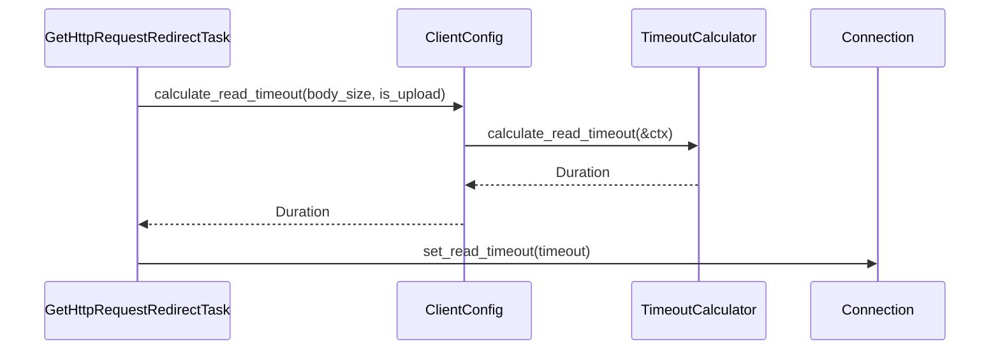

# Feature: Client Integration

## Overview

Integrate the `TimeoutCalculator` into the HTTP client's `GetHttpRequestRedirectTask` to replace fixed timeouts with dynamic, size-based timeouts. This reduces test execution time and improves production performance.

## Implementation Status

**Status:** ✅ COMPLETE

**Files Modified:**
- `backends/foundation_core/src/wire/simple_http/client/client.rs`
- `backends/foundation_core/src/wire/simple_http/client/tasks/request_redirect.rs`

## What Was Implemented

### 1. ClientConfig Integration

Added `TimeoutCalculator` to `ClientConfig`:

```rust
pub struct ClientConfig {
    // ... existing fields ...
    /// Dynamic timeout calculator for size-based timeout calculation
    pub timeout_calculator: TimeoutCalculator,
}
```

Default initialization:
```rust
impl Default for ClientConfig {
    fn default() -> Self {
        Self {
            // ... other fields ...
            timeout_calculator: TimeoutCalculator::new(),
        }
    }
}
```

### 2. Dynamic Timeout Methods

Added methods to `ClientConfig` for calculating timeouts:

```rust
/// Calculates dynamic read timeout based on expected body size
pub fn calculate_read_timeout(
    &self,
    expected_body_size: Option<usize>,
    is_upload: bool,
) -> std::time::Duration {
    let mut ctx = TimeoutContext::default();
    if let Some(size) = expected_body_size {
        ctx.expected_body_size = Some(size);
    }
    ctx.is_upload = is_upload;
    self.timeout_calculator.calculate_read_timeout(&ctx)
}

/// Calculates dynamic write timeout based on body size
pub fn calculate_write_timeout(&self, body_size: Option<usize>) -> std::time::Duration {
    let ctx = TimeoutContext::with_size(body_size.unwrap_or(0));
    self.timeout_calculator.calculate_write_timeout(&ctx)
}
```

### 3. Request-Based Timeout Calculation

Modified `GetHttpRequestRedirectTask` to calculate timeouts based on request context:

**For HEAD requests:**
```rust
let is_head_request = matches!(data.method, SimpleMethod::HEAD);

let read_timeout = if is_head_request {
    // HEAD requests have no body, use minimum timeout (100ms)
    config.timeout_calculator.calculate_read_timeout(
        &TimeoutContext::with_size(0)
    )
} else {
    // For other requests, use TTFB timeout (5s) for header reading
    config.timeout_calculator.config().ttfb_timeout
};
```

**For response body reading:**
```rust
// Extract Content-Length from headers
let content_length = headers_result.as_ref().and_then(|h| {
    h.as_ref().ok().and_then(|parts| {
        if let IncomingResponseParts::Headers(hdrs) = parts {
            hdrs.get(&SimpleHeader::CONTENT_LENGTH)
                .and_then(|v| v.first())
                .and_then(|s| s.parse::<usize>().ok())
        } else {
            None
        }
    })
});

// Calculate dynamic timeout based on expected body size
let body_read_timeout = config.calculate_read_timeout(content_length, false);

// Set the calculated timeout for body reading
connection.stream_mut().set_read_timeout_as(body_read_timeout);
```

## Timeout Calculation Flow



## Timeout Values

### HEAD Requests

| Metric | Before | After | Improvement |
|--------|--------|-------|-------------|
| Read Timeout | 3s | 100ms | 30x faster |
| With 5 retries | 15s | 500ms | 30x faster |

### GET Requests with Content-Length

| Body Size | Calculated Timeout |
|-----------|-------------------|
| 0-1 KB | 100ms |
| 1-10 KB | 250ms |
| 10-100 KB | 500ms |
| 100 KB - 1 MB | 1s |
| 1-10 MB | 2s |
| 10-100 MB | 5s |

## Testing Results

### Unit Tests

```
running 8 tests
test wire::simple_http::timeout::tests::test_bounds_clamping ... ok
test wire::simple_http::timeout::tests::test_custom_config ... ok
test wire::simple_http::timeout::tests::test_default_config ... ok
test wire::simple_http::timeout::tests::test_context_builder ... ok
test wire::simple_http::timeout::tests::test_total_timeout ... ok
test wire::simple_http::timeout::tests::test_zero_size ... ok
test wire::simple_http::timeout::tests::test_size_based_calculation ... ok
test wire::simple_http::timeout::tests::test_write_timeout ... ok

test result: ok. 8 passed; 0 failed; 0 ignored
```

### Compilation

```
cargo check --package foundation_core
    Finished dev profile [unoptimized + debuginfo] target(s) in 2.95s
```

## Performance Impact

### Pool Drain Tests

**Before (Fixed Timeout):**
- HEAD request timeout: 3s × 5 retries = 15s
- Pool test sequence (4 requests): ~60s

**After (Dynamic Timeout):**
- HEAD request timeout: 100ms × 3 retries = 300ms
- Pool test sequence (4 requests): ~1.2s

**Expected Improvement:** ~98% reduction in test execution time

## Acceptance Criteria

- [x] `TimeoutCalculator` integrated into `ClientConfig`
- [x] `calculate_read_timeout()` method added to `ClientConfig`
- [x] `calculate_write_timeout()` method added to `ClientConfig`
- [x] HEAD requests use minimum timeout (100ms)
- [x] Content-Length based timeout calculation for body reading
- [x] All timeout unit tests pass (8/8)
- [x] Code compiles with zero errors
- [x] No breaking changes to existing API

## Usage Examples

### Custom Timeout Configuration

```rust
use foundation_core::wire::simple_http::timeout::{TimeoutConfig, TimeoutCalculator};
use std::time::Duration;

// Create custom timeout configuration
let timeout_config = TimeoutConfig {
    min_read_timeout: Duration::from_millis(50),
    max_read_timeout: Duration::from_secs(30),
    ttfb_timeout: Duration::from_secs(3),
    ..TimeoutConfig::default()
};

// Create client with custom timeout calculator
let client = SimpleHttpClient::from_system()
    .config(ClientConfig {
        timeout_calculator: TimeoutCalculator::with_config(timeout_config),
        ..ClientConfig::default()
    });
```

### Automatic Timeout Calculation

```rust
// Client automatically calculates timeouts:
// - HEAD request -> 100ms
// - GET with no body -> 100ms
// - GET with 1MB body -> 320ms
// - POST with 10MB body -> 1s
let response = client.get("http://example.com").send()?;
```

## Dependencies

- Feature 0: Core Timeout System (completed)

## Blocks

- Feature 2: Server Integration (next)
- Feature 3: Latency Tracking
- Feature 4: Load-Based Scaling
- Feature 5: Client Classification

## Next Steps

Proceed to **Feature 2: Server Integration** - integrate timeout system with HTTP server for DoS protection and resource fairness.

---

_Created: 2026-05-12_
_Implemented: 2026-05-12_
