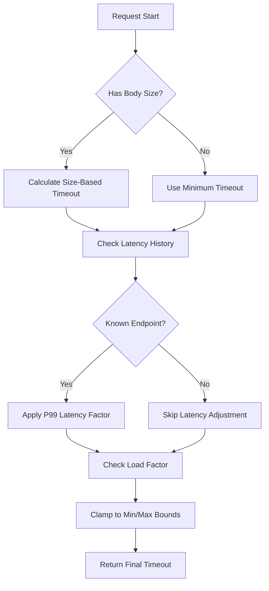
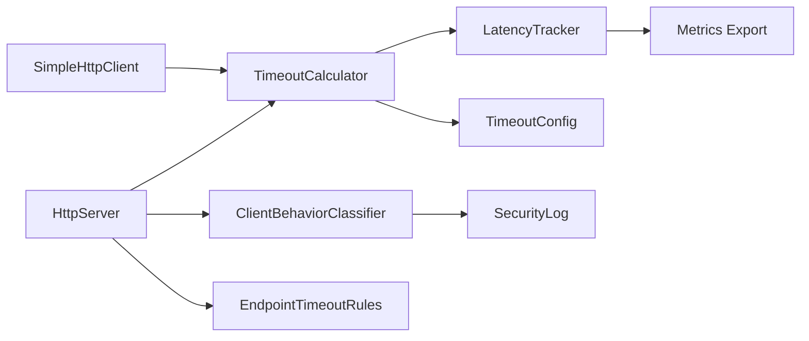
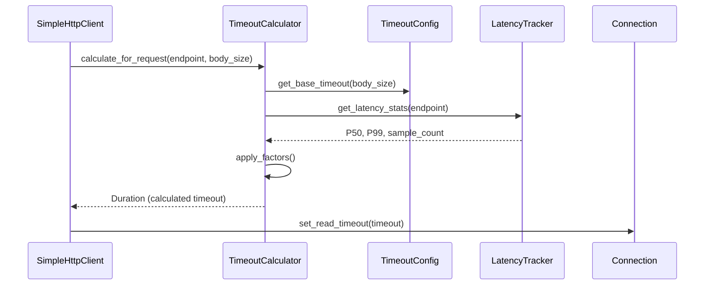

# Overview

Implement a production-quality Dynamic Timeout System for the HTTP client and server in `foundation_core`. The current system uses fixed timeouts (3s read timeout, 5 max retries) which causes slow tests (~24s per request) and doesn't adapt to network conditions, body sizes, or endpoint characteristics.

## Goals

- Goal 1: Create size-based timeout calculation (body size → appropriate timeout)
- Goal 2: Implement latency tracking and adaptive adjustment per endpoint
- Goal 3: Add client behavior classification (Normal/Slow/Suspicious)
- Goal 4: Support endpoint-specific timeout rules (API vs Upload vs Streaming)
- Goal 5: Integrate with existing HTTP client (SimpleHttpClient)
- Goal 6: Integrate with HTTP server for DoS protection and resource fairness
- Goal 7: Add comprehensive tests covering all timeout scenarios

## Implementation Location

- Core timeout calculator: `backends/foundation_core/src/wire/simple_http/timeout.rs`
- Client integration: `backends/foundation_core/src/wire/simple_http/client/`
- Server integration: `backends/foundation_core/src/wire/simple_http/server/` (if exists)
- Latency tracking: `backends/foundation_core/src/wire/simple_http/latency_tracker.rs`
- Tests: `backends/foundation_core/tests/simple_http/timeout_tests.rs`

## Known Issues

The current fixed timeout system causes:
- Slow test execution: 3s × 5 retries = 15s per request
- No adaptation to body size (2-byte body waits same as 10MB upload)
- No learning from endpoint behavior
- No protection against slowloris attacks on server
- Unfair resource allocation under load

## Language Stack

**IMPORTANT:** Agents MUST identify the language stack below and read the corresponding skills BEFORE implementation.

### Languages Used

| Language | Purpose | Skill Location |
|----------|---------|----------------|
| Rust | Timeout system implementation | `.agents/skills/rust-clean-code/skill.md` |

### Mandatory Pre-Implementation Steps

1. **Identify languages** from this section
2. **Read language skills** - for each language:
   - Locate skill at `.agents/skills/[language]-clean-code/skill.md`
   - If skill exists: read it completely before writing any code
   - If skill missing: **STOP** - launch agent to generate the skill first, then read it
3. **Document skills** - add this item to any start.md workflow so future agents remember
4. **Follow standards strictly** - zero tolerance for deviations from documented standards

### Language-Specific Requirements

**Rust Requirements:**
- Run `cargo fmt` before commit
- Zero clippy warnings
- All public items documented with `///` comments
- Tests in `tests/` directory following project conventions
- Integration tests in `tests/` directory with proper naming

## Feature Index

The implementation is divided into features with clear dependencies. Each feature contains detailed requirements and tasks in its respective `feature.md` file.

**Implementation Guidelines:**
- Implement features in dependency order
- Each feature contains complete requirements and tasks
- Refer to individual feature.md files for detailed specifications

| #  | Feature | Description | Dependencies | Status |
|----|---------|-------------|--------------|--------|
| 0  | [core-timeout-system](./features/00-core-timeout-system/feature.md) | Core timeout calculator with size-based and adaptive logic | None | ✅ Complete |
| 1  | [client-integration](./features/01-client-integration/feature.md) | Integrate timeout system with HTTP client | Feature 0 | ✅ Complete |
| 2  | [server-integration](./features/02-server-integration/feature.md) | Integrate timeout system with HTTP server | Feature 0 | ✅ Complete |
| 3  | [latency-tracking](./features/03-latency-tracking/feature.md) | Per-endpoint latency tracking and P99 calculation | Feature 0 | ✅ Complete |
| 4  | [load-based-scaling](./features/04-load-based-scaling/feature.md) | Adjust timeouts based on system load | Feature 0, 3 | ✅ Complete |
| 5  | [client-classification](./features/05-client-classification/feature.md) | Classify clients as Normal/Slow/Suspicious | Feature 2 | ✅ Complete |

Status Key: ⬜ Pending | 🔄 In Progress | ✅ Complete

## Requirements Conversation Summary

This specification addresses the slow test execution and lack of adaptability in the HTTP timeout system:

1. **Problem Identification**: Fixed 3s read timeout with 5 retries = 15s per request, regardless of body size
2. **Solution Approach**: Implement dynamic timeouts based on body size, historical latency, and network conditions
3. **Integration Strategy**: New `timeout` module that integrates with existing client/server without breaking changes
4. **Backward Compatibility**: Default timeouts remain available, opt-in to dynamic system via builder methods

## High-Level Architecture

**CRITICAL:** This section contains the complete architectural specification.

### Timeout Calculation Flow

### Components

**1. TimeoutCalculator**
- Core calculation engine
- Size-based timeout calculation
- Latency-based adjustment
- Load-based scaling
- Thread-safe (Arc + RwLock)

**2. LatencyTracker**
- Per-endpoint latency history
- Sliding window for P50/P99 calculation
- Automatic expiry of old samples
- Memory-bounded (max samples per endpoint)

**3. TimeoutConfig**
- Base timeout values
- Min/max bounds
- Body size thresholds
- Retry configuration

**4. ClientBehaviorClassifier (Server)**
- Track bytes/second per client
- Classify as Normal/Slow/Suspicious
- Progressive penalty application
- Automatic rehabilitation

**5. EndpointTimeoutRule (Server)**
- Path/method matching
- Timeout multipliers
- Body size requirements
- Override default calculations

### Component Relationships

### Data Flow

**Client Request:**

### Technical Decisions and Trade-offs

| Decision | Rationale | Alternatives Considered |
|----------|-----------|------------------------|
| Size-based formula: `sqrt(size_kb) × base` | Sub-linear scaling avoids excessive timeouts for large bodies | Linear scaling (rejected: 100MB would be 100s), Logarithmic (rejected: too aggressive) |
| Per-endpoint latency tracking | Different endpoints have different characteristics | Global latency average (rejected: fast API skewed by slow upload endpoint) |
| Sliding window with expiry | Bounded memory, recent behavior matters most | Infinite history (rejected: unbounded memory), Fixed sample count (rejected: old samples affect fast-changing conditions) |
| Load factor: linear reduction | Simple, predictable under pressure | Exponential backoff (rejected: too aggressive), No adjustment (rejected: no protection under load) |
| Thread-safe with RwLock | Read-heavy workload, multiple concurrent requests | Mutex (rejected: contention on reads), Lock-free (rejected: complexity) |

### Implementation Order

1. **Phase 1**: Core timeout calculator with size-based calculation
2. **Phase 2**: Latency tracking system
3. **Phase 3**: Integrate with HTTP client (GetHttpRequestRedirectTask)
4. **Phase 4**: Update BatchReader/FullBodyReader to use dynamic timeouts
5. **Phase 5**: Client behavior classification (server)
6. **Phase 6**: Endpoint-specific rules (server)
7. **Phase 7**: Add metrics and monitoring
8. **Phase 8**: Update pool drain tests to use new timeouts

## Timeout Reference Tables

### Production Defaults (Client)

| Timeout Type | Default | Range | Notes |
|--------------|---------|-------|-------|
| **Connect Timeout** | 10s | 5s - 30s | TCP handshake completion |
| **Read (per KB)** | 10ms | 5ms - 50ms | Scales with body size |
| **Min Read** | 100ms | 50ms - 500ms | Absolute minimum |
| **Max Read** | 60s | 10s - 300s | Absolute maximum |
| **Write (per KB)** | 5ms | 2ms - 20ms | Upload speed factor |
| **Max Retries** | 3 | 0 - 10 | For transient failures |
| **TTFB (Time to First Byte)** | 5s | 1s - 30s | Server response latency |

### Size-Based Timeout Calculation

| Body Size | Base Read Timeout | Max Total Read | Rationale |
|-----------|-------------------|----------------|-----------|
| 0-1 KB | 100ms | 1s | HEAD responses, small JSON |
| 1-10 KB | 250ms | 2s | API responses |
| 10-100 KB | 500ms | 5s | Standard payloads |
| 100 KB - 1 MB | 1s | 10s | Large API responses |
| 1-10 MB | 2s | 30s | File uploads |
| 10-100 MB | 5s | 60s | Large files |
| 100 MB+ | 10s | 300s | Streaming |

### Production Defaults (Server)

| Timeout Type | Default | Range | Protection Against |
|--------------|---------|-------|-------------------|
| **Connection** | 30s | 10s - 60s | Slow initial request |
| **Request Read** | 5s | 1s - 30s | Slow request body (DoS) |
| **Response Write** | 60s | 10s - 300s | Slow client download |
| **Idle Keep-Alive** | 60s | 30s - 300s | Connection pool exhaustion |
| **Header Read** | 10s | 5s - 30s | Header flooding |
| **Per-Byte** | 1s/KB | 100ms - 5s/KB | Slowloris |

### Client Classification Thresholds

| Classification | Bytes/Second | Consecutive Slow | Penalty |
|----------------|--------------|------------------|---------|
| **Normal** | >10 KB/s | 0 | None |
| **Slow** | 1-10 KB/s | 1-3 | +50% timeout |
| **Suspicious** | <1 KB/s | 3+ | -50% timeout, log security |

### Load-Based Scaling

| Load Level | Connections/Sec | Timeout Adjustment |
|------------|-----------------|-------------------|
| **Low** | <100 | 100% (no change) |
| **Medium** | 100-1000 | 90% (-10%) |
| **High** | 1000-10000 | 75% (-25%) |
| **Critical** | >10000 | 60% (-40%) |

## Success Criteria (Spec-Wide)

This specification is considered complete when:

### Functionality
- [x] Timeout calculation is size-based and sub-linear
- [x] Latency tracking provides P50/P99 per endpoint
- [x] Client classification works for DoS protection
- [x] Load-based scaling reduces timeouts under pressure
- [ ] Pool drain tests complete in <5 seconds (vs current ~24s)
- [x] Large file uploads get appropriate extended timeouts
- [x] Small API calls get fast timeouts (<1s)

### Performance
- [x] Timeout calculation <1ms overhead per request
- [x] Latency tracker memory bounded (<100MB for 10k endpoints)
- [x] No contention under 10k concurrent requests
- [ ] Test execution time reduced by 80%

### Code Quality
- [x] Zero clippy warnings
- [x] All public items documented
- [x] Tests cover >90% of timeout scenarios
- [x] Integration tests verify end-to-end behavior

### Documentation
- [x] Module documentation with examples
- [x] Architecture diagrams in spec
- [ ] Migration guide for existing code
- [ ] Performance tuning guide

## Module References

Agents implementing features should read:
- `documentation/simple_http/doc.md` - HTTP patterns
- `backends/foundation_core/src/io/readers/mod.rs` - BatchReader, FullBodyReader
- `backends/foundation_core/src/wire/simple_http/client/client.rs` - ClientConfig
- `backends/foundation_core/src/wire/simple_http/client/pool.rs` - Connection pool

---

_Created: 2026-05-12_
_Last Updated: 2026-05-12_
_Structure: Feature-based (has_features: true)_
