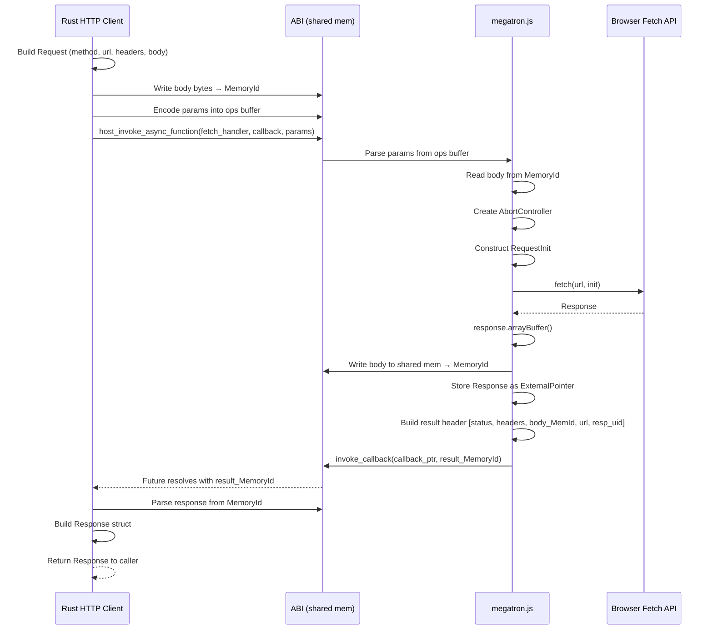

# ABI HTTP Bridge

## Overview

This feature creates the core bridge between Rust and browser fetch(): the Rust-side `src/http/` module structure, the megatron.js fetch executor function, the AbortGuard RAII pattern, the promise<T> async helper, and ServiceWorkerGlobalScope detection. This is the foundation that all other features build on.

## Language Stack

| Language | Purpose | Skill Location |
|----------|---------|----------------|
| Rust | HTTP bridge module, AbortGuard, promise helper | `.agents/skills/rust-clean-code/skill.md` |
| JavaScript | megatron.js fetch executor | Follow existing megatron.js patterns |

### Pre-Implementation Checklist

- [ ] Read `.agents/skills/rust-clean-code/skill.md`
- [ ] Read `backends/foundation_wasm/sdk/jsruntime/megatron.js` fully
- [ ] Read `backends/foundation_wasm/src/jsapi.rs` for host function patterns
- [ ] Read `backends/foundation_wasm/src/base.rs` for ExternalPointer/MemoryId types

## Architecture (COMPREHENSIVE)

### Rust-Side Module Structure

```
backends/foundation_wasm/src/
├── lib.rs                 # Will add: #[cfg(feature = "http")] mod http;
├── http/
│   ├── mod.rs             # Re-exports: Client, RequestBuilder, Response, Body
│   │                      # Internal: promise helper, AbortGuard
│   ├── abort.rs           # AbortGuard RAII (ExternalPointer to JS AbortController)
│   ├── bridge.rs          # Core fetch execution: send_request_to_js(), receive_response()
│   └── ...                # Other files created by subsequent features
```

### Module Gating

In `lib.rs`:
```rust
#[cfg(all(feature = "http", target_arch = "wasm32"))]
mod http;

#[cfg(all(feature = "http", not(target_arch = "wasm32")))]
mod http_stub;  // compile_error!("http feature requires wasm32 target")
```

### File Structure

```
src/http/
├── mod.rs        - Module root, re-exports, promise<T> helper
├── abort.rs      - AbortGuard, setTimeout/clearTimeout via ABI
├── bridge.rs     - Core fetch bridge: encode request, invoke JS, decode response
└── [other files added by subsequent features]
```

### Component Details

#### 1. `mod.rs` — Module Root

- **Purpose**: Re-exports public types, defines the `promise<T>` async helper
- **Public exports**: `Client`, `ClientBuilder`, `RequestBuilder`, `Request`, `Response`, `Body`
- **Internal**: `promise<T>` wrapper around async callback resolution

**`promise<T>` helper** — replicates reqwest's approach adapted for the ABI:

```rust
/// Wraps an async callback invocation into a Rust Future.
/// Uses the InternalReferenceRegistry to register a callback,
/// invokes host_invoke_async_function, and resolves when the
/// callback is fired with the result MemoryId.
async fn promise<T: FromBinary>(
    handler: HostFunction,
    callback_ptr: InternalPointer,
    params: &Params,
) -> Result<T, HttpError>;
```

The flow:
1. Register an async callback in `InternalReferenceRegistry` keyed by `InternalPointer`
2. Call `host_invoke_async_function` with the handler and callback
3. The JS side processes the request, writes result to shared memory
4. JS calls `invoke_callback(internal_ptr, result_alloc_id)`
5. The registry fires, resolving the Future
6. Parse the result MemoryId into type T using `FromBinary`

#### 2. `abort.rs` — AbortGuard RAII

- **Purpose**: Owns a JS `AbortController` (held as `ExternalPointer`) and a timeout handle
- **On drop**: Calls the JS-side abort function to cancel the in-flight fetch

```rust
pub struct AbortGuard {
    /// ExternalPointer to the JS AbortController
    controller: ExternalPointer,
    /// Optional timeout handle (via schedule_timeout ABI)
    timeout_handle: Option<u64>,
}

impl AbortGuard {
    /// Creates a new AbortController in JS, returns the ExternalPointer
    pub fn new() -> WasmRequestResult<Self>;

    /// Sets a timeout that will abort the fetch after the given duration
    pub fn with_timeout(mut self, duration: Duration) -> WasmRequestResult<Self>;

    /// Returns the ExternalPointer signal for wiring into fetch init
    pub fn signal(&self) -> ExternalPointer;
}

impl Drop for AbortGuard {
    fn drop(&mut self) {
        // Call JS-side abort function via host_invoke_function
        // Clear timeout handle if set
    }
}
```

**Timeout via existing ABI**: foundation_wasm already has `schedule_timeout(timing, callback)` in `host_runtime`. We can use this for the timeout — schedule a callback that calls `abort()`, store the handle so we can unschedule it on successful response.

#### 3. `bridge.rs` — Core Fetch Execution

- **Purpose**: The Rust-side of the fetch bridge — encodes request params, invokes JS, decodes response

```rust
/// Core fetch function. Takes a prepared Request, executes it via the ABI,
/// returns a Response.
pub(crate) async fn fetch(request: Request) -> Result<Response, HttpError> {
    // 1. Create AbortGuard
    let abort = AbortGuard::new()?;
    if let Some(timeout) = request.timeout {
        abort = abort.with_timeout(timeout);
    }

    // 2. Encode request body to shared memory (if present)
    let body_memory_id = match request.body {
        Some(body) => write_body_to_memory(&body)?,
        None => None,
    };

    // 3. Build instruction batch with params:
    //    - url (string)
    //    - method (string)
    //    - headers (JSON-encoded string of [(name, value)] pairs)
    //    - body_memory_id (if present, u64 MemoryId)
    //    - abort_signal (ExternalPointer)
    //    - cors flag (bool)
    //    - credentials mode (u8 enum)
    //    - cache mode (u8 enum)
    let instructions = encode_request_params(&request, body_memory_id, abort.signal())?;

    // 4. Invoke JS fetch handler asynchronously
    let result_memory_id = promise::<MemoryId>(
        get_fetch_handler(),
        register_async_callback(),
        &instructions,
    ).await?;

    // 5. Parse response from result memory
    let response = parse_response_from_memory(result_memory_id, abort)?;

    Ok(response)
}
```

**ServiceWorkerGlobalScope detection**: In megatron.js, detect if running in a ServiceWorker by checking `self instanceof ServiceWorkerGlobalScope` or `globalThis.ServiceWorkerGlobalScope`. Use the appropriate `fetch()` variant:
- Regular context: `fetch(request)`
- ServiceWorker: `self.fetch(request)` (same API but different this-binding)

### Megatron.js Fetch Executor

The fetch executor is added to megatron.js as a registered function that the Rust side can invoke. It follows the existing pattern:

```javascript
// Added to the function_heap or registered as a host function
const fetchExecutor = function(parameterBuffer, parameterLength) {
  // 1. Parse params from the binary ops buffer
  //    URL (string), method (string), headers (JSON), body (MemoryId),
  //    abortSignal (ExternalPointer UID), cors (bool), credentials (u8), cache (u8)

  // 2. Read body from shared memory if body MemoryId is provided
  //    const bodyData = instance.exports.get_memory(bodyMemoryId);

  // 3. Construct RequestInit
  //    const init = { method, headers, signal: abortSignal, credentials, cache };
  //    if (bodyData) init.body = bodyData;

  // 4. Create AbortController (if not passed from Rust)
  // 5. Call fetch(url, init)
  // 6. On response:
  //    a. response.arrayBuffer() → write to shared memory → get MemoryId
  //    b. Store response object as ExternalPointer → get UID
  //    c. Build result: [status(u16), headers_json(string), body_MemoryId, url(string), response_uid(u64)]
  //    d. Encode result into a MemoryId
  // 7. Return result MemoryId to Rust callback

  // For errors:
  //    a. Write error info to shared memory
  //    b. Return ErrorCode (type ID 31)
};
```

**Registration**: The fetch executor is registered during megatron.js initialization using the existing `function_heap.create()` / `host_register_function()` pattern. The Rust side gets a handle to invoke it.

### Data Flow (Mermaid)



### Error Handling Strategy

Errors flow through the existing `WASMErrors` enum with new HTTP-specific variants added in feature 03 (error-types). The bridge layer maps JS-side errors to Rust errors:

- **Network error** (fetch rejects) → `HttpError::RequestFailed`
- **Timeout** → `HttpError::TimedOut` (detected by checking abort reason)
- **Memory allocation failure** → `MemoryAllocationError` (existing)
- **Parse error** (malformed response) → `HttpError::DecodeError`

### Security Considerations

- **CORS**: The browser enforces CORS. We pass the cors flag to determine if `mode: 'cors'` or `mode: 'no-cors'` is used.
- **Credentials**: Credentials mode (omit/same-origin/include) is passed through to `RequestInit.credentials`.
- **No arbitrary code execution**: The JS fetch executor is built-in to megatron.js, not user-provided code.

### Performance Considerations

- **Body transfer**: Writing large bodies to shared memory is O(n) copy. For typical HTTP payloads (<10MB), this is acceptable.
- **Promise resolution**: Single callback invocation per response — no polling or busy-waiting.
- **AbortGuard**: RAII ensures AbortController is always cleaned up, preventing memory leaks.

### Trade-offs and Decisions

| Decision | Rationale | Alternatives Considered |
|----------|-----------|------------------------|
| Use existing `ExternalPointer` for JS objects | Already implemented, used for DOM references | Add new `JsObject` type — unnecessary duplication |
| Use `schedule_timeout` for timeouts | Already in ABI, integrates with callback system | JS `setTimeout` in fetch executor — simpler but less control |
| Body via shared memory `MemoryId` | Existing mechanism, no new types needed | Pass body as base64 string — wasteful encoding |
| Response body pre-consumed (arrayBuffer) | Simple, matches most common use case | Leave as ReadableStream — requires streaming infrastructure (feature 07) |
| JSON-encode headers for transfer | Simple, leverages existing string transfer | Custom binary encoding — more complex, marginal gain |

## Implementation

### Files to Create/Modify

- `backends/foundation_wasm/Cargo.toml` — Add `http` feature flag, `http` crate optional dependency
- `backends/foundation_wasm/src/lib.rs` — Add `#[cfg(feature = "http")] mod http;`
- `backends/foundation_wasm/src/http/mod.rs` — Module root, promise helper, re-exports
- `backends/foundation_wasm/src/http/abort.rs` — AbortGuard implementation
- `backends/foundation_wasm/src/http/bridge.rs` — Core fetch bridge function
- `backends/foundation_wasm/src/http/request.rs` — Request struct (stubs, full impl in feature 05)
- `backends/foundation_wasm/src/http/response.rs` — Response struct (stubs, full impl in feature 06)
- `backends/foundation_wasm/src/http/body.rs` — Body type (stubs, full impl in feature 04)
- `backends/foundation_wasm/src/http/error.rs` — HTTP error types (stubs, full impl in feature 03)
- `backends/foundation_wasm/sdk/jsruntime/megatron.js` — Add fetch executor function

### Tasks

- [ ] T1: Add `http` feature flag to Cargo.toml with `http` crate optional dependency (gated)
- [ ] T2: Add `#[cfg(feature = "http")]` gated `mod http` to lib.rs with non-wasm stub
- [ ] T3: Create `src/http/mod.rs` with module structure, re-exports, and `promise<T>` helper
- [ ] T4: Create `src/http/abort.rs` with AbortGuard using ExternalPointer + schedule_timeout
- [ ] T5: Create `src/http/bridge.rs` with core fetch() function (encode/decode logic)
- [ ] T6: Create stub `src/http/request.rs` with Request struct (fields only, no impl)
- [ ] T7: Create stub `src/http/response.rs` with Response struct (fields only, no impl)
- [ ] T8: Create stub `src/http/body.rs` with Body type (enum only, no impl)
- [ ] T9: Create stub `src/http/error.rs` with HttpError enum (variants only, impl in feature 03)
- [ ] T10: Add fetch executor function to megatron.js (parse params, call fetch, write response)
- [ ] T11: Register fetch executor in megatron.js initialization and expose handle to Rust
- [ ] T12: Add ServiceWorkerGlobalScope detection to megatron.js fetch executor

## Testing

### Test Cases

1. **Promise resolution**: Register async callback, verify Future resolves when JS invokes callback
2. **AbortGuard creation**: Verify AbortController ExternalPointer is created and dropped correctly
3. **AbortGuard timeout**: Verify schedule_timeout is set and cancelled on successful response
4. **Body encoding**: Verify body bytes written to shared memory and MemoryId returned correctly
5. **Response decoding**: Verify response parsed from result MemoryId with correct status/headers/body
6. **ServiceWorker detection**: Verify correct fetch variant used in ServiceWorker context

## Success Criteria

- [ ] All tasks completed
- [ ] `cargo build --target wasm32-unknown-unknown --features http` compiles (stubs for request/response/body/error OK)
- [ ] `promise<T>` helper correctly resolves async callbacks
- [ ] AbortGuard creates and destroys AbortController via ExternalPointer
- [ ] megatron.js fetch executor correctly parses params and calls browser fetch()
- [ ] Response body written to shared memory and returned as MemoryId
- [ ] No unsafe code without documented justification
- [ ] All tests passing

---

_Created: 2026-05-18_
