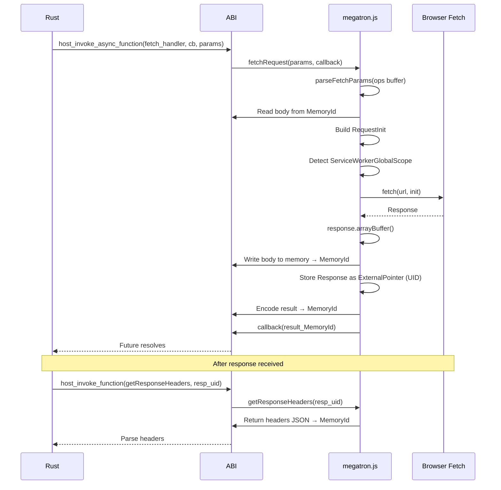

# JS Fetch Runtime

## Overview

This feature implements the JavaScript-side fetch executor in megatron.js that receives request parameters from Rust via the ABI, executes `fetch()`, and delivers the response back. It also adds response helper functions (`readResponseBody`, `getResponseHeaders`, `getResponseStatus`, etc.) that the Rust side can invoke to access Response properties without transferring the entire response object.

## Language Stack

| Language | Purpose | Skill Location |
|----------|---------|----------------|
| JavaScript | megatron.js fetch executor and response helpers | Follow existing megatron.js patterns |

### Pre-Implementation Checklist

- [ ] Read `backends/foundation_wasm/sdk/jsruntime/megatron.js` fully
- [ ] Understand the `BatchInstructions.parse_and_invoke_async` flow (line ~5841)
- [ ] Understand `host_invoke_async_function` flow (line ~6514)
- [ ] Understand `ExternalReference` management (function_heap, drop_external_reference)

## Architecture (COMPREHENSIVE)

### Fetch Executor Location in megatron.js

The fetch executor is added as a new method on `MegatronMiddleware` alongside existing `host_invoke_function*` methods. It follows the existing pattern of:

1. Reading parameters from the ops buffer using the `parse_params` machinery
2. Executing the fetch operation
3. Writing the response to shared memory
4. Returning the result MemoryId

### File Structure

All changes are in `backends/foundation_wasm/sdk/jsruntime/megatron.js`. No new files created.

### Component Details

#### 1. Fetch Executor (`MegatronMiddleware.fetchRequest`)

```javascript
/**
 * Main fetch executor. Called by Rust via host_invoke_async_function.
 *
 * Parameter layout in ops buffer:
 *   - URL (string): null-terminated or length-prefixed
 *   - Method (string): "GET", "POST", etc.
 *   - Headers (JSON string): '[["name","value"],...]'
 *   - Body MemoryId (u64): 0 = no body, non-zero = read from shared memory
 *   - AbortSignal ExternalPointer UID (u64)
 *   - CORS flag (u8): 0 = cors, 1 = no-cors
 *   - Credentials mode (u8): 0 = omit, 1 = same-origin, 2 = include
 *   - Cache mode (u8): 0 = default, 1 = no-store, 2 = reload, 3 = no-cache, 4 = force-cache, 5 = only-if-cached
 *   - Timeout ms (u64): 0 = no timeout
 */
async fetchRequest(parameterBuffer, parameterLength, resultCallback) {
  const logger = LOGGER.scoped("fetchRequest:");

  // 1. Parse parameters from the binary buffer
  const params = this.parseFetchParams(parameterBuffer, parameterLength);
  logger.debug("Parsed fetch params:", params);

  // 2. Read body from shared memory if present
  let bodyData = null;
  if (params.bodyMemoryId !== 0) {
    const bodyAlloc = this.allocations.get(params.bodyMemoryId);
    bodyData = new Uint8Array(bodyAlloc.buffer);
    logger.debug("Read body from memory:", bodyData.length, "bytes");
  }

  // 3. Parse headers from JSON
  const headers = JSON.parse(params.headersJson);
  const jsHeaders = new Headers();
  for (const [name, value] of headers) {
    jsHeaders.append(name, value);
  }

  // 4. Build RequestInit
  const init = {
    method: params.method,
    headers: jsHeaders,
    signal: this.getExternalObject(params.abortSignalUid), // AbortSignal from ExternalPointer
  };

  if (bodyData !== null) {
    init.body = bodyData;
  }

  // 5. Set fetch mode
  if (params.cors === 1) {
    init.mode = 'no-cors';
  } else {
    init.mode = 'cors';
  }

  // 6. Set credentials
  const credModes = ['omit', 'same-origin', 'include'];
  if (params.credentials < credModes.length) {
    init.credentials = credModes[params.credentials];
  }

  // 7. Set cache mode
  const cacheModes = ['default', 'no-store', 'reload', 'no-cache', 'force-cache', 'only-if-cached'];
  if (params.cacheMode < cacheModes.length) {
    init.cache = cacheModes[params.cacheMode];
  }

  // 8. Detect environment and call fetch
  const isServiceWorker = typeof ServiceWorkerGlobalScope !== 'undefined' &&
    self instanceof ServiceWorkerGlobalScope;

  let fetchPromise;
  try {
    fetchPromise = isServiceWorker
      ? self.fetch(params.url, init)
      : fetch(params.url, init);
  } catch (e) {
    // Immediate fetch failure (invalid URL, etc.)
    const errorMemId = this.writeFetchError(e.message);
    resultCallback(errorMemId);
    return;
  }

  // 9. Handle timeout
  let timeoutId = null;
  let timedOut = false;
  if (params.timeoutMs > 0) {
    timeoutId = setTimeout(() => {
      timedOut = true;
      // We need to abort — but the AbortController is managed by Rust's AbortGuard
      // which will call our abort function. For timeout, we signal it here.
      // Actually, the AbortGuard already wired the AbortController to this timeout
      // via setTimeout on the JS side. So we just need to detect the abort reason.
    }, params.timeoutMs);
  }

  // 10. Await response
  let response;
  try {
    response = await fetchPromise;
    if (timeoutId) clearTimeout(timeoutId);
  } catch (e) {
    if (timeoutId) clearTimeout(timeoutId);

    // Check if this was a timeout abort
    if (timedOut || (e && e.message && e.message.includes('TimedOut'))) {
      const timeoutMemId = this.writeTimeoutError();
      resultCallback(timeoutMemId);
    } else {
      const errorMemId = this.writeFetchError(e.message);
      resultCallback(errorMemId);
    }
    return;
  }

  // 11. Read response body as ArrayBuffer
  let bodyBuffer;
  try {
    const arrayBuffer = await response.arrayBuffer();
    bodyBuffer = new Uint8Array(arrayBuffer);
  } catch (e) {
    const errorMemId = this.writeFetchError('Failed to read response body: ' + e.message);
    resultCallback(errorMemId);
    return;
  }

  // 12. Write body to shared memory
  const bodyMemId = this.allocations.create(bodyBuffer.length);
  const bodyAlloc = this.allocations.get(bodyMemId);
  bodyAlloc.buffer.set(bodyBuffer);

  // 13. Store Response as ExternalPointer
  const responseUid = this.storeExternalObject(response);

  // 14. Get final URL (after redirects)
  const finalUrl = response.url;

  // 15. Extract headers as JSON array
  const responseHeaders = [];
  response.headers.forEach((value, name) => {
    responseHeaders.push([name, value]);
  });
  const headersJson = JSON.stringify(responseHeaders);

  // 16. Build result: [status(u16), headers_json(str), body_mem_id(u64), url(str), response_uid(u64)]
  const resultMemId = this.writeFetchResult(
    response.status,
    headersJson,
    bodyMemId,
    finalUrl,
    responseUid
  );

  // 17. Return to Rust callback
  resultCallback(resultMemId);
}
```

#### 2. Response Helper Functions

These are additional host functions that Rust can call to access Response properties after the initial fetch:

```javascript
/**
 * Get response status code.
 * Input: response_uid (u64 ExternalPointer)
 * Output: status (u16)
 */
getResponseStatus(responseUid) {
  const response = this.getExternalObject(responseUid);
  return response.status;
}

/**
 * Get response headers as JSON string.
 * Input: response_uid (u64)
 * Output: headers JSON string written to shared memory → MemoryId
 */
getResponseHeaders(responseUid) {
  const response = this.getExternalObject(responseUid);
  const headers = [];
  response.headers.forEach((value, name) => {
    headers.push([name, value]);
  });
  const json = JSON.stringify(headers);
  return this.writeStringToMemory(json);
}

/**
 * Get response URL.
 * Input: response_uid (u64)
 * Output: URL string written to shared memory → MemoryId
 */
getResponseUrl(responseUid) {
  const response = this.getExternalObject(responseUid);
  return this.writeStringToMemory(response.url);
}

/**
 * Get response body as text.
 * Input: response_uid (u64)
 * Output: body text written to shared memory → MemoryId
 */
async getResponseText(responseUid, resultCallback) {
  const response = this.getExternalObject(responseUid);
  try {
    const text = await response.text();
    const memId = this.writeStringToMemory(text);
    resultCallback(memId);
  } catch (e) {
    const errorMemId = this.writeFetchError(e.message);
    resultCallback(errorMemMemId);
  }
}

/**
 * Abort an in-flight request.
 * Input: abort_controller_uid (u64)
 * Called by Rust AbortGuard on drop
 */
abortRequest(abortControllerUid) {
  const controller = this.getExternalObject(abortControllerUid);
  controller.abort();
  // Also clean up the ExternalPointer reference
  this.dropExternalReference(abortControllerUid);
}

/**
 * Release a Response object (cleanup ExternalPointer).
 * Input: response_uid (u64)
 */
releaseResponse(responseUid) {
  this.dropExternalReference(responseUid);
}
```

#### 3. External Object Management

The existing `ExternalReference` system in megatron.js manages function references via `function_heap`. For data objects (AbortController, Response, FormData), we need a parallel mechanism:

```javascript
// Add to MegatronMiddleware constructor:
this.objectHeap = new ObjectHeap(); // Simple UID → object map

// Methods:
storeExternalObject(obj) {
  return this.objectHeap.allocate(obj);
}

getExternalObject(uid) {
  return this.objectHeap.get(uid);
}

dropExternalReference(uid) {
  this.objectHeap.free(uid);
}
```

The `ObjectHeap` follows the same UID allocation pattern as the existing `function_heap` but stores arbitrary JS objects instead of functions.

#### 4. Memory Writers for Response/Error Results

```javascript
/**
 * Write fetch result to shared memory.
 * Layout: [Begin marker][status(u16)][headers_json(str)][body_mem_id(u64)]
 *         [url(str)][response_uid(u64)][End marker]
 * Uses the existing ReturnTypeId encoding system.
 */
writeFetchResult(status, headersJson, bodyMemId, url, responseUid) {
  // Use the existing encoding infrastructure:
  // Create a result buffer using ReturnTypeId markers
  const result = this.encodeResult([
    { type: ReturnTypeId.Uint16, value: status },
    { type: ReturnTypeId.Text8, value: headersJson },
    { type: ReturnTypeId.MemorySlice, value: bodyMemId }, // or use u64 + pointer
    { type: ReturnTypeId.Text8, value: url },
    { type: ReturnTypeId.ExternalReference, value: responseUid },
  ]);
  return result;
}

/**
 * Write fetch error to shared memory.
 * Layout: [ErrorCode marker][error_message(str)]
 */
writeFetchError(message) {
  const result = this.encodeResult([
    { type: ReturnTypeId.ErrorCode, value: 1 },
    { type: ReturnTypeId.Text8, value: message },
  ]);
  return result;
}

/**
 * Write timeout error to shared memory.
 */
writeTimeoutError() {
  const result = this.encodeResult([
    { type: ReturnTypeId.ErrorCode, value: 2 }, // TimedOut code
  ]);
  return result;
}
```

### Data Flow (Mermaid)



### Trade-offs and Decisions

| Decision | Rationale | Alternatives Considered |
|----------|-----------|------------------------|
| Response body pre-consumed as ArrayBuffer | Simple, one-shot transfer | Leave as ReadableStream — deferred to feature 07 |
| ObjectHeap separate from function_heap | Functions and data objects have different lifecycles | Reuse function_heap — semantically wrong, function_heap expects callable |
| Headers transferred as JSON string | Leverages existing string transfer, simple to parse | Binary header encoding — more complex, JSON is fast enough |
| Timeout handled by Rust AbortGuard | Consistent with reqwest pattern, RAII cleanup | JS-side setTimeout in fetch executor — harder to cancel from Rust |

## Implementation

### Files to Modify

- `backends/foundation_wasm/sdk/jsruntime/megatron.js` — Add fetch executor, response helpers, ObjectHeap

### Tasks

- [ ] T1: Add `ObjectHeap` class to megatron.js (UID allocation for arbitrary JS objects)
- [ ] T2: Add `parseFetchParams()` method to parse binary ops buffer into fetch parameters
- [ ] T3: Add `fetchRequest()` async method as main fetch executor
- [ ] T4: Add `writeFetchResult()`, `writeFetchError()`, `writeTimeoutError()` memory writers
- [ ] T5: Add `getResponseStatus()`, `getResponseHeaders()`, `getResponseUrl()` helper methods
- [ ] T6: Add `abortRequest()` and `releaseResponse()` cleanup methods
- [ ] T7: Add ServiceWorkerGlobalScope detection in fetch executor
- [ ] T8: Register fetch executor host functions in megatron.js initialization
- [ ] T9: Expose fetch handler handle to Rust side (via ExternalReference or known constant)
- [ ] T10: Test fetch executor end-to-end with a simple GET request from Rust

## Testing

### Test Cases

1. **GET request**: Fetch executor correctly parses params, calls fetch(), returns response with status 200
2. **POST with body**: Body bytes transferred from shared memory to fetch init body
3. **Headers**: Request headers correctly parsed from JSON and set on RequestInit
4. **Timeout**: Timeout triggers error response with appropriate error code
5. **Abort**: AbortRequest correctly cancels in-flight fetch
6. **ServiceWorker detection**: Correct fetch variant used in ServiceWorker context
7. **Error handling**: Network error (invalid URL) returns error MemoryId, not thrown

## Success Criteria

- [ ] All tasks completed
- [ ] megatron.js fetch executor correctly executes browser fetch()
- [ ] Response body written to shared memory and returned as MemoryId
- [ ] Response object stored as ExternalPointer for later access
- [ ] Response helper functions (status, headers, url) work correctly
- [ ] AbortRequest cancels in-flight fetch
- [ ] Timeout detection works correctly
- [ ] No regressions in existing megatron.js functionality
- [ ] ObjectHeap correctly allocates/frees JS object references

---

_Created: 2026-05-18_
