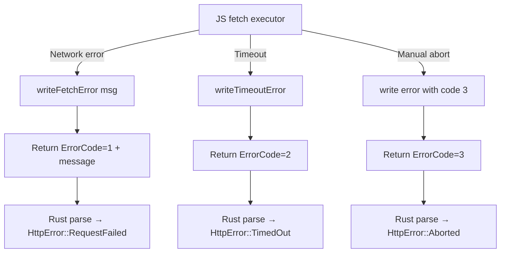

# Error Types

## Overview

This feature defines the HTTP-specific error types that the HTTP client uses. It extends the existing `WASMErrors` enum from `error.rs` with HTTP-related error variants, and provides a standalone `HttpError` type used internally by the `http` module.

## Language Stack

| Language | Purpose | Skill Location |
|----------|---------|----------------|
| Rust | Error type definitions, trait implementations | `.agents/skills/rust-clean-code/skill.md` |

## Architecture (COMPREHENSIVE)

### Error Hierarchy

```
WASMErrors (existing in error.rs)
├── GuestError(GuestOperationError)
├── BinaryErrors(BinaryReadError)
├── MemoryErrors(MemoryAllocationError)
├── WriteErrors(MemoryWriterError)
├── ReadErrors(MemoryReaderError)
├── ReturnError(ReturnValueError)
└── HttpError(HttpError)           ← NEW

HttpError (new, in http/error.rs)
├── Builder(String)                ← Invalid request configuration
├── RequestFailed(String)          ← fetch() rejected / network error
├── TimedOut                       ← Request timed out
├── Decode(String)                 ← Failed to decode response body
├── InvalidUrl(String)             ← URL parsing failure
└── Aborted                        ← Request was manually aborted

Type aliases:
  pub type HttpResult<T> = Result<T, HttpError>;
```

### Integration with WASMErrors

The `WASMErrors` enum in `error.rs` gets a new variant:

```rust
#[derive(Debug)]
pub enum WASMErrors {
    GuestError(GuestOperationError),
    BinaryErrors(BinaryReadError),
    MemoryErrors(MemoryAllocationError),
    WriteErrors(MemoryWriterError),
    ReadErrors(MemoryReaderError),
    ReturnError(ReturnValueError),
    HttpError(HttpError),        // NEW
}
```

And `HttpError` is imported in `error.rs`:

```rust
#[cfg(feature = "http")]
use crate::http::error::HttpError;
```

With a corresponding `From` impl:

```rust
#[cfg(feature = "http")]
impl From<HttpError> for WASMErrors {
    fn from(value: HttpError) -> Self {
        WASMErrors::HttpError(value)
    }
}
```

### File Structure

- `backends/foundation_wasm/src/http/error.rs` — `HttpError` enum, `HttpResult<T>`, `TimedOut` marker struct
- `backends/foundation_wasm/src/error.rs` — Extended with `HttpError` variant in `WASMErrors`

### Component Details

#### `HttpError` Enum

```rust
/// Error type for HTTP client operations.
#[derive(Debug)]
pub enum HttpError {
    /// Invalid request configuration (missing URL, invalid header, etc.)
    Builder(alloc::string::String),

    /// fetch() was rejected or a network-level error occurred
    RequestFailed(alloc::string::String),

    /// Request timed out (timeout duration elapsed before response)
    TimedOut,

    /// Failed to decode response body (invalid UTF-8, JSON parse error, etc.)
    Decode(alloc::string::String),

    /// URL could not be parsed
    InvalidUrl(alloc::string::String),

    /// Request was manually aborted via AbortGuard
    Aborted,
}
```

All variants must implement `Display` and `core::error::Error`. Since this is `no_std`, we use `core::error::Error` (available since Rust 1.81) or provide a custom error trait if the MSRV doesn't support it.

#### Builder Error Helper

```rust
/// Create a builder error for invalid request configuration.
pub fn builder_err(msg: impl Into<alloc::string::String>) -> HttpError {
    HttpError::Builder(msg.into())
}
```

Similar helpers: `request_err()`, `decode_err()`, `url_err()`.

#### Error Detection from ABI Responses

When parsing the result MemoryId from the JS fetch executor, errors are detected by:

1. **ErrorCode type ID (31)** in the return values — indicates a JS-side error
2. **Error code value** — distinguishes between network error (1), timeout (2), abort (3)
3. **Optional error message** — string following the ErrorCode in the return values

```rust
fn detect_error(error_code: u16, message: Option<&str>) -> HttpError {
    match error_code {
        1 => HttpError::RequestFailed(message.unwrap_or("unknown").into()),
        2 => HttpError::TimedOut,
        3 => HttpError::Aborted,
        _ => HttpError::RequestFailed(
            alloc::format!("unknown error code: {}", error_code)
        ),
    }
}
```

### Data Flow (Mermaid)



### Trade-offs and Decisions

| Decision | Rationale | Alternatives Considered |
|----------|-----------|------------------------|
| Separate `HttpError` from `WASMErrors` | HTTP errors are a distinct domain, keeps WASMErrors from becoming a god enum | Add variants directly to WASMErrors — couples HTTP to core |
| `TimedOut` as unit variant | No payload needed, easy to match with `==` | `TimedOut(String)` — unnecessary |
| Error codes 1/2/3 in JS | Simple numeric mapping | String-based error types — harder to match, encoding overhead |

## Implementation

### Files to Create/Modify

- `backends/foundation_wasm/src/http/error.rs` — New file: HttpError enum, helpers
- `backends/foundation_wasm/src/error.rs` — Add HttpError variant to WASMErrors (gated)

### Tasks

- [ ] T1: Create `src/http/error.rs` with `HttpError` enum and all variants
- [ ] T2: Implement `Display` and `Error` for `HttpError`
- [ ] T3: Create `HttpResult<T>` type alias
- [ ] T4: Add error helper functions: `builder_err()`, `request_err()`, `decode_err()`, `url_err()`
- [ ] T5: Add `HttpError` variant to `WASMErrors` in `error.rs` (gated on `http` feature)
- [ ] T6: Add `impl From<HttpError> for WASMErrors` (gated on `http` feature)

## Testing

### Test Cases

1. **HttpError::Display**: Each variant formats to a human-readable string
2. **Error conversion**: `HttpError::TimedOut` converts to `WASMErrors::HttpError(TimedOut)`
3. **Error detection**: ErrorCode=1 → RequestFailed, ErrorCode=2 → TimedOut, ErrorCode=3 → Aborted
4. **Builder helpers**: `builder_err("msg")` produces `HttpError::Builder("msg")`

## Success Criteria

- [ ] All tasks completed
- [ ] `HttpError` has all required variants
- [ ] `Display` and `Error` implementations compile and format correctly
- [ ] `WASMErrors` extended with `HttpError` variant
- [ ] No regressions on native target
- [ ] Error detection from ABI responses works correctly

---

_Created: 2026-05-18_
