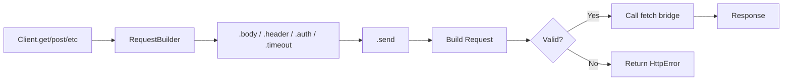

# Request Layer

## Overview

This feature implements the `Request` struct and `RequestBuilder` — the representation of an HTTP request with all browser fetch options. The builder pattern uses deferred errors (like reqwest) so that invalid configurations don't panic but are reported at send time.

## Language Stack

| Language | Purpose | Skill Location |
|----------|---------|----------------|
| Rust | Request types, builder pattern, header management | `.agents/skills/rust-clean-code/skill.md` |

## Architecture (COMPREHENSIVE)

### File Structure

- `backends/foundation_wasm/src/http/request.rs` — Request, RequestBuilder, all builder methods

### Request Struct

```rust
pub struct Request {
    /// HTTP method (GET, POST, etc.)
    method: Method,

    /// Target URL
    url: alloc::string::String,

    /// Request headers
    headers: HeaderMap,

    /// Request body (None for GET/HEAD)
    body: Option<Body>,

    /// Per-request timeout
    timeout: Option<Duration>,

    /// When false, sets fetch mode to 'no-cors'
    cors: bool, // default: true (cors mode)

    /// Fetch credentials mode
    credentials: Option<FetchCredentials>,

    /// Fetch cache mode
    cache: Option<FetchCache>,
}
```

**Note**: We use `alloc::string::String` for the URL rather than the `url::Url` type to avoid pulling in the `url` crate. URL validation can be done in the JS side (which has `new URL()` available).

### Fetch Enums

```rust
/// Maps to fetch() credentials option.
#[derive(Clone, Copy, Debug, PartialEq, Eq)]
pub enum FetchCredentials {
    Omit,
    SameOrigin,
    Include,
}

/// Maps to fetch() cache option.
#[derive(Clone, Copy, Debug, PartialEq, Eq)]
pub enum FetchCache {
    Default,
    NoStore,
    Reload,
    NoCache,
    ForceCache,
    OnlyIfCached,
}
```

### RequestBuilder

```rust
pub struct RequestBuilder {
    client: Client,
    request: HttpResult<Request>,  // deferred errors
}

impl RequestBuilder {
    // Body methods
    pub fn body<T: Into<Body>>(self, body: T) -> Self;
    pub fn json<T: Serialize>(self, json: &T) -> Self;  // feature-gated
    pub fn form<T: Serialize>(self, form: &T) -> Self;  // feature-gated

    // Auth methods
    pub fn basic_auth(self, user: impl Into<String>, password: Option<impl Into<String>>) -> Self;
    pub fn bearer_auth(self, token: impl Into<String>) -> Self;

    // Header methods
    pub fn header<K, V>(self, key: K, value: V) -> Self;
    pub fn headers(self, headers: HeaderMap) -> Self;

    // Fetch configuration
    pub fn timeout(self, timeout: Duration) -> Self;
    pub fn fetch_mode_no_cors(self) -> Self;
    pub fn fetch_credentials_same_origin(self) -> Self;
    pub fn fetch_credentials_include(self) -> Self;
    pub fn fetch_credentials_omit(self) -> Self;
    pub fn fetch_cache_default(self) -> Self;
    pub fn fetch_cache_no_store(self) -> Self;
    pub fn fetch_cache_reload(self) -> Self;
    pub fn fetch_cache_no_cache(self) -> Self;
    pub fn fetch_cache_force_cache(self) -> Self;
    pub fn fetch_cache_only_if_cached(self) -> Self;

    // Build and send
    pub fn build(self) -> HttpResult<Request>;
    pub fn build_split(self) -> (Client, HttpResult<Request>);
    pub async fn send(self) -> HttpResult<Response>;
}
```

### Deferred Errors

The `request: HttpResult<Request>` field means errors accumulate rather than fail immediately:

```rust
pub fn json<T: Serialize>(self, json: &T) -> Self {
    let mut req = match self.request {
        Ok(r) => r,
        Err(e) => return RequestBuilder { client: self.client, request: Err(e) },
    };

    match serde_json::to_string(json) {
        Ok(s) => {
            req.body = Some(Body::from(s));
            req.headers.insert(CONTENT_TYPE, "application/json".parse().unwrap());
            self.request = Ok(req);
        }
        Err(e) => {
            self.request = Err(HttpError::Builder(e.to_string()));
        }
    }
    self
}
```

### Builder Methods Detail

**`basic_auth`**: Encodes `user:password` as base64 and sets `Authorization: Basic <base64>`.

**`bearer_auth`**: Sets `Authorization: Bearer <token>`.

**`header`**: Inserts a header into the request's HeaderMap. Uses `HeaderName::from_str` and `HeaderValue::from_str` — errors are deferred.

### Data Flow (Mermaid)



### Trade-offs and Decisions

| Decision | Rationale | Alternatives Considered |
|----------|-----------|------------------------|
| `String` URL instead of `url::Url` | Avoids `url` crate dependency for no_std | Use `url::Url` — adds a heavy dependency |
| Deferred errors in builder | Matches reqwest API, user-friendly | Fail-fast — breaks chaining pattern |
| Separate enums for credentials/cache | Type-safe, no magic strings | Pass raw strings — error-prone |
| `&'static str` headers | Zero-copy for common headers | Always allocate — wasteful |

## Implementation

### Files to Create/Modify

- `backends/foundation_wasm/src/http/request.rs` — New file: Request, RequestBuilder, enums

### Tasks

- [ ] T1: Create `FetchCredentials` and `FetchCache` enums
- [ ] T2: Create `Request` struct with all fields
- [ ] T3: Create `RequestBuilder` struct with deferred errors
- [ ] T4: Implement body methods: `body()`, `try_clone()`
- [ ] T5: Implement header methods: `header()`, `headers()`
- [ ] T6: Implement auth methods: `basic_auth()`, `bearer_auth()`
- [ ] T7: Implement timeout method: `timeout()`
- [ ] T8: Implement fetch mode methods: `fetch_mode_no_cors()`, credentials_*, cache_*
- [ ] T9: Implement `build()`, `build_split()`, `send()`
- [ ] T10: Export from `http/mod.rs`

## Testing

### Test Cases

1. **Basic GET**: `Client::new().get("https://example.com").send()` builds valid request
2. **POST with body**: `client.post(url).body("hello").build()` has correct body
3. **Basic auth**: `client.get(url).basic_auth("user", Some("pass")).build()` has Authorization header
4. **Bearer auth**: `client.get(url).bearer_auth("token").build()` has correct header
5. **No-cors**: `client.get(url).fetch_mode_no_cors().build()` has cors=false
6. **Timeout**: `client.get(url).timeout(Duration::from_secs(5)).build()` has timeout set
7. **Deferred error**: Invalid header key defers error to build() time
8. **Header merge**: Multiple .header() calls accumulate headers correctly

## Success Criteria

- [ ] All tasks completed
- [ ] RequestBuilder correctly constructs Request with all options
- [ ] Deferred errors work correctly (chaining continues on error, build returns error)
- [ ] Auth helpers set correct Authorization headers
- [ ] Fetch mode/credentials/cache options correctly set enum fields
- [ ] No regressions on native target

---

_Created: 2026-05-18_
