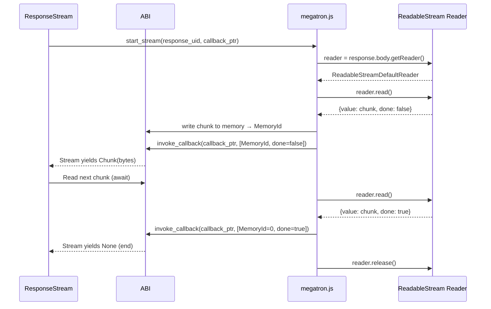

# Streaming

## Overview

This feature implements response body streaming — reading the Response body as a stream of chunks rather than consuming the entire body at once. Since the body was pre-consumed as ArrayBuffer in the fetch executor (feature 02), streaming requires a different path: the JS side reads the `ReadableStream` in chunks and invokes the Rust callback for each chunk via the ABI.

**Feature-gated**: `http-streaming`

## Language Stack

| Language | Purpose | Skill Location |
|----------|---------|----------------|
| Rust | Stream iterator, async callback processing | `.agents/skills/rust-clean-code/skill.md` |
| JavaScript | ReadableStream chunk delivery | Follow existing megatron.js patterns |

## Architecture (COMPREHENSIVE)

### File Structure

- `backends/foundation_wasm/src/http/stream.rs` — Stream implementation (new file)

### Approach: Stream via Pre-Consumed Body

Since the default fetch path already consumes the body as ArrayBuffer (feature 02), streaming is implemented as an **alternative** fetch path that leaves the body as a `ReadableStream` and delivers chunks via repeated callback invocations.

However, there's a simpler approach that avoids duplicating the fetch logic:

**After the Response is received**, the Rust side can request streaming by calling a JS-side function that reads the `response.body` ReadableStream and delivers chunks. But since we already consumed the body as ArrayBuffer, we need to either:

1. **Don't pre-consume the body when streaming is requested** — The fetch executor checks a "stream" flag and skips `arrayBuffer()`, instead setting up a ReadableStream reader.
2. **Always keep the ReadableStream** — The fetch executor stores the Response as ExternalPointer but doesn't consume the body. Rust requests body via separate calls (text/bytes/stream).

**We choose option 1**: A separate streaming fetch path that doesn't pre-consume the body.

### Stream Struct

```rust
/// A stream of response body chunks.
/// Implements the Stream trait from the futures crate.
pub struct ResponseStream {
    /// Internal state for the async iterator
    inner: StreamInner,
}

/// Opaque inner state that holds the callback registration
/// and tracks whether the stream is done.
struct StreamInner {
    /// Pointer to the async callback registration
    callback: InternalPointer,
    /// Whether the stream has completed
    done: bool,
    /// The JS Response ExternalPointer (kept alive)
    response_uid: ExternalPointer,
    /// Pending chunk future (if any)
    pending: Option<ChunkFuture>,
}
```

### Chunk Delivery Flow



### Stream Implementation

Since we're `no_std`, we can't use `futures::stream::Stream`. We define our own:

```rust
/// A simple stream trait for async chunk iteration.
pub trait HttpStream {
    type Item;

    /// Poll for the next item.
    fn poll_next(
        self: Pin<&mut Self>,
        cx: &mut core::task::Context<'_>,
    ) -> core::task::Poll<Option<Self::Item>>;
}

/// A stream of body chunks as Bytes.
pub struct BytesStream {
    inner: StreamInner,
}

impl HttpStream for BytesStream {
    type Item = HttpResult<Bytes>;

    fn poll_next(
        self: Pin<&mut Self>,
        cx: &mut core::task::Context<'_>,
    ) -> core::task::Poll<Option<Self::Item>> {
        // Check if callback has been invoked with a new chunk
        let inner = &mut self.get_mut().inner;
        if inner.done {
            return core::task::Poll::Ready(None);
        }

        // Check InternalReferenceRegistry for a fired callback
        match internal_api::check_callback(inner.callback) {
            Some(result_mem_id) => {
                // Parse result: [body_mem_id(u64), done(bool)]
                let (body_mem_id, done) = parse_chunk_result(result_mem_id)?;
                if done {
                    inner.done = true;
                    core::task::Poll::Ready(None)
                } else {
                    let bytes = read_body_from_memory(body_mem_id)?;
                    core::task::Poll::Ready(Some(Ok(bytes)))
                }
            }
            None => core::task::Poll::Pending,
        }
    }
}
```

### bytes_stream() on Response

```rust
impl Response {
    /// Converts the response into a stream of body chunks.
    /// Only available when the `http-streaming` feature is enabled.
    ///
    /// This consumes the Response and returns a stream that yields
    /// Bytes chunks. The stream ends when the body is fully read.
    pub fn bytes_stream(self) -> HttpResult<BytesStream> {
        // The Response must have a valid js_response ExternalPointer
        let response_uid = self.js_response
            .ok_or_else(|| HttpError::Decode("response body already consumed".into()))?;

        // Start streaming on JS side
        let callback = internal_api::register_stream_callback();
        host_runtime::web::start_stream_response(response_uid, callback)?;

        Ok(BytesStream {
            inner: StreamInner {
                callback,
                done: false,
                response_uid,
                pending: None,
            },
        })
    }
}
```

### Megatron.js Streaming

```javascript
/**
 * Start streaming response body chunks to Rust.
 * Reads the ReadableStream and invokes callback per chunk.
 */
async startStreamResponse(responseUid, callbackPtr) {
  const logger = LOGGER.scoped("startStreamResponse:");
  const response = this.getExternalObject(responseUid);

  if (!response.body) {
    // No body (e.g., 204 No Content)
    this.instance.exports.invoke_callback(callbackPtr, this.writeChunkResult(0, true));
    return;
  }

  const reader = response.body.getReader();

  try {
    while (true) {
      const { value, done } = await reader.read();

      if (done) {
        reader.releaseLock();
        this.instance.exports.invoke_callback(
          callbackPtr,
          this.writeChunkResult(0, true) // MemoryId=0, done=true
        );
        break;
      }

      // Write chunk to shared memory
      const chunk = new Uint8Array(value);
      const memId = this.allocations.create(chunk.length);
      const alloc = this.allocations.get(memId);
      alloc.buffer.set(chunk);

      // Invoke callback with chunk MemoryId
      this.instance.exports.invoke_callback(
        callbackPtr,
        this.writeChunkResult(memId, false)
      );

      logger.debug("Streamed chunk:", chunk.length, "bytes, memId:", memId);
    }
  } catch (e) {
    logger.error("Stream error:", e.message);
    // Signal error by invoking callback with error MemoryId
    const errorMemId = this.writeFetchError("Stream error: " + e.message);
    this.instance.exports.invoke_callback(callbackPtr, errorMemId);
  }
}

/**
 * Encode chunk result: [body_mem_id(u64), done(bool)]
 */
writeChunkResult(bodyMemId, done) {
  return this.encodeResult([
    { type: ReturnTypeId.MemorySlice, value: bodyMemId },
    { type: ReturnTypeId.Bool, value: done },
  ]);
}
```

### Trade-offs and Decisions

| Decision | Rationale | Alternatives Considered |
|----------|-----------|------------------------|
| Poll-based stream (not futures::Stream) | no_std compatible, no external deps | Use `futures` crate — adds dependency |
| Chunk-by-chunk callback | Matches existing async callback pattern | wasm_streams crate — requires wasm-bindgen |
| Response.body kept as ReadableStream | Only consumed when streaming requested | Always pre-consume — can't support streaming |
| MemoryId per chunk | Existing mechanism, clean transfer | Pass raw bytes in callback — limited by callback signature |

## Implementation

### Files to Create/Modify

- `backends/foundation_wasm/src/http/stream.rs` — New file: BytesStream, HttpStream trait
- `backends/foundation_wasm/src/http/response.rs` — Add `bytes_stream()` method (feature-gated)
- `backends/foundation_wasm/sdk/jsruntime/megatron.js` — Add `startStreamResponse()` method

### Tasks

- [ ] T1: Define `HttpStream` trait for no_std stream iteration
- [ ] T2: Create `StreamInner` struct with callback and state tracking
- [ ] T3: Create `BytesStream` struct implementing `HttpStream`
- [ ] T4: Implement `poll_next()` checking InternalReferenceRegistry for fired callbacks
- [ ] T5: Add `bytes_stream()` method to Response (feature-gated: `http-streaming`)
- [ ] T6: Add `startStreamResponse()` to megatron.js
- [ ] T7: Add `writeChunkResult()` memory writer to megatron.js
- [ ] T8: Export from `http/mod.rs` (feature-gated)

## Testing

### Test Cases

1. **Stream yields chunks**: Large response delivered in multiple chunks via BytesStream
2. **Stream ends**: bytes_stream() returns None after all chunks read
3. **Empty body**: Stream immediately returns None for 204 No Content
4. **Stream error**: Network error during streaming returns HttpError
5. **Double consumption**: Calling bytes_stream() after bytes() returns error
6. **AbortGuard cleanup**: Stream correctly cleans up on AbortGuard drop

## Success Criteria

- [ ] All tasks completed
- [ ] BytesStream correctly yields chunks via poll_next
- [ ] Stream ends correctly when body is fully read
- [ ] Empty body returns None immediately
- [ ] bytes_stream() returns error if body already consumed
- [ ] No regressions on native target
- [ ] megatron.js startStreamResponse correctly reads ReadableStream

---

_Created: 2026-05-18_
