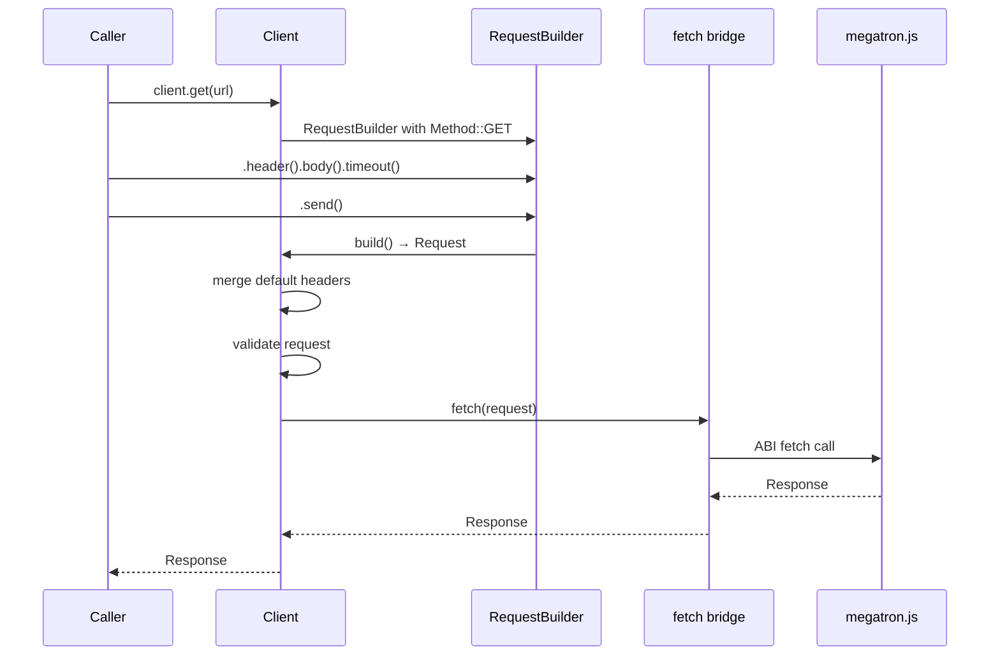

# Client Layer

## Overview

This feature implements the public-facing `Client` and `ClientBuilder` — the entry point for HTTP requests. It mirrors reqwest's client architecture: `Client` is cheap to clone (Arc-backed config), `ClientBuilder` configures defaults, and convenience methods (`get`, `post`, etc.) return `RequestBuilder` instances.

## Language Stack

| Language | Purpose | Skill Location |
|----------|---------|----------------|
| Rust | Client types, builder, header merging | `.agents/skills/rust-clean-code/skill.md` |

## Architecture (COMPREHENSIVE)

### File Structure

- `backends/foundation_wasm/src/http/client.rs` — Client, ClientBuilder, Config

### Config Struct

```rust
/// Internal configuration shared by Client instances via Arc.
struct Config {
    /// Default headers applied to all requests.
    headers: HeaderMap,

    /// User-Agent header (stored separately for convenience).
    user_agent: Option<HeaderValue>,

    /// Deferred error from builder configuration.
    error: Option<HttpError>,
}
```

### Client Struct

```rust
#[derive(Clone)]
pub struct Client {
    config: Arc<Config>,
}

impl Client {
    /// Creates a new Client with default configuration.
    pub fn new() -> Self;

    /// Creates a new ClientBuilder for custom configuration.
    pub fn builder() -> ClientBuilder;

    // Convenience methods - each returns a RequestBuilder
    pub fn get<U: Into<String>>(&self, url: U) -> RequestBuilder;
    pub fn post<U: Into<String>>(&self, url: U) -> RequestBuilder;
    pub fn put<U: Into<String>>(&self, url: U) -> RequestBuilder;
    pub fn patch<U: Into<String>>(&self, url: U) -> RequestBuilder;
    pub fn delete<U: Into<String>>(&self, url: U) -> RequestBuilder;
    pub fn head<U: Into<String>>(&self, url: U) -> RequestBuilder;

    /// Creates a RequestBuilder for the given method and URL.
    pub fn request(&self, method: Method, url: impl Into<String>) -> RequestBuilder;

    /// Executes a prepared Request directly.
    pub async fn execute(&self, request: Request) -> HttpResult<Response>;
}
```

### ClientBuilder

```rust
pub struct ClientBuilder {
    config: Config,
}

impl ClientBuilder {
    /// Adds a default header to all requests.
    pub fn default_headers(self, headers: HeaderMap) -> Self;

    /// Sets the User-Agent header.
    pub fn user_agent(self, user_agent: impl Into<String>) -> Self;

    /// Builds the Client.
    pub fn build(self) -> HttpResult<Client>;
}
```

### Header Merge Logic

When executing a request, client default headers are merged with per-request headers:

```rust
fn merge_headers(request: &mut Request, defaults: &HeaderMap) {
    for (name, value) in defaults {
        // Only insert if the request doesn't already have this header
        if !request.headers.contains_key(name) {
            request.headers.insert(name.clone(), value.clone());
        }
    }
}
```

This means per-request headers take precedence over client defaults.

### Execute Flow



### RequestBuilder.send() Integration

The `send()` method on RequestBuilder calls `client.execute()`:

```rust
impl RequestBuilder {
    pub async fn send(self) -> HttpResult<Response> {
        let (client, request) = self.build_split();
        let request = request?;  // propagate deferred errors
        client.execute(request).await
    }
}
```

### Default Configuration

```rust
impl Client {
    pub fn new() -> Self {
        Client {
            config: Arc::new(Config {
                headers: HeaderMap::new(),
                user_agent: None,
                error: None,
            }),
        }
    }
}
```

### Trade-offs and Decisions

| Decision | Rationale | Alternatives Considered |
|----------|-----------|------------------------|
| Client is Clone (Arc-backed) | Matches reqwest, cheap to share | Single ownership — breaks ergonomics |
| Default headers merged at execute time | Request headers always win | Merge at build time — can't change client defaults after build |
| No connection pooling | Browser manages connections | Implement pooling — unnecessary, browser handles it |
| No TLS/proxy config | Browser handles transport | Add config fields — unused |

## Implementation

### Files to Create/Modify

- `backends/foundation_wasm/src/http/client.rs` — New file: Client, ClientBuilder, Config
- `backends/foundation_wasm/src/http/request.rs` — Add `send()` method that calls client.execute()

### Tasks

- [ ] T1: Create `Config` struct with headers, user_agent, error fields
- [ ] T2: Create `Client` struct with Arc<Config>
- [ ] T3: Create `ClientBuilder` struct with Config
- [ ] T4: Implement `Client::new()` and `Client::builder()`
- [ ] T5: Implement convenience methods: get/post/put/patch/delete/head
- [ ] T6: Implement `Client::request()` and `Client::execute()`
- [ ] T7: Implement `ClientBuilder::default_headers()`, `user_agent()`, `build()`
- [ ] T8: Wire `RequestBuilder::send()` to call `client.execute()`
- [ ] T9: Export from `http/mod.rs`

## Testing

### Test Cases

1. **Client::new()**: Creates a client with empty config
2. **Client::builder()**: Builder constructs client with custom headers
3. **Default headers**: Client default headers appear in request
4. **Header precedence**: Per-request header overrides client default
5. **Convenience methods**: client.get(url) creates RequestBuilder with GET method
6. **execute()**: Sends request through fetch bridge, returns Response
7. **Clone**: Cloned client shares config (Arc reference count increases)

## Success Criteria

- [ ] All tasks completed
- [ ] Client correctly merges default headers with per-request headers
- [ ] Convenience methods return correctly-configured RequestBuilders
- [ ] execute() correctly calls the fetch bridge
- [ ] Cloned clients share configuration
- [ ] No regressions on native target

---

_Created: 2026-05-18_
