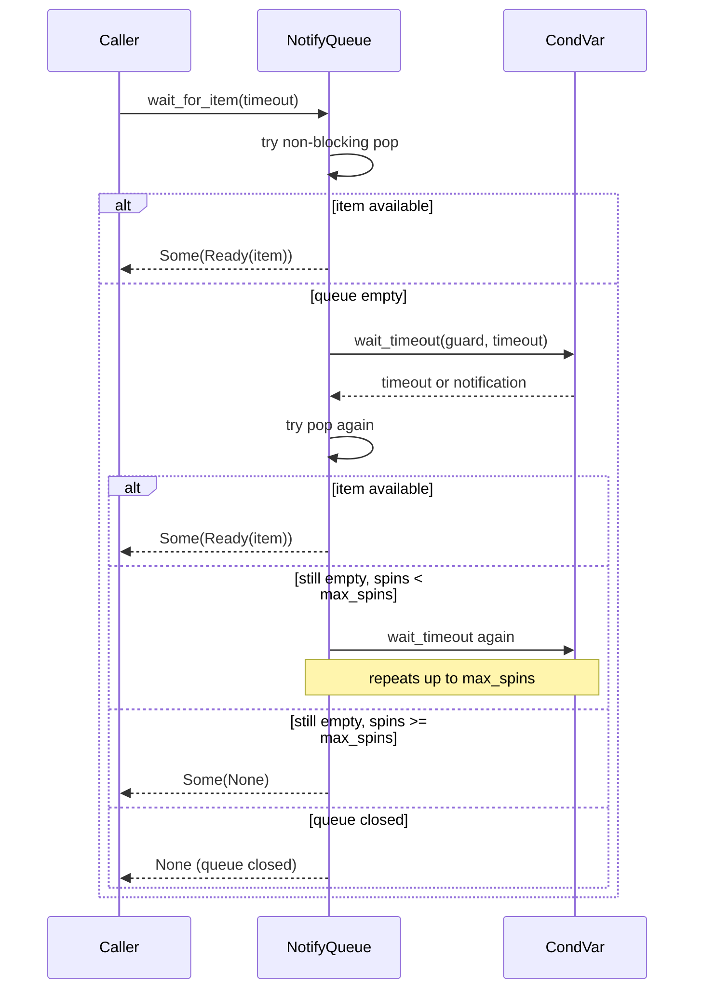

# NotifyQueue Contract Fix Feature

## Overview

Fix `NotifyQueue::wait_for_item` indefinite loop contract in `local.rs`. The current implementation loops forever when no item is available, preventing the valtron executor from ever yielding control — critical on wasm32 where this blocks the JS event loop.

The solution introduces `NotificationItem<T>` as the inner type wrapped in `Option` for `wait_for_item`, `NotifyRecvIterator::next`, and `NotifyQueueStreamIterator::next`. Callers can now decide whether to retry, map to Pending/Ignore, or break. `Option::None` means the queue is closed and iteration should end.

## Problem

`NotifyQueue::wait_for_item` in `local.rs:231-279` uses `loop {}` that only exits when an item is available OR the queue is closed. The CondVar timeout is a re-check interval, not a true bound on total wait time.

```rust
// local.rs:243-278 — current broken contract
loop {
    match self.queue.pop() { ... }
    let result = self.condvar.wait_timeout(guard, timeout).unwrap();
    guard = result.0;
    match self.queue.pop() { ... }
    *guard = false;
    // loops forever
}
```

This breaks the valtron executor contract:
1. **Never yields back** — `wait_for_item` holds control indefinitely
2. **Blocks JS event loop on wasm32** — no JS Promise resolution can occur
3. **Callers have no decision point** — they can't choose to retry later

## Affected Call Sites

| Location | Caller | Impact |
|----------|--------|--------|
| `NotifyQueue::wait_for_item` (line 231) | Returns `Option<NotificationItem<T>>` | Never blocked before, now configurable |
| `NotifyRecvIter::block_recv` (line 347) | Delegates to `wait_for_item` | Blocks forever |
| `NotifyRecvIterator::next` (line 389) | Calls `block_recv` | Iterator stuck |
| `NotifyQueueStreamIterator::next` (line 485-516) | Calls `wait_for_item` with `park_duration` | Stream iterator stuck |
| `DrivenNonSendTaskIterator::next` (line 641-658) | Uses `NotifyQueueStreamIterator` | Valtron spin loop deadlocks on wasm |
| `DrivenNonSendStreamIterator::next` (line 757-775) | Uses `NotifyQueueStreamIterator` | Same deadlock path |
| `DrivenRecvIterator::next` (line 906-925) | Uses `NotifyRecvIterator` | Same deadlock path |
| `run_until_receiver_has_value` (drivers.rs:150) | `while stream.is_empty() { run_until(checker) }` | Spins waiting for queue to fill |
| `run_until_stream_has_value` (drivers.rs:190) | `while stream.is_empty() && !stream.is_closed() { run_until(checker) }` | Spins waiting for queue to fill |
| Tests (6+ test cases) | `notification_based_waiting.rs` | Tests rely on current blocking behavior |

## Solution

### 1. Add `NotificationItem<T>` enum

```rust
pub enum NotificationItem<T> {
    /// An item was received successfully.
    Ready(T),
    /// No item available, queue still open.
    /// Mapped by caller to Stream::Wait or TaskStatus::Wait.
    None,
}
```

**Design note**: Only two variants. `None` means "nothing yet, queue still open." The caller maps it upward. When the queue is actually closed, the iterator returns `None` (Option) to end iteration.

### 2. Add `Stream::Wait`, `TaskStatus::Wait`, and `State::Wait`

Add `Wait` to `Stream<D, P>` in `streams.rs`:
```rust
pub enum Stream<D, P> {
    Init,
    Ignore,
    Delayed(std::time::Duration),
    Pending(P),
    Next(D),
    /// No data available, queue still open.
    /// Propagates to executor as a yield signal.
    Wait,
}
```

Add `Wait` to `TaskStatus<D, P, S>` in `task.rs`:
```rust
pub enum TaskStatus<D, P, S: ExecutionAction> {
    Delayed(time::Duration),
    Spawn(S),
    Pending(P),
    Init,
    Ready(D),
    Ignore,
    /// No data available, queue still open.
    /// Propagates to executor as a yield signal.
    Wait,
}
```

Add `Wait` to `State` in `task.rs`:
```rust
pub enum State {
    Pending(Option<time::Duration>),
    Panicked,
    SpawnFailed(Entry),
    SpawnFinished(SpawnInfo),
    Reschedule,
    Progressed,
    ReadyValue(Entry),
    Done,
    /// Queue empty, no item yet. Signals executor to yield.
    Wait,
}
```

Update `From<TaskStatus>` → `Stream` conversion in `task.rs`:
```rust
TaskStatus::Wait => Stream::Wait,
```

Update `State::Wait` match arms everywhere `State` is exhaustively matched:

### In `local.rs:1267` — `ExecutorState::schedule_and_do_work`

Add arm after `State::Reschedule` (around line 1634):
```rust
State::Wait => {
    tracing::debug!("Task is waiting, yielding to executor");
    self.local_tasks.borrow_mut().unpark(&top_entry, iter);
    self.processing.borrow_mut().push_front(top_entry);
    ProgressIndicator::Wait
}
```
Unparks task, pushes it back, returns `ProgressIndicator::Wait` so `run_until` yields.

### Add `Wait` variant to `ProgressIndicator` in `local.rs`

Add after `SpinWait`:
```rust
/// Queue empty, nothing available yet. Signals executor to yield
/// and re-check. On JS, maps to a short setTimeout (~4ms).
Wait,
```
This is distinct from `SpinWait(duration)` — the task doesn't want a specific delay, it just needs to yield because nothing is available yet.

### In `collect_next.rs:97-116` — `CollectNextTask::next`

Add `TaskStatus::Wait => State::Wait` in the match arm (between `Ready` and `Ignore`).

### In `do_next.rs:94-110` — `DoNextTask::next`

Add `TaskStatus::Wait => State::Wait` in the match arm (between `Ready` and `Ignore`).

### In `on_next.rs:183-203` — `OnNextTask::next`

Add `TaskStatus::Wait => State::Wait` in the match arm (between `Ready` and `Ignore`).

### In `drivers.rs` — `run_until_next_state` acceptability checkers

1. `run_until_next_acceptable_state` (line 79) — `run_until_next_state` uses this:
   ```rust
   !matches!(candidate, State::SpawnFailed(_) | State::SpawnFinished(_) | State::Reschedule | State::Done | State::Wait)
   ```
   Adding `State::Wait` means the checker returns `false` when it sees `Wait`, causing `run_until` to yield and re-enter instead of treating `Wait` as acceptable progress.

2. `DrivenStreamIterator::next` (line 830-835) — via `run_until_stream_has_value`:
   ```rust
   !matches!(state, State::SpawnFailed(_) | State::SpawnFinished(_) | State::Reschedule | State::Done | State::Wait)
   ```

3. `DrivenRecvIterator::next` (line 915) — via `run_until_receiver_has_value`:
   ```rust
   !matches!(state, State::SpawnFailed(_) | State::SpawnFinished(_) | State::Reschedule | State::Wait)
   ```

### In `dependent_lift.rs` — `FinishChildBeforeParentTask::next`

Add `State::Wait` to `needs_propagation` match (line 63):
```rust
let needs_propagation = matches!(
    parent_state,
    State::Wait
        | State::Pending(Some(_))
        | State::SpawnFinished(_)
        | State::Panicked
        | State::Reschedule
);
```

### In `task_iters.rs` — three `TaskStatus` match arms need `TaskStatus::Wait`

**`StreamConsumingIter::next` (around line 182):**
Add arm that pushes `Stream::Wait` into the channel:
```rust
TaskStatus::Wait => {
    match self.channel.push(Stream::Wait) {
        Ok(()) => State::Pending(None),
        Err(PushError::Full(_)) => {
            self.pending_msg = Some(Stream::Wait);
            State::Pending(None)
        }
        Err(PushError::Closed(_)) => {
            self.channel.close();
            self.alive.take();
            State::Done
        }
    }
}
```

**`TaskStatusConsumingIter::next` (around line 495):**
Add `TaskStatus::Wait => State::Pending(None)` — or push `TaskStatus::Wait` into channel with same pattern.

**`ActionConsumingIter::next` (around line 695):**
Add `TaskStatus::Wait => State::Pending(None)`.

### 3. Add `max_spins` parameter to `wait_for_item`

Add a `max_spins` field to `NotifyQueue<T>` that defaults to `DEFAULT_NOTIFY_QUEUE_MAX_SPINS`. The caller sets it before using the queue.

```rust
pub struct NotifyQueue<T> {
    queue: Queue<T>,
    mutex: Mutex<bool>,
    condvar: Condvar,
    max_spins: AtomicUsize,
}

impl<T> NotifyQueue<T> {
    pub fn unbounded() -> Self {
        Self {
            queue: Queue::unbounded(),
            mutex: Mutex::new(false),
            condvar: Condvar::new(),
            max_spins: AtomicUsize::new(DEFAULT_NOTIFY_QUEUE_MAX_SPINS),
        }
    }

    /// Set the maximum number of CondVar wait retries before yielding back.
    pub fn set_max_spins(&self, max_spins: usize) {
        self.max_spins.store(max_spins, Ordering::Relaxed);
    }
}
```

`wait_for_item` returns `Option<NotificationItem<T>>`:
- `Some(NotificationItem::Ready(value))` — item available
- `Some(NotificationItem::None)` — queue open but empty, caller decides
- `None` — queue closed, iteration should end

```rust
pub fn wait_for_item(&self, timeout: time::Duration) -> Option<NotificationItem<T>> {
    // Quick non-blocking pop first
    if let Ok(item) = self.queue.pop() {
        return Some(NotificationItem::Ready(item));
    }

    let max_spins = self.max_spins.load(Ordering::Relaxed);
    let mut spins = 0;
    let mut guard = self.mutex.lock().unwrap();

    loop {
        if spins >= max_spins {
            *guard = false;
            return Some(NotificationItem::None);
        }

        match self.queue.pop() {
            Ok(item) => {
                *guard = false;
                return Some(NotificationItem::Ready(item));
            }
            Err(PopError::Closed) => {
                *guard = false;
                return None;  // Queue closed
            }
            Err(PopError::Empty) => {}
        }

        let result = self.condvar.wait_timeout(guard, timeout).unwrap();
        guard = result.0;
        spins += 1;
    }
}
```

### 4. Add `DEFAULT_NOTIFY_QUEUE_MAX_SPINS` constant

```rust
/// Maximum number of CondVar wait retries before yielding back to executor.
/// Default of 1 gives one CondVar wait cycle (~10ms) before yielding.
pub const DEFAULT_NOTIFY_QUEUE_MAX_SPINS: usize = 1;
```

### 5. Update all callers

**`NotifyQueueStreamIterator::next()`** — returns `Option<Stream<D, P>>`:
```rust
fn next(&mut self) -> Option<Self::Item> {
    // Quick non-blocking pop first
    match self.chan.pop() {
        Ok(value) => return Some(value),
        Err(PopError::Closed) => return None,
        Err(PopError::Empty) => {}
    }

    match self.chan.wait_for_item(self.park_duration) {
        Some(NotificationItem::Ready(value)) => Some(value),
        Some(NotificationItem::None) => Some(Stream::Wait),  // Queue open but empty — executor yields
        None => None,  // Queue closed, iteration ends
    }
}
```

**`NotifyRecvIterator::next()`** — **breaking change**: associated type becomes `Item = NotificationItem<T>`:
```rust
impl<T> Iterator for NotifyRecvIterator<T> {
    type Item = NotificationItem<T>;

    fn next(&mut self) -> Option<Self::Item> {
        match self.0.queue.wait_for_item(self.1) {
            Some(NotificationItem::Ready(value)) => Some(NotificationItem::Ready(value)),
            Some(NotificationItem::None) => Some(NotificationItem::None),  // Queue open, caller decides
            None => None,  // Queue closed, iteration ends
        }
    }
}
```

**`NotifyRecvIter::block_recv()`** — returns `Option<NotificationItem<T>>`:
```rust
pub fn block_recv(&self, timeout: time::Duration) -> Option<NotificationItem<T>> {
    self.queue.wait_for_item(timeout)
}
```

**`DrivenNonSendTaskIterator`** — handles `NotificationItem` from `NotifyRecvIterator`:
```rust
fn next(&mut self) -> Option<Self::Item> {
    if let Some(mut task_iterator) = self.0.take() {
        run_until_next_state();

        match task_iterator.next_status() {
            Some(NotificationItem::Ready(status)) => {
                self.0.replace(task_iterator);
                Some(status)
            }
            Some(NotificationItem::None) => {
                // Queue open but empty — signal Wait to executor
                self.0.replace(task_iterator);
                Some(TaskStatus::Wait)  // Executor transforms to ProgressIndicator::Wait
            }
            None => None,  // Queue closed
        }
    } else {
        None
    }
}
```

**`DrivenNonSendStreamIterator`** — handles `Stream::Wait` from `NotifyQueueStreamIterator`:
```rust
fn next(&mut self) -> Option<Self::Item> {
    if let Some(mut task_iterator) = self.0.take() {
        run_until_next_state();

        let next_value = task_iterator.next();
        if next_value.is_some() {
            self.0.replace(task_iterator);
        }
        next_value  // Stream::Wait keeps iterator alive
    } else {
        None
    }
}
```

**`run_until_receiver_has_value`** / **`run_until_stream_has_value`**:
- These check `is_empty()` before spinning. No change to their core logic.
- When JS yield is enabled (Features 2-5), `run_until` yields to the event loop instead of spinning.

### 6. Tests

Existing tests that expect items to eventually arrive use a retry loop:
```rust
fn test_notify_queue_blocks_until_item_available() {
    let queue: Arc<NotifyQueue<i32>> = Arc::new(NotifyQueue::unbounded());
    queue.set_max_spins(1);
    let queue_clone = queue.clone();

    let producer = std::thread::spawn(move || {
        std::thread::sleep(Duration::from_millis(10));
        queue_clone.push(42).expect("push should succeed");
    });

    let mut result = None;
    for _ in 0..50 {
        match queue.wait_for_item(Duration::from_micros(100)) {
            Some(NotificationItem::Ready(v)) => { result = Some(v); break; }
            Some(NotificationItem::None) => { std::thread::sleep(Duration::from_millis(1)); }
            None => panic!("queue should not be closed during test"),
        }
    }

    producer.join().expect("producer should complete");
    assert_eq!(result, Some(42));
}
```

Tests that check queue-closed behavior assert `wait_for_item` returns `None` (Option) when the queue is closed.

## Architecture



```mermaid
flowchart TD
    A["wait_for_item returns Option<NotificationItem<T>>"] --> B{Caller type?}
    B -->|"NotifyQueueStreamIterator"| C[Ready → Some(value)]
    B -->|"NotifyQueueStreamIterator"| D[None → iteration ends]
    B -->|"NotifyQueueStreamIterator"| E[Some(None) → Stream::Wait]
    B -->|"NotifyRecvIterator"| F[Ready → Some(Ready(value))]
    B -->|"NotifyRecvIterator"| G[None → iteration ends]
    B -->|"NotifyRecvIterator"| H[Some(None) → caller decides]
    B -->|"Driven-task iterators"| I[Ready → Some(status)]
    B -->|"Driven-task iterators"| J[Some(None) → TaskStatus::Wait]
    B -->|"any caller"| K[None → queue closed, end iteration]
    C --> L["Executor gets value"]
    D --> L
    E --> M["Executor sees Wait → ProgressIndicator::Wait → yield"]
    F --> L
    G --> L
    H --> N["Caller decides: retry, yield, stop"]
    I --> L
    J --> M
    K --> O["Iteration ends"]
```

## Implementation Phases

1. Add `NotificationItem<T>` enum to `local.rs`
2. Add `Stream::Wait` to `streams.rs`
3. Add `TaskStatus::Wait` to `task.rs`, update `From<TaskStatus>` → `Stream` conversion
4. Add `State::Wait` to `State` enum in `task.rs`
5. Add `State::Wait` match arm in `ExecutorState::schedule_and_do_work` (local.rs:1267)
6. Update `TaskStatus` → `State` mapping in `collect_next.rs`
7. Update `TaskStatus` → `State` mapping in `do_next.rs`
8. Update `TaskStatus` → `State` mapping in `on_next.rs`
9. Update `run_until_next_acceptable_state` checker in `drivers.rs` (line 77)
10. Update `DrivenStreamIterator` checker in `drivers.rs` (line 830)
11. Update `DrivenRecvIterator` checker in `drivers.rs` (line 913)
12. Update `needs_propagation` in `dependent_lift.rs`
13. Update `StreamConsumingIter`, `TaskStatusConsumingIter`, `ActionConsumingIter` in `task_iters.rs`
14. Add `max_spins` field and `set_max_spins` to `NotifyQueue`, update `wait_for_item` to use it
15. Add `DEFAULT_NOTIFY_QUEUE_MAX_SPINS` to `constants.rs`
16. Update `NotifyRecvIter::block_recv` → returns `Option<NotificationItem<T>>`
17. Update `NotifyRecvIterator::next` → `Item = NotificationItem<T>`, returns `Some(NotificationItem::Ready(value))` on Ready, `Some(NotificationItem::None)` on open-but-empty, `None` on closed
18. Update `NotifyQueueStreamIterator::next` → maps `Some(NotificationItem::None)` to `Some(Stream::Wait)`, `None` to `None`
19. Update `DrivenNonSendTaskIterator`, `DrivenNonSendStreamIterator`, `DrivenRecvIterator` → handle `NotificationItem` / `Wait`
20. Update existing tests in `notification_based_waiting.rs`

## Tests

1. `test_notification_item_ready_on_available_item()` — wait_for_item returns `Some(NotificationItem::Ready(value))` when item exists
2. `test_notification_item_none_after_max_spins()` — wait_for_item returns `Some(NotificationItem::None)` when no item after max_spins retries
3. `test_notification_item_none_queue_closed()` — wait_for_item returns `None` (Option) when queue is closed, iterator ends
4. `test_wait_for_item_respects_max_spins()` — With max_spins=2, function returns `Some(NotificationItem::None)` after exactly 2 timeout cycles
5. `test_notify_recv_iterator_handles_none()` — NotifyRecvIterator::next returns `Some(NotificationItem::None)` when queue is open but empty
6. `test_notify_queue_stream_iterator_returns_wait_on_none()` — NotifyQueueStreamIterator::next returns `Some(Stream::Wait)` when `Some(NotificationItem::None)` and queue is open
7. `test_notify_queue_stream_iterator_ends_on_closed()` — NotifyQueueStreamIterator::next returns `None` when queue is closed

## Success Criteria

- `NotificationItem<T>` enum exists and is exported
- `Stream::Wait` variant exists in `streams.rs`
- `TaskStatus::Wait` variant exists in `task.rs` with `From<TaskStatus>` → `Stream` updated
- `State::Wait` variant exists in `State` enum in `task.rs`
- `TaskStatus::Wait` → `State::Wait` mapping in `collect_next.rs`, `do_next.rs`, `on_next.rs`
- `run_until` acceptability checkers in `drivers.rs` handle `State::Wait`
- `NotifyQueue` has `max_spins` field with `set_max_spins` setter, defaults to `DEFAULT_NOTIFY_QUEUE_MAX_SPINS`
- `wait_for_item` uses the queue's `max_spins` field and returns `Option<NotificationItem<T>>`
- `NotifyQueueStreamIterator` maps `Some(NotificationItem::None)` to `Some(Stream::Wait)`, `None` ends iteration
- All callers updated to handle `Option<NotificationItem<T>>` variants
- `DEFAULT_NOTIFY_QUEUE_MAX_SPINS` constant exists
- All existing tests pass (updated with retry loops)
- New contract tests pass

## Verification Commands

```bash
cargo test -p foundation_core -- notification_based_waiting
cargo test -p foundation_core -- notify_queue_contract
cargo build -p foundation_core
cargo clippy -p foundation_core -- -D warnings
```
