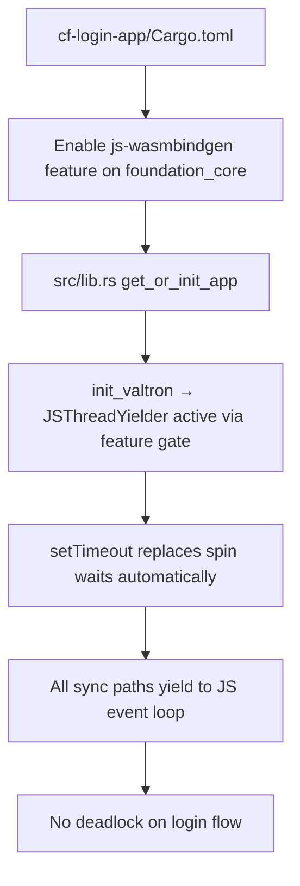

# cf-login-app Integration Feature

## Overview

Enable JS yield in the `cf-login-app` example to demonstrate the full login flow working on miniflare without deadlock.

## Problem

The `cf-login-app` example needs to enable JS yield to demonstrate the full login flow working on miniflare without deadlock.

## Solution

1. Add `js-wasmbindgen` feature to `foundation_db` (or `foundation_core`) dependency in `examples/cf-login-app/Cargo.toml`
2. The wasm module auto-uses `JSThreadYielder` via feature gating — no registration call needed
3. Verify full login flow works on miniflare

## Architecture



## Implementation Phases

1. Update `examples/cf-login-app/Cargo.toml` to enable `js-wasmbindgen` feature on `foundation_core`
2. Update `examples/cf-login-app/src/lib.rs` to ensure `init_valtron()` creates executor with `JSThreadYielder` (via feature gating in `single/mod.rs`)
3. Verify the app compiles and runs on miniflare

## Tests

1. `test_full_login_flow_on_miniflare()` — manual / e2e: POST /login → redirect to /dashboard → no deadlock

## Success Criteria

- `cf-login-app` compiles with `wasm-pack build --target web`
- App runs on miniflare via `wrangler dev`
- Full login flow (register → login → dashboard → logout) works without hanging
- No deadlock in credential store or session management paths

## Verification Commands

```bash
cd examples/cf-login-app
wasm-pack build --target no-modules
wrangler dev
curl -X POST http://localhost:8787/login -d "username=test&password=test"
```
