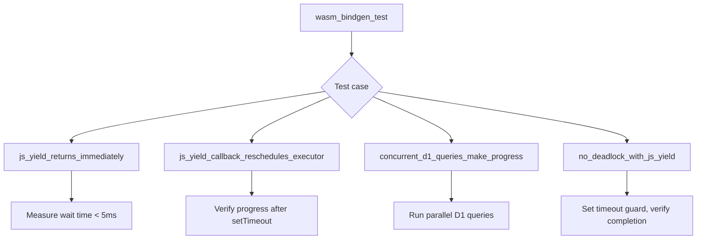

# wasm32 JS Yield Integration Tests Feature

## Overview

Create wasm-pack integration tests that verify the full stack: valtron executor → JS yield → Promise resolution → executor re-entry → task completion.

## Problem

We need integration tests that verify the full stack: valtron executor → JS yield → Promise resolution → executor re-entry → task completion.

## Solution

wasm-pack tests (`wasm32-unknown-unknown` target):

```
#[wasm_bindgen_test]
async fn js_yield_returns_immediately()
  → SpinWaiter::wait(100ms) returns in < 5ms

#[wasm_bindgen_test]
async fn js_yield_callback_reschedules_executor()
  → Executor makes progress on re-entry after setTimeout fires

#[wasm_bindgen_test]
async fn concurrent_d1_queries_make_progress()
  → Multiple D1 queries all complete

#[wasm_bindgen_test]
async fn no_deadlock_with_js_yield()
  → Task depending on JS Promise completes within timeout
```

## Architecture



## Implementation Phases

1. Create `foundation_core/tests/valtron/wasm_js_yield_integration.rs`
2. Add `#[wasm_bindgen_test]` test for immediate return from `SpinWaiter::wait()`
3. Add test for executor re-entry after setTimeout fires
4. Add test for concurrent D1 queries making progress
5. Add test for no deadlock with JS yield enabled

## Tests

1. `js_yield_returns_immediately` — `SpinWaiter::wait(100ms)` returns in < 5ms
2. `js_yield_callback_reschedules_executor` — Executor makes progress on re-entry after setTimeout fires
3. `concurrent_d1_queries_make_progress` — Multiple D1 queries all complete
4. `no_deadlock_with_js_yield` — Task depending on JS Promise completes within timeout

## Success Criteria

- All 4 wasm-pack integration tests pass
- Tests run with `wasm-pack test --node --features js_eventloop_yield`
- No deadlocks occur during any test
- Measured wait times confirm immediate return from JS-aware wait

## Verification Commands

```bash
wasm-pack test --node --features js_eventloop_yield -p foundation_core -- wasm_js_yield_integration
```
