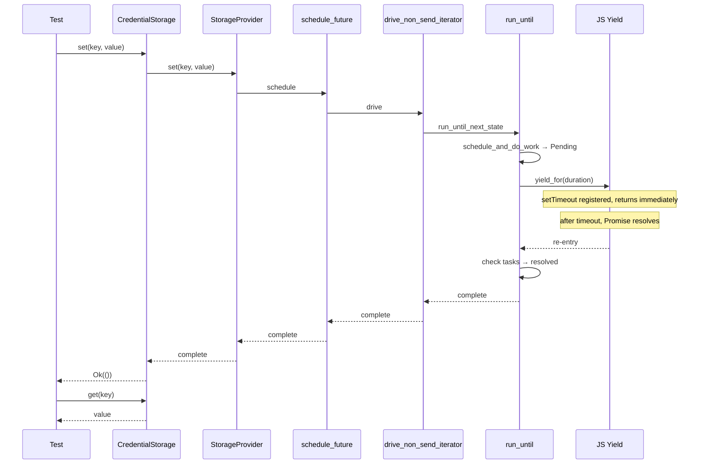

# wasm Credential Store End-to-End Tests Feature

## Overview

Create end-to-end wasm tests that prove the original deadlock path (`CredentialStorage::set()` → `schedule_future()` → `drive_non_send_iterator()` → valtron spin loop) now works correctly with JS yield enabled.

## Problem

The original deadlock path: `CredentialStorage::set()` → `schedule_future()` → `drive_non_send_iterator()` → valtron spin loop → JS Promise never resolves. We need tests that prove this path works with JS yield enabled.

## Solution

```
#[wasm_bindgen_test]
async fn set_and_get_with_js_yield()
  → CredentialStorage::set() + ::get() work (exact deadlocking call path)

#[wasm_bindgen_test]
async fn session_create_with_js_yield()
  → SessionManager::create_session() completes successfully
```

## Architecture



## Implementation Phases

1. Create `foundation_core/tests/valtron/wasm_credential_store_with_yield.rs`
2. Add `set_and_get_with_js_yield` wasm_bindgen_test
3. Add `session_create_with_js_yield` wasm_bindgen_test

## Tests

1. `set_and_get_with_js_yield` — `CredentialStorage::set()` + `::get()` work (exact deadlocking call path)
2. `session_create_with_js_yield` — `SessionManager::create_session()` completes successfully

## Success Criteria

- Both e2e tests pass with `wasm-pack test --node`
- No deadlock occurs during credential store operations
- Session creation completes within timeout
- Tests verify the exact call path that previously deadlocked

## Verification Commands

```bash
wasm-pack test --node --features js_eventloop_yield -p foundation_core -- wasm_credential_store_with_yield
```
