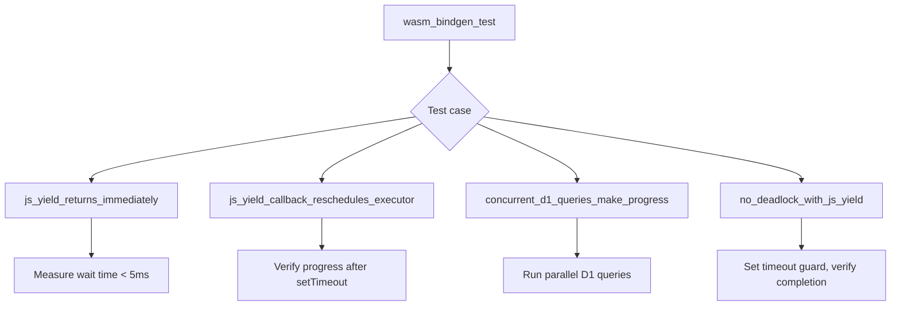

# wasm32 JS Yield Integration Tests Feature

## Overview

Create wasm32 integration tests that verify the full stack: valtron executor → JS yield → Promise resolution → executor re-entry → task completion.

## Problem

We need integration tests that verify the full stack: valtron executor → JS yield → Promise resolution → executor re-entry → task completion.

## Solution

wasm32 tests (`wasm32-unknown-unknown` target), discovered and run by `wasm-testbed`:

```
#[wasm_bindgen_test]
async fn js_yield_returns_immediately()
  → SpinWaiter::wait(100ms) returns in < 5ms

#[wasm_bindgen_test]
async fn js_yield_callback_reschedules_executor()
  → Executor makes progress on re-entry after setTimeout fires

#[wasm_bindgen_test]
async fn concurrent_d1_queries_make_progress()
  → Multiple D1 queries all complete

#[wasm_bindgen_test]
async fn no_deadlock_with_js_yield()
  → Task depending on JS Promise completes within timeout
```

`#[wasm_bindgen_test]` is used because it exports `__wbgt_` functions that the wasm-testbed CLI discovers via walrus binary parsing — that's how `bindgen-*` modes auto-generate their runners.

## Architecture



## Implementation Phases

1. Create `foundation_core/tests/valtron/wasm_js_yield_integration.rs`
2. Add `#[wasm_bindgen_test]` test for immediate return from `SpinWaiter::wait()`
3. Add test for executor re-entry after setTimeout fires
4. Add test for concurrent D1 queries making progress
5. Add test for no deadlock with JS yield enabled

## Tests

1. `js_yield_returns_immediately` — `SpinWaiter::wait(100ms)` returns in < 5ms
2. `js_yield_callback_reschedules_executor` — Executor makes progress on re-entry after setTimeout fires
3. `concurrent_d1_queries_make_progress` — Multiple D1 queries all complete
4. `no_deadlock_with_js_yield` — Task depending on JS Promise completes within timeout

## Implementation

Created `foundation_core/tests/valtron/wasm_js_yield_integration.rs` with four
`#[wasm_bindgen_test]` tests gated behind `#[cfg(target_arch = "wasm32")]` and
`#[cfg(feature = "js-wasmbindgen")]`.

Key design decisions:
- Tests use `JSThreadYielder` directly (test 1) and the full valtron executor
  via `initialize_pool` / `spawn` / `run_until_complete` (tests 2-4)
- Safety timeouts via `setTimeout` prevent hanging if executor re-entry fails
- `wasm-bindgen-test` added as dev-dependency to `foundation_core` — provides
  `#[wasm_bindgen_test]` macro and `WasmBindgenTestContext` runtime, which the
  wasm-testbed CLI uses in `bindgen-*` modes to auto-generate test runners
- Dev-dependencies like `tokio`/`smol` don't support wasm32, so tests are run
  through the `wasm-testbed` CLI (not `cargo test --target wasm32-unknown-unknown`)

## Success Criteria

- All 4 wasm32 integration tests pass
- Tests are discoverable by `wasm-testbed test bindgen-deno ./foundation_core` (via `__wbgt_` exports)
- No deadlocks occur during any test
- Measured wait times confirm immediate return from JS-aware wait

## Verification Commands

```bash
# Via wasm-testbed CLI (the project's own tool):
wasm-testbed test bindgen-deno ./backends/foundation_core --features js-wasmbindgen -- wasm_js_yield_integration

# Or bindgen-web for browser:
wasm-testbed test bindgen-web ./backends/foundation_core --features js-wasmbindgen --headless
```

## Results

- `cargo check -p foundation_core --target wasm32-unknown-unknown --features js-wasmbindgen`: passes
- `cargo check -p foundation_core` (native): passes
- Test file compiles cleanly with wasm-bindgen-test attribute macros
