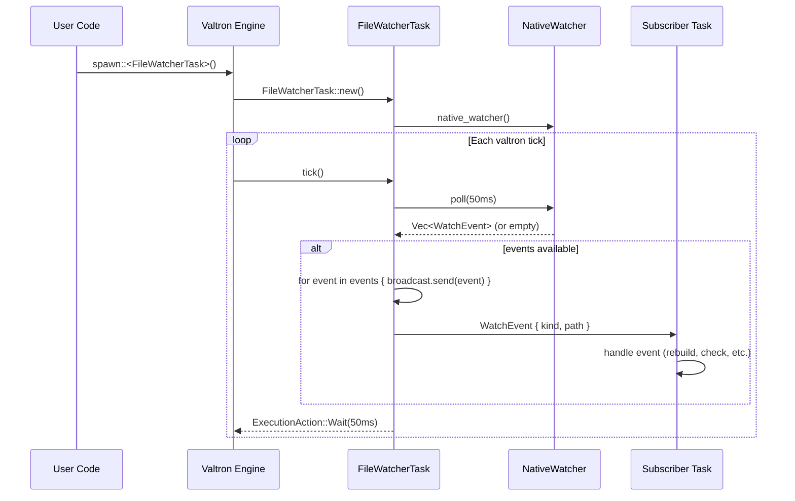

# Feature: Valtron Watcher Task

## Problem

Even with a minimal `NativeWatcher` trait, file watching needs to integrate into the valtron execution engine. The old `crates/watchers` used thread-per-watcher with blocking channels — this means:

- Other tasks can't react to file changes through the valtron scheduler
- No queue-based event delivery — events go to a single handler closure
- No way for multiple subscribers to receive the same file events

## Solution

A valtron task that wraps a `NativeWatcher` and:

1. **Polls the native watcher** on each valtron tick
2. **Delivers events to subscriber channels** (broadcast, not single-consumer)
3. **Allows dynamic watch management** — add/remove watches at runtime via task status mapper

Other valtron tasks can:
- **Start** a watcher task (spawns the NativeWatcher)
- **Subscribe** to receive events (gets a `broadcast::Receiver<WatchEvent>`)
- **React** to events in their own execution cycle

## Architecture

```
┌──────────────────────────────────────────────────────────────────┐
│                    Valtron Execution Engine                       │
│                                                                   │
│  ┌─────────────────────────────────────────┐                     │
│  │         FileWatcherTask                 │                     │
│  │                                         │                     │
│  │  struct FileWatcherTask {               │                     │
│  │      watcher: Box<dyn NativeWatcher>,   │                     │
│  │      subscribers: Arc<Broadcaster>,     │                     │
│  │      poll_timeout: Duration,            │                     │
│  │  }                                      │                     │
│  │                                         │                     │
│  │  impl TaskIterator for FileWatcherTask  │                     │
│  │    fn tick() -> ExecutionAction {       │                     │
│  │        let events = watcher.poll(t)?    │  ◄── NativeWatcher
│  │        for event in events {            │                     │
│  │            subscribers.send(event)      │  ◄── broadcast
│  │        }                                │                     │
│  │        ExecutionAction::Wait(50ms)      │  ◄── yield back     │
│  │    }                                    │                     │
│  └────────────┬────────────────────────────┘                     │
│               │                                                   │
│               ▼                                                   │
│  ┌────────────────────────┐  ┌────────────────────────┐          │
│  │  Subscriber Task A     │  │  Subscriber Task B     │          │
│  │  recv().for_each(|e| { │  │  recv().for_each(|e| { │          │
│  │     if e.path.ends     │  │     rebuild(e)         │          │
│  │       with(".rs") {    │  │  })                    │          │
│  │       cargo_check(e)   │  │                        │          │
│  │     }                  │  │                        │          │
│  │  })                    │  │                        │          │
│  └────────────────────────┘  └────────────────────────┘          │
│                                                                   │
└──────────────────────────────────────────────────────────────────┘
```

### Data Flow



### WatchEvent Delivery

```rust
/// Broadcast channel for file events.
/// Multiple subscribers can receive the same events.
pub type WatchEventBroadcaster = tokio::sync::broadcast::Sender<WatchEvent>;

/// A receiver for file events from a watcher.
pub type WatchEventReceiver = tokio::sync::broadcast::Receiver<WatchEvent>;

impl FileWatcherTask {
    /// Add a path to watch. Returns the paths that were registered.
    pub fn watch(&mut self, path: &Path, recursive: bool) -> Result<()>;

    /// Remove a watched path.
    pub fn unwatch(&mut self, path: &Path) -> Result<()>;

    /// Subscribe to file events. Can be called multiple times.
    pub fn subscribe(&self) -> WatchEventReceiver;

    /// Get the broadcaster for sending events (internal).
    fn broadcaster(&self) -> &WatchEventBroadcaster;
}
```

### TaskIterator Implementation

The `FileWatcherTask` implements valtron's `TaskIterator` trait:

```rust
pub struct FileWatcherTask {
    watcher: Box<dyn NativeWatcher>,
    broadcaster: Arc<WatchEventBroadcaster>,
    poll_timeout: Duration,
    watches: Vec<PathBuf>,
}

impl TaskIterator for FileWatcherTask {
    type Ready = ...;
    type Pending = ...;
    type Spawner = ...;

    fn tick(&mut self, _context: &TaskContext) -> ExecutionAction {
        // Poll the native watcher for events
        match self.watcher.poll(self.poll_timeout) {
            Ok(events) => {
                for event in events {
                    // Broadcast to all subscribers
                    let _ = self.broadcaster.send(event);
                }
            }
            Err(e) => {
                tracing::error!("Watcher poll error: {}", e);
            }
        }

        // Yield back to valtron — poll again on next tick
        ExecutionAction::Wait(self.poll_timeout)
    }
}
```

### How Users Use It

```rust
// 1. Create and configure the watcher task
let mut watcher = FileWatcherTask::new()
    .watch("src/", true)?
    .watch("Cargo.toml", false)?;

// 2. Subscribe before spawning (get events from the start)
let mut rx = watcher.subscribe();

// 3. Spawn into valtron
let guard = ValtronSingleton::get_or_init(42, |pool| {
    pool.spawn::<FileWatcherTask, ...>()
        .with_resolver(Box::new(FnReady::new(|_, _| {
            // Process events from the broadcast channel
            while let Ok(event) = rx.try_recv() {
                println!("File changed: {:?} ({:?})", event.path, event.kind);
            }
        })))
        .schedule()?;
});

guard.run_until_complete();
```

### Subscriber Pattern — Independent Task

A subscriber task can run independently and react to events:

```rust
// Another task that rebuilds on .rs changes
let mut rx = watcher.subscribe();
let rebuild_task = RebuildTask { events: rx };

pool.spawn::<RebuildTask, ...>()
    .with_resolver(/* ... */)
    .schedule()?;
```

## Implementation Plans

### Task Breakdown

1. [ ] Write `backends/foundation_nativeapis/src/task.rs` with `FileWatcherTask` struct
2. [ ] Implement `watch()`, `unwatch()`, `subscribe()` methods
3. [ ] Implement `TaskIterator` trait for `FileWatcherTask`
   - `tick()` polls `NativeWatcher`, broadcasts events, yields back
4. [ ] Add `WatchEventBroadcaster` / `WatchEventReceiver` type aliases
5. [ ] Add `tokio = { version = "1", features = ["sync"] }` as optional dependency (feature-gated)
6. [ ] Write integration test: spawn watcher, touch file, verify event delivery
7. [ ] Write example: simple file watcher that prints changes

## Trade-offs

| Decision | Choice | Rationale |
|----------|--------|-----------|
| Broadcast vs MPSC | Broadcast | Multiple subscribers need the same events |
| Poll-based vs interrupt | Poll via valtron tick | valtron controls scheduling — no internal threads |
| tokio::broadcast dependency | Feature-gated (`tokio-broadcast` feature) | Not all users need async; default uses crossbeam or mpsc |
| Error handling | Log and continue | A poll error shouldn't kill the watcher — retry on next tick |

## File Changes Summary

| File | Action |
|------|--------|
| `backends/foundation_nativeapis/src/task.rs` | Create |
| `backends/foundation_nativeapis/Cargo.toml` | Edit — add tokio optional dep |
| `backends/foundation_nativeapis/src/lib.rs` | Edit — export task module |
| `backends/foundation_nativeapis/examples/file_watcher.rs` | Create — example usage |
| `backends/foundation_nativeapis/tests/valtron_integration.rs` | Create |

## Dependencies

- **Feature 01 (native-apis)** must be complete first
- Requires valtron task infrastructure from `foundation_core/src/valtron/`
- Optional: `tokio` with `sync` feature for broadcast channels

---

_Created: 2026-06-01_
