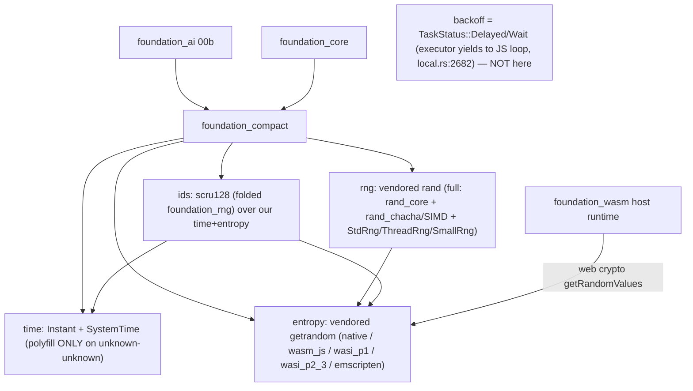

> **Reworked 2026-06-15 per user TODOs (which resolve the inline notes that were in this file):**
> F00 is no longer a thin time+entropy shim. It (a) **vendors `getrandom` in-house** (we own the
> entropy backends — native syscalls, wasm web-crypto, **WASI** `wasi_p1`/`wasi_p2_3`, emscripten
> `getentropy`), (b) **vendors `rand` in-house** (closing the external `rand → getrandom 0.4` chain
> that pulls a second getrandom and `compile_error!`s on wasm — the dominant 00a blocker), and (c)
> **folds `foundation_rng` (scru128 ids) into `foundation_compact`**. The earlier `SleepIterator`/
> blocking-sleep idea was **WRONG and is removed** — the valtron executor already yields to the JS
> event loop (`backends/foundation_core/src/valtron/executors/local.rs:2682`), so backoff uses
> `TaskStatus::Delayed`/`Wait` (owned by 00c). **00a is deleted** (folded here). Structure
> reorganised for the expanded scope.

# Feature 00: foundation_compact (cross-platform substrate)

> Root of Phase 0. Renames `foundation_webwasm` → **`foundation_compact`** and grows it into the one
> place the workspace gets time, entropy, RNG, and scru128 ids that "just work" across native +
> `wasm32-unknown-unknown` (CF Workers / wasm-bindgen) + `wasm32-unknown-emscripten` + `wasm32-wasip1`
> + `wasm32-wasip2`. Every wasm-capable crate depends on it instead of hand-rolling `#[cfg]` shims or
> fighting the external `rand`/`getrandom` wasm story. (Target-matrix prep is F00d.)

## WHY: Problem Statement

`wasm` targets lack several `std`/ecosystem capabilities the agentic stack uses unconditionally.
Verified blockers:

1. **`std::time::SystemTime::now()` panics on `wasm32-unknown-unknown`.** `Messages::Assistant.timestamp`
   (`types/mod.rs:901`) + every agentic memory type mint `SystemTime`. (Note: emscripten + WASI have
   real `std::time` — only `unknown-unknown` needs the polyfill.)
2. **The external `rand`/`getrandom` chain breaks wasm.** `foundation_rng` (and `foundation_ai`) depend
   on `rand 0.10`, which pulls **`getrandom 0.4`**, whose `wasm32-unknown-unknown` branch
   `compile_error!`s unless a backend cfg is set — a *separate* instance from any `getrandom 0.3` a
   crate sets `wasm_js` on. Per-target feature juggling across crates is fragile and was the dominant
   Phase-0 blocker.
3. **scru128 id generation is target-split today** (`foundation_rng::new_scru128` is `sys_rng`-gated;
   no clean wasm path).
4. **`std::thread::sleep` doesn't exist on `unknown-unknown`** — but this is **not** a compat-crate
   concern (see Non-Goal); the executor handles cooperative yielding.

**The fix (user direction): own the whole stack.** Vendor `getrandom` + `rand` in-house and fold
`foundation_rng` in, so `foundation_compact` provides time + entropy + RNG + ids with one consistent,
adaptive implementation we control — no external `rand`→`getrandom` chain, no per-crate cfg juggling.

> Sources to vendor (copied in, trimmed to what we use + our backends, with upstream licences):
> `getrandom` → `/home/darkvoid/Boxxed/@formulas/src.rust/src.rust-random/getrandom`;
> `rand` → `/home/darkvoid/Boxxed/@formulas/src.rust/src.rust-random/rand`.

## Non-Goal: sleep/backoff (the corrected assumption)

The first draft proposed a blocking wasm `sleep` / a valtron `SleepIterator`. **Both are wrong.** The
valtron executor (`backends/foundation_core/src/valtron/executors/local.rs:2682`) already intercepts
`State::Reschedule` / `SpinWait` / `Wait` and **yields to the JS event loop** under the
`js-wasmbindgen` / `js-foundation-wasm` features. So provider retry-backoff just returns
**`TaskStatus::Delayed(duration)`** (the executor schedules the wake cooperatively) or
**`TaskStatus::Wait`** (yield to the event loop) from the provider's stream — no blocking, no
busy-wait, no `SleepIterator`. `foundation_compact` owns **NO sleep primitive**; backoff is a valtron
scheduling concern (00c). (Propagated to 00b/00c.)

## WHAT: Solution

### Part A — Rename `foundation_webwasm` → `foundation_compact`

Pure rename; no behavior change to the time types. Blast radius (verified):

| Site | Change |
|------|--------|
| `backends/foundation_webwasm/` | rename dir → `backends/foundation_compact/` |
| `backends/foundation_compact/Cargo.toml` | `name = "foundation_compact"` |
| root `Cargo.toml:74` | `foundation_compact = { path = "./backends/foundation_compact", version = "0.1.0" }` |
| `backends/foundation_core/Cargo.toml:59` | `foundation_compact = { workspace = true }` |
| `foundation_core/tests/valtron/{wasm_js_yield_integration,wasm_yielder_tests}.rs` | `use foundation_webwasm` → `use foundation_compact` |
| `src/lib.rs:19` doc example; `src/wasm/web.rs:1,7,9,20` **intra-doc links** | update (broken intra-doc links fail `clippy -D warnings`) |

Final check: `grep -rn "foundation_webwasm"` returns empty.

### Part B — Vendor `getrandom` in-house → `entropy`

Copy the **full** `getrandom` source into `foundation_compact/src/entropy/`. Faithful vendor — all
backends, all dispatch logic, all utility files. We own it but don't lobotomize it. Public surface:

```rust
// foundation_compact::entropy (matching upstream getrandom API)
pub fn fill(buf: &mut [u8]) -> Result<(), Error>;
pub fn fill_uninit(buf: &mut [MaybeUninit<u8>]) -> Result<&mut [u8], Error>;
pub fn u32() -> Result<u32, Error>;
pub fn u64() -> Result<u64, Error>;
```

- **All upstream backends preserved**: `linux_raw` (asm), `getentropy` (macOS/emscripten/OpenBSD),
  `getrandom` (libc), `linux_android_with_fallback`, `use_file` (/dev/urandom), `windows`
  (ProcessPrng), `windows_legacy` (RtlGenRandom), `wasm_js` (Web Crypto), `wasi_p1`, `wasi_p2_3`,
  `apple_other`, `rdrand`, `rndr`, `esp_idf`, `fuchsia`, `unsupported`, etc. — the full upstream
  backend set. Removing unused backends saves nothing and loses future portability.
- **Keep `getrandom_backend` cfg override mechanism** — allows plugging in custom backends via
  `--cfg getrandom_backend="custom"` without modifying dispatch. Future-proof.
- **Keep `libc` crate dep** for platforms that need it (macOS getentropy, Linux getrandom(2) fallback,
  errno access). Platform-conditional dep, not pulled on platforms that don't need it.
- **Keep all utility files**: `get_errno.rs`, `sanitizer.rs` (MSAN), `lazy_bool.rs`, `lazy_ptr.rs`,
  `sys_fill_exact.rs`. The full upstream infrastructure.
- Only path adaptation: `crate::` → `crate::entropy::` (since backends.rs is now a submodule).
- **No external `getrandom` dependency remains.** OD-00-2 is moot — we own the cfg.

### Part C — Vendor `rand` in-house → `rng`

Vendor `rand_core`, `rand_chacha`, and `rand`'s higher-level API into `foundation_compact/src/rng/`.
**Faithful copy — full SIMD ChaCha (via `ppv-lite86` external dep), full trait set, full distributions.**
Per OD-00-5: "vendor the WHOLE capability", not a minimal subset.

The ONE adaptation: `ThreadRng`'s reseeding calls our vendored `crate::entropy::fill()` instead of
external `getrandom`. This is what breaks the `compile_error!` chain.

```rust
// foundation_compact::rng — full upstream rand API surface
pub use core::{Rng, TryRng, SeedableRng, CryptoRng, TryCryptoRng};  // vendored rand_core traits
pub use chacha::{ChaCha8Rng, ChaCha12Rng, ChaCha20Rng};              // vendored rand_chacha (SIMD)
pub use rngs::{StdRng, ThreadRng, SmallRng};                          // vendored rand rngs
pub fn rng() -> ThreadRng;                                            // thread-local, seeded from entropy
```

- **`ppv-lite86` stays as external dep** — it's a SIMD utility crate, not part of the rand/getrandom
  chain, has no wasm issues. Vendoring ~4000 lines of arch-specific SIMD intrinsics buys nothing.
- **`rand_core` vendored faithfully** — `Rng`, `TryRng`, `SeedableRng`, `CryptoRng`, `BlockRng`,
  `Generator` trait. All preserved.
- **`rand_chacha` vendored faithfully** — `guts.rs` with full SIMD dispatch via ppv-lite86,
  `chacha.rs` with the `chacha_impl!` macro. ChaCha8/12/20 all present.
- **`rand` higher-level API vendored** — `StdRng` (= ChaCha12Rng), `SmallRng` (Xoshiro),
  `ThreadRng` (reseeding), `RngExt` trait, distributions.
- Path adaptations: `rand_core::` → `crate::rng::core::`, `rand_chacha::` → `crate::rng::chacha::`,
  `getrandom::` → `crate::entropy::`

### Part D — Fold `foundation_rng` (scru128) in → `ids`

Move `foundation_rng`'s scru128 (`Id`, `Generator`, `TimeSource`/`RandSource`, `new_scru128`) into
`foundation_compact/src/ids/`, re-implemented over **our** `time` + **our** `entropy`/`rng` — so id
generation is uniform across all targets:

```rust
// foundation_compact::ids
pub use ids::Id;                                  // scru128 (was foundation_rng::Id) — the CONCRETE type
pub fn new_scru128() -> Id;                       // works native + every wasm target
pub fn new_scru128_string() -> String;
```

- `foundation_rng` the **crate is removed**; dependents switch to `foundation_compact` (grep both
  workspace + spec features and repoint).
- F01's `SessionId`/scru128 wrap **`foundation_compact::ids::Id`** directly — **no type aliases** (per
  user TODO: use the concrete `foundation_compact::Id`, never a `Scru128` alias).

### Feature flags

```toml
[features]
default = ["std"]
std = ["fstr/std"]                                        # std time, std entropy backends
serde = ["dep:serde"]                                     # serde for Id, time types
global_gen = ["std", "dep:forkguard", "dep:reseeding_rng"] # fork-safe global scru128 generator
native = ["std", "global_gen"]                            # native convenience (all std + fork safety)
# WASI + emscripten select their entropy backend by target_os (no extra feature needed)
# ppv-lite86 is always present (ChaCha SIMD — no feature gate needed)
```

### Module layout (restructured for the expanded scope — user TODO)

```
foundation_compact/src/
├── lib.rs            # cfg-split re-exports: time::*, entropy::*, rng::*, ids::*
├── time/             # Instant + SystemTime (existing; native/emscripten/wasi=std, unknown-unknown=polyfill)
│                     #   + CONSISTENT custom serde: SystemTime ⇄ {secs,nanos} via UNIX_EPOCH (OD-00b-6)
├── entropy/          # VENDORED getrandom (FULL source: all backends, all dispatch, all utils)
│   ├── mod.rs        # fill(), u32(), u64(), fill_uninit()
│   ├── error.rs      # Error type (faithful copy)
│   ├── util.rs       # slice helpers, inner_u32/u64
│   ├── utils/        # get_errno, sanitizer, lazy_bool, lazy_ptr, sys_fill_exact
│   └── backends/     # ALL upstream backends (linux_raw, getentropy, windows, wasm_js, wasi, ...)
├── rng/              # VENDORED rand ecosystem (FULL capability per OD-00-5)
│   ├── core/         # vendored rand_core (Rng, TryRng, SeedableRng, CryptoRng, BlockRng, Generator)
│   ├── chacha/       # vendored rand_chacha (ChaCha8/12/20 with SIMD via ppv-lite86 external dep)
│   ├── rngs/         # vendored rand rngs (StdRng, ThreadRng, SmallRng, Xoshiro)
│   ├── rng.rs        # RngExt trait (random, random_range, fill, sample)
│   └── distr/        # vendored rand distributions
└── ids/              # FOLDED foundation_rng: scru128 Id + Generator + global_gen (over our time+rng)
```

## Architecture



## Fundamentals Documentation (zero-to-expert) — REQUIRED

Author `fundamentals/` (numbered deep docs, house style) covering: cross-platform compatibility & the
wasm target matrix (unknown-unknown vs emscripten vs wasip1 vs wasip2); `std::time` on wasm
(`Performance.now()`/`Date.now()` vs WASI/emscripten std clocks); **CSPRNGs & entropy sources** (OS
syscalls `getrandom`/`getentropy`/`BCryptGenRandom`; Web Crypto `getRandomValues`; WASI `random_get`/
`wasi:random`); **the `rand`↔`getrandom` chain and why it breaks `wasm32-unknown-unknown`** (the dual-
getrandom `compile_error!`), and why vendoring closes it; **PRNG design** (ChaCha/`StdRng`, seeding,
`RngCore`/`SeedableRng`); **scru128/ULID** id design (timestamp+counter+entropy, lexicographic==
chronological, machine-id embedding); vendoring strategy (own-vs-depend, trimming, licences); the
`foundation_wasm` host-runtime abstraction and how the executor yields to the JS event loop. (Task.)

## HOW: Implementation Steps

1. **Rename** (Part A); workspace `cargo build` + `clippy -D warnings` green.
2. **Vendor getrandom** into `src/entropy/` — **full source**: all backends, all dispatch (keep
   `getrandom_backend` cfg override), all utils, `libc` dep for platforms that need it. Keep
   licence/attribution. Expose `fill`/`u32`/`u64`/`fill_uninit`.
3. **Vendor rand** into `src/rng/` — **full capability** per OD-00-5: `rand_core` (traits + BlockRng),
   `rand_chacha` (ChaCha with SIMD via `ppv-lite86` external dep), `rand` rngs (StdRng, ThreadRng,
   SmallRng), distributions. Seed ThreadRng from `entropy`; keep attribution.
4. **Fold foundation_rng** into `src/ids/` over our `time`+`rng`; keep `global_gen.rs` (fork-safe
   generator); `new_scru128` works on all targets.
5. **Remove the `foundation_rng` crate**; repoint every dependent + spec feature (grep both).
6. Feature flags; `ppv-lite86` as external dep; `libc` platform-conditional; `forkguard`/`reseeding_rng`
   behind `global_gen` feature.
7. Build matrix: native; `--target wasm32-unknown-unknown`; `--target wasm32-wasip1`;
   `--target wasm32-wasip2`; (emscripten via F00d). Verify `new_scru128`/`rng`/`entropy::fill` each.
8. Update crate `//!` docs.

## Resolved Decisions
- **OD-00-1 — wasm sleep:** **Resolved → not owned here; executor yields to the JS loop
  (`local.rs:2682`); backoff = `TaskStatus::Delayed`/`Wait` (00c).** (The `SleepIterator` framing was wrong.)
- **OD-00-2 — external getrandom wasm cfg:** **Moot — getrandom is vendored**; we own the wasm cfg.
- **OD-00-4 — aliases:** **Resolved (user) → NO type aliases.** `SessionId`/scru128 use the concrete
  `foundation_compact::Id`. Hard-rename, no `foundation_webwasm`/`foundation_rng` alias.
- **OD-00-5 — rand vendoring scope:** **Resolved (user, 2026-06-15) → vendor the WHOLE capability**
  ("own everything once and for all"), not a minimal subset. All `rand`/`rand_chacha`/`fastrand` usage
  (here and in `foundation_ai`) routes through `foundation_compact`, which selects the right backend per
  target. (discussion §A5)
- **OD-00-6 — wasm entropy host:** **Resolved (user) → support BOTH, feature-gated** — the
  `foundation_wasm` host AND a direct `js-sys` Crypto binding, behind feature flags, so either works
  correctly. (discussion §A1)
- **OD-00-7 — licence/attribution:** **Resolved (user) → vendor with licence headers + `VENDORED.md`**
  (source + version + local modifications). getrandom + rand are MIT/Apache-2.0.
- **OD-00-8 — merge 00a:** **Resolved (user) → 00a DELETED**, folded here.

## Open Decisions
- **OD-00-3 — dependency direction (verify):** `foundation_compact` is a **leaf** (depends only on
  `foundation_wasm` for the wasm host). Must NOT depend on `foundation_core`/`foundation_ai`; **confirm
  `foundation_wasm` doesn't cycle back** (low-level runtime crate — verification task).

## Target Files

- `backends/foundation_webwasm/` → `backends/foundation_compact/` — `Cargo.toml`, `src/lib.rs`, new
  `src/entropy/`, `src/rng/`, `src/ids/`; existing `src/wasm/`,`src/std/` time kept
- `backends/foundation_rng/` — **removed** (folded in)
- root `Cargo.toml` — dep (`:74`), drop `foundation_rng`; every dependent
- `backends/foundation_compact/VENDORED.md` (new) — getrandom + rand provenance

## Tests

```bash
cargo build && cargo clippy --workspace -- -D warnings
cargo test  -p foundation_compact                              # entropy, rng, scru128 (ordering/uniqueness)
cargo build -p foundation_compact --features js-wasmbindgen --target wasm32-unknown-unknown
cargo build -p foundation_compact --target wasm32-wasip1
cargo build -p foundation_compact --target wasm32-wasip2
grep -rn "foundation_rng\|foundation_webwasm" . --include=*.rs --include=*.toml   # expect: empty
```

## Verification

```bash
cargo build -p foundation_compact
cargo build -p foundation_compact --features js-wasmbindgen --target wasm32-unknown-unknown
cargo build -p foundation_compact --target wasm32-wasip1
cargo clippy --workspace -- -D warnings
cargo fmt -- --check
cargo test -p foundation_compact
```

## Done When

- `foundation_compact` owns time + **vendored** entropy (full getrandom) + **vendored** rng (full
  rand_core + rand_chacha + rand) + **folded** scru128 ids; builds native + unknown-unknown + wasip1 +
  wasip2 (emscripten via F00d).
- **No external `rand`/`getrandom` anywhere in the workspace**; the wasm `compile_error!` chain is gone.
  `ppv-lite86` remains as external dep (SIMD utility, not part of the chain).
- `foundation_rng` crate removed; all dependents (+ spec features) repointed; **no type aliases**.
- `new_scru128()` uniform across targets; `global_gen` feature preserves fork-safe generator.
- Vendored code is **faithful** — all upstream backends, dispatch logic, `getrandom_backend` cfg
  override, SIMD ChaCha, `libc` where upstream uses it. No lobotomization.
- No `sleep` primitive; backoff is `TaskStatus::Delayed`/`Wait`. Vendored code carries upstream
  licences (`VENDORED.md`). OD-00-5..7 resolved.
