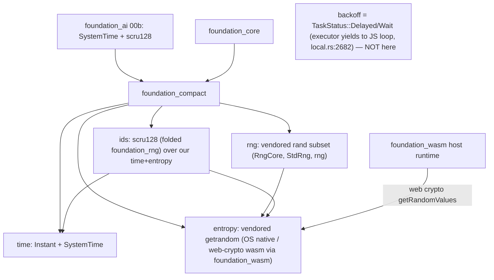

> **Reworked 2026-06-14 per user direction:** F00 is no longer a thin time+entropy shim. It (a)
> **vendors `getrandom` in-house** (we own the entropy backends, incl. the wasm web-crypto path),
> (b) **vendors `rand` in-house** (closing the external `rand → getrandom` chain that pulls a second
> `getrandom 0.4` and `compile_error!`s on wasm — the dominant 00a blocker), and (c) **folds
> `foundation_rng` (scru128 ids) into `foundation_compact`**. The earlier `SleepIterator`/blocking-
> sleep framing was **wrong and is removed** — the valtron executor already yields to the JS event
> loop (`local.rs:2682`), so backoff uses `TaskStatus::Delayed`/`Wait` (owned by 00c). **00a is
> subsumed into this feature** (foundation_rng no longer a separate crate).

# Feature 00: foundation_compact (cross-platform substrate)

> Root of Phase 0. Renames `foundation_webwasm` → **`foundation_compact`** and grows it into the one
> place the workspace gets time, entropy, RNG, and scru128 ids that "just work" on native +
> `wasm32-unknown-unknown` (browser / node / deno / Cloudflare Workers). Every wasm-capable crate
> depends on it instead of hand-rolling `#[cfg(target_arch = "wasm32")]` shims or fighting the
> external `rand`/`getrandom` wasm story.

## WHY: Problem Statement

`wasm32-unknown-unknown` lacks several `std`/ecosystem capabilities the agentic stack uses
unconditionally. Verified blockers:

1. **`std::time::SystemTime::now()` panics on wasm.** `Messages::Assistant.timestamp`
   (`types/mod.rs:901`) + every agentic memory type mint `SystemTime`.
2. **The external `rand`/`getrandom` chain breaks wasm.** `foundation_rng` (and `foundation_ai`)
   depend on `rand 0.10`, which pulls **`getrandom 0.4`**, whose `wasm32-unknown-unknown` branch
   `compile_error!`s unless a backend cfg is set — a *separate* instance from any `getrandom 0.3` a
   crate sets `wasm_js` on. Per-target feature juggling across crates is fragile and was the dominant
   Phase-0 blocker.
3. **scru128 id generation is target-split today** (`foundation_rng::new_scru128` is `sys_rng`-gated;
   no clean wasm path).
4. **`std::thread::sleep` does not exist on wasm** — but this is **not** a compat-crate concern (see
   the Non-Goal below); the executor handles cooperative yielding.

**The fix (user direction): own the whole stack.** Vendor `getrandom` + `rand` in-house and fold
`foundation_rng` in, so `foundation_compact` provides time + entropy + RNG + ids with one consistent,
adaptive wasm implementation we control — no external `rand`→`getrandom` chain, no per-crate cfg
juggling.

> Sources to vendor (copied in, then trimmed to what we use + our wasm backends):
> `getrandom` → `/home/darkvoid/Boxxed/@formulas/src.rust/src.rust-random/getrandom`;
> `rand` → `/home/darkvoid/Boxxed/@formulas/src.rust/src.rust-random/rand`.

## Non-Goal: sleep/backoff (the corrected assumption)

The first draft proposed a blocking wasm `sleep` / a valtron `SleepIterator`. **Both are wrong.** The
valtron executor (`backends/foundation_core/src/valtron/executors/local.rs:2682`) already intercepts
`State::Reschedule` / `SpinWait` / `Wait` and **yields to the JS event loop** under the
`js-wasmbindgen` / `js-foundation-wasm` features. So provider retry-backoff just returns
**`TaskStatus::Delayed(duration)`** (the executor schedules the wake cooperatively) or
**`TaskStatus::Wait`** (yield to the event loop) from the provider's stream — no blocking, no
busy-wait, no `SleepIterator`. `foundation_compact` therefore owns **NO sleep primitive**; backoff is
a valtron scheduling concern handled in 00c. (This correction is propagated to 00b/00c.)

## WHAT: Solution

### Part A — Rename `foundation_webwasm` → `foundation_compact`

Pure rename of the existing crate; no behavior change to the time types. Blast radius (verified):

| Site | Change |
|------|--------|
| `backends/foundation_webwasm/` | rename dir → `backends/foundation_compact/` |
| `backends/foundation_compact/Cargo.toml` | `name = "foundation_compact"` |
| root `Cargo.toml:74` | `foundation_compact = { path = "./backends/foundation_compact", version = "0.1.0" }` |
| `backends/foundation_core/Cargo.toml:59` | `foundation_compact = { workspace = true }` |
| `foundation_core/tests/valtron/{wasm_js_yield_integration,wasm_yielder_tests}.rs` | `use foundation_webwasm` → `use foundation_compact` |
| `foundation_core/integration/wasm_tests/src/lib.rs:9` | comment ref — update text |
| `src/lib.rs:19` doc example; `src/wasm/web.rs:1,7,9,20` **intra-doc links** | update (intra-doc links break `clippy -D warnings`) |

Final check: `grep -rn "foundation_webwasm"` returns empty.

### Part B — Vendor `getrandom` in-house → `entropy`

Copy the `getrandom` source into `foundation_compact/src/entropy/`, **trim to the targets we ship**
(linux/android/macos/windows + `wasm32-unknown-unknown`), and own it. Public surface:

```rust
// foundation_compact::entropy
pub fn fill(buf: &mut [u8]) -> Result<(), EntropyError>;  // fallible (matches getrandom)
pub fn u32() -> u32;  pub fn u64() -> u64;                // convenience (panic on CSPRNG failure)
```

- **Native backends** (vendored from getrandom): Linux `getrandom(2)`/`getentropy`, macOS/iOS
  `getentropy`, Windows `ProcessPrng`/`BCryptGenRandom`.
- **wasm backend (we own the adaptive path):** Web Crypto `crypto.getRandomValues` — reached via
  **`foundation_wasm`** (which already abstracts browser/node/deno host runtimes via the
  `js-wasmbindgen` / `js-foundation-wasm` features the executor uses) rather than a raw wasm-bindgen
  dep. This is the "implement the proper wasm RNG for wasm-bindgen + foundation_wasm" the user asked
  for, and it means **no external `getrandom` + no `getrandom_backend` cfg** — we control the cfg.
- **No external `getrandom` dependency remains.** The historical OD-00-2 (`getrandom_backend` cfg) is
  **moot** — we vendor it.

### Part C — Vendor `rand` in-house → `rng`

Copy the `rand` source into `foundation_compact/src/rng/`, trim to what the workspace uses
(`RngCore`/`SeedableRng`, `StdRng`/ChaCha, `thread_rng`-equivalent, the distributions actually used),
**seeded from our vendored `entropy`** (not external getrandom). This closes the loop: nothing in the
workspace pulls external `rand`/`getrandom`, so the wasm `compile_error!` chain is gone.

```rust
// foundation_compact::rng
pub trait RngCore { fn next_u32(&mut self) -> u32; fn next_u64(&mut self) -> u64; fn fill_bytes(&mut self, b: &mut [u8]); }
pub struct StdRng(/* ChaCha */);          // seeded from entropy::fill
pub fn rng() -> impl RngCore;             // thread-local CSPRNG (our ThreadRng)
```

> **OD-00-5 — vendoring scope:** copy `rand` whole then trim, vs port only `RngCore` + `StdRng` +
> the distributions we use. Rec: port the **minimal subset** (`RngCore`/`SeedableRng`/`StdRng`/
> thread-rng/uniform), not the whole crate — own less surface. List exactly what the agentic stack
> needs (scru128 entropy; F08/F09 k-means/HNSW seeding; loop-detector temperature jitter).

### Part D — Fold `foundation_rng` (scru128) in → `ids`

Move `foundation_rng`'s scru128 (`Id`, `Generator`, `TimeSource`/`RandSource`, `new_scru128`) into
`foundation_compact/src/ids/`, re-implemented over **our** `time` (`SystemTime`/`Instant`) and **our**
`entropy`/`rng` — so id generation is uniform native + wasm with no per-target plumbing:

```rust
// foundation_compact::ids
pub use ids::Id;                                  // scru128 (was foundation_rng::Id)
pub fn new_scru128() -> Id;                       // works on native AND wasm (entropy from web crypto, time from Date.now)
pub fn new_scru128_string() -> String;
```

- `foundation_rng` the crate is **removed**; its dependents switch to `foundation_compact`. (Grep
  `foundation_rng` across the workspace + the spec features and repoint them.)
- F01's `SessionId`/`Scru128` (this spec) wrap `foundation_compact::ids::Id` (machine-id folded into
  the entropy region per F01).

### Feature flags

```toml
[features]
default = ["std"]
std = []                      # native: OS entropy backends + std time
entropy = []                  # (now always-available in-crate; kept as a marker if a consumer wants to gate)
js-wasmbindgen = ["foundation_wasm/js-wasmbindgen"]      # wasm: web-crypto via foundation_wasm
js-foundation-wasm = ["foundation_wasm/js-foundation-wasm"]  # node/deno host runtime
```

Native `foundation_core` keeps its current zero-extra-runtime-dep posture (vendored code, no external
crates). The wasm entropy path is enabled by the same `js-*` features the executor already uses.

### Module layout (restructured for the expanded scope)

```
foundation_compact/src/
├── lib.rs        # cfg-split re-exports: time::*, entropy::*, rng::*, ids::*
├── time/         # Instant + SystemTime (existing; native=std, wasm=Date.now/Performance.now)
├── entropy/      # VENDORED getrandom: fill()/u32()/u64() + backends/{native,wasm-via-foundation_wasm}
├── rng/          # VENDORED rand (minimal subset): RngCore, StdRng (ChaCha), rng(), distributions
└── ids/          # FOLDED foundation_rng: scru128 Id + Generator (over our time + entropy)
```

## Architecture



## Fundamentals Documentation (zero-to-expert) — REQUIRED

Author `fundamentals/` (numbered deep docs, house style) covering: cross-platform compatibility & the
`wasm32-unknown-unknown` target model; `std::time` on wasm (`Performance.now()` vs `Date.now()`,
monotonic vs wall-clock); **CSPRNGs & entropy sources** (OS syscalls: `getrandom`/`getentropy`/
`BCryptGenRandom`; Web Crypto `getRandomValues`); **the `rand` ↔ `getrandom` dependency chain and why
it breaks `wasm32-unknown-unknown`** (the dual-getrandom `compile_error!`), and why vendoring closes
it; **PRNG design** (ChaCha/`StdRng`, seeding, `RngCore`/`SeedableRng`); **scru128/ULID** id design
(timestamp + counter + entropy, lexicographic==chronological, machine-id embedding); vendoring
strategy (own-vs-depend, trimming scope, keeping upstream licences/attribution); `foundation_wasm`
host-runtime abstraction (browser/node/deno) and how the executor yields to the JS event loop
(`Delayed`/`Wait`). (Task — see list.)

## HOW: Implementation Steps

1. **Rename** `foundation_webwasm` → `foundation_compact` (Part A); workspace `cargo build` + `clippy
   -D warnings` green (pure rename).
2. **Vendor getrandom** into `src/entropy/`: copy source, trim to shipped targets, keep upstream
   licence/attribution. Implement the wasm backend over `foundation_wasm` (web-crypto). Expose
   `fill`/`u32`/`u64`.
3. **Vendor rand** into `src/rng/` (minimal subset — OD-00-5): `RngCore`/`SeedableRng`/`StdRng`/`rng`/
   uniform; seed from `entropy`. Keep attribution.
4. **Fold foundation_rng** into `src/ids/`: scru128 `Id`/`Generator` over our `time` + `entropy`;
   `new_scru128`/`new_scru128_string` work native + wasm.
5. **Remove the `foundation_rng` crate**; repoint every workspace dependent + every spec feature that
   said `foundation_rng` to `foundation_compact` (grep both).
6. Feature flags (`std`, `js-wasmbindgen`, `js-foundation-wasm`); native zero-extra-dep.
7. Build matrix: `cargo build -p foundation_compact` (native); `--features js-wasmbindgen
   --target wasm32-unknown-unknown`; `--features js-foundation-wasm --target wasm32-unknown-unknown`.
   Verify `new_scru128()` + `rng()` + `entropy::fill()` work on all.
8. Update crate `//!` docs (time + entropy + rng + ids; backoff lives in valtron).

## Open Decisions

Resolved:
- **OD-00-1 — wasm sleep:** **Resolved → not owned here; the executor yields to the JS loop
  (`local.rs:2682`); backoff = `TaskStatus::Delayed`/`Wait` in 00c.** (The old `SleepIterator`
  framing was wrong.)
- **OD-00-2 — external getrandom wasm cfg:** **Moot — getrandom is vendored**; we own the wasm cfg.
- **OD-00-3 — dependency direction:** `foundation_compact` is the **leaf** (depends only on
  `foundation_wasm` for the wasm host runtime). It must NOT depend on `foundation_core`/`foundation_ai`.
  Confirm `foundation_wasm` doesn't cycle back (it's a low-level runtime crate — verify).
- **OD-00-4 — alias:** hard-rename, no `foundation_webwasm`/`foundation_rng` alias.

Open:
- **OD-00-5 — rand vendoring scope** (minimal subset vs whole crate). Rec: minimal subset; enumerate it.
- **OD-00-6 — `foundation_wasm` as the wasm entropy host:** use `foundation_wasm`'s runtime for
  `getRandomValues` vs a thin direct `js-sys` Crypto binding. Rec: `foundation_wasm` (one host
  abstraction, already powering the executor's JS yielding) — confirm it exposes (or can expose)
  crypto.
- **OD-00-7 — licence/attribution:** getrandom + rand are MIT/Apache-2.0; vendor with their licence
  headers + a `VENDORED.md` noting source + version + local modifications.
- **OD-00-8 — merge 00a fully:** **Resolved (user, 2026-06-15) → DELETED.** The `00a-*` feature dir
  is removed; Feature 00 is the single source of truth for the Phase-0 RNG/time substrate.

## Target Files

- `backends/foundation_webwasm/` → `backends/foundation_compact/` — `Cargo.toml`, `src/lib.rs`, new
  `src/entropy/`, `src/rng/`, `src/ids/` (vendored); existing `src/wasm/`,`src/std/` time kept
- `backends/foundation_rng/` — **removed** (folded in)
- root `Cargo.toml` — dep (`:74`), drop `foundation_rng`; every workspace dependent of `foundation_rng`
- `backends/foundation_compact/VENDORED.md` (new) — getrandom + rand provenance

## Tests

```bash
cargo build && cargo clippy --workspace -- -D warnings        # rename + fold green
cargo test  -p foundation_compact                              # entropy, rng, scru128 (ordering/uniqueness)
cargo build -p foundation_compact --features js-wasmbindgen --target wasm32-unknown-unknown
cargo build -p foundation_compact --features js-foundation-wasm --target wasm32-unknown-unknown
grep -rn "foundation_rng\|foundation_webwasm" . --include=*.rs --include=Cargo.toml   # expect: empty (or alias-only)
```

## Verification

```bash
cargo build -p foundation_compact                              # native
cargo build -p foundation_compact --features js-wasmbindgen --target wasm32-unknown-unknown
cargo clippy --workspace -- -D warnings
cargo fmt -- --check
cargo test -p foundation_compact
```

## Done When

- `foundation_compact` owns time + **vendored** entropy (getrandom) + **vendored** rng (rand) +
  **folded** scru128 ids; builds native + `wasm32-unknown-unknown` (wasm-bindgen + foundation-wasm).
- **No external `rand`/`getrandom` anywhere in the workspace**; the wasm `compile_error!` chain is gone.
- `foundation_rng` crate removed; all dependents (+ spec features) repointed to `foundation_compact`.
- `new_scru128()` works on native + wasm uniformly; native keeps zero external runtime deps.
- No `sleep` primitive here; backoff is `TaskStatus::Delayed`/`Wait` (00c). Vendored code carries
  upstream licences (`VENDORED.md`). OD-00-5..8 resolved (OD-00-8 needs a user ruling).
