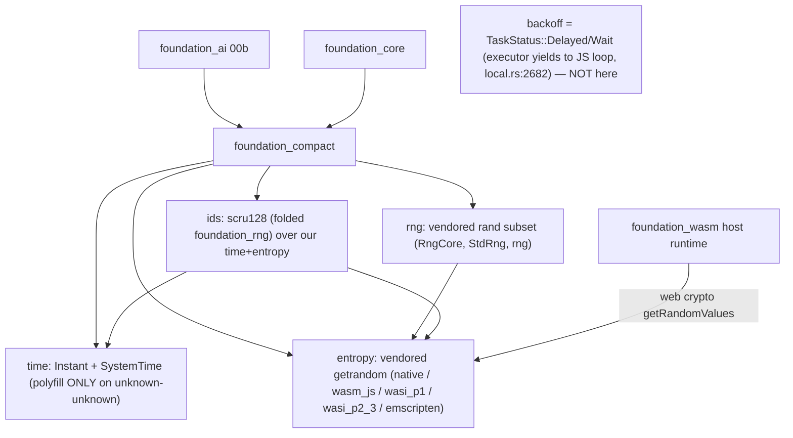

> **Reworked 2026-06-15 per user TODOs (which resolve the inline notes that were in this file):**
> F00 is no longer a thin time+entropy shim. It (a) **vendors `getrandom` in-house** (we own the
> entropy backends — native syscalls, wasm web-crypto, **WASI** `wasi_p1`/`wasi_p2_3`, emscripten
> `getentropy`), (b) **vendors `rand` in-house** (closing the external `rand → getrandom 0.4` chain
> that pulls a second getrandom and `compile_error!`s on wasm — the dominant 00a blocker), and (c)
> **folds `foundation_rng` (scru128 ids) into `foundation_compact`**. The earlier `SleepIterator`/
> blocking-sleep idea was **WRONG and is removed** — the valtron executor already yields to the JS
> event loop (`backends/foundation_core/src/valtron/executors/local.rs:2682`), so backoff uses
> `TaskStatus::Delayed`/`Wait` (owned by 00c). **00a is deleted** (folded here). Structure
> reorganised for the expanded scope.

# Feature 00: foundation_compact (cross-platform substrate)

> Root of Phase 0. Renames `foundation_webwasm` → **`foundation_compact`** and grows it into the one
> place the workspace gets time, entropy, RNG, and scru128 ids that "just work" across native +
> `wasm32-unknown-unknown` (CF Workers / wasm-bindgen) + `wasm32-unknown-emscripten` + `wasm32-wasip1`
> + `wasm32-wasip2`. Every wasm-capable crate depends on it instead of hand-rolling `#[cfg]` shims or
> fighting the external `rand`/`getrandom` wasm story. (Target-matrix prep is F00d.)

## WHY: Problem Statement

`wasm` targets lack several `std`/ecosystem capabilities the agentic stack uses unconditionally.
Verified blockers:

1. **`std::time::SystemTime::now()` panics on `wasm32-unknown-unknown`.** `Messages::Assistant.timestamp`
   (`types/mod.rs:901`) + every agentic memory type mint `SystemTime`. (Note: emscripten + WASI have
   real `std::time` — only `unknown-unknown` needs the polyfill.)
2. **The external `rand`/`getrandom` chain breaks wasm.** `foundation_rng` (and `foundation_ai`) depend
   on `rand 0.10`, which pulls **`getrandom 0.4`**, whose `wasm32-unknown-unknown` branch
   `compile_error!`s unless a backend cfg is set — a *separate* instance from any `getrandom 0.3` a
   crate sets `wasm_js` on. Per-target feature juggling across crates is fragile and was the dominant
   Phase-0 blocker.
3. **scru128 id generation is target-split today** (`foundation_rng::new_scru128` is `sys_rng`-gated;
   no clean wasm path).
4. **`std::thread::sleep` doesn't exist on `unknown-unknown`** — but this is **not** a compat-crate
   concern (see Non-Goal); the executor handles cooperative yielding.

**The fix (user direction): own the whole stack.** Vendor `getrandom` + `rand` in-house and fold
`foundation_rng` in, so `foundation_compact` provides time + entropy + RNG + ids with one consistent,
adaptive implementation we control — no external `rand`→`getrandom` chain, no per-crate cfg juggling.

> Sources to vendor (copied in, trimmed to what we use + our backends, with upstream licences):
> `getrandom` → `/home/darkvoid/Boxxed/@formulas/src.rust/src.rust-random/getrandom`;
> `rand` → `/home/darkvoid/Boxxed/@formulas/src.rust/src.rust-random/rand`.

## Non-Goal: sleep/backoff (the corrected assumption)

The first draft proposed a blocking wasm `sleep` / a valtron `SleepIterator`. **Both are wrong.** The
valtron executor (`backends/foundation_core/src/valtron/executors/local.rs:2682`) already intercepts
`State::Reschedule` / `SpinWait` / `Wait` and **yields to the JS event loop** under the
`js-wasmbindgen` / `js-foundation-wasm` features. So provider retry-backoff just returns
**`TaskStatus::Delayed(duration)`** (the executor schedules the wake cooperatively) or
**`TaskStatus::Wait`** (yield to the event loop) from the provider's stream — no blocking, no
busy-wait, no `SleepIterator`. `foundation_compact` owns **NO sleep primitive**; backoff is a valtron
scheduling concern (00c). (Propagated to 00b/00c.)

## WHAT: Solution

### Part A — Rename `foundation_webwasm` → `foundation_compact`

Pure rename; no behavior change to the time types. Blast radius (verified):

| Site | Change |
|------|--------|
| `backends/foundation_webwasm/` | rename dir → `backends/foundation_compact/` |
| `backends/foundation_compact/Cargo.toml` | `name = "foundation_compact"` |
| root `Cargo.toml:74` | `foundation_compact = { path = "./backends/foundation_compact", version = "0.1.0" }` |
| `backends/foundation_core/Cargo.toml:59` | `foundation_compact = { workspace = true }` |
| `foundation_core/tests/valtron/{wasm_js_yield_integration,wasm_yielder_tests}.rs` | `use foundation_webwasm` → `use foundation_compact` |
| `src/lib.rs:19` doc example; `src/wasm/web.rs:1,7,9,20` **intra-doc links** | update (broken intra-doc links fail `clippy -D warnings`) |

Final check: `grep -rn "foundation_webwasm"` returns empty.

### Part B — Vendor `getrandom` in-house → `entropy`

Copy the `getrandom` source into `foundation_compact/src/entropy/`, **keep the backends we ship**, and
own it. Public surface:

```rust
// foundation_compact::entropy
pub fn fill(buf: &mut [u8]) -> Result<(), EntropyError>;  // fallible (matches getrandom)
pub fn u32() -> u32;  pub fn u64() -> u64;                // convenience (panic on CSPRNG failure)
```

- **Native backends** (vendored): Linux `getrandom(2)`/`getentropy`, macOS/iOS `getentropy`, Windows
  `ProcessPrng`/`BCryptGenRandom`.
- **wasm backends we own** (the source already has them): `wasm_js` (Web Crypto `getRandomValues` —
  reached via **`foundation_wasm`** host runtime, not a raw wasm-bindgen dep), **`wasi_p1`** + **`wasi_p2_3`**
  (WASI `random_get` / `wasi:random`), and `getentropy` (**emscripten**). So entropy works on
  `unknown-unknown` + emscripten + wasip1 + wasip2 (the F00d matrix) with no `getrandom_backend` cfg —
  we control the per-target selection.
- **No external `getrandom` dependency remains.** Historical OD-00-2 (`getrandom_backend` cfg) is moot.

### Part C — Vendor `rand` in-house → `rng`

Copy the `rand` source into `foundation_compact/src/rng/`, **trim to the minimal subset the workspace
uses** (`RngCore`/`SeedableRng`, `StdRng`/ChaCha, a thread-rng-equivalent, the distributions actually
used — see OD-00-5), **seeded from our vendored `entropy`** (not external getrandom). This closes the
loop: nothing in the workspace pulls external `rand`/`getrandom`, so the wasm `compile_error!` chain
is gone.

```rust
// foundation_compact::rng
pub trait RngCore { fn next_u32(&mut self) -> u32; fn next_u64(&mut self) -> u64; fn fill_bytes(&mut self, b: &mut [u8]); }
pub struct StdRng(/* ChaCha */);          // seeded from entropy::fill
pub fn rng() -> impl RngCore;             // thread-local CSPRNG
```

### Part D — Fold `foundation_rng` (scru128) in → `ids`

Move `foundation_rng`'s scru128 (`Id`, `Generator`, `TimeSource`/`RandSource`, `new_scru128`) into
`foundation_compact/src/ids/`, re-implemented over **our** `time` + **our** `entropy`/`rng` — so id
generation is uniform across all targets:

```rust
// foundation_compact::ids
pub use ids::Id;                                  // scru128 (was foundation_rng::Id) — the CONCRETE type
pub fn new_scru128() -> Id;                       // works native + every wasm target
pub fn new_scru128_string() -> String;
```

- `foundation_rng` the **crate is removed**; dependents switch to `foundation_compact` (grep both
  workspace + spec features and repoint).
- F01's `SessionId`/scru128 wrap **`foundation_compact::ids::Id`** directly — **no type aliases** (per
  user TODO: use the concrete `foundation_compact::Id`, never a `Scru128` alias).

### Feature flags

```toml
[features]
default = ["std"]
std = []                                                  # native OS entropy + std time
js-wasmbindgen = ["foundation_wasm/js-wasmbindgen"]       # wasm: web-crypto via foundation_wasm
js-foundation-wasm = ["foundation_wasm/js-foundation-wasm"]   # node/deno host runtime
# WASI + emscripten select their entropy backend by target_os (no extra feature needed)
```

Native `foundation_core` keeps its zero-extra-runtime-dep posture (vendored code, no external crates).

### Module layout (restructured for the expanded scope — user TODO)

```
foundation_compact/src/
├── lib.rs        # cfg-split re-exports: time::*, entropy::*, rng::*, ids::*
├── time/         # Instant + SystemTime (existing; native/emscripten/wasi=std, unknown-unknown=Date.now/Performance.now)
│                 #   + a CONSISTENT custom serde: SystemTime ⇄ {secs_since_epoch,nanos_since_epoch} via
│                 #   duration_since(UNIX_EPOCH) on EVERY target (cross-platform replay round-trips — resolves OD-00b-6)
├── entropy/      # VENDORED getrandom: fill()/u32()/u64() + backends/{native, wasm_js, wasi_p1, wasi_p2_3, emscripten}
├── rng/          # VENDORED rand (minimal subset): RngCore, StdRng (ChaCha), rng(), distributions
└── ids/          # FOLDED foundation_rng: scru128 Id + Generator (over our time + entropy)
```

## Architecture



## Fundamentals Documentation (zero-to-expert) — REQUIRED

Author `fundamentals/` (numbered deep docs, house style) covering: cross-platform compatibility & the
wasm target matrix (unknown-unknown vs emscripten vs wasip1 vs wasip2); `std::time` on wasm
(`Performance.now()`/`Date.now()` vs WASI/emscripten std clocks); **CSPRNGs & entropy sources** (OS
syscalls `getrandom`/`getentropy`/`BCryptGenRandom`; Web Crypto `getRandomValues`; WASI `random_get`/
`wasi:random`); **the `rand`↔`getrandom` chain and why it breaks `wasm32-unknown-unknown`** (the dual-
getrandom `compile_error!`), and why vendoring closes it; **PRNG design** (ChaCha/`StdRng`, seeding,
`RngCore`/`SeedableRng`); **scru128/ULID** id design (timestamp+counter+entropy, lexicographic==
chronological, machine-id embedding); vendoring strategy (own-vs-depend, trimming, licences); the
`foundation_wasm` host-runtime abstraction and how the executor yields to the JS event loop. (Task.)

## HOW: Implementation Steps

1. **Rename** (Part A); workspace `cargo build` + `clippy -D warnings` green.
2. **Vendor getrandom** into `src/entropy/` (native + wasm_js + wasi_p1 + wasi_p2_3 + emscripten
   backends); wasm_js via `foundation_wasm`; keep licence/attribution. Expose `fill`/`u32`/`u64`.
3. **Vendor rand** into `src/rng/` (minimal subset — OD-00-5); seed from `entropy`; keep attribution.
4. **Fold foundation_rng** into `src/ids/` over our `time`+`entropy`; `new_scru128` works on all targets.
5. **Remove the `foundation_rng` crate**; repoint every dependent + spec feature (grep both).
6. Feature flags; native zero-extra-dep.
7. Build matrix: native; `--features js-wasmbindgen --target wasm32-unknown-unknown`;
   `--features js-foundation-wasm --target wasm32-unknown-unknown`; `--target wasm32-wasip1`;
   `--target wasm32-wasip2`; (emscripten via F00d). Verify `new_scru128`/`rng`/`entropy::fill` each.
8. Update crate `//!` docs.

## Open Decisions

**TODO**: If resolved why is it still opened ?

Resolved:
- **OD-00-1 — wasm sleep:** **Resolved → not owned here; executor yields to the JS loop
  (`local.rs:2682`); backoff = `TaskStatus::Delayed`/`Wait` (00c).** (The `SleepIterator` framing was wrong.)
- **OD-00-2 — external getrandom wasm cfg:** **Moot — getrandom is vendored**; we own the wasm cfg.
- **OD-00-3 — dependency direction:** `foundation_compact` is a **leaf** (depends only on
  `foundation_wasm` for the wasm host). Must NOT depend on `foundation_core`/`foundation_ai`; confirm
  `foundation_wasm` doesn't cycle back (low-level runtime crate — verify).
- **OD-00-4 — aliases:** **Resolved (user) → NO type aliases.** `SessionId`/scru128 use the concrete
  `foundation_compact::Id`. Hard-rename, no `foundation_webwasm`/`foundation_rng` alias.
- **OD-00-8 — merge 00a:** **Resolved (user) → 00a DELETED**, folded here.

Open:
- **OD-00-5 — rand vendoring scope** (minimal subset vs whole crate). Rec: minimal subset; enumerate it
  (scru128 entropy; F24/F25 k-means/HNSW seeding; loop-detector temperature jitter).
      - The whole capability - lets own everything once and for all.

- **OD-00-6 — `foundation_wasm` as the wasm entropy host** vs a thin direct `js-sys` Crypto binding.
  Rec: `foundation_wasm` (one host abstraction, already powering the executor's JS yielding) — confirm
  it exposes (or can expose) crypto.
      - We build for each gated by a feature flag, allow things to work correctly when either is used.

- **OD-00-7 — licence/attribution:** getrandom + rand are MIT/Apache-2.0; vendor with licence headers +
  a `VENDORED.md` (source + version + local modifications).
      - Sure we respect licenses, vendor them

## Target Files

- `backends/foundation_webwasm/` → `backends/foundation_compact/` — `Cargo.toml`, `src/lib.rs`, new
  `src/entropy/`, `src/rng/`, `src/ids/`; existing `src/wasm/`,`src/std/` time kept
- `backends/foundation_rng/` — **removed** (folded in)
- root `Cargo.toml` — dep (`:74`), drop `foundation_rng`; every dependent
- `backends/foundation_compact/VENDORED.md` (new) — getrandom + rand provenance

## Tests

```bash
cargo build && cargo clippy --workspace -- -D warnings
cargo test  -p foundation_compact                              # entropy, rng, scru128 (ordering/uniqueness)
cargo build -p foundation_compact --features js-wasmbindgen --target wasm32-unknown-unknown
cargo build -p foundation_compact --target wasm32-wasip1
cargo build -p foundation_compact --target wasm32-wasip2
grep -rn "foundation_rng\|foundation_webwasm" . --include=*.rs --include=*.toml   # expect: empty
```

## Verification

```bash
cargo build -p foundation_compact
cargo build -p foundation_compact --features js-wasmbindgen --target wasm32-unknown-unknown
cargo build -p foundation_compact --target wasm32-wasip1
cargo clippy --workspace -- -D warnings
cargo fmt -- --check
cargo test -p foundation_compact
```

## Done When

- `foundation_compact` owns time + **vendored** entropy + **vendored** rng + **folded** scru128 ids;
  builds native + unknown-unknown + wasip1 + wasip2 (emscripten via F00d).
- **No external `rand`/`getrandom` anywhere in the workspace**; the wasm `compile_error!` chain is gone.
- `foundation_rng` crate removed; all dependents (+ spec features) repointed; **no type aliases**.
- `new_scru128()` uniform across targets; native keeps zero external runtime deps.
- No `sleep` primitive; backoff is `TaskStatus::Delayed`/`Wait`. Vendored code carries upstream
  licences (`VENDORED.md`). OD-00-5..7 resolved.
