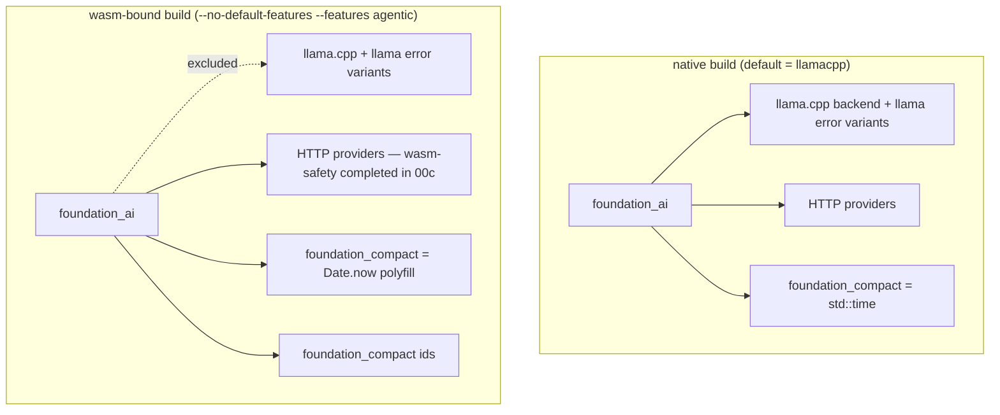

# Feature 00b: foundation_ai — optional llama, error gating, compat wiring

> Second `foundation_ai` build-foundation step. Makes the native model backends optional + gated,
> removes llama types from the always-compiled surface, migrates timestamps to
> `foundation_compact`, and wires the `foundation_compact` dependency (time + entropy + scru128 —
> `foundation_rng` is folded into it, see F00). After 00b the crate builds
> **native unchanged**; the actual wasm build is completed in **00c** (providers' `thread::sleep`,
> `foundation_deployment`/`foundation_auth`, the feature matrix). Resolves wasm blockers **B2, B4**
> and the `SystemTime::now()` panic.

> **Review status (2026-06-14):** reviewed against live code. Corrections folded in: the llama
> error contamination is **10 `GenerationError` variants** (not 4) across exactly **3 files**;
> `SystemTime` swap is byte-identical on native but compact's *wasm* serde differs (cross-platform
> divergence, tracked); `chrono` is a **dead dep** (remove); `rand`/`rand_chacha` are non-optional
> (wasm RNG concern); the premature `entropy`-wiring note removed.

## WHY: Problem Statement

For the agentic layer to build on wasm, `foundation_ai` must stop unconditionally compiling native,
C++-linking, and clock-panicking code. Verified blockers owned by this feature:

1. **`infrastructure_llama_cpp` is a non-optional dependency** (`Cargo.toml:25`). It links
   llama.cpp (C++) and cannot target wasm. `candle` is already optional; llama.cpp is the holdout.
2. **The core error enums embed llama types unconditionally.** `errors/mod.rs:7-9` imports
   `infrastructure_llama_cpp`; `GenerationError` has variants `LlamaCpp` (`:25`), `Tokenization`
   (`:28`), `LlamaModelLoad` (`:49`), `LlamaContextLoad` (`:52`) with `Display` arms (`:90,91,98,99`);
   `ModelErrors` has `LlamaModelLoad`/`LlamaContextLoad` (`:128,131`), `From` impls (`:143-151`), and
   `Display` arms (`:166,167`). These pull llama types into *every* compile.
3. **`llama`-touching backend modules are non-gated** (`backends/mod.rs:3-8`): `llamacpp`,
   `llamacpp_helpers`, `huggingface_gguf_provider` (the latter uses `crate::backends::llamacpp` +
   `std::fs`).
4. **`std::time::SystemTime::now()` panics on wasm** and is called throughout (`costing.rs:388,447`,
   the providers, and is the type of `Messages::Assistant.timestamp`, `types/mod.rs:5`).
5. **`foundation_ai` lacks the `foundation_compact` dep** — needed by F01's `SessionId` (scru128),
   the entropy/RNG, and the timestamp migration. (`foundation_compact` is the folded `foundation_rng`
   + vendored getrandom/rand — see F00.)

## WHAT: Solution

### 1. Make llama.cpp optional; establish the feature scaffold

```toml
# foundation_ai/Cargo.toml
[dependencies]
infrastructure_llama_cpp = { workspace = true, optional = true }
foundation_compact = { workspace = true }          # time + entropy + scru128 (folded foundation_rng, F00)

[features]
default = ["llamacpp"]                               # native default = current behavior
llamacpp = ["dep:infrastructure_llama_cpp"]
# candle stays as-is (already optional)
agentic = []                                         # wasm-safe surface marker (see 00c)
# metal/vulkan/cuda/... now route through llamacpp for clarity:
metal  = ["llamacpp", "infrastructure_llama_cpp/metal"]
vulkan = ["llamacpp", "infrastructure_llama_cpp/vulkan"]
# (same pattern for cuda/cuda_static/android/openmp/mtmd)
```

External blast radius is ~zero: only `bin/platform` depends on `foundation_ai` (default features),
so `default = ["llamacpp"]` keeps it working (verified in the F00 review).

### 2. Gate the error enums

The `infrastructure_llama_cpp` import (`errors/mod.rs:7-11`) pulls **ten** error types:
`ApplyChatTemplateError, ChatTemplateError, DecodeError, EmbeddingsError, EncodeError,
LlamaContextLoadError, LlamaCppError, LlamaModelLoadError, StringToTokenError, TokenToStringError`.
All variants typed on these must move behind `#[cfg(feature = "llamacpp")]` — import, variants,
`From` impls, and `Display` arms:

- **`GenerationError` — 10 variants** (`:25-52`): `LlamaCpp`, `Tokenization`, `TokenToString`,
  `Decode`, `Encode`, `Embeddings`, `ChatTemplate`, `ApplyChatTemplate`, `LlamaModelLoad`,
  `LlamaContextLoad`; their `From` impls; `Display` arms `:90-99`.
- **`ModelErrors` — 3 variants** (`:128,131,134`): `LlamaModelLoad`, `LlamaContextLoad`,
  `Embeddings`; manual `From` impls `:143-159` (**incl. the `EmbeddingsError` `From` at `:155-159`**);
  `Display` arms `:166-168`.

```rust
// errors/mod.rs
#[cfg(feature = "llamacpp")]
use infrastructure_llama_cpp::{ /* all 10 types */ };

pub enum GenerationError {
    // ... target-agnostic variants ...
    #[cfg(feature = "llamacpp")] LlamaCpp(LlamaCppError),
    #[cfg(feature = "llamacpp")] Tokenization(StringToTokenError),
    #[cfg(feature = "llamacpp")] TokenToString(TokenToStringError),
    #[cfg(feature = "llamacpp")] Decode(DecodeError),
    #[cfg(feature = "llamacpp")] Encode(EncodeError),
    #[cfg(feature = "llamacpp")] Embeddings(EmbeddingsError),
    #[cfg(feature = "llamacpp")] ChatTemplate(ChatTemplateError),
    #[cfg(feature = "llamacpp")] ApplyChatTemplate(ApplyChatTemplateError),
    #[cfg(feature = "llamacpp")] LlamaModelLoad(LlamaModelLoadError),
    #[cfg(feature = "llamacpp")] LlamaContextLoad(LlamaContextLoadError),
}
```

**Closed contamination set (verified): exactly 3 files** — `errors/mod.rs`, `backends/llamacpp.rs`,
`backends/llamacpp_helpers.rs`. **No external exhaustive `match`** on these enums exists: every
other `GenerationError::`/`ModelErrors::` use is a *construction* site (`Err(...)`, `.map_err(...)`),
and those live either in the gated `llamacpp.rs` or in llama-free providers — so gating the variants
does not create non-exhaustive matches anywhere. The only matches are the `Display` impls in
`errors/mod.rs`.

> OD-00b-1: keep `Tokenization`/`Decode`/`Encode`/`ChatTemplate`/`Embeddings` llama-gated (their
> *error types* are llama's) vs. introduce provider-agnostic equivalents. Recommendation: gate
> as-is now; generalize later if a non-llama provider needs them.

### 3. Gate the backend modules

```rust
// backends/mod.rs
#[cfg(feature = "llamacpp")] pub mod llamacpp;
#[cfg(feature = "llamacpp")] pub mod llamacpp_helpers;
#[cfg(feature = "llamacpp")] pub mod huggingface_gguf_provider;   // uses llamacpp + std::fs
// HTTP providers + candle unchanged here (HTTP providers' wasm-safety is 00c)
```

The provider registry / `ModelProviders` enumeration and any `pub use` of llama types must compile
with `llamacpp` off. Audit `lib.rs`/`backends/mod.rs` re-exports.

### 4. Migrate `SystemTime` → `foundation_compact::SystemTime`

`foundation_compact::SystemTime` **is** `std::time::SystemTime` on native (zero-cost re-export) and
the `Date.now()` polyfill on wasm. So this is a type-swap with no native behavior change:

- `types/mod.rs:5`: `use foundation_compact::SystemTime;` (the type of `Messages::Assistant.timestamp`).
- All `std::time::SystemTime::now()` / `SystemTime::now()` call sites → `foundation_compact::SystemTime::now()`
  (`costing.rs:388,447`; providers; etc.).
- The llama/candle backends' `SystemTime::now()` are auto-excluded on wasm (gated), but migrate them
  too for consistency.

> `Duration` and `UNIX_EPOCH` are re-exported by `foundation_compact`. **Serde caveat (corrected):**
> on **native** the swap is byte-identical because `foundation_compact` re-exports `std::time`
> (`std/mod.rs:3`), so F01/F17 native fixtures are unaffected. On **wasm**, compact's `SystemTime`
> serializes as its inner `Duration` (`{secs, nanos}`), which differs from std's
> `{secs_since_epoch, nanos_since_epoch}` — so a timestamp persisted on native does **not** round-trip
> to wasm and vice-versa. Tracked as OD-00b-6; not a native regression.

### 5. Wire `foundation_compact` / `foundation_compact`

Add the deps (Part 1). This unblocks F01's `SessionId` and the timestamp migration. `foundation_compact`
brings its per-target RNG features from 00a; `foundation_compact` brings `SystemTime`/`Instant`.
(The `entropy` feature that `SessionId::new()` will need on wasm is a **Feature 00** deliverable and
an **F01** consumer concern — 00b only adds the deps, it does not wire entropy.)

## Architecture



## HOW: Implementation Steps

1. Cargo: `infrastructure_llama_cpp` → optional; add `llamacpp` + `default = ["llamacpp"]` +
   `agentic`; route `metal/vulkan/cuda/...` through `llamacpp`. Add `foundation_compact` +
   `foundation_compact` deps (per-target features from 00a).
2. Gate `errors/mod.rs`: import, variants, `From` impls, `Display` arms behind `llamacpp`.
3. Grep all `match` sites on `GenerationError`/`ModelErrors`; cfg the llama arms.
4. Gate `backends/mod.rs`: `llamacpp`, `llamacpp_helpers`, `huggingface_gguf_provider`.
5. Audit `lib.rs`/registry for unconditional llama re-exports / `ModelProviders` references; gate.
6. Migrate `SystemTime` → `foundation_compact::SystemTime` crate-wide (type + call sites).
7. `cargo build -p foundation_ai` (default) — **byte-unchanged behavior**; run the suite.
8. `cargo build -p foundation_ai --no-default-features --features agentic` (native, no backends) —
   must compile (proves the error/backends gating is complete). Full wasm target build is 00c.

## Open Decisions

- **OD-00b-1 — llama error gating:** gate the 10 variants as llama-only now vs introduce
  provider-agnostic equivalents. Recommendation: gate now, generalize later.
- **OD-00b-2 — `agentic` vs `llamacpp`-off:** `--no-default-features` (no llamacpp) is the wasm
  surface; `agentic` stays a marker until 00c proves what it must gate.
- **OD-00b-3 — timestamp serde (native):** **Resolved → no native fixture change** (compact
  re-exports std on native). See OD-00b-6 for the cross-platform divergence.
- **OD-00b-4 — RNG dep overlap:** `foundation_ai` already has non-optional `fastrand`,
  `rand 0.10`, `rand_chacha 0.10` (`Cargo.toml:34-36`). `rand`/`rand_chacha` pull getrandom and may
  break wasm (same class as 00a's `rand` issue). Decide: consolidate onto `foundation_compact`, or make
  `rand`/`rand_chacha` native-only. **Recommendation: make them native-only here** (audit their use
  sites; likely native sampling) — pulled forward into 00b/00c. Flag for the wasm build in 00c.
- **OD-00b-5 — `chrono` dead dep:** `chrono` (`Cargo.toml:37`) has **zero** `src` use →
  **remove it** (cleanest; avoids a wasm-suspect dep). Confirm no feature/transitive need first.
- **OD-00b-6 — native↔wasm timestamp wire-format divergence:** accept that persisted `SystemTime`
  differs between native (std shape) and wasm (Duration shape), or make compact's wasm serde emit
  std's `{secs_since_epoch, nanos_since_epoch}` shape. Recommendation: make compact's wasm serde
  match std (a Feature 00 follow-up) so cross-platform session replay round-trips.

## Target Files

- `backends/foundation_ai/Cargo.toml` — optional llama, features, `foundation_compact`/`foundation_compact` deps
- `backends/foundation_ai/src/errors/mod.rs` — gate llama imports/variants/From/Display
- `backends/foundation_ai/src/backends/mod.rs` — gate `llamacpp`/`llamacpp_helpers`/`huggingface_gguf_provider`
- `backends/foundation_ai/src/{lib.rs}` — gate llama re-exports; registry compiles backend-less
- `backends/foundation_ai/src/{types/mod.rs,costing.rs,backends/*.rs}` — `SystemTime` → compact

## Tests

```bash
cargo build -p foundation_ai                                       # default (llamacpp) — unchanged
cargo test  -p foundation_ai                                       # native suite green
cargo build -p foundation_ai --no-default-features --features agentic   # native, backend-less, compiles
cargo clippy -p foundation_ai -- -D warnings
```

## Verification

```bash
cargo build -p foundation_ai
cargo build -p foundation_ai --no-default-features --features agentic
cargo clippy -p foundation_ai -- -D warnings
cargo clippy -p foundation_ai --no-default-features --features agentic -- -D warnings
cargo fmt -- --check
cargo test -p foundation_ai
grep -rn "std::time::SystemTime" backends/foundation_ai/src    # expect: empty (all → foundation_compact)
```

## Fundamentals Documentation (zero-to-expert) — REQUIRED

Author `fundamentals/` covering: Cargo feature unification & optional dependencies; `#[cfg(feature)]`
vs target-gating and how they compose; designing error enums that gate variants (exhaustiveness,
`From`, `Display`); the model-backend landscape (llama.cpp FFI, candle, HTTP providers) and why each
is/ isn't wasm-portable; `SystemTime` portability; default-feature blast radius. (Task — see list.)

## Done When

- `foundation_ai` builds + tests pass on the **default** feature set with **no behavior change**.
- `foundation_ai` compiles with `--no-default-features --features agentic` — this proves the
  **llama backend modules + the 10 llama error variants are fully gated out**. (It does *not* yet
  remove the always-compiled `foundation_auth`/`foundation_deployment`/HTTP-provider deps — those
  are made wasm-safe in 00c. The native backend-less build proves error/module gating only.)
- All `SystemTime::now()` route through `foundation_compact`; `foundation_compact`/`foundation_compact`
  wired; `chrono` removed (OD-00b-5).
- OD-00b-1..6 resolved and folded in.
