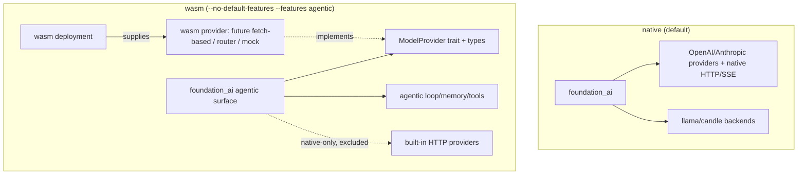

# Feature 00c: foundation_ai — wasm-buildable agentic surface

> **Re-scoped after review (2026-06-14).** A context-free review verified the original premise was
> wrong on three counts, the biggest being: **there is no wasm HTTP transport.** So this feature no
> longer tries to make the *built-in remote providers* run on wasm (that needs a fetch-based client
> — a separate future effort). Instead it makes the **agentic machinery** (types, loop, memory,
> tools, storage) build on `wasm32`, with the native-only HTTP providers + transport cfg-gated off
> wasm. Resolves wasm blockers **B5/B6/B7**; **B3** (`thread::sleep`) is moot on wasm (the providers
> are gated off) and stays as-is on native.

## WHY: Problem Statement (corrected against the code)

The original draft assumed the HTTP providers could be made wasm-safe by swapping `thread::sleep`
for `Stream::Delayed`. The review disproved this:

1. **No wasm HTTP/SSE transport exists (the real blocker).** `foundation_netio`'s `SimpleHttpClient`
   and `ReconnectingEventSourceTask` are native-only — `simple_http/client/mod.rs` gates them
   `#[cfg(all(feature = "multi", not(target_arch = "wasm32")))]`; there is no `web-sys`/fetch client
   anywhere. These native types are held in **always-compiled** provider struct fields
   (`openai_provider.rs:161,483`, `anthropic_messages_provider.rs:573`) and used by `stream()`. So
   the built-in providers **cannot link on wasm**, full stop, regardless of any sleep/auth/rand fix.
2. **The `thread::sleep` sites are not iterators.** They are synchronous blocking `loop {}` bodies
   inside `fn execute_request<T>() -> GenerationResult<T>` (`openai_provider.rs:236-252,513-529`,
   `openai_responses_provider.rs:395-411,717-730`, `anthropic_messages_provider.rs:607-623`), called
   from the **non-streaming** `generate()`/`generate_embeddings()`. There is no resumable state
   machine to yield `Stream::Delayed` from. Since these providers are native-only anyway, the sleep
   is fine where it is (native).
3. **`foundation_auth` needs a positive `wasm` feature, not just `turso` dropped.** `foundation_auth`
   has non-optional `rand 0.8`/`uuid`/`chrono`/`jwt-simple`/`argon2`/`time`; its wasm support is a
   `wasm` feature (`uuid/js`, `chrono/wasmbind`, `getrandom/js`). `foundation_ai` uses
   `AuthCredential`/`ConfidentialText` from it in **always-compiled** `types/mod.rs:8` → so
   `foundation_auth` must build on wasm via its `wasm` feature.
4. **`rand`, `rand_chacha`, `chrono` are dead deps** (zero `src` uses; only `fastrand` is used, in
   `candle.rs`). Remove them.

## WHAT: Solution

### Decision: wasm builds the agentic machinery, not the built-in remote providers

On wasm, `foundation_ai` exposes the **provider trait** + the agentic layer; the **concrete
OpenAI/Anthropic providers and their native transport are `cfg(not(target_arch = "wasm32"))`**. A
wasm deployment supplies a wasm-compatible provider (a future fetch-based provider, or the
`ModelProviderRouter` (F24) routing to one, or a mock). This is the only correct scope until a wasm
HTTP client exists. **OD-00c-1 (user): confirm this scoping.**

### 1. cfg-gate the native HTTP providers + transport off wasm

```rust
// backends/mod.rs — these depend on the native SimpleHttpClient / EventSource
#[cfg(not(target_arch = "wasm32"))] pub mod openai_provider;
#[cfg(not(target_arch = "wasm32"))] pub mod openai_responses_provider;
#[cfg(not(target_arch = "wasm32"))] pub mod anthropic_messages_provider;
```

Any always-compiled re-exports of these providers / their types move behind the same cfg. The
provider **trait** (`ModelProvider`/`Model`), `ModelInteraction`, `Messages`, `ToolShed`, etc. stay
target-agnostic. Audit `lib.rs` for unconditional provider re-exports.

> The `thread::sleep` calls live inside these now-gated modules → no wasm issue; left unchanged on
> native. (If a future wasm fetch-provider needs backoff, it uses `Stream::Delayed` from its
> streaming impl — but that's the future provider's concern, not this feature.)

### 2. Remove dead deps

```toml
# foundation_ai/Cargo.toml — delete entirely (zero src uses):
# rand = "0.10"
# rand_chacha = "0.10"
# chrono = "0.4.44"
# fastrand stays (used by candle.rs, which is candle-gated)
```

### 3. `foundation_auth` builds on wasm

`foundation_auth` is used by always-compiled `types/mod.rs` → it must build on wasm:

```toml
[dependencies]
foundation_auth = { workspace = true, default-features = false }   # drop turso

[target.'cfg(target_arch = "wasm32")'.dependencies]
foundation_auth = { workspace = true, default-features = false, features = ["wasm"] }
[target.'cfg(not(target_arch = "wasm32"))'.dependencies]
foundation_auth = { workspace = true }                              # native default (incl. turso if needed elsewhere)
```

> **OD-00c-2 (prerequisite):** verify `foundation_auth` actually builds on `wasm32` with its `wasm`
> feature (`jwt-simple`/`argon2` wasm-buildability is unverified). If it doesn't, a `foundation_auth`
> wasm fix is a prerequisite to this feature (like 00a was for `foundation_compact`).

### 4. `foundation_deployment` gated (native model providers only)

Used only by `huggingface_gguf_provider` (llama path) + `huggingface_candle_provider` (candle path)
→ optional, enabled by `llamacpp` and `candle` (00b gates those modules):

```toml
foundation_deployment = { workspace = true, features = ["huggingface"], optional = true }
[features]
llamacpp = ["dep:infrastructure_llama_cpp", "dep:foundation_deployment"]
candle   = ["candle-nn", "candle-transformers", "tokenizers", "dep:foundation_deployment"]
```

### 5. `agentic` marks the wasm surface

The wasm build is `cargo build -p foundation_ai --no-default-features --features agentic --target
wasm32-unknown-unknown`. It includes: types, the agentic module (F02+), the provider trait, storage
glue — and **excludes** llama/candle backends (00b) and the native HTTP providers (this feature).

## Architecture



## HOW: Implementation Steps

1. Confirm 00b landed (llama optional, error enums gated, `foundation_compact`/`foundation_compact` wired).
2. cfg-gate `openai_provider`/`openai_responses_provider`/`anthropic_messages_provider` (+ re-exports)
   off wasm. Keep the `ModelProvider`/`Model` trait + interaction types target-agnostic.
3. Delete dead `rand`/`rand_chacha`/`chrono` deps.
4. Target-gate `foundation_auth` (`wasm` feature on wasm; default on native). Verify it builds on
   wasm (OD-00c-2) — if not, file/await the `foundation_auth` wasm fix.
5. Make `foundation_deployment` optional under `llamacpp`/`candle`.
6. `cargo build -p foundation_ai --no-default-features --features agentic --target wasm32-unknown-unknown`;
   target-gate any residual native usage surfaced (the build error list is the worklist).
7. Native default build + suite — **no behavior change**.

## Open Decisions

- **OD-00c-1 (user) — wasm scope:** wasm = agentic machinery only; built-in HTTP providers are
  native-only until a fetch-based client lands. Confirm. (This re-scopes the spec's "everything
  builds on wasm" criterion: machinery yes, built-in remote providers no.)
      - Lets invest in getting this right - adding fetch based clients that make this easy for http client requests, we have all the capabilities and we own the own platform crates, we can do this well. Lets come up with a design that works for native and wasm, even the http API client has Send() and some methods that we can more than represent with fetch if possible, lets review and come up with a design that works and just feels right, we can discuss it if we have holes or questions to answer.

- **OD-00c-2 (prerequisite) — `foundation_auth` on wasm:** verify it builds with `wasm` feature; if
  not, prerequisite fix.
    do so, and document the fix clearly, feel free to create 000a,00b features if needed to own the work and scope it right

- **OD-00c-3 — future wasm HTTP transport:** building a `web-sys`/fetch `SimpleHttpClient` + SSE in
  `foundation_netio` (so wasm gets real built-in providers) is a **separate future feature / spec**.
  Record it; do not attempt here.
      - Lets investigate it, think about it, feature it and do it, then also see how we can do one using our foundation_wasm crate as well and add it to foundation_http with feature gating, making life even more seamless across native and wasm, lets think about it deeply and see how we can design it, if we need a new API surface for both native and wasm to work, lets think about it and design, then review and when we are happy, feature it and schedule for working.

    
- **OD-00c-4 — `huggingface_gguf_provider` gating:** confirm 00b gated it behind `llamacpp` (it must
  be, since it imports `foundation_deployment` + `infrastructure_llama_cpp`).
    - Of course

## Target Files

- `backends/foundation_ai/src/backends/mod.rs` — cfg-gate the 3 HTTP providers off wasm
- `backends/foundation_ai/src/lib.rs` — gate provider re-exports; trait/types stay target-agnostic
- `backends/foundation_ai/Cargo.toml` — delete `rand`/`rand_chacha`/`chrono`; target-gate
  `foundation_auth`; optional `foundation_deployment`
- (prerequisite, if needed) `backends/foundation_auth/` — wasm feature buildability

## Tests

```bash
cargo build -p foundation_ai                                       # native default — unchanged
cargo test  -p foundation_ai
cargo build -p foundation_ai --no-default-features --features agentic --target wasm32-unknown-unknown
```

## Verification

```bash
cargo build -p foundation_ai
cargo build -p foundation_ai --no-default-features --features agentic --target wasm32-unknown-unknown
cargo clippy -p foundation_ai -- -D warnings
cargo fmt -- --check
cargo test -p foundation_ai
grep -rn "rand::\|rand_chacha\|chrono::" backends/foundation_ai/src   # expect: empty (dead deps gone)
```

## Fundamentals Documentation (zero-to-expert) — REQUIRED

Author `fundamentals/` covering: HTTP on wasm (fetch/`web-sys` vs native sockets, why
`SimpleHttpClient` is native-only); Server-Sent Events & streaming; cooperative scheduling &
`Stream::Delayed` vs blocking `thread::sleep`; retry/backoff strategies (exponential, jitter); the
Cloudflare Workers runtime & `?Send` futures; how a wasm deployment supplies a provider. (Task.)

## Done When

- `foundation_ai` builds for `wasm32-unknown-unknown` under `--no-default-features --features agentic`
  — exposing the agentic machinery + provider trait, **without** the native HTTP providers.
- Native default build + suite unchanged.
- Dead deps removed; `foundation_auth` target-gated and wasm-buildable.
- OD-00c-1 (scope) confirmed by the user; OD-00c-3 (wasm fetch client) recorded as a future feature.
- **Phase 0 complete:** `foundation_compact`, `foundation_compact`, `foundation_ai` (machinery) build
  native + wasm; the agentic features (01+) can assume the substrate. wasm *remote inference* awaits
  the future fetch-based transport.
