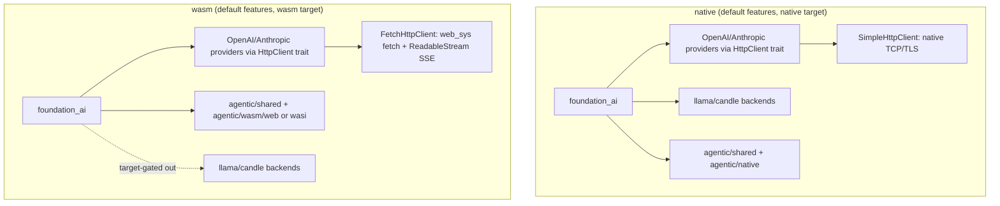

# Feature 00c: foundation_ai — wasm-buildable agentic surface

> **Re-scoped after review (2026-06-14).** A context-free review verified the original premise was
> wrong on three counts, the biggest being: **there is no wasm HTTP transport.** So this feature no
> longer tries to make the *built-in remote providers* run on wasm (that needs a fetch-based client
> — a separate future effort). Instead it makes the **agentic machinery** (types, loop, memory,
> tools, storage) build on `wasm32`, with the native-only HTTP providers + transport cfg-gated off
> wasm. Resolves wasm blockers **B5/B6/B7**; **B3** (`thread::sleep`) is moot on wasm (the providers
> are gated off) and stays as-is on native.

## WHY: Problem Statement (corrected against the code)

The original draft assumed the HTTP providers could be made wasm-safe by swapping `thread::sleep`
for `Stream::Delayed`. The review disproved this:

1. **No wasm HTTP/SSE transport exists (the real blocker).** `foundation_netio`'s `SimpleHttpClient`
   and `ReconnectingEventSourceTask` are native-only — `simple_http/client/mod.rs` gates them
   `#[cfg(all(feature = "multi", not(target_family = "wasm")))]`; there is no `web-sys`/fetch client
   anywhere. These native types are held in **always-compiled** provider struct fields
   (`openai_provider.rs:161,483`, `anthropic_messages_provider.rs:573`) and used by `stream()`. So
   the built-in providers **cannot link on wasm**, full stop, regardless of any sleep/auth/rand fix.
2. **The `thread::sleep` sites are not iterators.** They are synchronous blocking `loop {}` bodies
   inside `fn execute_request<T>() -> GenerationResult<T>` (`openai_provider.rs:236-252,513-529`,
   `openai_responses_provider.rs:395-411,717-730`, `anthropic_messages_provider.rs:607-623`), called
   from the **non-streaming** `generate()`/`generate_embeddings()`. There is no resumable state
   machine to yield `Stream::Delayed` from. Since these providers are native-only anyway, the sleep
   is fine where it is (native).
3. **`foundation_auth` needs a positive `wasm` feature, not just `turso` dropped.** `foundation_auth`
   has non-optional `rand 0.8`/`uuid`/`chrono`/`jwt-simple`/`argon2`/`time`; its wasm support is a
   `wasm` feature (`uuid/js`, `chrono/wasmbind`, `getrandom/js`). `foundation_ai` uses
   `AuthCredential`/`ConfidentialText` from it in **always-compiled** `types/mod.rs:8` → so
   `foundation_auth` must build on wasm via its `wasm` feature.
4. **`rand`, `rand_chacha`, `chrono` are dead deps** (zero `src` uses; only `fastrand` is used, in
   `candle.rs`). Remove them.

## WHAT: Solution

### Decision: wasm builds the agentic machinery AND the remote providers

With F00f delivering `FetchHttpClient` behind the `HttpClient` trait (same API as native
`SimpleHttpClient`), the built-in OpenAI/Anthropic providers **switch from hard `SimpleHttpClient` to
`HttpClient`** and build on wasm. The native transport continues to use `SimpleHttpClient`; on wasm
the providers use `FetchHttpClient` (web_sys fetch + ReadableStream SSE). Both implement the same
`HttpClient` trait — calling code is identical.

### 1. Switch providers from `SimpleHttpClient` to the `HttpClient` trait (F00f)

The built-in providers (`openai_provider`, `openai_responses_provider`,
`anthropic_messages_provider`) currently hold a concrete `SimpleHttpClient` in their struct fields.
Switch these to `Arc<dyn HttpClient>` (F00f's trait). On native, construct with `SimpleHttpClient`;
on wasm, construct with `FetchHttpClient`. The provider code itself is target-agnostic — it calls
`client.send()` / `client.send_streaming()` regardless of platform.

```rust
// Example: openai_provider.rs
pub struct OpenAiProvider {
    client: Arc<dyn HttpClient>,  // was: SimpleHttpClient
    // ...
}
```

The provider **trait** (`ModelProvider`/`Model`), `ModelInteraction`, `Messages`, `ToolShed`, etc.
stay target-agnostic. Audit `lib.rs` for any unconditional re-exports of native-only types.

> The `thread::sleep` calls in the non-streaming `execute_request` paths are native-only retry logic.
> On wasm, non-streaming calls use the same `HttpClient.send()` without blocking sleep — retry
> backoff on wasm uses `TaskStatus::Delayed` (valtron scheduling, F00). The streaming paths use
> `send_streaming()` which works identically on both platforms.

### 2. Remove dead deps

```toml
# foundation_ai/Cargo.toml — delete entirely (zero src uses):
# rand = "0.10"
# rand_chacha = "0.10"
# chrono = "0.4.44"
# fastrand stays (used by candle.rs, which is candle-gated)
```

### 3. `foundation_auth` builds on wasm

`foundation_auth` is used by always-compiled `types/mod.rs` → it must build on wasm:

```toml
[dependencies]
foundation_auth = { workspace = true, default-features = false }   # drop turso

[target.'cfg(target_family = "wasm")'.dependencies]
foundation_auth = { workspace = true, default-features = false, features = ["wasm"] }
[target.'cfg(not(target_family = "wasm"))'.dependencies]
foundation_auth = { workspace = true }                              # native default (incl. turso if needed elsewhere)
```

> **OD-00c-2 (prerequisite):** verify `foundation_auth` actually builds on `wasm32` with its `wasm`
> feature (`jwt-simple`/`argon2` wasm-buildability is unverified). If it doesn't, a `foundation_auth`
> wasm fix is a prerequisite to this feature (like 00a was for `foundation_compact`).

### 4. `foundation_deployment` gated (native model providers only)

Used only by `huggingface_gguf_provider` (llama path) + `huggingface_candle_provider` (candle path)
→ optional, enabled by `llamacpp` and `candle` (00b gates those modules):

```toml
foundation_deployment = { workspace = true, features = ["huggingface"], optional = true }
[features]
llamacpp = ["dep:infrastructure_llama_cpp", "dep:foundation_deployment"]
candle   = ["candle-nn", "candle-transformers", "tokenizers", "dep:foundation_deployment"]
```

### 5. wasm builds with default features (Item #14)

**`agentic` and wasm are orthogonal axes (Item #14).** The wasm build is simply
`cargo build -p foundation_ai --target wasm32-unknown-unknown` — **default features stay on**
(`llamacpp` + `agentic`). Target gates in Cargo.toml and code automatically exclude native-only
deps and modules. No `--no-default-features` needed.

The agentic module itself splits: `shared/` (target-agnostic, bulk of code), `native/` (non-wasm +
emscripten), `wasm/web/` (unknown-unknown: SendWrapper, fetch, web-sys), `wasm/wasi/` (wasip1/p2).

## Architecture



## HOW: Implementation Steps

1. Confirm 00b landed (llama optional, error enums gated, `foundation_compact` wired) and **F00f
   landed** (HttpClient trait + FetchHttpClient in foundation_netio).
2. Switch providers from `SimpleHttpClient` to `Arc<dyn HttpClient>` (F00f). Keep the
   `ModelProvider`/`Model` trait + interaction types target-agnostic.
3. Delete dead `rand`/`rand_chacha`/`chrono` deps (OD-00b-4/5 confirmed they're dead).
4. Target-gate `foundation_auth` (`wasm` feature on wasm; default on native). Verify it builds on
   wasm (OD-00c-2) — if not, file/await the `foundation_auth` wasm fix.
5. Make `foundation_deployment` optional under `llamacpp`/`candle`.
6. Handle `thread::sleep` in non-streaming paths: on wasm, replace with non-blocking retry via
   `TaskStatus::Delayed` (the providers are now target-agnostic, so blocking sleep needs a wasm path).
7. `cargo build -p foundation_ai --target wasm32-unknown-unknown`;
   target-gate any residual native usage surfaced (the build error list is the worklist).
8. Native default build + suite — **no behavior change**.

## Open Decisions

- **OD-00c-1 — wasm scope: RESOLVED (user, 2026-06-15).** Wasm builds the agentic machinery AND the
  built-in remote providers — **not** native-only. The user directed: invest in fetch-based clients so
  HTTP providers work seamlessly across native and wasm. This is delivered by **F00f** (wasm fetch HTTP
  client in `foundation_netio`), which provides `FetchHttpClient` behind the same `HttpClient` trait
  the native `SimpleHttpClient` implements. Once F00f lands, F00c un-gates the providers on wasm.
  The original "machinery-only on wasm" criterion is **superseded** — both machinery and remote
  providers build on wasm.

- **OD-00c-2 — `foundation_auth` on wasm: RESOLVED (user, 2026-06-15).** Verify and fix
  `foundation_auth` to build on wasm with its `wasm` feature. Document the fix clearly. If the fix is
  substantial, create a dedicated sub-feature to own the scope. This is a prerequisite — must land
  before F00c completes.

- **OD-00c-3 — wasm HTTP transport: RESOLVED (user, 2026-06-15) → delivered by F00f.** The user
  directed: investigate, feature it, and do it. This became **Feature 00f** (wasm fetch HTTP client) —
  a `FetchHttpClient` in `foundation_netio` behind the `HttpClient` trait, plus SSE over fetch
  `ReadableStream`. F00f depends on F00e (Send async traits). F00c consumes F00f's deliverable to
  un-gate providers on wasm. **Not deferred — scheduled as Phase 0.**

- **OD-00c-4 — `huggingface_gguf_provider` gating: RESOLVED (user, 2026-06-15).** Confirmed: F00b
  gates it behind `llamacpp` (it imports `foundation_deployment` + `infrastructure_llama_cpp`).
  Verified.

## Target Files

- `backends/foundation_ai/src/backends/mod.rs` — cfg-gate the 3 HTTP providers off wasm
- `backends/foundation_ai/src/lib.rs` — gate provider re-exports; trait/types stay target-agnostic
- `backends/foundation_ai/Cargo.toml` — delete `rand`/`rand_chacha`/`chrono`; target-gate
  `foundation_auth`; optional `foundation_deployment`
- (prerequisite, if needed) `backends/foundation_auth/` — wasm feature buildability

## Tests

```bash
cargo build -p foundation_ai                                       # native default — unchanged
cargo test  -p foundation_ai
cargo build -p foundation_ai --target wasm32-unknown-unknown
```

## Verification

```bash
cargo build -p foundation_ai
cargo build -p foundation_ai --target wasm32-unknown-unknown
cargo clippy -p foundation_ai -- -D warnings
cargo fmt -- --check
cargo test -p foundation_ai
grep -rn "rand::\|rand_chacha\|chrono::" backends/foundation_ai/src   # expect: empty (dead deps gone)
```

## Fundamentals Documentation (zero-to-expert) — REQUIRED

Author `fundamentals/` covering: HTTP on wasm (fetch/`web-sys` vs native sockets, why
`SimpleHttpClient` is native-only); Server-Sent Events & streaming; cooperative scheduling &
`Stream::Delayed` vs blocking `thread::sleep`; retry/backoff strategies (exponential, jitter); the
Cloudflare Workers runtime & `?Send` futures; how a wasm deployment supplies a provider. (Task.)

## Done When

- `foundation_ai` builds for `wasm32-unknown-unknown` with **default features** (`llamacpp` + `agentic`)
  — target gates automatically exclude llamacpp dep. Providers work on wasm via `HttpClient` trait
  (F00f). No `--no-default-features`.
- Native default build + suite unchanged.
- Dead deps removed; `foundation_auth` target-gated and wasm-buildable.
- All cfg gates use `target_family = "wasm"` (not `target_arch = "wasm32"`).
- OD-00c-1..4 resolved. Remote providers work on wasm via F00f's `HttpClient` trait.
- **Phase 0 complete:** `foundation_compact`, `foundation_ai` (machinery + remote providers) build
  native + wasm; the agentic features (01+) can assume the substrate.
