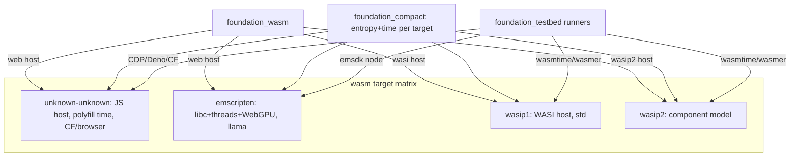

# Feature 00d: wasm target matrix (emscripten + WASI p1/p2)

> Phase-0 prep so the agentic stack isn't locked to a single wasm target. Today the wasm story targets
> only **`wasm32-unknown-unknown`** (CF Workers / wasm-bindgen). This feature prepares
> **`foundation_wasm`** (the nostd WASM/JS runtime) and **`foundation_testbed`** (the harness) — plus the
> spec's cfg-gating discipline — for the full matrix: **`unknown-unknown`**, **`unknown-emscripten`**
> (the llama/WebGPU path, F00b OD-00b-7), **`wasip1`**, **`wasip2`**.

## WHY: Problem Statement

The spec originally gated wasm with blanket **`cfg(target_arch = "wasm32")`** / `cfg(not(target_arch="wasm32"))`.
**Item #14 resolved:** all gates now use `target_family = "wasm"` (covers wasm32 + wasm64). But even
`target_family` is too coarse — it lumps four *very different* targets together:

| Target | std? | time | threads | host | net/HTTP | use |
|--------|------|------|---------|------|----------|-----|
| `wasm32-unknown-unknown` | **no** (no libc) | panics (needs polyfill) | no | wasm-bindgen / foundation_wasm JS | fetch (none in netio yet) | CF Workers, browser SPA |
| `wasm32-unknown-emscripten` | **partial** (emscripten libc) | std works | pthreads | emscripten + WebGPU | emscripten sockets | browser local inference (llama, WebGPU) |
| `wasm32-wasip1` | **yes** (WASI preview1) | std (clock) works | wasi-threads | WASI host (wasmtime/wasmer) | WASI sockets | server/edge wasm, Deno, some CF |
| `wasm32-wasip2` | **yes** (WASI 0.2 component model) | std works | yes | WASI component host | wasi:http | component-model deployments |

So emscripten + WASI have **far more std capability** than `unknown-unknown` — and the code that's
gated off "all wasm" today wrongly excludes targets where it would work (e.g. `std::time`,
`std::thread`, parts of fff/fjall). The two crates that own the wasm runtime + testing must be made
**target-OS-aware**, and the entropy/time substrate (F00) already covers the matrix (its vendored
getrandom ships `wasm_js` + `wasi_p1` + `wasi_p2_3` + emscripten `getentropy`; time uses std on
emscripten/wasi, polyfill only on `unknown-unknown`).

## WHAT: Solution

### 1. cfg discipline — target_os-aware, not blanket target_family

Establish the canonical discriminators (used spec-wide, all using `target_family = "wasm"`):

```rust
// the RESTRICTIVE no-std browser/CF target (the one needing polyfills + JS host):
#[cfg(all(target_family = "wasm", not(target_os = "emscripten"), not(target_os = "wasi")))]
// emscripten (libc + threads + WebGPU; llama works — routes to native/ in agentic module):
#[cfg(all(target_family = "wasm", target_os = "emscripten"))]
// WASI preview 1 / preview 2:
#[cfg(all(target_family = "wasm", target_os = "wasi"))]   // (+ target_env "p1"/"p2" where needed)
```

Audit the agentic crates' wasm gates: native-only C tooling (fff's heed/git2/memmap2, llama's CMake)
stays gated to **native + emscripten** where it actually builds; pure-Rust agentic machinery
(foundation_compact, foundation_vectors, the agentic types/loop/memory) targets **all four**.

### 2. `foundation_wasm` — add WASI + emscripten host backends

`foundation_wasm` today: a nostd WASM/JS interop runtime; the **`web`** feature enables the JS host ABI
(`wasm_import_module = "abi"` imports, timers, `host_apply`) — that's the `unknown-unknown`/browser
path. Its cfg gates on `target_family = "wasm"`, not `target_os`. Needed:

- **Make the host abstraction target-OS-aware.** The `web` (JS) host stays for unknown-unknown +
  emscripten-in-browser. Add a **WASI host backend** (`wasi` feature) — under wasip1/p2 there is no JS
  `abi`; host calls go through WASI (preview1 syscalls / preview2 component imports). Time, entropy,
  scheduling resolve via WASI, not the JS ABI.
- **Features:** keep `web`; add `wasi` (WASI preview1) and `wasip2` (component model) so a consumer
  selects its host. The `host_runtime`/`frames`/`intervals`/`schedule` modules gate the JS-import path
  on `web` and provide a WASI path under `wasi`.
- The executor's JS-event-loop yield (`local.rs:2682`, `js-wasmbindgen`/`js-foundation-wasm`) is
  unknown-unknown/emscripten-specific; WASI hosts drive the executor differently (poll/yield via WASI)
  — document the per-host scheduling model.

### 3. `foundation_testbed` — run the matrix

`foundation_testbed`'s `wasm` feature is a **`wasm32-unknown-unknown`**-only harness (browser via the
pure-Rust CDP/BiDi driver, Deno, CF Workers; built with `walrus` + `foundation_browser`/`foundation_http`/
`foundation_wasm_ui`). Extend it to build + run the other targets:

- **emscripten** (`wasm32-unknown-emscripten`): build via the vendored EMSDK (`tools/emsdk`), run in
  node/browser (WebGPU). Add an emscripten runner.
- **WASI** (`wasm32-wasip1` / `wasm32-wasip2`): run under **wasmtime** (no wasmer — OD-00d-3 resolved).
  The WASI runner is owned by **`foundation_wasmtime`** which is **DEFERRED to Phase 4 / last** (user,
  2026-06-15): nothing in core machinery depends on it, so this **WASI-runner portion of 00d splits out
  and lands *with* `foundation_wasmtime`**. 00d ships the native / `unknown-unknown` / emscripten runners
  first; the `wasi` harness runner (loads `.wasm` + WASI imports, asserts output) is built when
  `foundation_wasmtime` is.
- A **target enum** in the harness (`unknown-unknown | emscripten | wasip1 | wasip2`) + per-target
  runner, so a test declares which targets it must pass on.

### 4. The agentic build matrix (what must compile where)

| Crate | uu | emscripten | wasip1 | wasip2 | notes |
|-------|----|-----------|--------|--------|-------|
| `foundation_compact` | ✅ | ✅ | ✅ | ✅ | F00 vendored entropy covers all; time=std except uu |
| `foundation_vectors` | ✅ | ✅ | ✅ | ✅ | pure Rust (flat/IVF/HNSW/BM25); code-graph native-only |
| `foundation_db` (agentic subset) | ✅ | ✅ | ✅ | ✅ | in-memory + CF; fjall/native gated to native+emscripten? (verify) |
| `foundation_ai` (agentic, `--features agentic`) | ✅ | ✅(+llama) | ✅ | ✅ | llama on native+emscripten (OD-00b-7); providers' HTTP per host |
| `foundation_wasm` | ✅(web) | ✅(web) | ✅(wasi) | ✅(wasip2) | this feature |

## Architecture



## Fundamentals Documentation (zero-to-expert) — REQUIRED

Author `fundamentals/` covering: the **wasm target matrix** (unknown-unknown vs emscripten vs wasip1
vs wasip2 — libc, threads, time, host model, networking — and the `target_os`/`target_env`
discriminators); **emscripten** (the SDK, libc, pthreads, WebGPU, why llama builds there); **WASI**
(preview1 syscalls, preview2 component model + WIT, `wasi:random`/`wasi:clocks`/`wasi:http`, wasmtime/
wasmer); the **JS host ABI** (`wasm_import_module`, `getRandomValues`, event-loop yield) vs WASI host;
how to write **target-OS-aware cfg** (not blanket `target_arch`); building/running each target in CI.
(Task — see list.)

## HOW: Implementation Steps

1. Define the canonical cfg discriminators + audit the agentic crates' wasm gates (native-C tooling →
   native+emscripten; pure-Rust → all four).
2. `foundation_wasm`: make host gating `target_os`-aware; add `wasi` + `wasip2` features + WASI host
   backend alongside `web`; document per-host scheduling.
3. `foundation_testbed`: add a target enum + emscripten runner (EMSDK) + WASI runner (wasmtime/wasmer,
   OD-00d-3); keep the existing uu browser/Deno/CF harness.
4. Add the targets to tooling (`mise.toml` already has `wasm32-wasip1`; add `wasip2`, emscripten via
   EMSDK) and a CI matrix.
5. Build-check the agentic crates across the matrix; fix residual gates surfaced.
6. Tests: per-target build of foundation_compact/foundation_vectors/foundation_ai(agentic); a
   foundation_wasm host smoke per host; a foundation_testbed runner smoke per target.

## Open Decisions

- **OD-00d-1 — scope of host backends in `foundation_wasm`: PARTIALLY RESOLVED (user, 2026-06-15).**
  Split into two sub-features within F00d's implementation:
  - **F00d-a (wasip1 host backend):** WASI preview1 syscalls (`random_get`, `clock_time_get`, `fd_*`).
    Broader runtime support (wasmtime, wasmer, Deno, Node). Ships first.
  - **F00d-b (wasip2 host backend):** WASI preview2 component model (`wasi:random`, `wasi:clocks`,
    `wasi:http`). Requires WIT bindings + the component model toolchain. Ships second.
  Both are Phase 0 deliverables within F00d — not deferred. The HOW steps should reflect the sequencing.
  Needs a review of what each requires (research task before implementation).

- **OD-00d-2 — which crates are required on which targets: RESOLVED (user, 2026-06-15).** The matrix
  table above is confirmed. The rule: if it works on a target, we make it work and gate properly.
  `foundation_db` fjall/native is gated to **native + emscripten** (fjall compiles with emscripten's
  libc; verify). Pure-Rust crates (foundation_compact, foundation_vectors, agentic shared) target all
  four.

- **OD-00d-3 — WASI runtime for the harness: RESOLVED (user, 2026-06-15) → `wasmtime` always** (no
  wasmer). Owned by a dedicated **`foundation_wasmtime`** crate (nice API: set host imports, get an
  executable exposing the exports). **DEFERRED to Phase 4 / last** (discussion §B2): nothing in core
  machinery depends on it, so the WASI runner here lands together with `foundation_wasmtime`. The other
  00d runners (native/unknown-unknown/emscripten) are not blocked.

- **OD-00d-4 — emscripten in CI: RESOLVED (user, 2026-06-15).** Invest in getting the emscripten build
  target working well. EMSDK is vendored (`tools/emsdk`); wire it into CI, gate behind a testbed
  feature (`emscripten`), and exercise the emscripten runner in the CI matrix. The
  `foundation_buildtools` crate (F00b OD-00b-8) owns the EMSDK wiring helpers.

- **OD-00d-5 — spec-wide cfg refactor: RESOLVED (user, 2026-06-15).** All spec features use
  `target_family = "wasm"` (Item #14). The finer target_os discriminators (unknown-unknown vs
  emscripten vs wasi) are this feature's deliverable — the canonical patterns in §1 above are the
  spec-wide standard. F00d's HOW step 1 audits all agentic crates and replaces blanket gates with
  target_os-aware gates where the distinction matters (e.g. native C tooling → native+emscripten,
  not blanket "not wasm"). The dependency chain: F00 (entropy/time already target-aware) → F00d
  (establishes patterns + audits crates) → all subsequent features follow the patterns.

## Target Files

- `backends/foundation_wasm/` — `Cargo.toml` (`wasi`/`wasip2` features), `host_runtime.rs`/`frames.rs`/
  `intervals.rs`/`schedule.rs` (target_os-aware host backends)
- `backends/foundation_testbed/` — `Cargo.toml` (wasmtime/wasmer + emsdk deps), `src/wasm/` (target enum
  + emscripten + WASI runners)
- `mise.toml` / CI — add `wasm32-wasip2` + emscripten targets
- (coordination) the agentic features' wasm cfg gates (OD-00d-5)

## Tests

```bash
# substrate across the matrix
for t in wasm32-unknown-unknown wasm32-wasip1 wasm32-wasip2; do cargo build -p foundation_compact --target $t; done
cargo build -p foundation_wasm --features wasi --target wasm32-wasip1
cargo test  -p foundation_testbed --features wasm -- matrix   # per-target runner smoke
```

## Verification

```bash
cargo build -p foundation_compact --target wasm32-wasip1
cargo build -p foundation_compact --target wasm32-wasip2
cargo build -p foundation_wasm --features wasi --target wasm32-wasip1
cargo build -p foundation_ai --target wasm32-wasip1
cargo clippy --workspace -- -D warnings
```

## Done When

- `foundation_wasm` builds + provides a host on `unknown-unknown` (web), `wasip1`/`wasip2` (wasi), and
  emscripten; cfg gating is target_os-aware.
- `foundation_testbed` can build + run tests on `unknown-unknown` (existing), emscripten, wasip1, wasip2.
- The agentic pure-Rust crates compile across the matrix; native-C tooling (fff/llama) is gated to
  native+emscripten, not "all wasm".
- The canonical target_os cfg pattern is documented + adopted (OD-00d-5). OD-00d-1..5 resolved;
  fundamentals authored. `foundation_buildtools` crate exists (OD-00b-8) for cross-platform build
  helpers.
