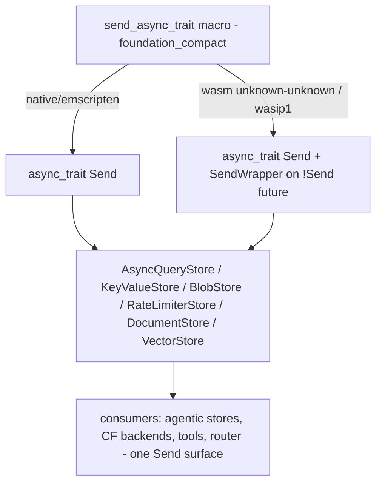

# Feature 00e: Unified `Send` async traits

> **Owns Item #1 / discussion §A1 (user, 2026-06-15).** One unified **`Send`** async-trait surface
> everywhere — **no `#[async_trait(?Send)]` mirror**. On the **single-threaded** wasm targets
> (`wasm32-unknown-unknown`, CF Workers, `wasm32-wasip1`) a **`SendWrapper`-style adapter** makes the
> `!Send` JS/Promise futures present as `Send` (sound — nothing crosses threads there). The adapter is
> **gated to single-threaded targets only**; **`wasm32-unknown-emscripten` is treated like native**
> (real threads ⇒ genuine `Send`, no adapter).

## WHY: Problem Statement

`foundation_db` (and the wasm/native backends) define their async store traits with
`#[async_trait::async_trait(?Send)]` because **JS/Promise-backed futures on wasm are `!Send`** (CF KV/D1/R2
bindings hold JS handles). That `?Send` choice then **forces the whole stack to be `?Send`**, which:

- Splits every consumer into a `Send` (native) vs `?Send` (wasm) shape — the friction behind F07
  OD-07-5, F23 OD-23-11, F28/F30 `AsyncVectorStore`, and the agentic layer that wants to be mostly `Send`.
- Blocks the agentic executor (valtron, multi-threaded on native) from moving store-touching tasks across
  worker threads, because a `?Send` future can't be `Send`.

The insight (§A1): on the **single-threaded** wasm targets there is **no real concurrency**, so a `Send`
bound is **vacuously safe** — we can assert it via a wrapper. So we keep **one `Send` trait surface**
everywhere and localize the `!Send→Send` assertion to single-threaded wasm.

## WHAT: Solution

### 1. One `Send` async-trait surface

Every existing `Async*` trait drops `(?Send)` and becomes a normal `Send` async trait:

| Trait | File |
|-------|------|
| `AsyncQueryStore` | `core/storage_provider.rs:362` |
| `AsyncKeyValueStore` | `core/storage_provider.rs:386` |
| `AsyncBlobStore` | `core/storage_provider.rs:418` |
| `AsyncRateLimiterStore` | `core/storage_provider.rs:428` |
| `AsyncDocumentStore` | `core/storage_provider.rs:509` |
| `AsyncVectorStore` | (defined by F28; same rule) |

(plus the legacy `src/storage_provider.rs` duplicates at :678/816/924/1033 — reconcile/converge.)

All impls — `core/backends/{memory,memory_json}.rs`, `native/{turso_backend,json_file,libsql_store,r2_blobstore,d1_kvstore}.rs`, `wasm/wasm_storage/{r2_wasm,d1_wasm,kv_wasm}.rs` — migrate to the unified macro.

### 2. The `maybe_send` adapter (single-threaded wasm only)

A small **cfg-selected `async_trait` wrapper** owns the asymmetry, so individual traits/impls don't repeat cfg:

```rust
// foundation_compact (compatibility-owning crate). One macro, target-aware expansion.
//   native, wasm32-unknown-emscripten  -> #[async_trait::async_trait]            (genuine Send)
//   wasm32-unknown-unknown / wasip1     -> #[async_trait::async_trait] + the impl
//                                          body's !Send future is wrapped in SendWrapper
#[macro_export] macro_rules! send_async_trait { /* re-export of the right attribute */ }

/// Asserts Send for a !Send future. SOUND ONLY on single-threaded targets — gated by cfg so it
/// cannot be named on native/emscripten. Mirrors `send_wrapper::SendWrapper` but ours/no-dep.
#[cfg(all(target_arch = "wasm32", not(target_os = "emscripten"), /* single-threaded */))]
pub struct SendWrapper<T>(/* T, !Send-but-asserted-Send */);
```

- **Native + emscripten:** the trait is `#[async_trait]` (Send); futures are genuinely `Send`; **no
  `SendWrapper`** exists (cfg'd out) — so a misuse can't compile there.
- **Single-threaded wasm:** the impl returns its `!Send` JS future wrapped in `SendWrapper`, so the
  trait's `Send` future bound is satisfied. Safe because the runtime is single-threaded.
- A `debug_assert!`/doc invariant documents the single-thread requirement.

### 3. Consumers simplify

`StorageItemStream`, the agentic stores (F06 DocumentStore, F07 MemoryStore), F28 VectorStore, the CF
backends (F23/F30), ToolImpl (F09), RoutableProvider (F12) all reference **one** `Send` async surface.
The `?Send` mirrors and dual shapes are deleted.

## Architecture



## HOW: Implementation Steps

1. Add `SendWrapper` + the `send_async_trait` cfg-macro to `foundation_compact` (gated; single-threaded
   wasm only for the wrapper).
2. Migrate the 5 (+VectorStore) trait defs in `foundation_db` off `(?Send)` to the unified macro.
3. Migrate every backend impl (memory/turso/json_file/libsql/r2/d1/kv, native + wasm) to match.
4. Reconcile the duplicate `src/storage_provider.rs` trait copies with `core/storage_provider.rs`.
5. Wrap the wasm CF binding futures (`kv_wasm`/`d1_wasm`/`r2_wasm`) in `SendWrapper` at the impl boundary.
6. Delete `?Send` mentions across the agentic spec consumers (F06/F07/F09/F12/F23/F28/F30) — done as each
   feature is touched; this feature owns the trait-level change.
7. Build the full target matrix (native, unknown-unknown, wasip1, emscripten); confirm `Send` holds.
8. Author `fundamentals/` (below).

## Open Decisions

- **OD-00e-1 — adapter home:** `foundation_compact` (compatibility crate, rec) vs `foundation_wasm`.
  Rec: `foundation_compact` (it already owns per-target compatibility; §A5).
- **OD-00e-2 — single-thread detection:** how to cfg "single-threaded wasm" precisely —
  `target_arch="wasm32"` + `not(target_os="emscripten")` + `not(target_feature="atomics")`. Confirm the
  `atomics` feature is the right multi-thread discriminator (wasm threads ⇒ `atomics`).
- **OD-00e-3 — macro vs hand-cfg:** a `send_async_trait` macro (rec) vs each trait writing the cfg
  attribute inline. Rec: macro (one place, no drift).
- **OD-00e-4 — duplicate storage_provider modules:** `src/storage_provider.rs` vs
  `src/core/storage_provider.rs` both define these — converge to one during the migration (flag scope).

## Target Files

- `backends/foundation_compact/` — `SendWrapper` + `send_async_trait` macro (gated).
- `backends/foundation_db/src/core/storage_provider.rs` — the 5 trait defs.
- `backends/foundation_db/src/{core/backends,native,wasm}/**` — all impls.
- coordinates with F06/F07/F09/F12/F23/F28/F30 (consumers drop `?Send`).

## Tests

```bash
cargo build -p foundation_db
cargo build -p foundation_db --target wasm32-unknown-unknown --features <cf>
cargo build -p foundation_db --target wasm32-wasip1
# emscripten via foundation_testbed runner (00d)
cargo test -p foundation_db
```

## Verification

```bash
cargo clippy -p foundation_db -- -D warnings
# assert the store futures are Send on native (compile-time assert in a test)
```

## Fundamentals Documentation (zero-to-expert) — REQUIRED

Author `fundamentals/` covering: `Send`/`Sync` and `!Send` futures; why JS/Promise futures are `!Send`;
single-threaded soundness of asserting `Send` (and why it's UB under real threads); `send_wrapper`
pattern; `async_trait` and the `?Send` form; wasm threads (`atomics`) vs single-threaded targets; the
cfg discriminators (target_os/target_feature). (Task — see list.)

## Done When

- Every `foundation_db` (+VectorStore) async store trait is a single **`Send`** async trait; `(?Send)` is
  gone.
- The `SendWrapper`/`send_async_trait` adapter exists in `foundation_compact`, cfg-gated to
  single-threaded wasm; native + emscripten use genuine `Send` with no adapter.
- Builds on native, `wasm32-unknown-unknown`, `wasm32-wasip1`, and `wasm32-unknown-emscripten`.
- Agentic consumers (F06/F07/F09/F12/F23/F28/F30) reference one `Send` surface; `?Send` deleted.
- OD-00e-1..4 resolved.
