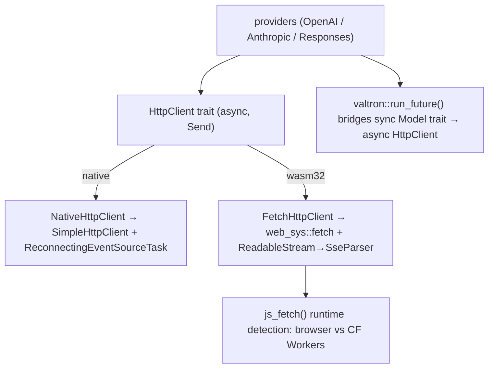

# Feature 00f: wasm `fetch` HTTP client

> **Owns discussion §B1 (user, 2026-06-15) — "build the fetch client now, early."** The outbound HTTP
> **client** is `foundation_netio::simple_http::SimpleHttpClient` and is **native-only** today; this
> feature adds the **wasm32 `fetch` backend** behind an **async `HttpClient` trait**, so the agentic
> stack can talk to remote model providers + REST vector DBs from wasm/CF Workers.

## WHY: Problem Statement

**Grounded in the current code:**
- The HTTP **client** lives in **`foundation_netio`** — `simple_http::client::SimpleHttpClient<R: DnsResolver>`
  (`native/client.rs`), `ClientRequestBuilder` (`get`/`post`), and SSE via
  `event_source::ReconnectingEventSourceTask<R>`. It is **native-only** (`netcap`/TCP/rustls).
- `foundation_netio` has **no wasm/`fetch` path** today.
- `foundation_ai` providers all use the native client directly — three identical patterns:
  - `OpenAIProvider<R: DnsResolver>` with `http_client: Option<SimpleHttpClient<R>>` + `resolver: Option<R>`
  - `ResponsesProvider<R: DnsResolver>` — same pattern
  - `AnthropicMessagesProvider<R: DnsResolver>` — same pattern
- The `DnsResolver` type parameter propagates into `Model` structs, `Stream` structs, and every impl
  block — all native-only concerns that shouldn't leak into the provider API.

Consequence: on wasm/CF Workers there is **no outbound HTTP**, so built-in remote providers and external
REST vector backends (TurboPuffer, F30) are native-only.

## WHAT: Solution

### 1. `HttpClient` trait — async + sync surfaces

Four methods: async versions return async types, sync versions return sync types. No lazy
delegation — each platform implements both properly.

```rust
// foundation_netio::simple_http::client::shared::http_client

pub type BoxedSseIterator = Box<dyn Iterator<Item = Stream<ParseResult, SseProgress>> + Send>;
pub type BoxedSseFutureStream = Pin<Box<dyn futures_core::Stream<Item = Stream<ParseResult, SseProgress>> + Send>>;

#[async_trait::async_trait]
pub trait HttpClient: Send + Sync {
    async fn send_async(&self, req: PreparedRequest) -> Result<SimpleResponse<SendSafeBody>, HttpClientError>;
    async fn send_sse_async(&self, req: PreparedRequest) -> Result<BoxedSseFutureStream, HttpClientError>;
    fn send(&self, req: PreparedRequest) -> Result<SimpleResponse<SendSafeBody>, HttpClientError>;
    fn send_sse(&self, req: PreparedRequest) -> Result<BoxedSseIterator, HttpClientError>;
}
```

Object-safe (no generics in return types). Providers store `Arc<dyn HttpClient>`.
On native, `send()` calls `ClientRequest::send()` (sync); `send_async()` calls
`ClientRequest::send_async().await` (truly async). On wasm, async is canonical
(`fetch()`); sync wraps via valtron `run_future()`.

### 2. Reuses existing cross-platform types — no new request/response structs

**`PreparedRequest`** (`client/shared/request.rs`) already carries `Uri`, `SimpleMethod`, `SimpleHeaders`,
`SendSafeBody`, `Extensions` — all pure Rust, all cross-platform. `Uri` from `foundation_core::url` is
proper RFC 3986 parsing, not a raw string. `SendSafeBody` supports all body variants including streaming
(`Stream`, `ChunkedStream`, `LineFeedStream`, `SseStream`).

**`SimpleResponse<SendSafeBody>`** (`simple_http::shared::impls`) carries `Status`, `SimpleHeaders`, and
the full `SendSafeBody` — streaming response bodies are preserved end-to-end.

No new types invented — the trait uses what already exists.

### 3. `NativeHttpClient` — wraps the existing `SimpleHttpClient`

```rust
// foundation_netio::simple_http::client::native::http_client_impl

pub struct NativeHttpClient<R: DnsResolver + Clone + Send + 'static = SystemDnsResolver> {
    client: SimpleHttpClient<R>,
    resolver: R,
}
```

- `send()` converts `PreparedRequest` → `ClientRequestBuilder` (method, headers, body via
  `builder.body(req.body)` for all `SendSafeBody` variants) → `.send()` →
  `FinalizedResponse.into_parts()` → `SimpleResponse<SendSafeBody>` (drops pool/conn).
- `send_sse()` builds `ReconnectingEventSourceTask` from request fields, `execute(task, None)` to get
  `DrivenStreamIterator`, maps `ReconnectingProgress` → `SseProgress`.
- All `SendSafeBody` variants pass through — no rejections.
- No behavior change from existing native path — just a trait wrapper.

### 4. `FetchHttpClient` — wasm32 backend (browser + CF Workers)

```
foundation_netio/src/simple_http/client/wasm/
├── mod.rs       — module root, exports
├── client.rs    — FetchHttpClient struct + HttpClient impl
├── headers.rs   — SimpleHeaders <-> web_sys::Headers conversion
└── stream.rs    — ReadableStream -> byte buffer -> SseParser -> ParseResult iterator
```

**One implementation covers both browser and CF Workers.** The `fetch()` API is standard in both
environments. The only difference is how you obtain the global fetch function:

```rust
// Reuse the pattern from foundation_auth/src/wasm_bindgen/oauth.rs:234-250
fn js_fetch(req: &web_sys::Request) -> js_sys::Promise {
    let global = js_sys::global();
    if let Ok(true) = js_sys::Reflect::has(
        &global, &JsValue::from_str("ServiceWorkerGlobalScope"),
    ) {
        // CF Workers: use global scope's fetch
        global.unchecked_into::<web_sys::ServiceWorkerGlobalScope>()
            .fetch_with_request(req)
    } else {
        // Browser: use window.fetch
        web_sys::window().expect("no window").fetch_with_request(req)
    }
}
```

No separate CF-specific HTTP client is needed — CF Workers implement the standard Web Fetch API.

**Streaming request bodies on wasm:** All `SendSafeBody` variants are supported. Text → JS string,
Bytes → `Uint8Array`, streaming variants (`Stream`, `ChunkedStream`, `LineFeedStream`, `SseStream`) →
JS `ReadableStream` via valtron's `iterator_to_readable_stream()` bridge (see §4a below).

**SSE responses on wasm:** basic (no auto-reconnect in first cut — providers handle retries at their level).
Uses the existing `SseParser<R: Read>` from `event_source::shared::sse` with a `QueueReader` adapter over
buffered `ReadableStream` chunks (async reader task via `spawn_local` + `ConcurrentQueue`). The `!Send` JS
futures are wrapped via `foundation_compact::SendWrapper` (F00e).

### 4a. Valtron `js_stream` — general-purpose JS ReadableStream bridge (foundation_core)

A new wasm construct in `foundation_core::valtron::executors::wasm::wasm_bindgen::js_stream`,
analogous to native `ThreadedIterFuture`. Two directions:

- **`JsReadableStreamIterator`**: JS `ReadableStream` → sync `Iterator<Item = JsStreamValue>`.
  Spawns an async reader task via `spawn_local` that reads chunks into a `ConcurrentQueue`.
  Yields `JsStreamValue::Chunk(Vec<u8>)` or `JsStreamValue::Waiting` (valtron yields to JS event loop).

- **`iterator_to_readable_stream(iter)`**: sync `Iterator<Item = Vec<u8>>` → JS `ReadableStream`.
  Creates a pull-based underlying source with `controller.enqueue()`/`controller.close()` closures
  wrapped in `Rc<RefCell<>>`. Used by `FetchHttpClient` to bridge streaming `SendSafeBody` variants
  into fetch request bodies.

Re-exported at `foundation_core::valtron::js_stream` (gated behind `wasm32 + js-wasmbindgen`).

### 5. Provider refactor — remove `DnsResolver` type parameter

All 3 providers + model structs + stream structs:

**Before:**
```rust
pub struct OpenAIProvider<R: DnsResolver = SystemDnsResolver> {
    http_client: Option<SimpleHttpClient<R>>,
    resolver: Option<R>,
    ...
}
impl<R: DnsResolver + Default + 'static> ModelProvider for OpenAIProvider<R> { ... }
```

**After:**
```rust
pub struct OpenAIProvider {
    http_client: Arc<dyn HttpClient>,
    ...
}
impl ModelProvider for OpenAIProvider { ... }
```

`do_request()` simplifies from `client.post(url)?.header()...request(builder)?.send()?.into_parts()` to
`self.http_client.send(req).await`. The sync `generate()`/`stream()` Model methods drive async via
`valtron::run_future(self.http_client.send(req))`.

`stream()` simplifies from manually building `ReconnectingEventSourceTask::connect(resolver, &url)` to
`self.http_client.send_sse(req).await` — the backend handles the SSE mechanics.

### 6. Convenience constructors

```rust
// Providers call this to get the right client for the current platform:
#[cfg(all(feature = "multi", not(target_arch = "wasm32")))]
pub fn default_http_client() -> Arc<dyn HttpClient> { Arc::new(NativeHttpClient::default()) }

#[cfg(all(target_arch = "wasm32", feature = "wasm-fetch"))]
pub fn default_http_client() -> Arc<dyn HttpClient> { Arc::new(FetchHttpClient) }
```

## Architecture



## HOW: Implementation Steps

1. ~~Define `HttpRequest`/`HttpResponse`~~ → **Deleted** — reuse existing `PreparedRequest` and
   `SimpleResponse<SendSafeBody>` (already cross-platform with `Uri`, full `SendSafeBody` support).
2. Define async `HttpClient` trait + `SseProgress` + `BoxedSseIterator` in `client/shared/http_client.rs`.
   Uses `PreparedRequest` / `SimpleResponse<SendSafeBody>` as trait parameters.
3. Implement `NativeHttpClient<R>` in `client/native/http_client_impl.rs` — wraps `SimpleHttpClient`.
   Add `body(SendSafeBody)` method to `ClientRequestBuilder` to pass all body variants through.
4. Build valtron `js_stream` module in `foundation_core` — `JsReadableStreamIterator` (ReadableStream →
   Iterator) and `iterator_to_readable_stream` (Iterator → ReadableStream). Add `wasm-bindgen-futures`
   dep and extend `web-sys` features in `foundation_core/Cargo.toml`.
5. Add wasm deps to `foundation_netio/Cargo.toml`: `wasm-bindgen-futures`, extend `web-sys` features,
   new `wasm-fetch` feature with `foundation_core/js-wasmbindgen`.
6. Create `client/wasm/` with `FetchHttpClient` — `js_fetch()` runtime detection, full `SendSafeBody`
   → JS body conversion (streaming via `iterator_to_readable_stream`), `WasmSseIterator` with
   `QueueReader` → `SseParser` pipeline.
7. Wire wasm module in `client/mod.rs` behind `cfg(target_arch = "wasm32", feature = "wasm-fetch")`.
8. Refactor 3 providers to `Arc<dyn HttpClient>` — remove `R: DnsResolver` type param from all
   provider/model/stream structs, use `PreparedRequest` builder + trait methods.
9. Add `wasm-fetch` feature gating in `foundation_ai/Cargo.toml`.
10. Tests: native parity, wasm build check, future browser/deno tests via `foundation_browser/tests/smoke.rs`.
11. Author `fundamentals/` doc.

## Open Decisions — Resolved

- **OD-00f-1 — trait shape:** Minimal async `HttpClient { send, send_sse }` with existing
  `PreparedRequest`/`SimpleResponse<SendSafeBody>` types — no new request/response structs invented.
  **Resolved: minimal trait, reuse existing types.**
- **OD-00f-2 — streaming type:** SSE method returns `Box<dyn Iterator<Item = Stream<ParseResult, SseProgress>>>`.
  Native wraps `DrivenStreamIterator<ReconnectingEventSourceTask>`, wasm wraps `ReadableStream` → `SseParser`.
  **Resolved: boxed iterator of valtron Stream items.**
- **OD-00f-3 — wasm host path:** Direct `web-sys::fetch` with `js_fetch()` runtime detection
  (browser vs CF Workers). Same pattern already proven in `foundation_auth/src/wasm_bindgen/oauth.rs:234-250`.
  **Resolved: direct web-sys, no foundation_wasm indirection.**
- **OD-00f-4 — crate placement:** Client stays in `foundation_netio`. **Resolved: confirmed.**
- **OD-00f-5 — SSE in first cut:** Both request/response and SSE in v1. Streaming providers need SSE.
  No auto-reconnect on wasm (providers handle retries). **Resolved: both, basic SSE.**
- **OD-00f-6 — sync vs async trait:** Async is canonical (project norm). Sync callers drive via
  `valtron::run_future()`. **Resolved: async trait.**
- **OD-00f-7 — CF Workers compatibility:** One `FetchHttpClient` covers both browser and CF Workers.
  CF Workers implement the standard Web Fetch API; the only difference is obtaining the global fetch
  function (no `window` in Workers). Runtime detection via `js_sys::Reflect::has("ServiceWorkerGlobalScope")`.
  No separate CF HTTP client needed. **Resolved: one implementation.**

## Target Files

**foundation_core (new):**
- `src/valtron/executors/wasm/wasm_bindgen/js_stream.rs` — `JsReadableStreamIterator`, `iterator_to_readable_stream`

**foundation_core (modify):**
- `Cargo.toml` — `wasm-bindgen-futures` dep, extend `web-sys` features for ReadableStream
- `src/valtron/executors/wasm/wasm_bindgen/mod.rs` — add `js_stream` module
- `src/valtron/executors/wasm/mod.rs` — re-export `js_stream`
- `src/valtron/executors/mod.rs` — re-export `js_stream` at executor level

**foundation_netio (new):**
- `src/simple_http/client/shared/http_client.rs` — `HttpClient` trait, `SseProgress`, `BoxedSseIterator`
- `src/simple_http/client/native/http_client_impl.rs` — `NativeHttpClient<R>`, `default_http_client()`
- `src/simple_http/client/wasm/mod.rs` — module root
- `src/simple_http/client/wasm/client.rs` — `FetchHttpClient`, `default_http_client()`
- `src/simple_http/client/wasm/headers.rs` — header conversion
- `src/simple_http/client/wasm/stream.rs` — `WasmSseIterator`, `QueueReader`, `spawn_stream_reader`

**foundation_netio (modify):**
- `Cargo.toml` — wasm deps, `wasm-fetch` feature with `foundation_core/js-wasmbindgen`
- `src/simple_http/client/mod.rs` — add wasm module gate + `default_http_client` re-exports
- `src/simple_http/client/shared/mod.rs` — add `http_client` module
- `src/simple_http/client/native/mod.rs` — add `http_client_impl`
- `src/simple_http/client/native/request.rs` — add `body(SendSafeBody)` method to `ClientRequestBuilder`

**foundation_netio (deleted):**
- `src/simple_http/client/shared/http_request.rs` — removed (redundant with `PreparedRequest`/`SimpleResponse`)

**foundation_ai (modify — phase 4, pending):**
- `Cargo.toml` — feature gating
- `src/backends/openai_provider.rs` — remove `R: DnsResolver`, use `Arc<dyn HttpClient>`
- `src/backends/openai_responses_provider.rs` — same
- `src/backends/anthropic_messages_provider.rs` — same

## Tests

```bash
# Native builds + tests
cargo check -p foundation_netio
cargo clippy -p foundation_netio --all-targets -- -D warnings
cargo test -p foundation_netio

# Wasm build
cargo check -p foundation_netio --target wasm32-unknown-unknown --features wasm-fetch

# Provider builds + tests
cargo check -p foundation_ai
cargo clippy -p foundation_ai --all-targets -- -D warnings
cargo test -p foundation_ai

# End-to-end wasm
cargo check -p foundation_ai --target wasm32-unknown-unknown
```

## Verification

```bash
cargo build -p foundation_netio
cargo build -p foundation_ai
cargo clippy -p foundation_netio --all-targets -- -D warnings
cargo clippy -p foundation_ai --all-targets -- -D warnings
cargo test -p foundation_netio
cargo test -p foundation_ai
cargo check -p foundation_netio --target wasm32-unknown-unknown --features wasm-fetch
```

## Fundamentals Documentation (zero-to-expert) — REQUIRED

Author `fundamentals/` covering: the browser/CF `fetch` API & `RequestInit`; `web_sys`/`js-sys`/
`wasm-bindgen-futures`; `ReadableStream` & streaming bodies; SSE (`text/event-stream`) parsing; mapping
a native socket client to a fetch client behind one async trait; CORS & CF Workers fetch specifics; auth
header injection; the `js_fetch()` environment detection pattern; async-canonical / sync-wraps-via-valtron
relationship.

## Done When

- `foundation_netio` exposes one async `HttpClient` trait (Send, F00e) with a native (`NativeHttpClient`)
  and a wasm (`FetchHttpClient`) backend, plus SSE over `ReadableStream`.
- `foundation_ai` providers build + run on `wasm32-unknown-unknown` via the trait (unblocks F00c).
- External REST adapters (F30 TurboPuffer) can run on wasm through the same client.
- Native behavior unchanged — `NativeHttpClient` wraps `SimpleHttpClient` transparently.
- One `FetchHttpClient` works in both browser and CF Workers environments.
- OD-00f-1..7 resolved.
