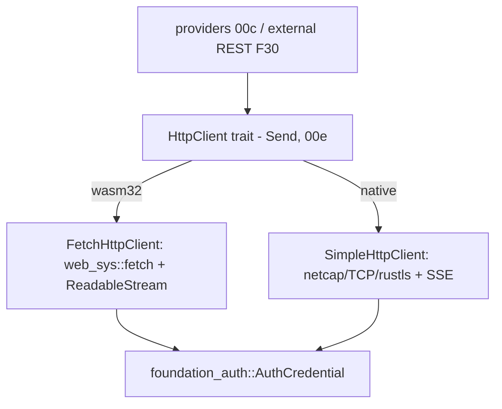

# Feature 00f: wasm `fetch` HTTP client

> **Owns discussion §B1 (user, 2026-06-15) — "build the fetch client now, early."** The outbound HTTP
> **client** is `foundation_netio::simple_http::SimpleHttpClient` and is **native-only** today; this
> feature adds the **wasm32 `fetch` backend** behind the **same client API**, plus **SSE over fetch
> `ReadableStream`**, so the agentic stack can talk to remote model providers + REST vector DBs from
> wasm/CF Workers.

## WHY: Problem Statement

**Grounded in the current code (corrects the earlier "new crate" framing):**
- The HTTP **client** lives in **`foundation_netio`** — `simple_http::client::SimpleHttpClient`
  (`native/client.rs:37`), `ClientRequestBuilder` (`get`/`post`), and SSE via
  `event_source::ReconnectingEventSourceTask`. It is **native-only** (`netcap`/TCP/rustls).
- **`foundation_http` is an HTTP *server* framework** (native TCP + CF Workers serving) — **not** a
  client. So there is **no greenfield "foundation_http client" to create**.
- `foundation_netio` has **no wasm/`fetch` path** today.
- `foundation_ai` providers already consume the native client (`openai_responses_provider.rs:17` uses
  `SimpleHttpClient`, `event_source::ReconnectingEventSourceTask`).

Consequence: on wasm/CF Workers there is **no outbound HTTP**, so built-in remote providers and external
REST vector backends (TurboPuffer, F30) are native-only (the F00c "machinery-only on wasm" caveat). The
fix is a **wasm `fetch` client backend** with a **consistent API** so calling code is identical
native↔wasm (your F30-4 ask).

## WHAT: Solution

### 1. Extract a client trait the native + wasm backends share

Factor the existing `SimpleHttpClient` surface into a small **client trait** (one async `Send` surface per
Item #1 / 00e) so the same calling code drives either backend:

```rust
// foundation_netio::simple_http::client
// request/response + a streaming body for SSE. Send everywhere; on single-threaded wasm the !Send
// fetch future is wrapped via foundation_compact's SendWrapper (00e).
#[foundation_compact::send_async_trait]
pub trait HttpClient {
    async fn send(&self, req: SimpleOutgoingRequest) -> Result<SimpleIncomingResponse, HttpClientError>;
    /// Streaming response body (SSE / chunked) — yields bytes as they arrive.
    async fn send_streaming(&self, req: SimpleOutgoingRequest)
        -> Result<ByteStream, HttpClientError>;
}
```

The existing native `SimpleHttpClient` implements it (no behavior change); a new wasm backend implements
it over `fetch`. Reuse the existing `SimpleOutgoing*`/`SimpleIncoming*`/`SimpleHeaders`/`SendSafeBody`
types (already shared, re-exported by `foundation_http`).

### 2. wasm `fetch` backend

```
foundation_netio/src/simple_http/client/wasm/   (#[cfg(target_arch = "wasm32")])
├── client.rs     — FetchHttpClient: builds a web_sys::Request, awaits fetch(), maps Response
├── stream.rs     — ReadableStream -> ByteStream (SSE/chunked)
└── headers.rs    — SimpleHeaders <-> web_sys::Headers
```

- Request/response: map `SimpleOutgoingRequest` → `web_sys::Request` + `RequestInit`; `await fetch()`;
  map `web_sys::Response` → `SimpleIncomingResponse`.
- **Streaming (SSE):** consume `Response.body()` (`web_sys::ReadableStream`) chunk-by-chunk into a
  `ByteStream` the providers' SSE parser already understands (so `ReconnectingEventSourceTask`'s parse
  logic is reused; only the byte source differs).
- **CF Workers:** `fetch` is available in the Workers runtime; the same backend covers browser + CF.
  (Optionally route through `foundation_wasm`'s host instead of direct `web-sys` — OD-00f-3.)

### 3. Auth + integration

- **Credentials:** reuse **`foundation_auth::AuthCredential`** (already threaded through every provider —
  `types/mod.rs:1458`); the backend sets the auth header. No new credential type.
- **Providers (00c):** anthropic/openai/openai_responses switch from a hard `SimpleHttpClient` to the
  `HttpClient` trait, so they compile + run on wasm. (00c consumes this.)
- **External REST (F30):** the TurboPuffer adapter and any REST vector backend use `HttpClient` → they
  work on wasm too (resolves F30 OD-30-2/30-4 "if it's HTTP we should call it in wasm").

## Architecture



## HOW: Implementation Steps

1. Extract the `HttpClient` trait in `foundation_netio::simple_http::client`; impl it for the existing
   native `SimpleHttpClient` (no behavior change).
2. Define `ByteStream` (streaming body) shared by both backends; adapt the native SSE path to it.
3. wasm `FetchHttpClient`: `web_sys::Request`/`fetch`/`Response` mapping behind `cfg(wasm32)`.
4. wasm streaming: `ReadableStream` → `ByteStream`; wire the existing SSE parser onto it.
5. Headers + body conversions (`SimpleHeaders` ↔ `web_sys::Headers`; `SendSafeBody`).
6. Auth header from `foundation_auth::AuthCredential` in both backends.
7. Point `foundation_ai` providers (00c) at the trait; confirm wasm build.
8. Feature-gate + Cargo wiring (`web-sys`/`js-sys`/`wasm-bindgen-futures` on wasm only; optional
   `foundation_wasm` host path).
9. Tests: native parity (unchanged), wasm req/resp + SSE via the testbed wasm runners (not
   wasm-bindgen-test — F21 ruling); a mock fetch for deterministic unit tests.
10. Author `fundamentals/`.

## Open Decisions

- **OD-00f-1 — trait extraction shape:** minimal `HttpClient { send, send_streaming }` (rec) vs porting
  the full `ClientRequestBuilder` ergonomics to the trait. Rec: minimal trait + keep builders as helpers.
- **OD-00f-2 — streaming type:** reuse an existing `foundation_core`/`netio` byte-stream type for
  `ByteStream` vs a new one. Rec: reuse (the SSE parser already consumes one).
- **OD-00f-3 — wasm host path:** direct `web-sys::fetch` (rec, fewest layers) vs route through
  `foundation_wasm`'s host abstraction (consistent with the executor's JS yielding). Rec: direct
  `web-sys` now; `foundation_wasm` variant behind a feature if it buys uniformity.
- **OD-00f-4 — crate placement:** client stays in **`foundation_netio`** (client home; rec) — `foundation_http`
  remains the server framework. Confirm we are NOT creating a separate client crate.
- **OD-00f-5 — SSE in first cut:** request/response **and** SSE both in v1 (rec — streaming providers
  need SSE) vs req/resp first. Rec: both (the providers are useless without streaming).

## Target Files

- `backends/foundation_netio/src/simple_http/client/` — extract `HttpClient` trait; `wasm/` backend.
- `backends/foundation_netio/Cargo.toml` — wasm deps (`web-sys`/`js-sys`/`wasm-bindgen-futures`) gated.
- coordinates with **00c** (providers consume the trait), **00e** (Send surface), **F30** (external REST),
  `foundation_auth` (credentials).

## Tests

```bash
cargo build -p foundation_netio
cargo build -p foundation_netio --target wasm32-unknown-unknown
cargo test  -p foundation_netio -- simple_http::client
# wasm req/resp + SSE via foundation_testbed runners
```

## Verification

```bash
cargo clippy -p foundation_netio -- -D warnings
cargo build -p foundation_ai --target wasm32-unknown-unknown --no-default-features --features agentic   # providers compile on wasm
```

## Fundamentals Documentation (zero-to-expert) — REQUIRED

Author `fundamentals/` (→ a `foundation_docs` chapter, §B4) covering: the browser/CF `fetch` API &
`RequestInit`; `web_sys`/`js-sys`/`wasm-bindgen-futures`; `ReadableStream` & streaming bodies; SSE
(`text/event-stream`) parsing; mapping a native socket client to a fetch client behind one trait; CORS &
CF Workers fetch specifics; auth header injection. (Task — see list.)

## Done When

- `foundation_netio` exposes one `HttpClient` trait (Send, 00e) with a native (`SimpleHttpClient`) and a
  wasm (`FetchHttpClient`) backend, plus SSE over `ReadableStream`.
- `foundation_ai` providers build + run on `wasm32-unknown-unknown`/CF via the trait (unblocks 00c).
- External REST adapters (F30 TurboPuffer) can run on wasm through the same client.
- Credentials reuse `foundation_auth::AuthCredential`; native behavior unchanged.
- OD-00f-1..5 resolved.
