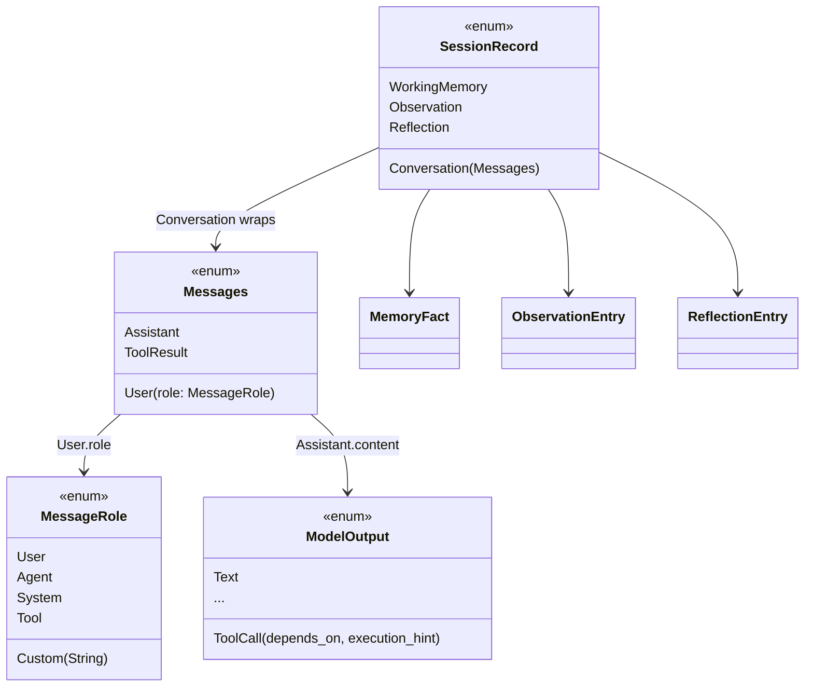

> **Review status (2026-06-14):** reviewed by a context-free agent against live code; mechanical
> corrections folded in. Cross-cutting rulings received: **wasm + `foundation_compact` wiring moved to
> [Feature 00b](../00b-foundation-ai-llama-optional/feature.md)** (OD-6 resolved), and **SessionId folds a
> machine id into the entropy region** (OD-7 resolved). This feature now assumes F00 has landed and
> focuses purely on the type substrate.

# Feature 01: Message Model & Types

> Implements parts of Decision 02 (Message API) and Decision 04 (ToolCall dependency fields).
> Resolves CRIT-04 (ToolShed `others`), CRIT-06 (`MessageRole`), and the type half of TODO #9.
> This feature is **pure type substrate** — no behavior, no Valtron tasks. Every later feature
> depends on these types, so they must be settled first.

## WHY: Problem Statement

The agentic API needs a precise, serializable type vocabulary before any behavior can be built.
Five concrete gaps exist in `foundation_ai::types` today:

1. **`Messages::User.role` is a bare `String`** (`types/mod.rs:895`). The agentic loop must
   distinguish a *human* user from a *system* instruction from *another agent's* steering — all
   of which are routed as `Messages::User` but with different provenance. Stringly-typed roles
   make this error-prone and unsearchable. (CRIT-06)
2. **There is no session-record type for memory.** Working memory, observations, and reflections
   must be persisted to and replayed from the same ordered log as conversation, but they are
   **not** provider messages and must never be sent verbatim to an LLM. No type expresses this.
3. **`ModelOutput::ToolCall` cannot express dependencies** (`types/mod.rs:870`). The ToolCall DAG
   executor (F23) needs the LLM to declare `depends_on` + an `execution_hint`; without schema
   fields the LLM has no way to express ordering. (Decision 04)
4. **`ToolShed.others` exists** (`types/mod.rs:1076`) but the agentic design replaces dynamic
   discovery with the `shed` meta-tool (F21). The field must be removed and the five provider
   `flatten_tools` functions updated. (CRIT-04)
5. **There is no `SessionId` type.** `foundation_compact` exposes `new_scru128() -> Id` and
   `scru128::Id`, but nothing wraps it into a time-ordered, machine-unique, name-derivable
   session identity (Decision 01).

This feature closes all five at the type level, with a complete migration plan for the breaking
changes (#1 and #4 touch every provider).

## WHAT: Solution

### 1. `MessageRole` enum (replaces `Messages::User.role: String`)

```rust
/// Source/provenance of a message. Distinguishes human, agent, system, and tool origins.
///
/// Wire-compatible: serializes to the same lowercase strings providers already expect
/// ("user", "agent", "system", "tool"); unknown values round-trip through `Custom`.
#[derive(Debug, Clone, PartialEq, Eq, Serialize, Deserialize)]
#[serde(rename_all = "lowercase")]
pub enum MessageRole {
    /// Direct human user input.
    User,
    /// Another LLM agent providing guidance/steering (inter-agent).
    Agent,
    /// System prompt / instructions / loop-redirect.
    System,
    /// Tool result context.
    Tool,
    /// Extensibility for unknown/custom roles. Serializes as its inner string.
    #[serde(untagged)]
    Custom(String),
}
```

Bridges to keep provider code terse and preserve existing wire formats:

```rust
impl MessageRole {
    /// Canonical wire string ("user", "agent", "system", "tool", or the custom value).
    pub fn as_wire(&self) -> &str { /* match */ }
}
impl From<&str> for MessageRole { /* "user" => User, ... unknown => Custom */ }
impl From<String> for MessageRole { /* same */ }
impl fmt::Display for MessageRole { /* writes as_wire() */ }
impl Default for MessageRole { fn default() -> Self { MessageRole::User } }
```

`Messages::User` changes from `role: String` to `role: MessageRole`:

```rust
User {
    role: MessageRole,         // was: String
    content: UserModelContent, // unchanged (Text | Image)
    signature: Option<String>, // unchanged
},
```

**Serde compatibility:** `MessageRole` serializes to the identical JSON the `String` field
produced for the four known roles, so already-persisted sessions and provider request/response
bodies are byte-compatible. `Custom("x-foo")` serializes to `"x-foo"` (untagged), matching the
old free-string behavior.

> **Scope note:** `ChatMessage.role: String` (`types/mod.rs:1533`) is a *separate* chat-template
> helper, not a session message. It is **out of scope** here (left as `String`). See Open
> Decision OD-1.

### 2. `SessionId` (scru128 wrapper)

```rust
/// Globally-unique, time-ordered session identity. Newtype over `foundation_compact::Id` (scru128).
#[derive(Debug, Clone, PartialEq, Eq, Hash, Serialize, Deserialize)]
#[serde(transparent)]
pub struct SessionId(foundation_compact::Id);

impl SessionId {
    /// Fresh, time-ordered, machine-attributable id.
    ///
    /// Built via `Id::try_from_fields(timestamp, counter_hi, counter_lo, entropy)`
    /// (`foundation_compact::ids` (was foundation_rng/src/id.rs:80)). The high bits of the `counter_hi` region carry a stable
    /// **machine id** (OD-7), the remainder is random — so ids are globally unique AND
    /// machine-attributable, honoring Decision 01.
    pub fn new() -> Self { /* try_from_fields(now_ms, machine_id<<k | rand, rand, rand) */ }

    /// Deterministic, sortable id derived from a human-friendly name.
    ///
    /// `timestamp` = current 48-bit unix-ms (preserves ordering). The
    /// `counter_hi(24) | counter_lo(24) | entropy(32)` = 80-bit region is filled from
    /// `machine_id` (high bits) + a stable hash of `name` (low bits), so the same name on the
    /// same machine within one millisecond derives the same id, and different machines do not
    /// collide. See OD-2 (intra-ms, same-machine collisions — accepted).
    pub fn from_name(name: &str) -> Self { /* try_from_fields(now_ms, machine_id | hash(name)...) */ }

    pub fn timestamp_ms(&self) -> u64 { self.0.timestamp() } // Id::timestamp(), id.rs

    /// Stable per-machine identifier folded into the entropy region (OD-7).
    /// Derived once from a host signal (see HOW Step 3b); 0 on wasm if no host id is available.
    fn machine_id() -> u32 { /* ... */ }
}

impl fmt::Display for SessionId { /* writes self.0 (scru128 25-char string) */ }
impl FromStr for SessionId { type Err = ParseError; /* parse scru128 via Id::from_str */ }
```

> No `as_str()` — callers use `Display`/`to_string()` (avoids a redundant allocating accessor;
> `Id` already implements `Display`).

A `Scru128` type alias (`pub type Scru128 = foundation_compact::Id;`) is exported for the per-message
ids that later features (F16) attach to stored records, so decision docs that say `Scru128`
resolve to a real type.

> **Cargo wiring done in [Feature 00b](../00b-foundation-ai-llama-optional/feature.md):** the
> `foundation_compact` dependency (with `serde` + per-target RNG features) and the wasm build path are
> F00's responsibility. F01 assumes `foundation_compact::Id` and a working `try_from_fields` are
> available on both targets.

### 3. `ModelOutput::ToolCall` dependency fields

```rust
ToolCall {
    id: String,
    name: String,
    arguments: Option<HashMap<String, ArgType>>,
    signature: Option<String>,
    // NEW (Decision 04):
    #[serde(default)]
    depends_on: Vec<String>,        // ids of tool calls this one depends on
    #[serde(default)]
    execution_hint: ExecutionHint,  // parallel | sequential | unspecified
},
```

```rust
#[derive(Debug, Clone, Copy, PartialEq, Eq, Serialize, Deserialize, Default)]
#[serde(rename_all = "lowercase")]
pub enum ExecutionHint {
    #[default]
    Unspecified, // ToolCallManager decides (F23)
    Parallel,    // run with other independent calls
    Sequential,  // run after depends_on completes
}
```

`#[serde(default)]` means existing serialized tool calls (without these fields) deserialize with
`depends_on: []` and `execution_hint: Unspecified` — **non-breaking on the wire**. The fields are
also surfaced into the tool **JSON schema** sent to the LLM, but that schema generation lives in
F21 (ToolShed); F01 only adds the data fields.

### 4. Remove `ToolShed.others`

```rust
pub struct ToolShed {
    pub shed: Tool,                       // always present (the meta-tool)
    pub memory: Option<MemoryTool>,
    pub delegate: Option<DelegationTool>,
    pub read: Tool,
    pub edit: Tool,
    pub write: Tool,
    pub search: Tool,
    pub bash: Option<Tool>,
    // REMOVED: pub others: Option<Vec<Tool>>,
}
```

Dynamic/extra tools are discovered via the `shed` meta-tool (F21), not carried inline. The five
provider `flatten_tools(shed: &ToolShed) -> Vec<Tool>` functions each have an
`if let Some(others) = &shed.others { ... }` block that must be deleted. (See Migration Surface.)

### 5. Agentic session-record types (KEY DESIGN — see OD-3)

Memory snapshots must live in the same ordered, replayable log as conversation, but they are not
provider messages. **Recommended approach: a wrapper enum** that keeps `Messages` provider-pure:

```rust
/// One entry in a session's ordered record log. Either a real conversation message
/// (sent to / received from the model) or an agentic memory snapshot (persisted + replayed,
/// never sent verbatim to a provider).
///
/// Internally tagged with `message_type` (matches Decision 03's tag key). `Conversation` is a
/// **struct variant** (not a newtype) because serde internal tagging cannot wrap a newtype
/// variant — verified design constraint, not a stylistic choice.
#[derive(Debug, Clone, PartialEq, Serialize, Deserialize)]
#[serde(tag = "message_type", rename_all = "snake_case")]
pub enum SessionRecord {
    /// A provider-facing message (user/assistant/tool-result).
    Conversation { message: Messages },

    /// Permanent curated facts about the user/session (Decision 03, Tier 1).
    WorkingMemory { facts: Vec<MemoryFact>, version: u64, timestamp: SystemTime },

    /// Time-scoped structured observations (Decision 03, Tier 2).
    Observation { observations: Vec<ObservationEntry>, token_count: u64, timestamp: SystemTime },

    /// Condensed reflections over observations (Decision 03, Tier 3).
    Reflection {
        reflections: Vec<ReflectionEntry>,
        generated_at: SystemTime,
        observation_token_count_before: u64,
        reflection_token_count_after: u64,
    },
}
```

> **Timestamp policy (resolved — ED-B):** all agentic types use `std::time::SystemTime`, matching
> the **existing** `Messages::Assistant.timestamp: SystemTime` (`types/mod.rs:901`). Decision 03's
> ISO-8601 strings are illustrative, not binding — no chrono dependency is added. `SystemTime`
> serializes via serde's default (`{secs_since_epoch, nanos_since_epoch}`); fixtures in Test 7 use
> that form, not ISO. If a human-readable wire format is later required it is a crate-wide change,
> out of scope for F01.

Supporting entry types (all derive `Debug, Clone, PartialEq, Serialize, Deserialize`; optional
fields use `#[serde(skip_serializing_if = "Option::is_none")]` to reproduce Decision 03's omitted
keys). Note `SessionRecord` derives **only** `PartialEq` (no `Eq`/`Hash`) — matching `Messages`,
which also omits them — so the `f32` fields below raise no `Eq`/`Hash` conflict.

```rust
pub struct MemoryFact {
    pub fact: String,
    pub asserted_at: SystemTime,
    #[serde(skip_serializing_if = "Option::is_none")]
    pub source_message_id: Option<Scru128>,
    pub confidence: f32,
}

pub struct ObservationEntry {
    #[serde(rename = "type")]
    pub kind: ObservationKind,            // assertion | question (snake_case)
    pub content: String,
    pub timestamp: SystemTime,
    #[serde(skip_serializing_if = "Option::is_none")]
    pub source_message_id: Option<Scru128>,
    #[serde(skip_serializing_if = "Option::is_none")]
    pub scope: Option<String>,
}
#[derive(Debug, Clone, PartialEq, Serialize, Deserialize)]
#[serde(rename_all = "snake_case")]
pub enum ObservationKind { Assertion, Question }

pub struct ReflectionEntry {
    pub summary: String,
    #[serde(skip_serializing_if = "Option::is_none")]
    pub time_range: Option<TimeRange>,    // {"from":..,"to":..}, not a 2-tuple (matches Decision 03)
    pub observation_refs: Vec<Scru128>,
    pub importance: f32,
}

pub struct TimeRange { pub from: SystemTime, pub to: SystemTime }
```

**Why a wrapper instead of new `Messages` variants (as Decision 02 sketched):** adding
`WorkingMemory`/`Observation`/`Reflection` directly to `Messages` would force **every** provider
`match self { ... }` (generate, stream, format, costing) to handle variants that must never reach
a provider — churn across all 5 backends with a constant "unreachable/skip" arm. The wrapper keeps
`Messages` exactly provider-shaped, isolates agentic concerns, and gives the Message API (F16) a
single clean log element. This is flagged as **OD-3** for the reviewer to confirm/override.

### Type Relationships



## Migration Surface (re-verified after review)

| Change | Exact sites | Action |
|--------|-------------|--------|
| `MessageRole` replaces `role: String` | **Only 3 real construction sites** that set `role`: `costing.rs:378`, `costing.rs:422` (test), `openai_responses_provider.rs:1485` (test). All read sites destructure `Messages::User { content, .. }` and are unaffected. **Do NOT touch** unrelated wire structs (`OpenAIMessage.role`, `AnthropicRole`, `ChatMessage.role:1533`) or `candle.rs`/`llamacpp.rs` (0 role sites). | Construct `MessageRole::User` (or `MessageRole::from("user")`) |
| Remove `ToolShed.others` | struct def `types/mod.rs:1076`; `fn flatten_tools` at `openai_provider.rs:1619`, `openai_responses_provider.rs:1290`, `anthropic_messages_provider.rs:1242`, `candle.rs:908`, `llamacpp.rs:693`; `if let Some(others)` blocks at `:1640 / :1311 / :1263 / :929 / :714` respectively | Delete field + each `others` block |
| `ToolCall` new fields | The real `ModelOutput::ToolCall { .. }` construction sites (tool-call extraction): `anthropic_messages_provider.rs` (~750/1200/1328/1520), `openai_provider.rs` (~757/1161/1760/2005), `openai_responses_provider.rs` (~1072/1142), `llamacpp.rs` (~792), `types/mod.rs` (~1308). Provider **wire** structs (`OpenAIToolCall`, `AccumulatedToolCall`) are separate and need no change. | Add explicit `depends_on: Vec::new(), execution_hint: ExecutionHint::default()` — **not** `..Default::default()` (illegal on enum variants) |
| New types | new `types/agentic.rs` (re-exported) | Add `SessionRecord`, entry types, `SessionId`, `Scru128`, `TimeRange`; `ExecutionHint` lives in `types/mod.rs` next to `ModelOutput` |

> Line numbers are guidance; the implementer re-greps before editing (`grep -n "ModelOutput::ToolCall {"`).

## HOW: Implementation Steps

### Step 0 — Prerequisite check
Confirm [Feature 00b](../00b-foundation-ai-llama-optional/feature.md) has landed: `foundation_compact` is a dep
(serde + per-target RNG) and `foundation_ai` builds native + wasm. F01 does not touch `Cargo.toml`.

### Step 1 — `MessageRole`
Add the enum + serde + `From<&str>`/`From<String>`/`Display`/`Default`/`as_wire` bridges in
`types/mod.rs`. Unit-test serde round-trips for all four known roles + a `Custom` value, asserting
the JSON equals the old string form.

### Step 2 — Migrate `Messages::User.role`
Change the field type. Then fix each construction/read site (Migration Surface row 1). Prefer
`MessageRole::from(existing_str)` at provider boundaries so request/response mapping is mechanical.

### Step 3 — `SessionId` + `Scru128`
Add the newtype, `new()`, `from_name()`, `Display`/`FromStr`/serde(transparent), and the
`Scru128` alias. Implement `from_name` derivation (Step 3a) and test ordering: ids minted later
sort after earlier ones; `from_name("x")` is stable within a millisecond.

### Step 3a — `from_name` derivation
Use `Id::try_from_fields(now_ms, counter_hi, counter_lo, entropy)`. Pack `machine_id()` into the
high bits of `counter_hi`; fill the remaining ~48 bits from a stable hash (`foundation_compact` hash or
`xxhash`) of `name`. Same name + same machine + same ms ⇒ same id (OD-2, accepted).

### Step 3b — `machine_id()`
Derive a stable `u32` once per process from a host signal: native = hash of hostname /
machine-id file / MAC; wasm = a persisted random value (or 0 if none). Fold into the entropy region
of both `new()` and `from_name()` so ids are machine-attributable (OD-7). Document the wasm
fallback explicitly.

### Step 4 — `ModelOutput::ToolCall` fields
Add `depends_on` + `execution_hint` with `#[serde(default)]`; add `ExecutionHint`. Fix each real
tool-call construction site (Migration Surface row 3) by adding explicit
`depends_on: Vec::new(), execution_hint: ExecutionHint::default()`. **Do not** use
`..Default::default()` (functional-update syntax is invalid for enum variants). Round-trip test:
old JSON (no fields) deserializes to empty/`Unspecified`.

### Step 5 — Remove `ToolShed.others`
Delete the field; delete the five `flatten_tools` `others` blocks. Confirm `flatten_tools` still
compiles and returns the fixed shed tools. (The `shed` meta-tool itself is F21.)

### Step 6 — Agentic record types
Add `SessionRecord` + `MemoryFact`/`ObservationEntry`/`ObservationKind`/`ReflectionEntry` (new
`types/agentic.rs`, re-exported from `types`). Serde round-trip tests for each variant against the
Decision 03 JSON shapes.

### Step 7 — Exports & docs
Re-export new public types from the crate root with `///` docs (WHY/WHAT/HOW per house standard).

## Open Decisions

Resolved during review (recommendation taken; override if desired):
- **OD-1 — `ChatMessage.role`:** keep `String` (template helper, maps to provider wire roles, not
  a session record). **Resolved: keep String.**
- **OD-3 — wrapper vs inline `Messages` variants:** **Resolved: `SessionRecord` wrapper** keeps
  `Messages` provider-pure (reviewer concurred — inline would force "skip" arms across 5 providers).
- **OD-4 — module placement:** **Resolved: new `types/agentic.rs`**, re-exported, to avoid
  bloating the ~1600-line `types/mod.rs` (`ExecutionHint` stays in `types/mod.rs` by `ModelOutput`).
- **OD-5 — `depends_on` referential integrity:** **Resolved: F23 (executor) validates**; F01
  carries data only.
- **ED-B (timestamp policy):** **Resolved: `SystemTime` crate-wide** (matches existing
  `Messages::Assistant`); Decision 03 ISO strings are illustrative.

Resolved by user ruling (2026-06-14):
- **OD-6 — wasm scope:** **Resolved → [Feature 00b](../00b-foundation-ai-llama-optional/feature.md).** The
  agentic layer is a feature-gated subset (`--no-default-features --features agentic`) that builds
  on wasm with native model backends excluded. F01 assumes F00 landed.
- **OD-7 — machine identity:** **Resolved → fold a machine id into the entropy region** (honors
  Decision 01's "machine-attributable" property). See SessionId `new()`/`from_name()` + Step 3b.

Minor, recommendation taken:
- **OD-2 — `from_name` intra-ms collisions:** **Accepted** — same name + same machine + same
  millisecond deriving the same id is fine (names are user labels; cross-machine collisions are
  eliminated by the machine id from OD-7).

## Target Files

- `backends/foundation_ai/src/types/mod.rs` — `MessageRole`, `Messages::User`, `ModelOutput::ToolCall`, `ExecutionHint`, `ToolShed`
- `backends/foundation_ai/src/types/agentic.rs` — **new** — `SessionRecord`, `SessionId`, `Scru128`, memory entry types
- `backends/foundation_ai/src/costing.rs` — `role:` migration
- `backends/foundation_ai/src/backends/{llamacpp,candle,openai_provider,openai_responses_provider,anthropic_messages_provider}.rs` — `role:` migration, `flatten_tools` `others` removal, `ToolCall` field defaults
- `backends/foundation_ai/src/lib.rs` — re-exports

## Tests

```bash
cargo test -p foundation_ai -- types::message_role
cargo test -p foundation_ai -- types::session_id
cargo test -p foundation_ai -- types::tool_call_deps
cargo test -p foundation_ai -- types::session_record
cargo test -p foundation_ai -- toolshed_flatten
```

Test cases (minimum):
1. `MessageRole` serde round-trips to legacy strings for User/Agent/System/Tool; `Custom` is transparent.
2. `Messages::User` with each role serializes/deserializes unchanged vs legacy fixtures.
3. `SessionId::new()` ordering: later ids sort after earlier ids.
4. `SessionId::from_name("fix-bug")` stable within a millisecond; parses via `FromStr`.
5. `ToolCall` legacy JSON (no dep fields) deserializes to `depends_on: []`, `Unspecified`.
6. `ExecutionHint` serde lowercase round-trip.
7. Each `SessionRecord` variant round-trips against Decision 03 JSON shapes.
8. `flatten_tools` compiles without `others` and returns the fixed shed tools.

## Verification

```bash
cargo build -p foundation_ai
cargo clippy -p foundation_ai -- -D warnings
cargo fmt -- --check
cargo test -p foundation_ai
# wasm build is gated on OD-6 — only add once the wasm scope/feature-gating is decided:
# cargo build -p foundation_ai --features <agentic-wasm-subset> --target wasm32-unknown-unknown
```

## Fundamentals Documentation (zero-to-expert) — REQUIRED

Author `fundamentals/` covering: enum-based domain modeling in Rust; `serde` representations
(externally/internally/adjacently tagged, `untagged`, `rename`, `skip_serializing_if`) and wire
compatibility; scru128/time-ordered IDs & newtype wrappers; designing breaking type changes +
migration without breaking persisted data; `SystemTime` serde. (Task — see list.)

## Done When

- All five type changes land; `foundation_ai` builds native; clippy clean.
- (Per OD-6) wasm build of the agreed subset succeeds — or wasm is explicitly deferred.
- Legacy JSON fixtures still deserialize (serde compatibility proven by tests).
- No `ToolShed.others` references remain (`grep -rn "\.others" backends/foundation_ai` is clean).
- `foundation_compact` dependency present (via Feature 00).
- All Open Decisions resolved (OD-1..OD-7, ED-B) and folded into this file.
