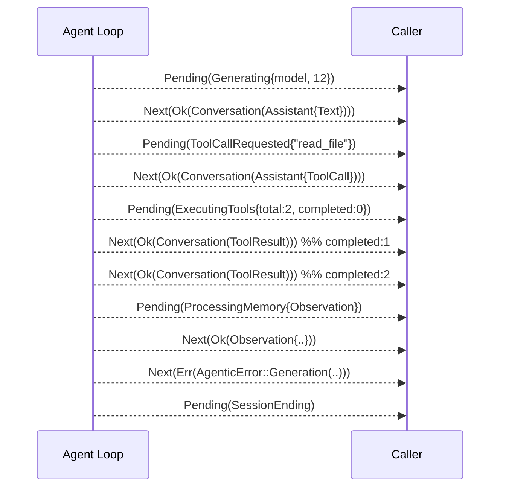

# Feature 02: Agent Stream & Progress Contract

> **Review status (2026-06-14):** reviewed against live valtron + F01. Fixes folded: F01
> `Conversation` is a **struct variant** `{ message }`; the expect-next protocol is **advisory**
> (executor interleaves `Ignore`/`Wait`/`Delayed`; `Spread` multiplexes `Next`); streaming-partials
> decision added; `AgenticError` trait bounds pinned; session-final payload restored; `&'static str`
> → `Cow`. The `agentic` cargo feature is created by 00b (the wasm-surface marker); the agentic
> *code* lives unconditionally in `types/agentic.rs`/`agentic/` (per F01), not behind that feature.

> Implements Decision 11's streaming surface and resolves **TODO #9** ("what happened to the rich
> `Messages`? carry it on the stream, not thin events"). Pure contract + types; the loop that
> *produces* this stream is F27. Defines what every caller of `run_turn_stream` observes.

## WHY: Problem Statement

Decision 11's first draft modelled streaming as a big `AgentEvent` enum with
`MessageStart`/`MessageUpdate`/`MessageEnd`/`ToolCallStart`/… variants that **duplicated** the
content already in `foundation_ai`'s rich `Messages`. That is redundant and lossy.

The model layer already got this right: generation streams as
`StreamIterator<D = Messages, P = ModelState>` (`types/mod.rs:1438`) — the **rich `Messages`** ride
on `Stream::Next`, and thin status (`ModelState::{GeneratingTokens, Finished, Error}`) rides on
`Stream::Pending`. The agentic loop must **mirror** this one level up, not reinvent a parallel event
taxonomy.

Two more constraints:
- **Errors** must flow without a new `Stream` variant — `Stream<D,P>` has none (verified). So `D`
  carries a `Result` (CRIT-05 resolution).
- **Memory records** (working/observation/reflection) are produced mid-loop and should be observable
  too — they are already modelled by F01's `SessionRecord`.

## WHAT: Solution

### The stream type

```rust
// The agentic loop is a TaskIterator; consumers see a StreamIterator of:
StreamIterator<D = Result<SessionRecord, AgenticError>, P = AgentProgress>
```

- **`Stream::Next(Ok(SessionRecord))`** — the rich record: `Conversation { message: Messages }` for
  assistant/tool-result/user, or `WorkingMemory`/`Observation`/`Reflection` when memory is generated.
  `SessionRecord::Conversation` (a **struct variant** per F01) wraps the exact `Messages` the model
  layer produces.
- **`Stream::Next(Err(AgenticError))`** — an error (no new `Stream` variant; `AgenticError` is F30).
- **`Stream::Pending(AgentProgress)`** — a thin status signal: lifecycle + progress only, **no
  content**. It tells the consumer *what kind of `Next` to expect* (the "expect-next" protocol).

> **OD-02-1 (carries to the user):** `D = Result<SessionRecord, _>` vs `D = Result<Messages, _>`.
> `SessionRecord` is the superset (conversation **and** memory records on one stream); a
> conversation-only consumer matches `SessionRecord::Conversation { message }`. The alternative — `Messages`
> on `Next`, memory visible only via `Pending` signals — is closer to the literal TODO #9 wording
> but hides the generated memory content. **Recommendation: `SessionRecord`.** Flag for the user.

### `AgentProgress` — thin status signals (the only "events")

```rust
/// Lifecycle + progress. Carries NO message content (that's on Stream::Next). Each variant is an
/// ADVISORY hint about a forthcoming `Stream::Next` (not a framing guarantee — see protocol).
#[derive(Debug, Clone, PartialEq, Serialize, Deserialize)]
#[non_exhaustive]
pub enum AgentProgress {
    /// Loading context/memory; hint: recalled records or first assistant record.
    Initializing { step: Cow<'static, str> },
    /// Model is generating; hint: Conversation{Assistant Text|Thinking}.
    /// `tokens_so_far` = None until providers emit partial usage (today they don't — OD-02-4).
    Generating { model: ModelId, tokens_so_far: Option<u64> },
    /// Assistant requested a tool; hint: Conversation{Assistant content=ToolCall}.
    ToolCallRequested { name: String },
    /// Tools executing; hint: Conversation{ToolResult} (one per completion).
    ExecutingTools { total: usize, completed: usize },
    /// A tool call was cancelled by steering (so ExecutingTools consumers don't deadlock).
    ToolCallCancelled { id: String },
    /// Memory generation running; hint: Observation|Reflection|WorkingMemory record.
    ProcessingMemory { kind: MemoryKind },
    /// Flushing buffered records to storage; no Next follows from this.
    FlushingRecords { count: usize },
    /// Steering/interruption being applied; hint: Conversation{User role=System|Agent}.
    Steering { source: Cow<'static, str> },
    /// Turn/loop is ending; the final summary record (below) is emitted just before stream end.
    SessionEnding,
}

#[derive(Debug, Clone, PartialEq, Serialize, Deserialize)]
#[non_exhaustive]
pub enum MemoryKind { Working, Observation, Reflection }
```

> **Session-final payload (restores Decision 11's `SessionEnd { message_count }`):** before the
> stream ends (`Iterator::next() → None`), the loop emits a terminal
> `SessionRecord::Conversation`-adjacent summary — **OD-02-6**: either a dedicated
> `SessionRecord::Summary { message_count, usage: TokenSnapshot }` variant (cleanest; add to F01) or
> the caller aggregates. Recommendation: add a `Summary` record so consumers get totals without
> re-summing. `ToolCallCancelled` above closes the steering/deadlock gap the review flagged.

This **replaces** Decision 11's `AgentEvent` enum entirely. There is no `MessageStart/Update/End` —
streaming token deltas are the model layer's concern (it already yields incremental `Messages` /
`ModelState::GeneratingTokens`); the agent loop forwards them.

### The "expect-next" protocol

A `Stream::Pending(AgentProgress::X)` is a promise about the subsequent `Stream::Next`:



**The protocol is ADVISORY, not a framing guarantee.** The executor freely interleaves `Ignore`,
`Wait`, and `Delayed` between any `Pending` and the eventual `Next` (`ConcurrentQueueStreamIterator`,
`streams.rs:370-398`); a single delivery point can emit **multiple** `Next` via `TaskStatus::Spread`
(`task.rs:217-227`); and a `Next(Err)` may substitute for the promised record. Therefore consumers
**must key off the record/error content of each `Next`, not item adjacency** — a UI updates its
"calling tool X" label on the `Pending` hint but must not assume the immediately-following item is
the promised record. Content-only callers ignore `Pending` entirely.

### Mapping to valtron `TaskStatus`

The agent loop (F27) is a `TaskIterator`; its statuses convert to the stream above
(`TaskStatus → Stream` is valtron-provided):

Verified against `From<TaskStatus> for Stream` (`task.rs:207-231`):

| TaskStatus | Stream | Meaning |
|-----------|--------|---------|
| `Ready(Ok(SessionRecord))` | `Next(Ok(record))` | a record produced |
| `Ready(Err(AgenticError))` | `Next(Err(e))` | an error |
| `Pending(AgentProgress)` | `Pending(progress)` | status |
| `Spread(vec)` | `Spread(vec)` | **multiple** records/progress at one delivery point (e.g. batch tool results) |
| `Init` | `Init` | session bootstrapping |
| `Ignore` | `Ignore` | polled queues, nothing to emit |
| `Wait` | `Wait` | yield to the JS event loop (wasm) |
| `Delayed(d)` | `Delayed(d)` | rate-limit / cooperative wait |
| `Spawn(_)` | `Ignore` | spawned a sub-task; nothing to emit this tick |
| `Depends(sig)` | `Ignore` | waiting on a readiness signal (F25) |

So `TaskIterator::Ready = Result<SessionRecord, AgenticError>`, `Pending = AgentProgress` (the
producer is a `TaskIterator` with `Ready`/`Pending`/`Spawner`; `StreamIterator` `D`/`P` is the
consumer-facing view after `into_stream_iter()`).

> **`AgenticError` trait-bound contract (pin now, F30 owns the type):** `Stream<D,P>`/`TaskStatus`
> only derive `PartialEq`/`Clone`/`Debug` when `D`/`P` do (`streams.rs:77`, `task.rs:142-150`). F01's
> `SessionRecord` is `Clone + PartialEq + Debug` (no `Eq`/`Hash`). So **`AgenticError` must be
> `Clone + PartialEq + Debug`** or the whole agent stream loses those derives. F30 must honor this.

### Relationship to the model stream

The loop wraps the model's `Stream<Messages, ModelState>` and lifts it:
- `model Next(Messages)` → `agent Next(Ok(SessionRecord::Conversation { message }))`
- `model Pending(ModelState::GeneratingTokens(_))` → `agent Pending(AgentProgress::Generating{..})`
  (note: providers currently emit `GeneratingTokens(None)` — no partial usage — so `tokens_so_far`
  updates only at turn boundaries unless providers are changed; see OD-02-4)
- `model Pending(ModelState::Error(s))` → `agent Next(Err(AgenticError::Generation(..)))`

> **Streaming partials (OD-02-5):** the model yields *incremental* `Messages` as tokens arrive. The
> loop must decide: forward each partial as its own `Conversation` record (consumer sees N partials
> then a final), or coalesce and emit one final `Conversation` per turn (partials visible only via
> `Pending`). **Recommendation: coalesce** — emit one final `SessionRecord::Conversation` per model
> turn; surface streaming progress via `AgentProgress::Generating`. If partials are forwarded, add a
> `final: bool`/sequence marker. This is the literal heart of TODO #9 — confirm.

## HOW: Implementation Steps

1. Define `AgentProgress` + `MemoryKind` in `foundation_ai::agentic` (new module).
2. Define the loop's associated types: `type Ready = Result<SessionRecord, AgenticError>;
   type Pending = AgentProgress;` (the `AgenticError` shell may be a forward-declared stub until F30).
3. Document the expect-next protocol next to `AgentProgress` (each variant's doc states its Next).
4. Provide a `From<ModelState> for AgentProgress` and a helper lifting model
   `Stream<Messages, ModelState>` items into the agent stream (used by F27).
5. Unit-test the lift mapping (model item → agent item) and serde of `AgentProgress`.

## Open Decisions

- **OD-02-1 (user):** `SessionRecord` vs `Messages` as `Next`'s payload (see above). Rec: `SessionRecord`.
- **OD-02-2:** `tokens_so_far` source — **Resolved → `Option<u64>`**, `None` until providers thread
  partial usage. (Related: OD-02-4.)
- **OD-02-3:** `#[non_exhaustive]` — **Resolved → applied to both `AgentProgress` and `MemoryKind`.**
- **OD-02-4:** providers emit `GeneratingTokens(None)` today (verified) — change them to emit
  `Some(usage)` for live `tokens_so_far`, or accept turn-boundary-only updates? Rec: turn-boundary
  now; partial-usage is a separate provider enhancement.
- **OD-02-5 (user — heart of TODO #9):** forward streaming partials as N `Conversation` records, or
  **coalesce** to one final per turn? Rec: coalesce.
- **OD-02-6:** add `SessionRecord::Summary { message_count, usage }` (to F01) for the session-final
  payload, or have callers aggregate? Rec: add `Summary`.
- **OD-02-7 (dependency):** `AgenticError` (F30) is a forward-ref; until F30 lands, F02 uses a local
  stub with the pinned bounds (`Clone + PartialEq + Debug`). Track F30 as a soft dependency.

## Target Files

- `backends/foundation_ai/src/agentic/mod.rs` (new) — `AgentProgress`, `MemoryKind`, the stream type alias, the lift helper
- references F01 (`SessionRecord`), F30 (`AgenticError` — stub/forward until then)

## Tests

```bash
cargo test -p foundation_ai -- agentic::progress
cargo test -p foundation_ai -- agentic::stream_lift
```

## Verification

```bash
cargo build -p foundation_ai
cargo build -p foundation_ai --no-default-features --features agentic --target wasm32-unknown-unknown
cargo clippy -p foundation_ai -- -D warnings
cargo test -p foundation_ai
```

## Fundamentals Documentation (zero-to-expert) — REQUIRED

Author `fundamentals/` covering: valtron's `Stream`/`TaskIterator` execution model & `TaskStatus`
→`Stream` mapping; streaming protocols (token deltas, SSE); **advisory vs framed** streaming
contracts; error-in-stream (`Result` payload) vs side channels; `Spread` multiplexing; how the agent
loop mirrors the model layer; trait-bound propagation (`Clone`/`PartialEq`) through generic streams.
(Task — see list.)

## Done When

- `AgentProgress` + the `Result<SessionRecord, AgenticError>` / `AgentProgress` stream contract are
  defined and documented with the expect-next protocol.
- The model-stream lift mapping exists and is tested.
- No `AgentEvent`-style content-duplicating enum is introduced (TODO #9 honored).
- OD-02-1..3 resolved.
