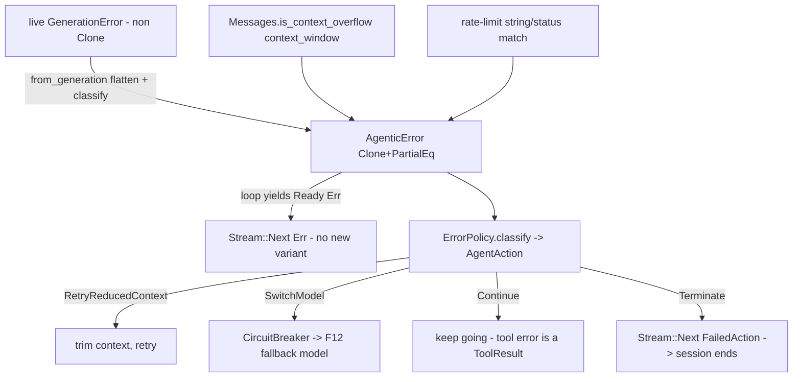

# Feature 02: Error Handling

> **Review status (2026-06-14) — self-review against code (subagent unavailable):**
> 1. **`AgenticError` MUST be `Clone + PartialEq + Debug + Serialize + Deserialize`** — errors now flow
>    as a **record, not a `Result`**: F03's stream is pure `D = SessionRecord`, and failures are carried
>    by `SessionRecord::FailedAction { error: AgenticError, trace: StructuredErrorTrace }` (F01 §5, OD-1-FA). Because
>    `SessionRecord` derives `Clone + PartialEq + Debug + Serialize + Deserialize` for **all** variants,
>    `AgenticError` must derive the same set. `Clone + PartialEq + Debug` is required by the
>    `Stream`/`TaskStatus` machinery + tests (F03: "`AgenticError` trait bounds pinned"); **`Serialize +
>    Deserialize` is newly required** so the enclosing `FailedAction` variant derives cleanly. All
>    agentic errors are `foundation_errstacks` errors (user, 2026-06-15): the live `ErrorTrace`/`Report`
>    is `Serialize`-only, so `FailedAction` stores its **owned structured projection**
>    `StructuredErrorTrace` (via `to_structured()`, `Clone + Debug + Serialize + Deserialize`; add
>    `PartialEq` upstream — F01 OD-1-FA), while `AgenticError` itself is the matchable taxonomy/context
>    type carried alongside. This is the HARD constraint that reshapes Decision 16's design — and it makes
>    OD-02-1 (String-flatten the non-`Clone` generation failure) doubly necessary: a flattened
>    `{ kind, message: String }` context is what makes `AgenticError` `Clone + PartialEq + Serialize` in
>    the first place. `AgenticError` is the `C` in `ErrorTrace<C>`/`Report<C>`; F02 builds its errors
>    with `foundation_errstacks` (declare `serde` + `to_structured` features).
> 2. **Decision 16's `#[from] GenerationError` BREAKS the derive.** The real `GenerationError`
>    (`errors/mod.rs:18-69`) is **NOT `Clone` and NOT `PartialEq`** — it wraps `BoxedError` (:22), live
>    `llama.cpp` error types (`LlamaCppError`, `DecodeError`, …), and `candle_core::Error`. You **cannot**
>    `#[from] GenerationError` into a `Clone+PartialEq` enum. **OD-02-1 (load-bearing):** `AgenticError`
>    must store a **`String`-flattened** generation failure (a `GenerationFailure { kind: GenKind, message:
>    String }`) captured at the boundary, NOT the live `GenerationError`. Same applies to `StorageError`,
>    `VectorStoreError`, `EmbeddingError`, `ToolCallingError` if any are non-`Clone`/non-`PartialEq` —
>    audit each; flatten the ones that don't derive. Flag for the user (departs from Decision 16's
>    `#[from]` design).
> 3. **`GenerationError` has NO `ContextOverflow` or `RateLimit` variant** (verified: the enum is
>    `Failed/LlamaCpp/Tokenization/.../Backend/Generic`, :19-69). Decision 16 `handle_error` matches
>    `GenerationError::ContextOverflow` / `::RateLimit` (lines 132-135) — **those don't exist.** Two real
>    options (requirements §5): (a) **detect** via `Messages::is_context_overflow(context_window)`
>    (verified at `types/mod.rs:967`, takes `context_window: u64`) for overflow, and a rate-limit
>    `RateLimiterStore`/error-string match for 429s; or (b) ADD `ContextOverflow`/`RateLimit` variants to
>    `GenerationError`. **Rec: (a) detect** — `is_context_overflow` already encodes every provider's
>    overflow patterns; F02 classifies into its own `GenKind::{ContextOverflow, RateLimit, Other}` at the
>    boundary. (OD-02-2.)
> 4. **Errors propagate as `Stream::Next(SessionRecord::FailedAction{ error, trace })`** — a record, NOT
>    a `Result`, and NO new `Stream` variant (`Stream<D,P>` has none, verified F03). The agent loop (F19)
>    yields `TaskStatus::Ready(SessionRecord::FailedAction{ error, trace })` where `error: AgenticError`
>    is the kind and `trace: StructuredErrorTrace` is the serializable errstack chain (F01 §5/OD-1-FA).
>    Decision 16 §Error Propagation, as amended by F03 OD-03-1.
> 5. **Retry/resilience is owned by model + tool tasks, NOT the loop** (Decision 16 §Error Ownership):
>    model task retries rate-limit/network internally (backoff); tool retry is F11's `ToolRetryConfig`
>    (non-blocking `Delayed`, F11 OD-11-4). F02 owns the **taxonomy + classification + circuit-breaker
>    decision**, not the per-call retry loops.
> 6. **Circuit breaker switches model via F12** (Decision 16 §Circuit Breaker): after
>    `circuit_breaker_threshold` consecutive generation failures, pick the next `fallback_models` entry
>    through the router (F12). The `handle_error` → `AgentAction{ Continue / RetryWithReducedContext /
>    SwitchModel / Terminate }` dispatcher (Decision 16 line 170) lives here; F19 executes the action.
>    `AgentAction` carries no non-`Clone` payload (it references model ids / the error).
> 7. **Tool errors do NOT become `FailedAction` records** — they are `Messages::ToolResult{ error_detail }`
>    back to the LLM (Decision 16 §Error Surfacing; already handled in F11). Only generation/auth/loop/
>    unexpected surface as `Next(SessionRecord::FailedAction)`. The taxonomy still has an `AgenticError::ToolCall` variant for
>    the rare case a tool failure must terminate (non-recoverable), but the default path is LLM-visible.

> Implements Decision 16 (error handling), corrected for the real (non-`Clone`) underlying errors. Owns
> the `AgenticError` taxonomy (`Clone+PartialEq+Debug+Serialize+Deserialize`, the context `C` in
> `foundation_errstacks::ErrorTrace<C>`, flattening non-`Clone` sources at the boundary),
> `SessionRecord::FailedAction` propagation, the missing-overflow/rate-limit resolution via detection, the
> `AgentAction` classifier, and the circuit-breaker model fallback. Retry stays in model/tool tasks.

## WHY: Problem Statement

The loop spans LLM, tools, memory, storage, auth — each failing differently. The stream carries errors
as `Next(SessionRecord::FailedAction{ error: AgenticError, trace: StructuredErrorTrace })`, which forces
`AgenticError: Clone + PartialEq + Debug + Serialize + Deserialize` (F03/F01). But the real
`GenerationError` is neither `Clone` nor `PartialEq` and lacks the `ContextOverflow`/`RateLimit`
variants Decision 16 pattern-matches on. So the unified error type can't just `#[from]` the platform
errors — it must flatten them at the boundary and classify overflow/rate-limit by detection. This
feature builds that corrected error layer.

## WHAT: Solution

```rust
// backends/foundation_ai/src/agentic/errors.rs
#[derive(Debug, Clone, PartialEq)]          // the F03 stream constraint
pub enum AgenticError {
    Generation(GenerationFailure),          // flattened — NOT #[from] GenerationError (non-Clone)
    ToolCall { tool_name: String, reason: String },
    ToolNotAuthorized { tool_name: String, user: UserId },
    MessageStore(String),                   // flatten StorageError if non-Clone (OD-02-1)
    Memory(String),
    VectorStore(String),
    Embedding(String),
    Session(String),
    Queue(String),
    LoopDetected(LoopDetection),            // F17 — Clone+PartialEq (ensured there)
    Auth(AuthError),                        // F18 — Clone+PartialEq (ensured there)
    Budget { limit: u64 },
    Unexpected(String),
}

#[derive(Debug, Clone, PartialEq)]
pub struct GenerationFailure { pub kind: GenKind, pub message: String }

#[derive(Debug, Clone, Copy, PartialEq, Eq)]
pub enum GenKind { ContextOverflow, RateLimit, Provider, Network, Other }

impl AgenticError {
    /// Boundary constructor: flatten a live GenerationError + classify overflow/rate-limit (OD-02-2).
    pub fn from_generation(e: &GenerationError, last: Option<&Messages>, context_window: u64) -> Self {
        let kind = if last.map(|m| m.is_context_overflow(context_window)).unwrap_or(false) {
            GenKind::ContextOverflow
        } else if is_rate_limit(e) {            // error-string / status match (no GenerationError variant)
            GenKind::RateLimit
        } else { GenKind::Provider };
        AgenticError::Generation(GenerationFailure { kind, message: e.to_string() })
    }
}
```

### Classification → `AgentAction` (Decision 16 line 170)

```rust
pub enum AgentAction { Continue, RetryWithReducedContext, SwitchModel, Terminate(AgenticError) }

impl ErrorPolicy {
    pub fn classify(&self, e: AgenticError) -> AgentAction {
        match e {
            AgenticError::Generation(GenerationFailure { kind: GenKind::ContextOverflow, .. })
                => AgentAction::RetryWithReducedContext,          // trim via is_context_overflow signal
            AgenticError::Generation(GenerationFailure { kind: GenKind::RateLimit, .. })
                => AgentAction::SwitchModel,                       // model task already retried; fall back
            AgenticError::ToolCall { .. }
                => AgentAction::Continue,                          // already a ToolResult to the LLM (F11)
            AgenticError::Auth(_) | AgenticError::ToolNotAuthorized { .. } | AgenticError::Budget { .. }
                => AgentAction::Terminate(e),
            AgenticError::LoopDetected(_)
                => AgentAction::Continue,                          // F17 owns redirect/escalation
            _   => AgentAction::Terminate(e),
        }
    }
}
```

### Circuit breaker (Decision 16 §Circuit Breaker)

```rust
pub struct CircuitBreaker { failures: u32, threshold: u32, fallbacks: Vec<ModelId>, idx: usize }
impl CircuitBreaker {
    /// After `threshold` consecutive generation failures, return the next fallback model (via F12).
    pub fn on_failure(&mut self) -> Option<ModelId>;   // None = exhausted → Terminate
    pub fn on_success(&mut self);                       // reset
}
```

## Architecture



## Fundamentals Documentation (zero-to-expert) — REQUIRED

Author `fundamentals/` covering: error modeling in Rust (enum taxonomies, `Display`/`Error`,
`#[from]`); **why stream-carried errors force `Clone+PartialEq` and how to flatten non-`Clone` source
errors at a boundary** (the `GenerationError` problem); detecting vs typing failures (using
`is_context_overflow`'s provider-pattern matching + rate-limit detection instead of absent enum
variants); **`foundation_errstacks` integration — `ErrorTrace<C>`, `to_structured()`/`StructuredErrorTrace`
serializable views, and carrying errors as data records**; error propagation through valtron streams
(`Next(SessionRecord::FailedAction)`, no new `Stream` variant); ownership of
resilience (model/tool tasks retry; the loop only flow-controls); the circuit-breaker / fallback-model
pattern; tool-error-to-LLM vs terminating. (Task — see list.)

## HOW: Implementation Steps

1. `AgenticError` (`Clone+PartialEq+Debug+Serialize+Deserialize`, the `C` in errstack `ErrorTrace<C>`) +
   `GenerationFailure`/`GenKind`. Declare `foundation_errstacks` with `serde` + `to_structured` features;
   add `PartialEq` to `StructuredErrorTrace`/`StructuredFrame` upstream (F01 OD-1-FA).
2. Audit each wrapped error (`StorageError`/`VectorStoreError`/`EmbeddingError`/`ToolCallingError`); for
   any non-`Clone`/non-`PartialEq`, flatten to `String` (OD-02-1).
3. `from_generation` boundary constructor: classify via `Messages::is_context_overflow(context_window)`
   + rate-limit detection (OD-02-2).
4. `ErrorPolicy::classify` → `AgentAction` (Decision 16 dispatcher).
5. `CircuitBreaker` (threshold, fallback iteration via F12).
6. Ensure `LoopDetection` (F17) + `AuthError` (F18) are `Clone+PartialEq` so they embed.
7. Tests: `AgenticError` derives `Clone+PartialEq+Serialize+Deserialize` (compile-asserted + JSON
   round-trip); overflow classified via `is_context_overflow`; rate-limit classified; non-`Clone` source
   flattened; `classify` returns the right `AgentAction` per variant; circuit breaker switches then
   exhausts → Terminate; error rides `Stream::Next(SessionRecord::FailedAction)` with a populated
   `StructuredErrorTrace`; wasm build.

## Open Decisions

- **OD-02-1 — flatten vs derive (load-bearing):** flatten non-`Clone` source errors to `String` at the
  boundary (rec — `GenerationError` can't be `Clone`/`PartialEq`) vs make every source `Clone` (huge,
  touches llama/candle). Rec: flatten. **Departs from Decision 16's `#[from]` — flag for the user.**
      Is this respecting our foundation_errstack rules, is it not Clone ?

- **OD-02-2 — overflow/rate-limit (load-bearing):** detect via `is_context_overflow` + rate-limit string
  match (rec) vs add `GenerationError::{ContextOverflow,RateLimit}` variants. Rec: detect (overflow
  patterns already exist); add variants only if detection proves insufficient. Flag.
      Yes, make sense, add more depth so we knopw what this looks like and can decide upfront in feautre write up

- **OD-02-3 — context reduction:** on `ContextOverflow`, how to trim (drop oldest recall first, F16
  OD-16-2). Rec: reuse F16's budget-packing drop order.
      Surface in discussion with examples for clarity

- **OD-02-4 — retry ownership:** model/tool tasks retry; loop does not (Decision 16). Confirm no
  agent-level retry loop.
          Yes, tool and model owns retry, not the loop

- **OD-02-5 — Unexpected catch-all:** `Unexpected(String)` for `ErrorTrace<T>` and anything unmapped
  (Decision 16 line 316). Confirm.
          Sure

## Target Files

- `backends/foundation_ai/src/agentic/errors.rs` (new) — `AgenticError`, `GenerationFailure`/`GenKind`,
  `ErrorPolicy`/`AgentAction`, `CircuitBreaker`
- coordinates the real `GenerationError`/`Messages::is_context_overflow` (`errors/`, `types/`), F03
  (stream `D` type), F12 (fallback models), F11 (tool errors), F17 (`LoopDetected`), F18 (`AuthError`),
  F19 (executes `AgentAction`)

## Tests

```bash
cargo test -p foundation_ai -- agentic::errors
cargo build -p foundation_ai --no-default-features --features agentic --target wasm32-unknown-unknown
```

## Verification

```bash
cargo build -p foundation_ai
cargo build -p foundation_ai --no-default-features --features agentic --target wasm32-unknown-unknown
cargo clippy -p foundation_ai -- -D warnings
cargo test  -p foundation_ai -- agentic::errors
```

## Done When

- `AgenticError` is `Clone+PartialEq+Debug+Serialize+Deserialize` (so `SessionRecord::FailedAction` stays
  derivable) with non-`Clone` sources flattened at the boundary; context-overflow + rate-limit resolved
  by detection (`is_context_overflow` + string match) rather than absent `GenerationError` variants;
  errors propagate via `Stream::Next(SessionRecord::FailedAction{ error, trace })` (no new `Stream`
  variant; `trace` is errstack's `StructuredErrorTrace`); `ErrorPolicy::classify`→`AgentAction` +
  circuit-breaker fallback via F12; retry stays in model/tool tasks; builds native + wasm.
- OD-02-1..5 resolved (OD-02-1 + OD-02-2 flagged for the user); fundamentals authored.
