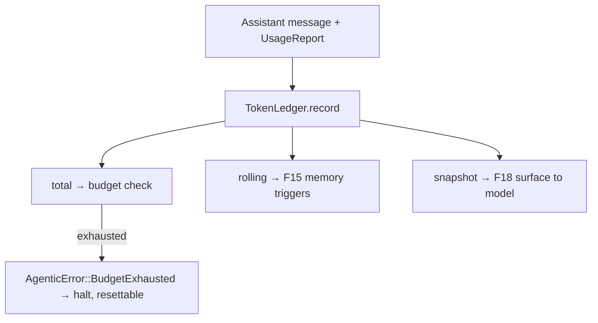

# Feature 04: Token Accounting & Budget

> **RESOLVED (user, 2026-06-15; CONFIRMED against code).** Each model already exposes a **cumulative**
> usage/cost summation over the whole lifetime of interactions with it: every provider holds a
> `CostAccumulator` that "keeps a running total for the model's lifetime" (`costing.rs:47-49`) and
> `Model::costing()` returns it (`costing.rs:96-98`). So F04 **builds on that existing cumulative
> source — it does NOT re-accumulate per-token from scratch.** Division of labor (see OD-04-10):
> the per-model `CostAccumulator` is the running total *for one model*; `TokenLedger` is the
> **session-level** aggregate that spans models/turns and owns the **budget**, fed once per turn from
> the same `UsageReport` the model just accounted (`record(usage)` reads the delta the model already
> computed). No parallel counting: the ledger aggregates the models' own numbers, it does not re-derive
> them. Where a model is long-lived, the ledger can seed/reconcile from `Model::costing()` directly
> instead of replaying turns.

> **Review status (2026-06-14):** reviewed against live code. The key insight is confirmed
> (`Assistant.usage` is a per-*call* delta, so summing across turns doesn't double-count) — **but**
> a streaming turn clones one `UsageReport` onto every emitted message (thinking+text+each toolcall),
> so the ledger must record **once per turn, not per message** (else 4× over-count). Also folded:
> ledger computes its own total from the four token buckets (provider `total_tokens` is inconsistent
> — Anthropic excludes cache, OpenAI includes it); `u64::MAX` sentinel (budget=0 is valid);
> `tokens_so_far` is **live** (providers emit `GeneratingTokens(Some(usage))` per delta — Item #9, OD-04-9);
> rolling = input+output of recent turns (Item #9, OD-04-3), split from the 40k observation-size trigger;
> `total_cost` sourced; reconcile with existing per-model `CostAccumulator`.

> Resolves **TODO #5**: ObservationMemory should not track token accumulation — a dedicated ledger
> does. Plugs into `foundation_ai`'s existing `UsageReport` (no parallel counting). Provides the
> counters that memory generation triggers (F15) and budget surfacing (F18) consume, and the budget
> halt the loop (F19) enforces.

## WHY: Problem Statement

The agentic loop needs two distinct token measures, and neither should live in the memory layer:

1. **A cumulative session budget** — total tokens spent across the whole session, with an optional
   ceiling. When exhausted, the agent must **stop generating** and surface a clear, recoverable
   error until the budget is reset/raised (per TODO #5).
2. **A rolling "recent interaction" count** — used by F15 to decide when to generate observations
   (~30k) and reflections (~40k). Decision 03 wrongly implied ObservationMemory tracks this
   (Decision 02's TODO flags it). It belongs in a ledger the loop owns.

`foundation_ai` already produces `UsageReport { input, output, cache_read, cache_write,
total_tokens, cost }` (`types/mod.rs:751`) on every `Messages::Assistant` and via
`ModelState::GeneratingTokens(Option<UsageReport>)`. F04 **accumulates** these — it does not
re-count tokens.

## WHAT: Solution

### `TokenLedger` (Arc-shared, `&self`)

```rust
/// Session-level token accounting. Fed by each Assistant message's UsageReport.
/// Arc-shared; interior mutability via atomics so all methods are &self (valtron-compatible).
pub struct TokenLedger { inner: Arc<TokenLedgerInner> }

struct TokenLedgerInner {
    // Cumulative across the whole session (budget basis).
    total_input:  AtomicU64,
    total_output: AtomicU64,
    total_cache_read:  AtomicU64,
    total_cache_write: AtomicU64,
    total_cost_micros: AtomicU64,   // cost * 1e6, integral (sources TokenSnapshot.cost)
    // Rolling counter since the last observation reset (30k recent-interaction trigger only).
    rolling_tokens: AtomicU64,
    // Ceiling; u64::MAX sentinel = unlimited (0 is a VALID budget = halt immediately).
    budget_max_tokens: AtomicU64,
}
// NOTE: the budget basis is computed = input+output+cache_read+cache_write (NOT a provider
// `total_tokens` field — that is inconsistent across providers: Anthropic = input+output,
// OpenAI = provider total incl. cache). AtomicU64 is available on wasm32-unknown-unknown.

impl TokenLedger {
    /// Fold one turn's UsageReport into the ledger. **Call ONCE per model turn**, not per emitted
    /// Assistant message — a streaming turn clones the same UsageReport onto thinking/text/each
    /// tool-call message (`anthropic_messages_provider.rs:1150,1168`), so per-message would N×-count.
    /// f64 buckets are folded as `(v.max(0.0).round()) as u64`.
    pub fn record(&self, usage: &UsageReport);

    /// Cumulative session total (budget basis).
    pub fn total(&self) -> u64;
    /// Rolling count since last memory reset (F15 reads this for 30k/40k triggers).
    pub fn rolling(&self) -> u64;
    /// Reset the rolling counter (F15 calls after an observation/reflection condenses context).
    pub fn reset_rolling(&self);

    /// Budget controls.
    pub fn set_budget(&self, max_tokens: Option<u64>);
    pub fn remaining(&self) -> Option<u64>;          // None = unlimited
    pub fn is_exhausted(&self) -> bool;              // total >= budget (when set)
    /// Snapshot for surfacing to the model / UI (F18).
    pub fn snapshot(&self) -> TokenSnapshot;
}

/// Carried by `SessionRecord::Summary { usage: TokenSnapshot }` (F01) as well as surfaced to model/UI
/// (F18), so it must derive the SessionRecord-compatible set. `cost: f64` → `PartialEq` only (no
/// `Eq`/`Hash`), which matches `SessionRecord`.
#[derive(Debug, Clone, PartialEq, Serialize, Deserialize)]
pub struct TokenSnapshot {
    pub total: u64, pub input: u64, pub output: u64,
    pub rolling: u64, pub budget: Option<u64>, pub remaining: Option<u64>,
    pub cost: f64,
}
```

`f64` token fields from `UsageReport` (its fields are `f64`) are folded as `u64` via rounding (token
counts are integral; cost stays `f64`). See OD-04-1.

### Budget enforcement (loop-facing)

The agent loop (F19) checks the ledger at turn boundaries:

```
before model call:
    if ledger.is_exhausted() -> emit Stream::Next(SessionRecord::FailedAction{
                                    error: AgenticError::BudgetExhausted{ snapshot }, trace })
                                and halt generation (do NOT call the model)
after model call:
    ledger.record(assistant.usage); ledger also feeds AgentProgress::Generating.tokens_so_far
```

- **Per-request `max_tokens`** (`ModelParams::max_tokens`, `types/mod.rs:381`) is the *output cap per
  call* — unchanged. The **session budget** is new and orthogonal: it bounds total spend across the
  whole session.
- `AgenticError::BudgetExhausted` (taxonomy in F02) carries the `TokenSnapshot`. It is **recoverable**:
  raising the budget via `set_budget(...)` and re-driving the session resumes generation.

### Wiring to other features

| Consumer | Uses |
|----------|------|
| F15 memory triggers | `rolling()` for the **30k** recent-interaction trigger; `reset_rolling()` after condensing. The **40k** reflection trigger is *observation-memory size*, a different quantity F15 measures on the observation store — **not** `rolling` (OD-04-8). |
| F18 budget surfacing | `snapshot()` → injected into the system prompt so the model knows its remaining budget |
| F19 loop | `is_exhausted()` halt; `record()` **once per turn** |
| F01 `SessionRecord::Summary` | `snapshot()` → `TokenSnapshot` carried in the per-interaction `Summary` record (cumulative running spend; the per-turn `UsageReport` delta rides `AgentProgress::TurnComplete`) |
| F03 stream | per-turn authoritative totals (ledger) **plus** live `tokens_so_far` from `GeneratingTokens(Some(usage))` per delta (Item #9 — OD-03-4/OD-04-9) |

### Optional: model-side hard stop

Beyond the loop-level halt, F04 can pass a derived `max_tokens` to the model call so a single request
cannot overshoot the remaining budget: `effective_max = min(params.max_tokens, remaining)`. (OD-04-2.)

## Architecture



## HOW: Implementation Steps

1. Define `TokenLedger`/`TokenLedgerInner`/`TokenSnapshot` in `foundation_ai::agentic` (atomics).
2. `record(usage)` folds `UsageReport` fields; updates total + rolling.
3. Budget API: `set_budget`/`remaining`/`is_exhausted`/`snapshot`; `reset_rolling`.
4. Provide `AgenticError::BudgetExhausted{ snapshot }` shape (coordinated with F02).
5. Helper for the loop: `effective_max_tokens(params)` (OD-04-2).
6. Unit-test: accumulation, rolling reset, budget exhaustion boundary, snapshot, concurrent `record`
   (atomics).

## Open Decisions

- **OD-04-1 — `f64`→`u64` folding:** `UsageReport` token fields are `f64`. Round to `u64` for
  counters (cost stays `f64`)? Rec: yes, `round() as u64`.
        Sure

- **OD-04-2 — model-side hard cap:** also clamp per-request `max_tokens` to `remaining`? Rec: yes,
  cheap defense-in-depth; the loop-level halt is the primary guard.

- **OD-04-3 — what counts toward `rolling`: RESOLVED (user, 2026-06-15; Item #9) → input + output of
  recent turns.** *(What other harnesses do: context-window managers — Mastra, Letta/MemGPT — measure
  total context size = input+output of recent turns, because the trigger is "the prompt is getting too
  big to fit / too expensive," not "we generated a lot." So input+output is the right basis.)* F16/F15
  use the same definition for context assembly so the number means the same thing in both places.

- **OD-04-4 — persistence:** recompute `total` from stored per-turn `UsageReport`s on resume;
  persist only the budget ceiling. Caveat: `rolling` can't be recomputed from raw messages alone —
  it needs the last observation/reflection marker persisted (F15 stores those records, so the last
  reset point is recoverable from them).
      - Just persist it then, add a new SessionRecord type for this that gets persisted by MessageAPI, you can also add a cheap cache for it like we do for Memory/Memories.
o
- **OD-04-5 — budget basis:** **Resolved → ledger sums `input+output+cache_read+cache_write`** (not
  the provider-inconsistent `total_tokens` field).
        - why is the total_tokens inconsistent, just for my learning

- **OD-04-6 — record granularity:** **Resolved → once per model turn** (multi-message turns share
  one `UsageReport`).
- **OD-04-7 — cost:** **Resolved → `total_cost_micros` atomic** sources `TokenSnapshot.cost`.

- **OD-04-8 — two triggers:** F04's `rolling` serves the **30k** recent-interaction trigger only;
  the **40k** reflection trigger measures observation-memory size and is owned by **F15**, not the
  ledger.

- **OD-04-9 — live streaming usage: RESOLVED (user, 2026-06-15; Item #9) → build it NOW (in scope).**
  Streaming providers emit `ModelState::GeneratingTokens(Some(usage))` per delta (F03 OD-03-4), so
  `tokens_so_far` is **live** during generation. *(Naming: the state is `GeneratingTokens` — the
  in-progress phase; "Generated" would be the final. And yes — the model/provider knows the running
  count: input is known at start, output accrues per delta, and several provider stream APIs send usage
  events. So we read it per delta rather than only at turn end.)* The ledger still records the
  authoritative per-turn total once per turn (OD-04-6); live `tokens_so_far` feeds `AgentProgress` for
  UI/budget-awareness.

- **OD-04-10 — reconcile with existing `CostAccumulator`:** **Resolved (user, 2026-06-15)** → build
  on the model's existing cumulative source, don't re-accumulate. Each provider already holds a
  `CostAccumulator` "running total for the model's lifetime" (`costing.rs:47-49`) and `Model::costing()`
  returns it (`costing.rs:96-98`). `TokenLedger` is the **session-level** accumulator (spans turns,
  models, the budget); the per-model `CostAccumulator` stays the **per-model** cost source the ledger
  reads from via `record(usage)` (and may seed/reconcile from `Model::costing()` for long-lived
  models). "No parallel counting" holds: the ledger aggregates the models' own numbers, never
  re-derives them.

        - Ok, so providers also provide usage stats, good

## Target Files

- `backends/foundation_ai/src/agentic/token_ledger.rs` (new)
- coordinates with F02 (`AgenticError::BudgetExhausted`), F15, F18, F19

## Tests

```bash
cargo test -p foundation_ai -- agentic::token_ledger
```

## Verification

```bash
cargo build -p foundation_ai
cargo build -p foundation_ai --no-default-features --features agentic --target wasm32-unknown-unknown
cargo clippy -p foundation_ai -- -D warnings
cargo test -p foundation_ai
```

## Fundamentals Documentation (zero-to-expert) — REQUIRED

Author `fundamentals/` covering: LLM tokenization & usage reporting (input/output/cache tokens,
provider inconsistencies); pricing models; lock-free counters with atomics (`AtomicU64`, ordering,
`fetch_add`, sentinel design); budget enforcement & recoverable errors; context-window size vs
cumulative spend; per-turn vs per-message accounting. (Task — see list.)

## Done When

- `TokenLedger` accumulates from `UsageReport` (no parallel token counting) and exposes
  total/rolling/budget/snapshot with `&self` atomics.
- Budget exhaustion halts generation with a recoverable `AgenticError::BudgetExhausted`.
- ObservationMemory no longer tracks token accumulation (TODO #5) — the ledger owns it.
- OD-04-1..4 resolved.
