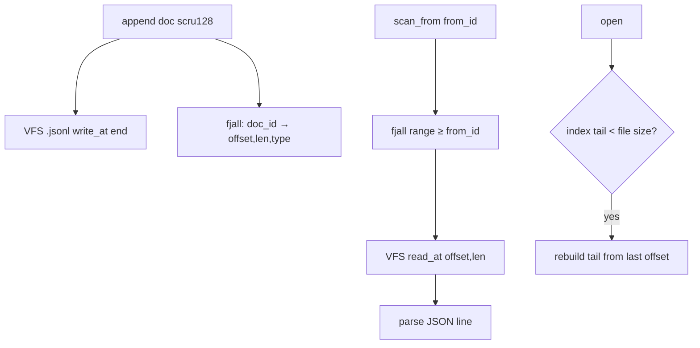

# Feature 05: DocumentStore — VFS (NDJSON) + fjall offset index

> **Review status (2026-06-14):** the VFS offset-I/O substrate is real (`read_at`/`write_at`/`seek`/
> `size`), but two dependency facts were wrong: (1) there is **no `Vfs` trait** — the surface is
> `VfsFile` + `SeekableVfsFile` + `VfsFileSystem` (`shared/vfs/traits.rs:6,15,98`), so the bound is
> `V: VfsFileSystem` holding `V::File`; (2) **`fjall` is declared but never used** — `vfs-fjall`'s
> `FjallFs` is an in-memory HashMap shim, so F05 adds the crate's **first real `use fjall`**, and the
> index handle is a `fjall::Partition` (via `Keyspace::open_partition`), not a bare `Keyspace`. Also
> folded: explicit Cargo wiring (foundation_db + serde_json + foundation_compact), an append-concurrency
> mutex, key→filename encoding, and materialization strategy. See OD-05-6..9.

> Implements Decision 13's VFS-backed DocumentStore and Decision 03's TODO (a fjall sidecar index
> beside the file store so a scru128 → "this is at offset X" lookup makes `scan_from` a fast seek
> instead of a full file scan). Native-only (target-gated). Builds on the F04 trait contract
> (`scan_from`, doc_id = authoritative scru128).

## WHY: Problem Statement

`MemoryDocumentStore` and `SqlDocumentStore` exist (F04), but the agentic layer wants a **local
filesystem** store that is human-inspectable (NDJSON — `cat`/`jq`/`fff`-friendly, Decision 10) and
**fast to seek**. A plain NDJSON file gives append + human-readability but `scan_from(from_id)` would
require scanning every line. Decision 03's TODO: keep a **fjall index beside the file** mapping
`doc_id → byte offset`, so `scan_from` seeks directly. SQL/Turso don't need this (they have indexes);
file-backed stores do.

The substrate already exists: `foundation_nativeapis` has a VFS with **offset I/O** (`read_at`,
`write_at`, `seek(SeekFrom)` — `native/vfs/native_fs.rs:167,188,342`) and `fjall` wired behind the
`vfs-fjall` feature (`Cargo.toml:35,290`, with a `fjall_vfs` test).

## WHAT: Solution

### Storage layout (Decision 13)

```
{vfs_root}/
├── {encoded_collection_key}.jsonl        # one NDJSON line per document (append-only)
└── .index/{encoded_collection_key}/      # fjall keyspace: doc_id → (offset, len)
```

- **Append (race-safe):** `DocumentStore::append` is `&self`, so computing offset via `file.size()`
  then `write_at(size)` is a **check-then-act race** — two concurrent appends could target the same
  offset and corrupt the NDJSON. F05 takes a **per-collection append lock** (OD-05-6) to atomically:
  reserve EOF offset → `write_at` the line → `insert` the index entry. doc_id is the authoritative
  scru128 (F04 Part 0), so the fjall key order **is** chronological.
- **`scan_from(from_id, limit)`:** fjall range-scan keys `>= from_id` (LSM keyspaces are ordered),
  for each hit `read_at(offset, len)` and parse the line. O(log n + k) instead of O(file).
- **`scan(last N)`:** fjall reverse-range from the largest key, N entries, seek+read each.
- **`scan_all`:** stream the NDJSON file start→end (no index needed), or iterate the index ascending.
- **`delete`:** append a tombstone / mark in the index; compaction rewrites the file (OD-05-2).
- **Promoted columns (F04):** the fjall index value can also carry `record_type` (and a short
  `title`) so `scan_documents`-style filtering by type avoids reading the file at all (OD-05-3).

### `VfsDocumentStore`

```rust
// foundation_nativeapis, behind feature = "vfs-fjall", #[cfg(not(target_arch = "wasm32"))]
// Real traits (shared/vfs/traits.rs): VfsFileSystem (open/create), VfsFile (read_at/write_at/size),
// SeekableVfsFile (seek). NOT a single `Vfs` trait.
pub struct VfsDocumentStore<V: VfsFileSystem> {
    vfs: V,
    root: String,
    index: fjall::Partition,                  // REAL fjall LSM (open_partition); ordered range()
    append_locks: Mutex<HashMap<String, ()>>, // per-collection append serialization (OD-05-6)
}

impl<V: VfsFileSystem> DocumentStore for VfsDocumentStore<V> { /* ... */ }
```

It implements the **same `DocumentStore` trait** (F04, which adds `scan_from` — absent on the trait
today) so the Message API (F16) is backend-agnostic. `fjall::Partition` (via
`Keyspace::open_partition`, fjall 2.x) provides `range()`/`get`/`insert`; `scan` uses `range().rev()`.

> **Cargo wiring (explicit tasks):** `vfs-fjall` currently = `["vfs","dep:fjall","dep:hex"]` but
> never `use`s fjall. F05 must: add real `use fjall::{Config, Keyspace, PartitionCreateOptions}`;
> add `dep:foundation_db` (the `DocumentStore` trait + `Document`), `dep:serde_json` (NDJSON), and
> `dep:foundation_compact` (scru128 doc_ids) to the feature. No cycle: `foundation_db` does not depend on
> `foundation_nativeapis`.

### fjall index keyspace design

| Key | Value |
|-----|-------|
| `doc_id` (scru128, 25 chars, lexicographically chronological) | `IndexEntry { offset: u64, len: u32, record_type: Option<String>, title: Option<String> }` |

One fjall partition per collection (or a single keyspace with `{collection}\0{doc_id}` composite
keys — OD-05-1). LSM ordered iteration gives `scan_from`/`scan`/`scan_all` for free.

### Crash consistency

The file (NDJSON) is the source of truth; the index is a derived accelerator. On open, if the index
is missing/stale (last indexed offset < file size), **rebuild the tail** by scanning from the last
indexed offset to EOF and re-indexing. So a crash between file-append and index-write self-heals.
(OD-05-4.)

## Architecture



## HOW: Implementation Steps

1. `VfsDocumentStore` in `foundation_nativeapis` behind `vfs-fjall` + `cfg(not(wasm32))`.
2. `append`: serialize line, `write_at(EOF)`, write `IndexEntry` to fjall. Return `Document` (F04 shape).
3. `scan_from`/`scan`/`scan_all` via fjall range + `read_at`.
4. `delete`/`delete_all`: tombstone + compaction policy (OD-05-2).
5. Carry `record_type`/`title` into `IndexEntry` for index-only filtering (OD-05-3).
6. Open-time tail rebuild for crash consistency (OD-05-4).
7. Tests: append→scan_from seek correctness; ordering matches SQL/Memory backends; crash-rebuild
   (truncate index, reopen, verify); delete+compaction; large-file seek perf smoke.

## Open Decisions

- **OD-05-1 — keyspace layout:** one fjall partition per collection vs one keyspace with
  `{collection}\0{doc_id}` composite keys. Rec: composite keys (fewer partitions, still ordered).
- **OD-05-2 — delete strategy:** tombstone-in-index + periodic file compaction vs immediate rewrite.
  Rec: tombstone + compaction at a threshold (append-only friendly).
- **OD-05-3 — index value contents:** offset+len only, or also `record_type`/`title` for index-only
  filters. Rec: include them (cheap, avoids file reads for typed scans).
- **OD-05-4 — crash recovery:** tail-rebuild on open (rec) vs full reindex vs fsync-per-append.
- **OD-05-5 — which `VfsFileSystem` impl:** `native_fs` (real disk) now; the generic
  `V: VfsFileSystem` keeps libsql/d1 deltas open. (Note: the `FjallFs` shim is in-memory — not for
  durable storage.)
- **OD-05-6 — append serialization:** per-collection `Mutex` for offset reservation (rec) vs
  file-lock vs single-writer. Required to make `&self` append race-free.
- **OD-05-7 — collection-key → filename encoding:** keys like `session:{id}:messages` contain `:`.
  Encode via the already-pulled `hex` (or base32/percent). Rec: hex.
- **OD-05-8 — `scan_from` materialization:** eager-materialize (matches all existing backends:
  `memory_document_store.rs:66-81` locks→clones→builds iterator) vs lazy seek-on-`.next()` (needs
  `Send` handle plumbing in the boxed iterator). Rec: eager now (low-risk); lazy as a perf follow-up.
- **OD-05-9 — tail-rebuild high-water-mark:** persist a `__hwm` key (last indexed offset) vs derive
  `max(offset+len)` over all index entries on open. Rec: store an explicit `__hwm` index key.

## Target Files

- `backends/foundation_nativeapis/src/native/vfs/` (new `document_store.rs` or sibling module)
- `backends/foundation_nativeapis/Cargo.toml` — ensure `vfs-fjall` covers it; `foundation_db` dep for
  the `DocumentStore` trait (or the trait is re-exported)
- coordinates with F04 (trait, doc_id ordering, `Document` shape)

## Tests

```bash
cargo test -p foundation_nativeapis --features vfs-fjall -- document_store
```

## Verification

```bash
cargo build -p foundation_nativeapis --features vfs-fjall
cargo clippy -p foundation_nativeapis --features vfs-fjall -- -D warnings
cargo test  -p foundation_nativeapis --features vfs-fjall
```

## Fundamentals Documentation (zero-to-expert) — REQUIRED

Author `fundamentals/` covering: virtual filesystems (VFS abstractions, `read_at`/`write_at`/`seek`);
NDJSON append logs; **LSM trees** & fjall (keyspaces, partitions, ordered range scans, compaction);
byte-offset sidecar indexing & fast seeks; crash consistency & tail-rebuild (high-water-marks);
append concurrency under `&self` (offset reservation, locking). (Task — see list.)

## Done When

- `VfsDocumentStore` implements `DocumentStore` over NDJSON + a fjall offset index; `scan_from` is a
  seek, not a scan; ordering matches the SQL/Memory backends (doc_id/scru128).
- Crash between file-append and index-write self-heals on open.
- Native-only, target-gated; `vfs-fjall` feature; existing VFS/fjall tests unaffected.
- OD-05-1..5 resolved.
