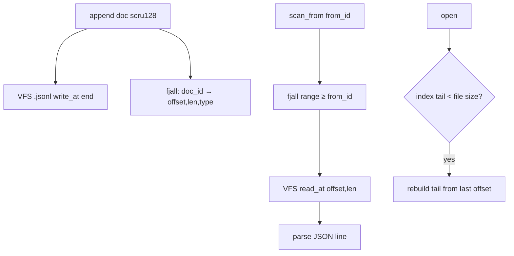

# Feature 05: DocumentStore — VFS (NDJSON) + fjall offset index

> **RESOLVED (user, 2026-06-15) — rename the fake fjall, build the real one, single-writer batched
> appends. No half-assed work.**
>
> 1. **Honest naming (Part A).** The current `FjallFs` is an **in-memory HashMap shim**, not fjall — so
>    **rename it to what it is** (`InMemoryVfsFileSystem` / `MemoryFs`) and stop pretending it's fjall.
>    Then **build the real fjall-backed `VfsFileSystem`** properly (fjall LSM as the durable substrate),
>    no shim. (Resolves the `vfs-fjall` "declared-but-never-used" gap the review flagged.)
> 2. **Single writer + batch write (Part B) — supersedes the per-collection mutex (OD-05-6).** Exactly
>    **one writer can ever write** a collection, so there is **no concurrent append and no race** by
>    construction. Writes are **batched**. Because the single writer owns all state, **offset computation
>    is trivial**: the next offset = current persisted file size + the byte-length of everything ahead of
>    this record in the in-flight batch. So **`append` returns the computed `offset` on submit** — the
>    writer already knows it from `current_file_offset + accumulated_batch_bytes`; no `size()`-then-`write`
>    check-then-act, no reservation lock.
> 3. **Last-N reads (Part C).** To serve "last N records": **copy the current (un-flushed) batch first**;
>    if it has fewer than N, **pull the remaining `N - batch.len()` from the persisted store** (fjall
>    reverse-range + `read_at`). Newest data (still in the batch) needs no disk hit; only the shortfall
>    touches the store. (New OD-05-10.)
>
> **RESOLVED (user, 2026-06-15) — multi-partition fjall indexes.** fjall supports **multiple keyspaces /
> partitions**, so we use **one partition per index** to make retrieval fast: a primary `doc_id → (offset,
> len)` partition **plus** secondary index partitions (e.g. `record_type → doc_ids`, `title`-prefix, time
> buckets) — each an ordered LSM giving range scans for free. This expands OD-05-1/OD-05-3 from a single
> offset index to a small **index family**. (New OD-05-11.)

> **Review status (2026-06-14):** the VFS offset-I/O substrate is real (`read_at`/`write_at`/`seek`/
> `size`), but two dependency facts were wrong: (1) there is **no `Vfs` trait** — the surface is
> `VfsFile` + `SeekableVfsFile` + `VfsFileSystem` (`shared/vfs/traits.rs:6,15,98`), so the bound is
> `V: VfsFileSystem` holding `V::File`; (2) **`fjall` is declared but never used** — `vfs-fjall`'s
> `FjallFs` is an in-memory HashMap shim, so F05 adds the crate's **first real `use fjall`**, and the
> index handle is a `fjall::Partition` (via `Keyspace::open_partition`), not a bare `Keyspace`. Also
> folded: explicit Cargo wiring (foundation_db + serde_json + foundation_compact), single-writer batch
> appends (user-resolved — supersedes the earlier mutex idea), key→filename encoding, and
> materialization strategy. See OD-05-6..11.

> Implements Decision 13's VFS-backed DocumentStore and Decision 03's TODO (a fjall sidecar index
> beside the file store so a scru128 → "this is at offset X" lookup makes `scan_from` a fast seek
> instead of a full file scan). Native-only (target-gated). Builds on the F04 trait contract
> (`scan_from`, doc_id = authoritative scru128).

## WHY: Problem Statement

`MemoryDocumentStore` and `SqlDocumentStore` exist (F04), but the agentic layer wants a **local
filesystem** store that is human-inspectable (NDJSON — `cat`/`jq`/`fff`-friendly, Decision 10) and
**fast to seek**. A plain NDJSON file gives append + human-readability but `scan_from(from_id)` would
require scanning every line. Decision 03's TODO: keep a **fjall index beside the file** mapping
`doc_id → byte offset`, so `scan_from` seeks directly. SQL/Turso don't need this (they have indexes);
file-backed stores do.

The substrate already exists: `foundation_nativeapis` has a VFS with **offset I/O** (`read_at`,
`write_at`, `seek(SeekFrom)` — `native/vfs/native_fs.rs:167,188,342`) and `fjall` wired behind the
`vfs-fjall` feature (`Cargo.toml:35,290`, with a `fjall_vfs` test).

## WHAT: Solution

### Storage layout (Decision 13)

```
{vfs_root}/
├── {encoded_collection_key}.jsonl        # one NDJSON line per document (append-only)
└── .index/{encoded_collection_key}/      # fjall keyspace: doc_id → (offset, len)
```

- **Append (single writer + batch):** `DocumentStore::append` is `&self`, but a collection has **exactly
  one writer ever** (the `SingleWriter`), so there is **no concurrent append and no race** — no
  `size()`-then-`write_at` check-then-act, no reservation lock. Offset is computed, not reserved: the
  writer holds the persisted file high-water-mark and the in-flight batch, so the next offset =
  `current_file_offset + accumulated_batch_bytes`. Records accumulate in a **batch**; `append` **returns
  the computed `offset`** immediately. The batch flushes (one `write_at` of the concatenated lines +
  index inserts) on size/time threshold or explicit flush. doc_id is the authoritative scru128 (F04
  Part 0), so the fjall key order **is** chronological. (OD-05-6.)
- **`scan_from(from_id, limit)`:** fjall range-scan keys `>= from_id` (LSM keyspaces are ordered),
  for each hit `read_at(offset, len)` and parse the line. O(log n + k) instead of O(file).
- **`scan(last N)`:** fjall reverse-range from the largest key, N entries, seek+read each.
- **`scan_all`:** stream the NDJSON file start→end (no index needed), or iterate the index ascending.
- **`delete`:** append a tombstone / mark in the index; compaction rewrites the file (OD-05-2).
- **Promoted columns (F04):** the fjall index value can also carry `record_type` (and a short
  `title`) so `scan_documents`-style filtering by type avoids reading the file at all (OD-05-3).

### `FjallDocumentStore`

> **RESOLVED (user, 2026-06-15) — name it `FjallDocumentStore`, NOT `VfsDocumentStore`.** This store is
> the **fjall-indexed** one; a bare `VfsDocumentStore` would be "insanely generic" (any `VfsFileSystem`,
> no index) and is a *different*, broader thing. So the concrete type below is **`FjallDocumentStore`**
> (NDJSON file in a VFS **+** the fjall index family). If a plain generic VFS-only store is ever wanted,
> that is a separate `VfsDocumentStore<V>` — don't conflate them.

```rust
// foundation_nativeapis, behind feature = "vfs-fjall", #[cfg(not(target_arch = "wasm32"))]
// Real traits (shared/vfs/traits.rs): VfsFileSystem (open/create), VfsFile (read_at/write_at/size),
// SeekableVfsFile (seek). NOT a single `Vfs` trait.
pub struct FjallDocumentStore<V: VfsFileSystem> {
    vfs: V,
    root: String,
    // Index FAMILY — one fjall partition per index (OD-05-11): primary offset index + secondaries.
    indexes: FjallIndexSet,        // { primary: doc_id→(offset,len,..), by_type: record_type→doc_ids, .. }
    // Single-writer + batch state per collection (OD-05-6 superseded): exactly one writer, no race;
    // append returns the computed offset (current_file_size + accumulated_batch_bytes).
    writer: SingleWriter,          // owns file-offset high-water-mark + the in-flight batch
}

impl<V: VfsFileSystem> DocumentStore for FjallDocumentStore<V> { /* ... */ }
```

It implements the **same `DocumentStore` trait** (F04, which adds `scan_from` — absent on the trait
today) so the Message API (F16) is backend-agnostic. `fjall::Partition` (via
`Keyspace::open_partition`, fjall 2.x) provides `range()`/`get`/`insert`; `scan` uses `range().rev()`.

> **Cargo wiring (explicit tasks):** `vfs-fjall` currently = `["vfs","dep:fjall","dep:hex"]` but
> never `use`s fjall. F05 must: add real `use fjall::{Config, Keyspace, PartitionCreateOptions}`;
> add `dep:foundation_db` (the `DocumentStore` trait + `Document`), `dep:serde_json` (NDJSON), and
> `dep:foundation_compact` (scru128 doc_ids) to the feature. No cycle: `foundation_db` does not depend on
> `foundation_nativeapis`.

### fjall index family (multi-partition — OD-05-11)

fjall keyspaces hold **multiple partitions**, so the store keeps an **index family**, one partition per
access pattern, each an ordered LSM:

| Partition | Key | Value | Serves |
|-----------|-----|-------|--------|
| **primary** | `doc_id` (scru128, 25 chars, lexicographically chronological) | `IndexEntry { offset: u64, len: u32, record_type: Option<String>, title: Option<String> }` | `scan_from`/`scan`/`scan_all` (offset seeks) |
| **by_type** | `{record_type}\0{doc_id}` | `()` (or offset) | `WHERE record_type = ?` without touching the file |
| **(extensible)** | e.g. `title`-prefix, time-bucket | … | typed/prefix/time queries |

The primary partition alone gives `scan_from`/`scan`/`scan_all` for free (LSM ordered iteration);
secondary partitions accelerate filtered retrieval. One keyspace per collection, or a single keyspace
with `{collection}\0…` composite keys — OD-05-1.

### Crash consistency

The file (NDJSON) is the source of truth; the index is a derived accelerator. On open, if the index
is missing/stale (last indexed offset < file size), **rebuild the tail** by scanning from the last
indexed offset to EOF and re-indexing. So a crash between file-append and index-write self-heals.
(OD-05-4.)

## Architecture



## HOW: Implementation Steps

0. **Rename** the in-memory `FjallFs` shim → `InMemoryVfsFileSystem`/`MemoryFs` (honest name), and build
   the **real fjall-backed `VfsFileSystem`** (no shim) — Part A.
1. `FjallDocumentStore<V: VfsFileSystem>` in `foundation_nativeapis` behind `vfs-fjall` + `cfg(not(wasm32))`.
2. `append` via the **`SingleWriter`** (one writer per collection, no lock): compute `offset =
   current_file_offset + accumulated_batch_bytes`, push the line into the batch, **return the computed
   `offset`** + the `Document` (F04 shape). Batch flush writes concatenated lines (`write_at(EOF)`) and
   the index-family inserts together.
3. `scan_from`/`scan`/`scan_all` via the **primary** fjall partition range + `read_at`. `scan(last N)`:
   serve from the **in-flight batch first**, then pull `N - batch.len()` from the store (OD-05-10).
4. `delete`/`delete_all`: tombstone + compaction policy (OD-05-2).
5. Carry `record_type`/`title` into `IndexEntry`; populate the **secondary index partitions** (`by_type`,
   …) for index-only filtering (OD-05-3/OD-05-11).
6. Open-time tail rebuild for crash consistency (OD-05-4).
7. Tests: append→scan_from seek correctness; `append` returns the right offset; batch flush correctness;
   single-writer invariant (a second writer is rejected/impossible); last-N served from batch+store
   (OD-05-10); secondary-index filtering (OD-05-11); ordering matches SQL/Memory backends; crash-rebuild
   (truncate index, reopen, verify); delete+compaction; large-file seek perf smoke.

## Open Decisions

- **OD-05-1 — keyspace layout:** one keyspace per collection vs one keyspace with `{collection}\0…`
  composite keys; either way each access pattern is its own **partition** (OD-05-11). Rec: composite
  collection keys, multiple partitions per index type.
- **OD-05-2 — delete strategy:** tombstone-in-index + periodic file compaction vs immediate rewrite.
  Rec: tombstone + compaction at a threshold (append-only friendly).
- **OD-05-3 — index value contents:** offset+len only, or also `record_type`/`title` for index-only
  filters. Rec: include them (cheap, avoids file reads for typed scans).
- **OD-05-4 — crash recovery:** tail-rebuild on open (rec) vs full reindex vs fsync-per-append.
- **OD-05-5 — which `VfsFileSystem` impl:** `native_fs` (real disk) + the **real fjall-backed** VFS
  (Part A) now; the generic `V: VfsFileSystem` keeps libsql/d1 deltas open. The old `FjallFs` shim is
  renamed to `InMemoryVfsFileSystem` (in-memory, test/ephemeral only — not durable).
- **OD-05-6 — append serialization:** **Resolved (user, 2026-06-15) → single writer + batch**, NOT a
  mutex. Exactly one writer per collection ⇒ no concurrent append, no race; offset is computed
  (`current_file_offset + accumulated_batch_bytes`) and **returned from `append`**, not reserved under a
  lock. Batched flush. Supersedes the earlier per-collection `Mutex` recommendation.
- **OD-05-7 — collection-key → filename encoding:** keys like `session:{id}:messages` contain `:`.
  Encode via the already-pulled `hex` (or base32/percent). Rec: hex.
- **OD-05-8 — `scan_from` materialization:** eager-materialize (matches all existing backends:
  `memory_document_store.rs:66-81` locks→clones→builds iterator) vs lazy seek-on-`.next()` (needs
  `Send` handle plumbing in the boxed iterator). Rec: eager now (low-risk); lazy as a perf follow-up.
- **OD-05-9 — tail-rebuild high-water-mark:** persist a `__hwm` key (last indexed offset) vs derive
  `max(offset+len)` over all index entries on open. Rec: store an explicit `__hwm` index key. (The
  `SingleWriter` already holds this in memory; persist it for crash recovery.)
- **OD-05-10 — last-N read strategy:** **Resolved (user, 2026-06-15)** → serve "last N" by **copying the
  in-flight batch first**; if `batch.len() < N`, pull the remaining `N - batch.len()` from the persisted
  store (fjall reverse-range + `read_at`). Newest records (still batched) need no disk read.
- **OD-05-11 — multi-partition index family:** **Resolved (user, 2026-06-15)** → use **one fjall
  partition per index** (primary `doc_id→offset`, secondary `record_type→doc_ids`, optional title/time
  partitions) for fast filtered retrieval, rather than a single offset index. Each partition is an
  ordered LSM; the batch flush updates all relevant partitions atomically with the file write.

## Target Files

- `backends/foundation_nativeapis/src/native/vfs/` — new `fjall_document_store.rs`; rename the in-memory
  `FjallFs` shim → `InMemoryVfsFileSystem`; add the real fjall-backed `VfsFileSystem` impl
- `backends/foundation_nativeapis/Cargo.toml` — ensure `vfs-fjall` covers it; `foundation_db` dep for
  the `DocumentStore` trait (or the trait is re-exported)
- coordinates with F04 (trait, doc_id ordering, `Document` shape)

## Tests

```bash
cargo test -p foundation_nativeapis --features vfs-fjall -- document_store
```

## Verification

```bash
cargo build -p foundation_nativeapis --features vfs-fjall
cargo clippy -p foundation_nativeapis --features vfs-fjall -- -D warnings
cargo test  -p foundation_nativeapis --features vfs-fjall
```

## Fundamentals Documentation (zero-to-expert) — REQUIRED

Author `fundamentals/` covering: virtual filesystems (VFS abstractions, `read_at`/`write_at`/`seek`);
NDJSON append logs; **LSM trees** & fjall (keyspaces, **multiple partitions / index families**, ordered
range scans, compaction); byte-offset sidecar indexing & fast seeks; crash consistency & tail-rebuild
(high-water-marks); **single-writer + batched append** (why one writer makes offsets computable and
race-free, batch flush, returning the computed offset, last-N from batch+store). (Task — see list.)

## Done When

- `FjallDocumentStore<V: VfsFileSystem>` implements `DocumentStore` over NDJSON + a fjall **index
  family**; `scan_from` is a seek, not a scan; ordering matches the SQL/Memory backends (doc_id/scru128).
- The in-memory `FjallFs` shim is **renamed** to `InMemoryVfsFileSystem`; a **real fjall-backed
  `VfsFileSystem`** exists (no shim).
- Appends go through a **single writer** with **batched** writes; `append` **returns the computed
  offset**; no mutex/check-then-act; last-N reads come from batch+store.
- Crash between file-append and index-write self-heals on open.
- Native-only, target-gated; `vfs-fjall` feature; existing VFS tests updated to the renamed type.
- OD-05-1..11 resolved.
