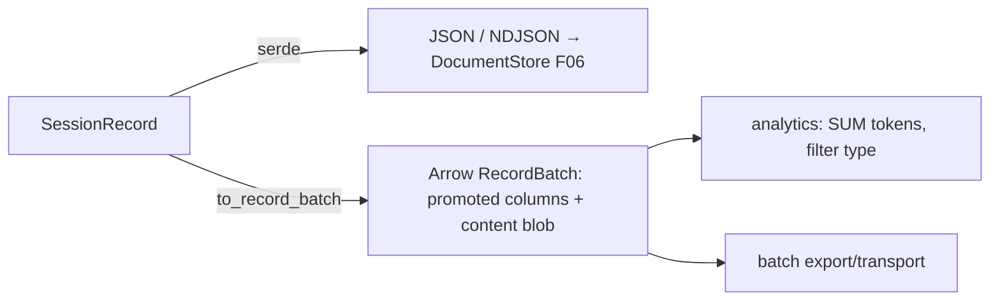

# Feature 05: Serialization — JSON + Arrow

> Implements Decision 10. Resolves **TODO #4** (drop the unnecessary FlatBuffers fallback — Arrow
> already rides FlatBuffers and builds in wasm) and **TODO #3** (don't stuff everything in one
> `content` blob — promote scru128/title/summary/type/usage into real Arrow columns for search/analytics).

## WHY: Problem Statement

Records (F01 `SessionRecord`) need two serializations: **JSON** (human-readable, NDJSON-append for
DocumentStore F06, `jq`/`fff`-friendly) and **Arrow** (columnar, for batch export, analytics — token
sums, latency, filter-by-type — and efficient transport). Decision 10's TODOs: FlatBuffers is
redundant (Arrow uses it internally + works in wasm); and a single JSON `content` column wastes
Arrow's columnar power — promote the searchable fields.

## WHAT: Solution

### JSON (primary storage) — already via serde

`SessionRecord` is `Serialize`/`Deserialize` (F01). NDJSON one-record-per-line is the DocumentStore
file format (F06). No new work beyond confirming round-trip + the F06 promoted-column extraction.

### Arrow columnar (batch / analytics)

A `Serializable` helper produces Arrow `RecordBatch` with **promoted columns + a content blob**
(TODO #3 — not everything in `content`):

```
Arrow schema (messages):
  id            Utf8         (scru128 — sortable/searchable)
  session_id    Utf8
  record_type   Utf8         ("conversation"/"observation"/"reflection")  ← promoted
  role          Utf8         (MessageRole, for conversation)              ← promoted
  title         Utf8 (null)  ← promoted (memory summaries)
  summary       Utf8 (null)  ← promoted
  model         Utf8 (null)  ← promoted (assistant)
  input_tokens  UInt32 (null)← promoted (analytics)
  output_tokens UInt32 (null)← promoted
  created_at    UInt64       (scru128 timestamp ms)                       ← promoted
  content       Utf8         (JSON-encoded full record — fidelity)        ← the blob
```

- The promoted columns mirror F06's promoted DocumentStore columns (consistency) — same `record_type`/
  `title`/`summary` + the token/model analytics fields.
- `content` keeps the full JSON record (no fidelity loss); the columns enable
  `SUM(output_tokens)`, `WHERE record_type='observation'`, `ORDER BY id` without parsing blobs.

```rust
pub trait ArrowSerializable {
    fn arrow_schema() -> arrow::datatypes::Schema;
    fn to_record_batch(records: &[StoredRecord]) -> Result<RecordBatch, SerError>;
    fn from_record_batch(batch: &RecordBatch) -> Result<Vec<StoredRecord>, SerError>;
}
```

### Drop FlatBuffers (TODO #4)

Decision 10's conditional FlatBuffers fallback is **removed** — Arrow's WASM support (it uses
FlatBuffers internally) makes a separate path unnecessary. JSON + Arrow are the only two formats.

### Transport uses

- JSON for real-time streaming (SSE) + single requests.
- Arrow for batch session export/import + analytics + efficient bulk transport (Decision 10).

## Architecture



## Fundamentals Documentation (zero-to-expert) — REQUIRED

Author `fundamentals/` covering: serialization formats (JSON/NDJSON vs columnar); **Apache Arrow**
(record batches, schema, columnar layout, zero-copy, why it rides FlatBuffers, wasm support); when
columnar beats row/blob (analytics, vectorized filters); the promoted-columns-vs-content-blob
trade-off; Arrow ↔ JSON interop; why FlatBuffers-as-fallback is redundant. (Task — see list.)

## HOW: Implementation Steps

1. Confirm `SessionRecord` JSON round-trip (F01) + NDJSON for F06.
2. `ArrowSerializable` + the promoted-column schema (mirror F06 columns).
3. `to_record_batch`/`from_record_batch` (handle nullables, the content blob, scru128 ids).
4. Remove any FlatBuffers references from the design; confirm Arrow builds on wasm32.
5. Analytics helpers (token sums / type filter) over a batch — demonstrate columnar value.
6. Tests: JSON round-trip; Arrow round-trip (incl. nulls, all record types); column extraction
   correctness; wasm32 Arrow build; analytics aggregation.

## Open Decisions

- **OD-05-1 — Arrow crate:** `arrow`/`arrow2`; wasm-buildability. Rec: `arrow` (mainline, wasm-ok);
  confirm wasm32 build.
    Rather confused, we used the `arrow-rs` crate, so how did arrow and arrow2 appear, check what we use currently in `foundation_arrow`.

- **OD-05-2 — column set:** exactly which fields promote (match F06). Rec: id/session/type/role/title/
  summary/model/in_tokens/out_tokens/created_at + content blob.
      You know the structure, you know what we can search and what makes it efficiently for searrching and column level representation, use wise review and sense and detailed it in feature.

- **OD-05-3 — content encoding in Arrow:** JSON string (rec) vs nested Arrow union. Rec: JSON string
  in `content` (avoids complex nested Arrow types; columns carry the searchable bits).
      Cool

- **OD-05-4 — where it lives:** `foundation_ai::agentic::serde` vs a shared crate. Rec: `foundation_ai`.

## Target Files

- `backends/foundation_ai/src/agentic/serialization.rs` (new)
- `backends/foundation_ai/Cargo.toml` — `arrow` dep
- coordinates F01 (records), F06 (column parity), F08 (export)

## Tests

```bash
cargo test -p foundation_ai -- agentic::serialization
cargo build -p foundation_ai --target wasm32-unknown-unknown
```

## Verification

```bash
cargo build -p foundation_ai
cargo build -p foundation_ai --target wasm32-unknown-unknown
cargo clippy -p foundation_ai -- -D warnings
cargo test  -p foundation_ai -- agentic::serialization
```

## Done When

- JSON + Arrow round-trip for all `SessionRecord` variants; Arrow has promoted columns + content blob
  (TODO #3); FlatBuffers removed (TODO #4); Arrow builds wasm32.
- Analytics (token sums, type filter) work columnar. OD-05-1..4 resolved; fundamentals authored.
