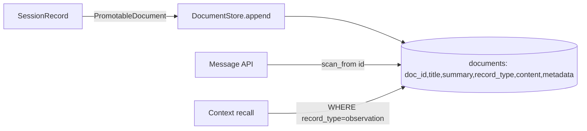

# Feature 06: DocumentStore — scan_from + promoted columns

> **RESOLVED (user, 2026-06-15) — rebuild to match the scru128 decision; no half-measures.** Anything
> in the current `foundation_db` DocumentStore that contradicts the spec'd scru128-id focus is **wrong
> code to be fixed, not behavior to preserve**. Concretely (all surfaced in the review banner below and
> mandated by **Part 0**): `created_at` (1-second resolution) ordering → **`doc_id` scru128 ordering**;
> `MemoryDocumentStore`'s `"mem-{seq}"` ids → **`foundation_compact` scru128**; the unregistered
> `020_create_documents.sql` migration → **registered in the runner**; `append`-owns-the-id → **caller
> can supply the message scru128**. Backward-compat is **not** a reason to keep any of these — where the
> old shape contradicts the decision we change it and document the break (Part 0 / OD-06-4). The
> "additive only" notes below mean *additive to the data model* (nullable columns, new methods); the
> **ordering + id semantics are deliberately rebuilt**.

> **Review status (2026-06-14) — scope expanded.** A depth-5 review found the scru128-cursor
> premise is **false against the current code**: both backends order by `created_at` (1-second
> resolution!) not `doc_id`, `MemoryDocumentStore` uses `"mem-{seq}"` ids (not scru128), the
> `documents` migration **isn't even registered** in the runner, `append` assigns its own id (caller
> can't pass a message scru128), and `scan` returns `V` not `Document` (promoted columns would be
> write-only). 04 therefore must **fix doc_id ordering + id control first** (Part 0), then add
> `scan_from`/columns. See the new Part 0 and OD-06-4/5/6.

> **Re-scoped after grounding:** `DocumentStore` is **already implemented** in `foundation_db` —
> the trait (`storage_provider.rs:471`: `append/scan/scan_all/delete/delete_all/count`), an
> `AsyncDocumentStore` variant, `MemoryDocumentStore` + `SqlDocumentStore` backends, and the
> `documents` SQL schema (`schema/sql/020_create_documents.sql`). This feature does **not** rebuild
> them — it **adds** the two things the agentic layer needs that are missing: (1) `scan_from()`
> temporal range scan (Decision 13 TODO), (2) promoted searchable columns (Decision 10b TODO).

## WHY: Problem Statement

The Message API (F08) and memory hierarchy (F16/F15) need two capabilities the current
`DocumentStore` lacks:

1. **Temporal range scan.** scru128 doc ids are time-ordered; "give me every record at/after this
   id" enables fast resume (last-10 then forward) and incremental sync. The trait only has
   `scan(last N)` and `scan_all` — no `from_id` cursor (Decision 13 TODO).
2. **Searchable columns.** The `documents` schema stores everything as a JSON `content` blob +
   `metadata` (`020_create_documents.sql:5-6`). Decision 10b: promote the sensible fields —
   scru128 id (already a column: `doc_id`), plus `title`, `summary`, `record_type` — into real
   columns so memory/message search can filter/sort without parsing every blob.

## WHAT: Solution

### Part 0 — Fix doc_id ordering + id control (prerequisite)

`scan_from` is incoherent until the store orders by a real time-ordered id:

1. **`doc_id` becomes an authoritative scru128 on every backend.** `MemoryDocumentStore` switches
   from `"mem-{seq}"` (`memory_document_store.rs:42`) to `foundation_compact` scru128. (SQL already
   generates scru128 at `sql_document_store.rs:39` — confirm.)
2. **Re-point ordering to `doc_id`** so all three scans agree: `scan`
   (`sql_document_store.rs:75` `ORDER BY created_at DESC` → `ORDER BY doc_id DESC`), `scan_all`
   (`:106` → `ORDER BY doc_id ASC`), and the new `scan_from`. (`created_at`'s 1-second SQLite
   resolution makes it unfit for ordering anyway.) Memory backend sorts by `doc_id`, not `seq`.
3. **Caller-supplied ids.** Add `append_with_id(key, id, content)` (or `append(key, Option<&str> id,
   content)`) so the agentic message scru128 **is** the `doc_id` — required for F08/F16 to anchor
   `scan_from` on a message id they hold (OD-06-5). Plain `append` keeps generating one.

This is additive at the API level but **changes ordering semantics** of existing scans (now strictly
time-ordered by id rather than coarse `created_at`) — call out in the migration/changelog. OD-06-4.

### 1. `scan_from` on the trait + both backends

```rust
// add to trait DocumentStore (storage_provider.rs)
/// Scan documents whose id is >= `from_id`, oldest-first, up to `limit` (0 = unlimited).
/// Exploits scru128 lexicographic == chronological ordering.
fn scan_from<V: DeserializeOwned + Send + 'static>(
    &self, key: &str, from_id: &str, limit: usize,
) -> StorageResult<StorageItemStream<'_, V>>;
```

- **`SqlDocumentStore`:** `WHERE collection_key = ? AND doc_id >= ? ORDER BY doc_id ASC LIMIT ?`,
  served by the existing `(collection_key, doc_id)` unique index (`020:13`). Works **only after
  Part 0** makes `doc_id` the authoritative scru128 order.
- **`MemoryDocumentStore`:** filter by `doc_id >= from_id` (scru128 lexicographic, post Part 0),
  oldest-first — NOT the old `"mem-{seq}"` ids (which sort wrong: `"mem-10" < "mem-2"`).
- **`AsyncDocumentStore`:** add `scan_from_async` returning `StorageResult<Vec<V>>` (the async trait
  returns `Vec`, not a stream — `storage_provider.rs:514`). Note `StorageItemStream` is non-`Send`
  on wasm (`storage_provider.rs:27-33`). **No `AsyncDocumentStore` backend exists yet** — VFS is F22,
  CF KV/D1 is F23; `scan_from_async`'s backend implementations land there (OD-06-7).

### 2. Promoted columns

Extend the schema + `Document` so the agentic record's key fields are first-class:

```sql
-- migration 021: add promoted columns (nullable; populated via PromotableDocument on write)
ALTER TABLE documents ADD COLUMN title       TEXT;
ALTER TABLE documents ADD COLUMN summary     TEXT;
ALTER TABLE documents ADD COLUMN record_type TEXT;   -- e.g. "conversation","observation","reflection"
CREATE INDEX IF NOT EXISTS idx_documents_collection_type ON documents(collection_key, record_type);
```

> **Migration wiring (required — currently broken):** the `MIGRATIONS` array in `migrations.rs` stops
> at `019` and asserts `len() == 19` (`migrations.rs:215`). The existing `020_create_documents.sql`
> is **not registered** — so DocumentStore's table has no runner path today. 04 must add **both**
> `020` and the new `021` to `MIGRATIONS` (via `include_str!`) and update the `len()` assertions.
> `execute_batch` handles the multiple `ALTER`s.

```rust
pub struct Document {
    pub id: String,            // doc_id (scru128)
    pub content: String,       // JSON blob (unchanged — full fidelity)
    pub metadata: serde_json::Value,
    // NEW promoted columns (Option — not every document has them):
    pub title: Option<String>,
    pub summary: Option<String>,
    pub record_type: Option<String>,
}
```

- **Write path:** `append` gains an overload / companion that accepts the promoted fields, or
  extracts them from a well-known trait (`PromotableDocument { title()/summary()/record_type() }`)
  implemented by F01's `SessionRecord`. See OD-06-1.
- **Columns are nullable**; the JSON blob is untouched and remains source of truth (Decision 10b).
  Adding fields to `Document` **breaks** its two struct-literal construction sites
  (`memory_document_store.rs:47`, `sql_document_store.rs:61`) — update both; mark `Document`
  `#[non_exhaustive]` to avoid future breaks. (So this is *not* purely additive — the struct change
  is breaking; only the DB columns are additive.)
- **Read path (gap to close):** `scan`/`scan_all` currently `SELECT content` and deserialize to `V`
  (`sql_document_store.rs:74,105`) — they never surface `Document`, so the promoted columns would be
  unobservable. Add a `Document`-returning scan (e.g. `scan_documents(key, limit)` /
  `scan_documents_from(key, from_id, limit)`) that SELECTs the columns, so F08/F16 can filter/sort on
  them. OD-06-6.
- **Memory/Message search (F08/F16)** then `WHERE record_type = 'observation'` / `ORDER BY doc_id` /
  `LIKE` on `title`/`summary` without deserializing blobs.

> **OD-06-1:** how do promoted fields get populated — an extended `append_with(content, title,
> summary, record_type)`, or a `PromotableDocument` trait the store calls? Recommendation: a
> `PromotableDocument` trait (F01's `SessionRecord` implements it → `record_type` from the variant,
> `summary` from observation/reflection text) so callers don't pass fields manually.

## Architecture



## HOW: Implementation Steps

1. Add `scan_from` to `DocumentStore` + `AsyncDocumentStore` (`scan_from_async`).
2. Implement `scan_from` in `SqlDocumentStore` (range query) and `MemoryDocumentStore` (filter).
   Verify/extend indexing for the `doc_id >=` range.
3. Add a `02x_promote_document_columns.sql` migration (nullable title/summary/record_type + index).
4. Extend `Document` with the three `Option` fields; populate on read (SELECT the columns).
5. Add the write path for promoted fields (OD-06-1: `PromotableDocument` trait recommended).
6. Tests: `scan_from` boundary (inclusive `from_id`, ordering, limit), promoted-column round-trip,
   filter-by-record_type, backward-compat (plain append → NULL columns), wasm async parity.

## Open Decisions

- **OD-06-1 — promoted-field population:** `append_with(...)` vs `PromotableDocument` trait. Rec: trait.
        - Lets discuss, explain to me further
      - **Resolved → `PromotableDocument` trait (implemented).** A record type implements
        `PromotableDocument { record_type()/title()/summary() -> Option<String> }` (all default `None`)
        once, and the store's `append_promotable`/`append_promotable_with_id` extract the promoted
        columns on write — rather than threading three extra args through every `append`. Plain
        `append` leaves the columns NULL (backward-compatible). The trait lives in `foundation_db`
        (`storage_provider.rs`). The `impl PromotableDocument for SessionRecord` does **not** ship here:
        `foundation_ai` does not (yet) depend on `foundation_db`, so that impl lands with the
        persistence-wiring feature (F07/F08) that takes the dependency. Its projection will reuse the
        existing `serialization::SessionRecordRow::from_record` logic so the DocumentStore promoted
        columns match the Arrow row promotion exactly (record_type from the serde tag; title/summary
        per variant). The promoted columns themselves are populated/observed here via tests using a
        local `PromotableDocument` record.

- **OD-06-2 — `scan_from` inclusivity:** `>= from_id` (inclusive) so resume can re-anchor on a known
  id, with the caller skipping the first if already seen. Rec: inclusive.
      Sure, sounds good

- **OD-06-3 — does the fjall offset index (F22) supersede `scan_from` for file backends?** No —
  `scan_from` is the trait-level contract; F22's index is the *implementation* that makes it fast on
  NDJSON. SQL backends satisfy it natively.
        Sure, good with me

- **OD-06-4 (decisive) — doc_id ordering:** **Resolved → `doc_id` is the authoritative scru128
  order on all backends** (Part 0); `scan`/`scan_all`/`scan_from` all `ORDER BY doc_id`. This changes
  existing scans from coarse `created_at` ordering to strict id ordering — acceptable (more correct),
  but document it.
      - Yes, make it very clear and we can also provide api options to use the `created_at` date, nothing stops us, we own the surface anyway

- **OD-06-5 — caller-supplied ids:** **Resolved → add `append_with_id`** so the agentic message
  scru128 is the `doc_id` (lets F08/F16 anchor `scan_from` on a known message id).
      Cool

- **OD-06-6 — `Document`-returning read path:** **Resolved → add `scan_documents`/`scan_documents_from`**
  so promoted columns are observable (plain `scan` still returns `V`).
      Good with me

- **OD-06-7 — async/CF scope:** `scan_from_async` signature lands in F06; its **production backend
  impls** land with CF KV/D1 (F23) — VFS (F22) is a *sync* backend. Decision 13's "all backends" is
  satisfied across F06–F23, not in one feature.
        I always like to say it: keep async traits and Sync traits separate, let async traits method have *_async suffixes in name to avoid conflict, this lets users clearly use which works for their environment and context.
      - **Resolved → in F06 we also ship a real `AsyncDocumentStore` impl for `MemoryDocumentStore`**
        (forwards to the sync in-memory logic, identical ordering/id/promoted-column semantics; tested
        via `block_on`). WHY: the async trait must not be a phantom contract — the agentic layer and the
        future async backends (F23) need something to compile and test against *now*. So `AsyncDocumentStore`
        is no longer impl-less. **Scheduled remaining impls:** F23 supplies the Cloudflare D1/KV/R2
        `AsyncDocumentStore`; F22 supplies the sync `FjallDocumentStore` (VFS). Each is expected to pass the
        same scan/scan_from/promoted-column conformance the in-memory + SQL backends already pass.

## Target Files

- `backends/foundation_db/src/core/storage_provider.rs` — `scan_from`(+async), `Document` fields
- `backends/foundation_db/src/core/backends/{sql_document_store,memory_document_store}.rs`
- `backends/foundation_db/src/core/schema/sql/02x_promote_document_columns.sql` (new migration)

## Tests

```bash
cargo test -p foundation_db -- document_store::scan_from
cargo test -p foundation_db -- document_store::promoted_columns
```

## Verification

```bash
cargo build -p foundation_db
cargo clippy -p foundation_db -- -D warnings
cargo test -p foundation_db
```

## Fundamentals Documentation (zero-to-expert) — REQUIRED

Author `fundamentals/` covering: append-only logs & event sourcing; time-ordered IDs as range
cursors (why `doc_id >=` works only with scru128 ordering); columnar/promoted columns vs JSON blob
trade-offs; SQL indexing & query planning for range scans; schema migrations & runners; lexicographic
vs timestamp ordering pitfalls. (Task — see list.)

## Done When

- `DocumentStore`/`AsyncDocumentStore` have `scan_from` implemented in SQL + Memory backends.
- `documents` has nullable `title`/`summary`/`record_type` columns + index; `Document` exposes them;
  the content blob is unchanged and remains source of truth.
- Ordering + id semantics rebuilt to scru128 (Part 0): all scans `ORDER BY doc_id`, `MemoryDocumentStore`
  mints scru128, `020`+`021` migrations registered, caller can supply the message id. Tests that asserted
  the old `created_at`/`mem-{seq}` behavior are updated to the corrected semantics (the break is intended,
  not a regression). Data model changes are additive (nullable columns, new methods).
- OD-06-1..7 resolved.
