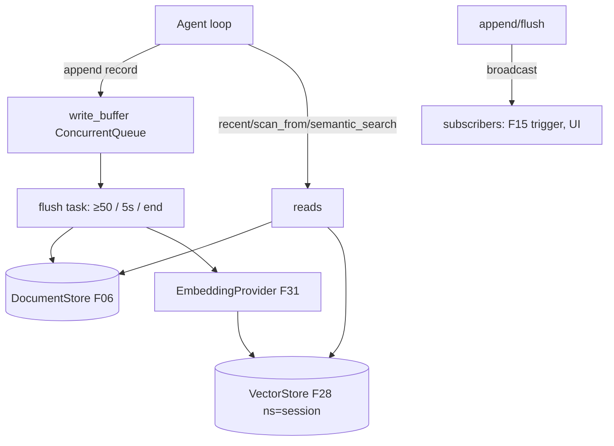

# Feature 08: Message API

> **Review status (2026-06-14) — folded:**
> 1. **`append(&self, record) -> Scru128`** mints the scru128 **before enqueue** (so id-order ==
>    arrival-order) and **returns it** (callers need the id; `SessionRecord` has no id field). The id
>    becomes `doc_id` via F06 `append_with_id`. (OD-08-6.)
> 2. **The `&self` broadcaster is NET-NEW** — no `&self`-safe broadcaster exists in `synca`
>    (`Broadcaster` is `&mut self`). Build a small `Mutex<Vec<Sender<MessageEvent>>>` + `&self`
>    `subscribe`/`broadcast`, **elevated into `foundation_core::synca::mpp`**, reusing the existing
>    `Broadcaster::broadcast` fan-out/cleanup. `subscribe()` returns mpp `Receiver` (drop Decision 02's
>    `Arc<ConcurrentQueue>`). (OD-08-1 = build commitment.)
> 3. **Reads use F06's `scan_documents`/`scan_documents_from`** (`Document`-returning, carry `id` +
>    promoted columns) — NOT `scan`/`scan_all` (return `V`, no id). `StoredRecord.id` needs them.
> 4. **`semantic_search` hydration:** F28 `query` returns id+score only; F06 has no `get` — **add F06
>    `get_many(ids) -> Vec<Document>`** (or accept N `scan_from(id,1)`). (OD-08-10.)
> 5. **flush task type is `SpawnInfo`** (not `Entry`); the periodic trigger is `TaskStatus::Delayed(5s)`;
>    **`flush()` drains SYNCHRONOUSLY on the calling thread** for shutdown (no join primitive exists) —
>    the task only handles the ≥50/5s triggers. (OD-08-7.)
> 6. **Flush-task embedding must respect F31's OD-31-6** (non-blocking `embed`) — do NOT block the
>    executor. Add F31 to `depends_on`. Embedding needs a **`model_id` config field** on the Message
>    API (OD-08-8). **Embedding-failure policy:** durable write is kept, index is skipped/retried, a
>    `MessageEvent::Error` is emitted — never blocks durability (OD-08-9).
> 7. **Memory snapshots** (`SessionRecord::{WorkingMemory,Observation,Reflection}`) traverse the **same**
>    append→flush→index path with `record_type` set. **`foundation_ai::agentic` module** creation is
>    owned by F01/F03 (precondition). **WAL is target-gated** (hole #15): native uses `cacache` for
>    crash-safe WAL; wasm uses an in-memory buffer or a Cloudflare-native alternative (KV/D1-backed).
>    No WAL on wasm = accept crash-before-flush loss (F08 OD-08-3 already documents this).

> Implements Decision 02. The **authoritative, append-only audit log** of every session record
> (`SessionRecord` from F01). Never compacted. Backed by `DocumentStore` (F06), indexed in
> `VectorStore` (F28) via `EmbeddingProvider` (F31), with write buffering, a flush valtron task, and
> `&self` pub/sub. Resolves **CRIT-02** (Broadcaster `&mut self`).

## WHY: Problem Statement

Every interaction (user/assistant/tool-result + memory snapshots) must be durably recorded, replayable,
searchable, and observable in real time — without per-record disk latency stalling the agent loop.
Decision 02: write-buffered append-only log + pub/sub + semantic search, all `&self` and `Arc`-shared.

## WHAT: Solution

```rust
pub struct MessageApi { inner: Arc<MessageInner> }  // cheap clone across valtron tasks

struct MessageInner {
    session_id: SessionId,
    doc_store: Arc<dyn DocumentStore>,          // F06 — persistence (append/scan/scan_from)
    write_buffer: ConcurrentQueue<SessionRecord>, // in-memory buffer (interior mutability)
    vector_store: Arc<dyn VectorStore>,         // F28 — semantic index (namespace = session)
    embedder: Arc<dyn EmbeddingProvider>,       // F31
    subscribers: /* &self pub/sub (see CRIT-02 fix) */,
    flush_task: Entry,                          // valtron flush task handle
}

impl MessageApi {
    pub fn append(&self, record: SessionRecord);                         // buffered, returns immediately
    pub fn recent(&self, n: usize) -> Vec<StoredRecord>;                 // DocumentStore.scan
    pub fn all(&self) -> impl Iterator<Item = StoredRecord>;             // scan_all
    pub fn scan_from(&self, id: &Scru128, n: usize) -> Vec<StoredRecord>;// F06 temporal cursor
    pub fn semantic_search(&self, query: &str, k: usize) -> Vec<StoredRecord>; // embed + VectorStore.query(ns)
    pub fn flush(&self) -> Result<(), AgenticError>;                     // drain buffer → disk (+ index)
    pub fn subscribe(&self) -> Receiver<MessageEvent>;                   // pub/sub
}
```

### Write buffering + flush task (Decision 02)

- `append` enqueues into `write_buffer` (returns immediately — no disk latency in the loop).
- A **flush valtron task** drains on: buffer ≥ capacity (default 50), time interval (default 5s), or
  session end. On flush: `doc_store.append` each record (with promoted columns from F06 via
  `PromotableDocument`), then index its text in `vector_store` (embed via F31).
- **Flush-on-end is awaited** — no record lost before shutdown (Decision 01).
- Each record gets a scru128 id (caller-supplied via F06's `append_with_id`) → stable, time-ordered.

### `&self` pub/sub — CRIT-02 fix

Pub/sub uses F14's **bounded fan-out broadcaster** (per-subscriber `ConcurrentQueue`, `try_push` never
blocks, eviction on `max_retries` consecutive failures). Lives in `foundation_core::synca::mpp`. The
Message API holds it via `Arc`, so `subscribe()` and `broadcast()` are `&self`. Events:

```rust
pub enum MessageEvent { Appended { id: Scru128, variant: &'static str }, Flushed { count: usize }, Error { msg: String } }
```

Listeners (the observation-memory trigger F15, embedding indexer, external UI) subscribe; `append`/
`flush` broadcast. (Decision 02; resolves the design's pub/sub dependency.)

### Semantic recall

- On flush, each text-bearing record is embedded (F31) and inserted into `VectorStore` (F28) with
  `namespace = session_id` (isolation) + `record_type` metadata.
- `semantic_search(query)` embeds the query, `vector_store.query(vec, k, Some(session))`, loads the
  matched records by id from `DocumentStore` (fast `scan_from`/id lookup).

### Serialization (Decision 10 — folds F05)

- Records persist as JSON (NDJSON-friendly, F06). Arrow columnar export is **F05** (this feature
  produces JSON; F05 adds the Arrow batch path + promoted columns). Reference F05.

## Architecture



## Fundamentals Documentation (zero-to-expert) — REQUIRED

Author `fundamentals/` covering: append-only audit logs & event sourcing; write buffering &
batched-flush (latency vs durability, flush triggers, flush-on-shutdown); **`&self` pub/sub** patterns
(why `&mut self` broadcasters fail behind `Arc`, ConcurrentQueue-of-senders, `ThreadSafeBroadcaster`);
semantic recall pipelines (embed→index→query→load); `Arc<Inner>` interior-mutability sharing across
valtron tasks; scru128 time-ordering for replay. (Task — see list.)

## HOW: Implementation Steps

1. `MessageApi`/`MessageInner` (Arc, `&self`); wire DocumentStore/VectorStore/EmbeddingProvider.
2. `append` → buffer; flush valtron task (triggers + drain + persist + index); flush-on-end await.
3. `&self` pub/sub mechanism (CRIT-02) + `MessageEvent`.
4. `recent`/`all`/`scan_from` via DocumentStore; `semantic_search` via embed+VectorStore+load.
5. caller-supplied scru128 ids (F06 `append_with_id`); promoted columns via `PromotableDocument`.
6. Tests: append→flush durability; flush triggers; flush-on-end loses nothing; pub/sub delivery;
   semantic_search recall; scan_from cursor; concurrent append+read; wasm build.

## Open Decisions

- **OD-08-1 — pub/sub mechanism:** `ThreadSafeBroadcaster` (interior Mutex) vs ConcurrentQueue-of-receivers.
  Rec: a small `&self` broadcaster helper (possibly elevated into `foundation_core::synca`).
        ConcurrentQueueOfRecevers is not that better ?

- **OD-08-2 — backpressure:** write_buffer full (ConcurrentQueue push fails) → block? force-flush?
  Rec: force-flush synchronously when full (never drop records).
        - We can have an innerQueue which has a bounded window to cache these and if reached and no one is consuming then this means we have problems and need to panic and report fast, something is broken and wrong.

- **OD-08-3 — crash before flush:** records in the buffer are lost on crash (no WAL). Accept (the gaps
  Q-04), or add periodic forced flush / WAL? Rec: short flush interval + flush-on-end; WAL later.
        Why not WAL it, this even makes the backpressure easier to deal with and crash safe, cacache is there for our needs.

- **OD-08-4 — index which records:** only text-bearing conversation + memory records get embedded
  (skip pure tool-call args?). Rec: embed user/assistant text + observation/reflection; skip raw blobs.
      Good

- **OD-08-5 — StoredRecord shape:** `{ id: Scru128, record: SessionRecord, created_at }`. Confirm.

## Target Files

- `backends/foundation_ai/src/agentic/message_api.rs` (new)
- coordinates F01 (`SessionRecord`/`Scru128`), F06 (DocumentStore + `append_with_id` + columns), F28
  (VectorStore), F31 (EmbeddingProvider), F05 (Arrow), F15 (subscriber)

## Tests

```bash
cargo test -p foundation_ai -- agentic::message_api
cargo build -p foundation_ai --target wasm32-unknown-unknown
```

## Verification

```bash
cargo build -p foundation_ai
cargo build -p foundation_ai --target wasm32-unknown-unknown
cargo clippy -p foundation_ai -- -D warnings
cargo test  -p foundation_ai -- agentic::message_api
```

## Done When

- Append-only, write-buffered store over DocumentStore; flush task (triggers + flush-on-end loses
  nothing); `&self` pub/sub (CRIT-02 resolved); semantic_search via VectorStore; recent/all/scan_from.
- `Arc`-shared, `&self`, concurrent-safe; builds native + wasm.
- OD-08-1..5 resolved; fundamentals authored.
