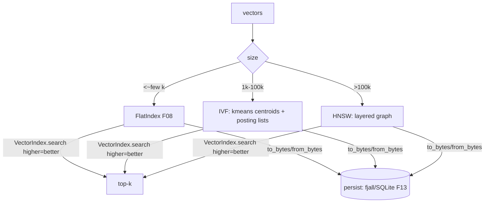

# Feature 09: foundation_vectors — IVF + HNSW

**TODO**: I have reached the limits of my knowledge, lets do web research and select the best answers for these for the different platforms we wish to support, then add foundation_docs to teach me from zero to hero on all these topics in detail and depth.

> **Review status (2026-06-14) — trait redesign + likely split.** Folded: (1) `&mut self`
> mutators violate Decision 08's `&self`+interior-mutability rule (an `Arc<dyn VectorIndex>` can't
> call `&mut self`) → **`&self` mutators with internal `RwLock`**, and **fallible** (`insert ->
> Result`) for dimension/NaN. (2) `from_bytes -> Self where Self: Sized` is **uncallable on `dyn`** →
> a **kind-tagged free loader** `load_index(bytes) -> Result<Box<dyn VectorIndex>>`. (3) the
> serialized bytes must be **self-describing** (embed metric + dimension + params + version) — don't
> pass `metric` to load. (4) the **id→vector ownership** model (does the index own vector copies?
> drives memory + format) must be decided. (5) parallel HNSW build can't be bit-identical → scope
> `parallel` to distance kernels, graph mutation serial. (6) recall gates need a **fixed seeded
> realistic corpus**, not random vectors. **Likely split into 09 (IVF) + a follow-on HNSW feature**
> during implementation — each is substantial. See OD-09-7..12.

> Decision 07's approximate indexes. Flat scan (F08) is O(n·d) — fine to ~few-thousand vectors; IVF
> and HNSW give sub-linear query time for larger sets. Same `DistanceMetric` + higher-is-better
> top-k contract as F08, so they're drop-in for the `VectorStore` backends (F12-14). Pure Rust,
> WASM-safe. Both must serialize/deserialize (fjall/SQLite persistence in F13).

## WHY: Problem Statement

Agent sessions accumulate embeddings (messages, observations). Flat scan degrades linearly; for a
store of 10k-100k vectors a cluster index (IVF) and for very large sets a graph index (HNSW) keep
recall high with sub-linear latency. We own these (Decision 07) so behavior is consistent across
backends and works in WASM (no native ANN lib). The index abstraction must also **persist** (build
once, reload) since rebuilding on every start is wasteful.

## WHAT: Solution

### Common index trait

```rust
/// All ANN indexes share this. Returns higher-is-better matches (F08 convention).
/// &self mutators (interior RwLock) per Decision 08 — an Arc<dyn VectorIndex> is shared between
/// the Embedding task (inserts) and the Agent loop (searches). Mutators are fallible (dimension/NaN).
pub trait VectorIndex: Send + Sync {
    fn insert(&self, id: &str, vector: &[f32]) -> Result<(), VectorError>;
    fn remove(&self, id: &str) -> Result<(), VectorError>;
    fn search(&self, query: &[f32], k: usize) -> Result<Vec<VectorMatch>, VectorError>;
    fn len(&self) -> usize;
    /// Serialize the built index — SELF-DESCRIBING: embeds kind tag + metric + dimension + params +
    /// version. WASM-safe (postcard). No metric is passed back in.
    fn to_bytes(&self) -> Vec<u8>;
}

/// Reconstruct any index from self-describing bytes (kind tag dispatches). Callable for `dyn`
/// (free function, not a `Self`-returning trait method).
pub fn load_index(bytes: &[u8]) -> Result<Box<dyn VectorIndex>, VectorError>;
```

`FlatIndex` (wrapping F08's `flat_top_k`) also implements this — so `VectorStore` (F12) can start
with `FlatIndex` and swap to IVF/HNSW transparently (OD-09-1: automatic promotion at a size
threshold vs explicit config).

### IVF (Inverted File Index)

- **Build:** k-means cluster the vectors into `nlist` centroids; each vector assigned to its nearest
  centroid's posting list.
- **Search:** find the `nprobe` nearest centroids to the query, flat-scan only those posting lists.
  Recall/speed tunable via `nprobe`.
- **Params:** `nlist` (≈ √n heuristic), `nprobe` (default ~8), `metric`. Incremental insert assigns
  to nearest existing centroid; periodic re-cluster when drift is high (OD-09-2).
- **Range:** ~1k-100k vectors.

### HNSW (Hierarchical Navigable Small World)

- **Build:** multi-layer navigable graph; insert links each node to `M` neighbors per layer, layer
  assigned by an exponential distribution.
- **Search:** greedy descent from the top layer, `ef_search` candidates at the base layer.
- **Params:** `M` (default 16), `ef_construction` (default 200), `ef_search` (default 64), `metric`.
- **Range:** >100k vectors. Higher memory; best recall/latency at scale.
- **Delete:** soft-delete (tombstone) + periodic rebuild (HNSW deletion is hard) — OD-09-3.

### Determinism & WASM

- Seeded RNG (`foundation_compact`) for k-means init + HNSW layer assignment → reproducible builds
  (OD-09-4).
- Pure Rust, no SIMD/native deps in the portable path; `parallel` (rayon) feature for native build
  acceleration only, identical results.
- Serialization via `postcard`/`bincode` (no_std-friendly, WASM-safe).

## Architecture



## HOW: Implementation Steps

1. `VectorIndex` trait + `FlatIndex` impl (wraps F08).
2. IVF: k-means (seeded), posting lists, `nprobe` search, incremental insert.
3. HNSW: layered graph build, greedy search, `ef_*` params, soft-delete.
4. Serialize/deserialize (postcard) for both; round-trip tests.
5. Recall benchmarks vs flat-scan ground truth (IVF ≥0.9 @ nprobe, HNSW ≥0.95 @ ef).
6. Tests: insert/search/remove; recall vs flat; serialize round-trip; determinism (seeded);
   serial==parallel; wasm32 build; large-set smoke.

## Open Decisions


- **OD-09-1 — index selection:** automatic promotion (flat→IVF→HNSW at size thresholds) vs explicit
  config per store. Rec: explicit config with a sensible default (flat<8k, IVF<100k, HNSW above).
- **OD-09-2 — IVF re-clustering:** when to re-run k-means as inserts drift. Rec: rebuild at 2× growth
  or on demand.
- **OD-09-3 — HNSW deletes:** soft-delete + periodic rebuild (HNSW can't truly delete). Rec: yes.
- **OD-09-4 — determinism:** seeded RNG for reproducible builds. Rec: yes (test stability).
- **OD-09-5 — crate deps:** k-means/HNSW from scratch vs vetted crates (`hnsw_rs`, `instant-distance`)
  — but those may not be WASM-safe. Decision 07 says own the algorithms. Rec: implement ours
  (WASM-safe, consistent); study existing crates for reference only.
- **OD-09-6 — serialization format:** postcard, **self-describing**: kind tag + metric + dimension +
  params + version + the id→vector data. No external metric. Rec: postcard.
- **OD-09-7 — `&self` mutators + locking:** interior `RwLock` (whole-index now; sharded later) so the
  trait is `&self` per Decision 08. Rec: whole-index `RwLock`.
- **OD-09-8 — trait-object load:** `load_index(bytes) -> Box<dyn VectorIndex>` keyed by an embedded
  kind tag (replaces `from_bytes -> Self`). Rec: yes.
- **OD-09-9 (decisive) — id→vector ownership:** the index **owns its own vector copies** (HNSW needs
  them for graph distances; IVF for posting-list scans) — so it roughly doubles memory vs the store's
  copy, OR holds ids + a re-fetch callback. Rec: index owns copies (simpler, self-contained for
  serialize); document the memory cost.
- **OD-09-10 — split:** ship **09 = IVF + `VectorIndex` trait + `FlatIndex` + serialization**, and a
  follow-on **HNSW** feature (the highest-risk component). Rec: split; this feature delivers IVF +
  trait + Flat first.
- **OD-09-11 — recall benchmark corpus:** a fixed, seeded, *clustered/embedding-like* dataset (NOT
  random-uniform, which gives pathological ANN recall) with a committed query set + k. Rec: commit a
  fixture corpus; gate recall against flat ground truth on it.
- **OD-09-12 — WASM memory:** state a bytes/vector budget and the wasm32 linear-memory ceiling;
  qualify the HNSW size target to "≤N within memory limits" rather than a flat ">100k".
- **OD-09-13 — evaluate `instant-distance`:** before from-scratch HNSW, check if `instant-distance`
  (small, pure-Rust) is wasm-buildable — Decision 07 says own it, but evaluate rather than dismiss.

## Target Files

- `backends/foundation_vectors/src/{index.rs, ivf.rs, hnsw.rs}` (new)
- builds on F08 (`DistanceMetric`, `flat_top_k`, `VectorMatch`)

## Tests

```bash
cargo test -p foundation_vectors -- ivf hnsw index
cargo build -p foundation_vectors --target wasm32-unknown-unknown
```

## Verification

```bash
cargo build -p foundation_vectors --all-features
cargo build -p foundation_vectors --target wasm32-unknown-unknown
cargo clippy -p foundation_vectors --all-features -- -D warnings
cargo test  -p foundation_vectors
```

## Fundamentals Documentation (zero-to-expert) — REQUIRED

Author `fundamentals/` covering: exact vs **approximate** nearest neighbor (ANN); recall/latency/
memory trade-offs; **k-means & IVF** (centroids, posting lists, nprobe); **HNSW** (small-world
graphs, layers, M/ef, neighbor heuristic, deletion); index serialization (self-describing, versioned);
interior mutability for `&self` indexes; reproducible-build determinism; recall benchmarking method.
(Task — see list.)

## Done When

- `VectorIndex` trait + `FlatIndex`/`IvfIndex`/`HnswIndex`, all higher-is-better top-k, all
  serialize/deserialize, all build native + wasm.
- Recall meets targets vs flat-scan ground truth; builds are deterministic under a seed.
- OD-09-1..6 resolved.
