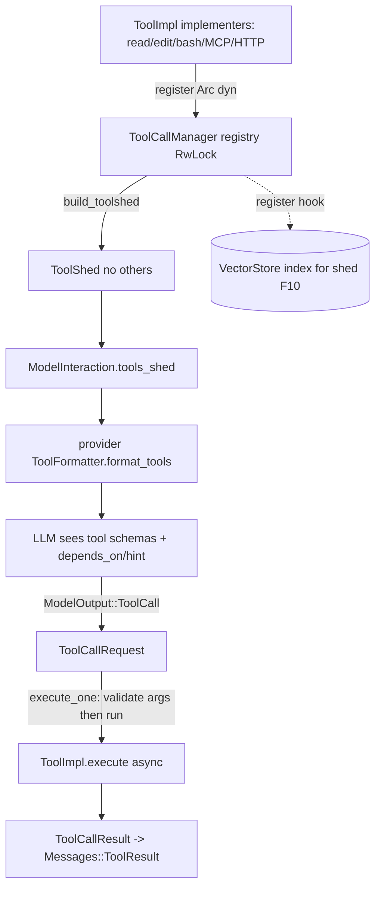

# Feature 09: ToolImpl & Registry

> **Review status (2026-06-14) — self-review against code (subagent unavailable):**
> 1. **`Tool`, `ToolShed`, `ToolFormatter`, `Args`, `ArgType`, `ToolChoice` ALREADY EXIST** in
>    `backends/foundation_ai/src/types/mod.rs` (`Tool` :1012, `ToolShed` :1067, `ToolFormatter` trait
>    :1140, `Args` :633, `ArgType` :590, `ToolChoice` :1023). F09 does NOT redefine them. The
>    **`ToolImpl` trait and `ToolCallManager` are NET-NEW** in `agentic/` and bridge implementers to
>    those existing types. Decision 15's `ToolDefinition`/`ToolCallResult`/`ToolError` are new; they
>    map onto the existing `Tool`/`Messages::ToolResult`.
> 2. **`ToolImpl::execute` returns `impl Future` in Decision 15** (`-> impl Future<Output=...> + Send`).
>    But the agentic layer is **valtron, not async** (Decision 08: "we valtron it all"). An `impl
>    Future` on a trait method is **not object-safe** — `Arc<dyn ToolImpl>` (which the registry stores,
>    Decision 15 line 71) would not compile. **OD-09-1 (load-bearing):** make `execute` either (a) a
>    **sync** `fn execute(&self, args) -> Result<ToolCallResult, ToolError>` driven by a valtron task
>    (the DAG executor F11 owns concurrency), or (b) return a **`TaskIterator`** the F11 DAG pumps. Rec
>    (a): sync + object-safe; F11 parallelism comes from valtron `broadcast`, not per-tool async. The
>    Decision-15 `async fn` signature MUST be reconciled — flag for the user.
        Makes no sense to me, we already write async_traits right? why not just write an async trait with an async method.

> 3. **`Args` is a JSON-Schema wrapper, not a builder of params.** `ToolDefinition.arguments` should be
>    `Args` (the existing type at :633, built via `foundation_jsonschema::scheme`), so a tool's schema
>    flows unchanged into `Tool.arguments` and out through `ToolFormatter::format_tools` (:1147). Decision
>    15's `arguments: Args` matches reality — keep it; reuse the existing `Args`.
> 4. **`execute` takes `HashMap<String, ArgType>`** to match `ModelOutput::ToolCall.arguments` (the real
>    type is `Option<HashMap<String, ArgType>>`, :873). The registry validates args against the tool's
>    `Args.validator` (`foundation_jsonschema::ValidationOptions`, :638) BEFORE calling `execute`.
> 5. **`ToolCallResult.content` is `UserModelContent`** (Decision 15 line 60) — matches the real
>    `Messages::ToolResult.content: UserModelContent` (:916). The registry wraps a `ToolCallResult` into
>    a `SessionRecord::Conversation { message: Messages::ToolResult { .. } }` for F08 (F11 owns the
>    persist-before-deliver; F09 owns the *shape*).
> 6. **VectorStore registration is for the `shed` meta-tool (F10), not F09's core.** Decision 15 line 81
>    inserts the tool description into the vector store on `register`. The *insertion* belongs here (so
>    every registered tool is discoverable), but the **`shed` tool + ShedQuery/ShedResult are F10**. F09
>    exposes a `register`-time hook; F10 implements the search tool. Embedding the description requires
>    F31 (EmbeddingProvider) — added as a soft dep via F10, not a hard F09 dep (registration can defer
>    indexing). `register` mutation: Decision 15 uses `&mut self`; behind `Arc` that fails — use **`&self`
>    + interior mutability** (`RwLock<HashMap>`), matching Decision 08. (OD-09-3.)
> 7. **`build_toolshed` must drop `others`.** The real `ToolShed` (:1076) still has
>    `others: Option<Vec<Tool>>`; F01 removes it. F09's `build_toolshed` populates the post-F01 struct
>    (`shed`/`memory`/`delegate`/`read`/`edit`/`write`/`search`/`bash`) — `read`/`edit`/`write`/`search`
>    are non-optional `Tool` in the real struct (:1071-1074), so a session with none registered still
>    needs *some* `Tool` there or F01 must make them `Option` — **flag: F01/F10 must reconcile the
>    ToolShed field optionality** with "zero tools registered" (Decision 15 §Always Present). (OD-09-4.)

> Implements Decision 15 (the `ToolImpl` → registry → schema pipeline, minus the `shed` meta-tool
> which is F10). Owns the **tool contract** every tool implements and the **registry** that holds them,
> looks them up by name, validates arguments, and builds the `ToolShed` the LLM sees.

## WHY: Problem Statement

The agent needs a uniform way to define, register, look up, and describe tools. `foundation_ai` has
the *wire types* (`Tool`, `ToolShed`, `ToolFormatter`) but no **implementer contract** (how does a
tool actually run?) and no **registry** (how do we go from "the LLM called `read_file`" to running
code?). Decision 15 defines `ToolImpl` (`definition()` + `execute()`) and the `ToolCallManager`
registry. Without these the tool-call loop has wire types but nothing behind them.

## WHAT: Solution

### The `ToolImpl` contract (async-first — OD-09-1, Item #1 + Item #13)

```rust
// backends/foundation_ai/src/agentic/tools/mod.rs
#[async_trait]
pub trait ToolImpl: Send + Sync {
    /// The LLM-facing definition (name, description, JSON-Schema args).
    fn definition(&self) -> ToolDefinition;

    /// Run the tool with validated arguments. ASYNC (Item #1: async-first everywhere).
    /// Cancellation = valtron stops polling the future and drops it. Drop-based cleanup
    /// handles process kills, connection closes, etc. — implementers own their cleanup.
    async fn execute(&self, arguments: HashMap<String, ArgType>) -> Result<ToolCallResult, ToolError>;
}

pub struct ToolDefinition {
    pub name: String,
    pub description: String,
    pub arguments: Args,            // existing foundation_ai::types::Args (JSON Schema + validator)
    pub category: String,          // for shed discovery (F10)
}

pub struct ToolCallResult {
    pub content: UserModelContent, // existing type — becomes Messages::ToolResult.content
    pub error_detail: Option<String>,
}

#[derive(Debug, Clone, PartialEq)]
pub enum ToolError {
    UnknownTool(String),
    InvalidArguments { tool: String, reason: String },
    Execution { tool: String, reason: String },
    Timeout { tool: String },
}
```

`ToolError` is `Clone + PartialEq + Debug` so F02's `AgenticError` (which must stay `Clone+PartialEq`
for the F03 stream derives) can embed it.

### The registry — `ToolCallManager` (registration + lookup half)

```rust
pub struct ToolCallManager { inner: Arc<ToolCallManagerInner> }   // cheap clone across tasks

struct ToolCallManagerInner {
    tools: RwLock<HashMap<String, Arc<dyn ToolImpl>>>,  // &self register (OD-09-3)
    session_id: SessionId,
    // F11 adds: execution_queue, cancellation, message_api (persist), retry config.
    // F10 adds:  vector_store + embedder for shed discovery indexing.
}

impl ToolCallManager {
    pub fn register(&self, tool: Arc<dyn ToolImpl>);              // &self + interior mutability
    pub fn deregister(&self, name: &str);
    pub fn get(&self, name: &str) -> Option<Arc<dyn ToolImpl>>;
    pub fn names(&self) -> Vec<String>;

    /// Look up + validate args against the tool's Args.validator, then execute.
    /// (Pure execution; F11 owns scheduling/persistence/retry — this is the inner call.)
    pub async fn execute_one(&self, call: &ToolCallRequest) -> Result<ToolCallResult, ToolError>;

    /// Build the ModelInteraction.tools_shed from the registry (Decision 15 build_toolshed).
    pub fn build_toolshed(&self) -> ToolShed;
}

pub struct ToolCallRequest {     // parsed from ModelOutput::ToolCall (F01 added depends_on/hint)
    pub id: String,
    pub name: String,
    pub arguments: HashMap<String, ArgType>,
    pub depends_on: Vec<String>,        // F01 field
    pub execution_hint: ExecutionHint,  // F01 field
}
```

`execute_one` validates with `definition().arguments.validator.compile()` (the real
`foundation_jsonschema` validator) and returns `ToolError::InvalidArguments` on failure before ever
calling user code.

### Schema path: `ToolImpl` → `Tool` → `ToolShed` → `ModelInteraction`

```text
ToolImpl::definition() -> ToolDefinition { name, description, arguments: Args, category }
    │  (ToolDefinition -> foundation_ai::types::Tool: id=name, name, description, arguments: Some(Args))
    ▼
ToolCallManager::build_toolshed() -> ToolShed { shed(F10), read, edit, write, search, bash, .. }   // NO others
    ▼
ModelInteraction.tools_shed: Option<ToolShed>   (:1083)
    ▼
provider's ToolFormatter::format_tools(&[Tool]) -> provider JSON   (:1147)
```

The `Args.schema` already carries the JSON Schema, so `depends_on`/`execution_hint` (Decision 04's
LLM-declared DAG fields) are injected into each tool's schema **here** (so the LLM knows it can
declare them) — F11 reads them back off `ModelOutput::ToolCall`.

## Architecture



## Fundamentals Documentation (zero-to-expert) — REQUIRED

Author `fundamentals/` covering: LLM function/tool calling (what a tool definition is, how providers
consume it, the request/result round trip); **async trait design** (`#[async_trait]` for `dyn`-safe async
methods; `async fn` returns a boxed future behind `Arc<dyn ToolImpl>`); **drop-based cancellation**
(valtron stops polling → future dropped → resources cleaned up; implementers own their `Drop` logic for
processes/connections); registries with `&self` interior mutability over `Arc` (why `&mut self` fails
behind `Arc`); JSON-Schema argument validation (`foundation_jsonschema` `ValidationOptions`/`Validator`,
validate-before-execute); the `ToolImpl`→`Tool`→`ToolShed`→provider schema pipeline; wrapping external
tools (MCP/HTTP/CLI) behind one trait; injecting DAG hint fields (`depends_on`/`execution_hint`) into
tool schemas so the LLM can declare dependencies. (Task — see list.)

## HOW: Implementation Steps

1. `ToolImpl` trait (async `execute`, OD-09-1) + `ToolCallResult`/`ToolError` (`Clone+PartialEq+Debug`).
   `Tool` gains `category: Option<String>` (OD-09-2).
2. `ToolCallManager` registry (`&self` `register`/`get`/`names` over `Arc<RwLock<Inner>>`, OD-09-3).
4. `execute_one`: lookup → validate args via `Args.validator` → call `execute` → map errors.
5. `build_toolshed` populating the post-F01 `ToolShed` (no `others`); inject `depends_on`/
   `execution_hint` into each tool schema.
6. `register`-time discovery hook (description → vector index) — interface only; F10 fills it.
7. Tests: register/lookup/deregister; arg validation rejects bad input before execute; unknown-tool
   error; build_toolshed shape (no `others`, shed always present); schema carries DAG fields; a
   sample sync `MockTool` round-trips through format_tools; wasm build.

## Open Decisions

- **OD-09-1 — execute signature: RESOLVED (user, 2026-06-15; Item #1 + Item #13) → async.** `execute`
  is `async fn` via `#[async_trait]` (boxed future behind `Arc<dyn ToolImpl>` — dyn-safe). Consistent
  with Item #1 (async-first everywhere). **Cancellation is drop-based:** valtron stops polling the
  future and drops it → Rust's ownership cleanup fires (process handles, connections, etc.).
  Implementers own their `Drop` logic for resources. No `CancelToken`/`ProcessHandle`/SIGKILL ladder
  needed — the framework just drops the future. Tools that do blocking sync work inside the async fn
  are the implementer's concern, not the framework's.

- **OD-09-2 — ToolDefinition vs Tool: RESOLVED (user, 2026-06-15) → consolidate.** `ToolDefinition`
  merges into `Tool` (add `category: Option<String>` to `Tool` for shed discovery). One type, no
  conversion. `category` is `None` for tools that don't use shed.

- **OD-09-3 — register mutability: RESOLVED (user, 2026-06-15) → `&self` + `Arc<RwLock<Inner>>`.** 
  `ToolCallManager { inner: Arc<RwLock<ToolCallManagerInner>> }` — `register`/`deregister` take
  `&self`, write-lock the inner. Reads (`get`/`names`/`build_toolshed`) take a read-lock.

- **OD-09-4 — ToolShed optionality: RESOLVED (user, 2026-06-15) → `Option<ToolShed>`.** 
  `ModelInteraction.tools_shed` becomes `Option<ToolShed>`. With zero tools registered,
  `build_toolshed` returns `None` — no stubs, no complicated messes. F01 makes it `Option`.

- **OD-09-5 — duplicate registration: RESOLVED (user, 2026-06-15) → error.** Registering a tool with
  an already-taken name returns `ToolError::DuplicateTool(name)`. Registration happens at init; a
  duplicate is a bug the developer should fix immediately.

## Target Files

- `backends/foundation_ai/src/agentic/tools/mod.rs` (new) — `ToolImpl`, `ToolCallManager` (registry half)
- coordinates F01 (`ModelOutput::ToolCall` DAG fields, `ToolShed` no-`others`), existing
  `types/mod.rs` (`Tool`/`Args`/`ToolFormatter`), F08 (persist results), F10 (shed tool), F11
  (execution DAG)

## Tests

```bash
cargo test -p foundation_ai -- agentic::tools
cargo build -p foundation_ai --target wasm32-unknown-unknown
```

## Verification

```bash
cargo build -p foundation_ai
cargo build -p foundation_ai --target wasm32-unknown-unknown
cargo clippy -p foundation_ai -- -D warnings
cargo test  -p foundation_ai -- agentic::tools
```

## Done When

- `ToolImpl` (async `execute` via `#[async_trait]`, dyn-safe behind `Arc`) + `ToolCallManager` registry
  (`&self` over `Arc<RwLock<Inner>>`) register/look up/validate/build `Option<ToolShed>` (no `others`);
  cancellation is drop-based (valtron drops the future); duplicate registration errors; arguments
  validated against JSON Schema before execution; DAG hint fields injected into schemas; `Tool` gains
  `category` (consolidated from `ToolDefinition`); builds native + wasm.
- OD-09-1..5 all resolved; fundamentals authored.
