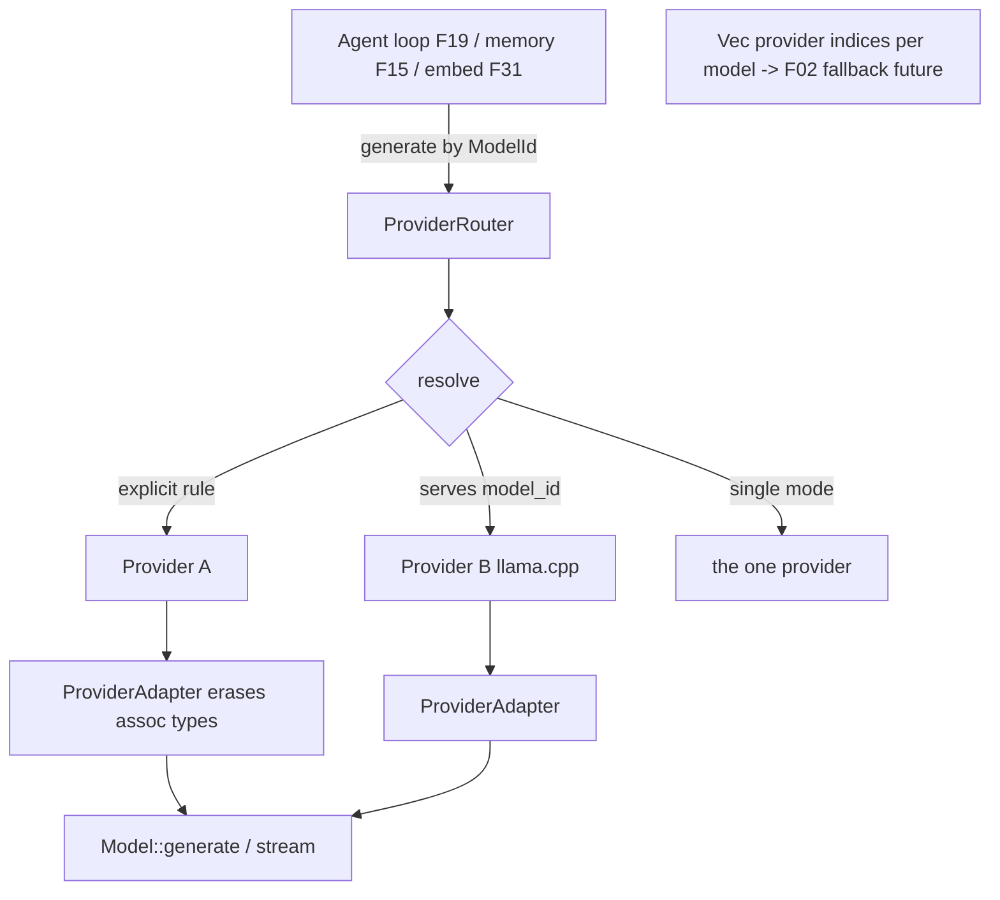

# Feature 12: ModelProviderRouter

> **Review status (2026-06-14) — self-review against code (subagent unavailable):**
> 1. **`ModelProvider` is NOT object-safe as written.** The real trait (`types/mod.rs:1461`) has
>    **associated types** `type Config: AuthProvider` (:1462) and `type Model: Model` (:1463), plus
>    `fn create(self, ..) -> Result<Self>` (:1478, `Self`-returning, consumes self). You **cannot**
>    write `Arc<dyn ModelProvider>` (Decision 18 line 49 / 110 assumes you can — that's wrong). The
>    router needs an **object-safe boxed surface**. **OD-12-1 (load-bearing):** define a new
>    `RoutableProvider` (object-safe: erases `Config`, returns `BoxModel` (`Box<dyn Model>`) or operates on
>    `ModelInteraction`→`Vec<Messages>` directly) that wraps any concrete `P: ModelProvider`, and have
>    `ProviderRouter` hold `Vec<Box<dyn RoutableProvider>>`. Flag for the user — this reshapes how
>    Decision 18's builder takes a provider.
> 2. **`Model` is also not object-safe** — `type Formatter: ToolFormatter` (:1393) + `fn stream(..) ->
>    impl StreamIterator` (:1436, RPITIT, not dyn-safe). So `Arc<dyn Model>` (Decision 16 line 290) also
>    can't exist. The erased surface must expose `generate(ModelInteraction, Option<ModelParams>) ->
>    GenerationResult<Vec<Messages>>` (:1420, object-safe — concrete args, concrete return) and a boxed
>    stream (`Box<dyn StreamIterator<D=Messages,P=ModelState>>`). (OD-12-2.)
> 3. **Providers already declare their models** via `get_all(model_id) -> Vec<ModelSpec>` (:1521),
>    `get_one(model_id) -> ModelSpec` (:1512), and `describe() -> ModelProviderDescriptor` (:1487). The
>    descriptor (`types/mod.rs:254`) carries `provider: ModelProviders` (:259) + `api` + cost +
>    `context_window` but **NOT a list of supported model ids** — so "provider-declared supported
>    models" means the router calls `get_one`/`get_all` and treats success/`NotFound`
>    (`ModelProviderErrors::NotFound`, errors :208) as the routing signal, and/or holds an explicit
>    `routes: model→provider` map. (OD-12-3.)
> 4. **`ModelId` is an enum** (`Name/Alias/Group/Architecture(String, Option<Quantization>)`, :362), not
>    a string. Routing keys on `ModelId` equality / a provider's `get_one(model_id)` resolving. The
>    builder's `model("claude-sonnet-4-6")` is `ModelId::Alias` or `Name`.
> 5. **Same-model multi-provider fallback is DESIGN-AWARE, not implemented now** (user's note). The
>    router data model supports N providers per model (a `Vec<provider_idx>` per route) but F12 ships
>    single-winner routing; the fallback *iteration* is wired by F02's circuit breaker later. Keep the
>    `Vec` so F02 can light it up without a reshape.
> 6. **F31 (Embedding) declared F12 as a hard dep** (`31-embedding-provider/feature.md` review #6:
>    "F12 ProviderRouter is an undeclared dep and UNWRITTEN"). F12 must therefore also route the
>    **embedding** model (which can differ from the chat model). The erased surface includes the
>    embedding generation path (the marker-message `ModelOutput::Embedding`, F31 review #2) so F31 routes
>    through F12. (OD-12-4.)
> 7. **This is the spec's one "(new)" feature** (requirements Feature Index F28 row: "(new)") — no
>    Decision doc; design follows the user's note + the real provider trait. Record the rationale in the
>    feature itself.

> A `ProviderRouter` that presents a provider-like surface while routing each requested `ModelId` to
> the provider that serves it. Supports one provider (pass-through) or many (routed). Built on the
> REAL (associated-type-heavy, non-object-safe) `ModelProvider`/`Model` traits via an erased
> `RoutableProvider` adapter.

## WHY: Problem Statement

The agent loop (F19), memory generation (F15), embeddings (F31), and the circuit breaker (F02) all
need to ask for a model **by id** without knowing which provider hosts it — Anthropic for
`claude-*`, a local llama.cpp for a GGUF, OpenAI for `gpt-*`. Decision 18's builder wants a single
"provider" handle. The catch: the real `ModelProvider`/`Model` traits use associated types + RPITIT
and are **not** object-safe, so `Arc<dyn ModelProvider>` (as several decisions assume) does not
compile. This feature provides the missing **object-safe router** so one handle fronts any number of
concrete providers and resolves model→provider.

## WHAT: Solution

### Object-safe erased surface (OD-12-1/2)

```rust
// backends/foundation_ai/src/agentic/router.rs
/// Object-safe erasure of a concrete `P: ModelProvider`. One per real provider.
pub trait RoutableProvider: Send + Sync {
    fn descriptor(&self) -> ModelProviderResult<ModelProviderDescriptor>;   // wraps describe()
    /// Does this provider serve `model_id`? (get_one resolves vs NotFound.)
    fn serves(&self, model_id: &ModelId) -> bool;
    /// Object-safe generation (concrete in/out — dyn-safe, unlike Model::stream's RPITIT).
    fn generate(&self, model_id: &ModelId, interaction: ModelInteraction, params: Option<ModelParams>)
        -> GenerationResult<Vec<Messages>>;
    /// Boxed stream (erases Model::stream's `impl StreamIterator`).
    fn stream(&self, model_id: &ModelId, interaction: ModelInteraction, params: Option<ModelParams>)
        -> GenerationResult<Box<dyn StreamIterator<D = Messages, P = ModelState>>>;
}

/// Blanket adapter: any concrete ModelProvider becomes Routable.
pub struct ProviderAdapter<P: ModelProvider> { provider: P }
impl<P: ModelProvider> RoutableProvider for ProviderAdapter<P> { /* get_model + generate/stream */ }
```

### The router (single OR many providers)

```rust
pub struct ProviderRouter { inner: Arc<RouterInner> }

struct RouterInner {
    providers: Vec<Box<dyn RoutableProvider>>,
    routes: RwLock<HashMap<ModelId, Vec<usize>>>,   // model -> provider indices (Vec for future fallback)
    rules: Vec<RoutingRule>,                          // optional explicit overrides
}

impl ProviderRouter {
    pub fn single(provider: impl ModelProvider + 'static) -> Self;   // pass-through
    pub fn builder() -> ProviderRouterBuilder;                       // add_provider(..), rule(..)

    /// Resolve model->provider: explicit route, else first provider whose serves(model_id).
    fn resolve(&self, model_id: &ModelId) -> Result<&dyn RoutableProvider, AgenticError>;

    pub fn generate(&self, model_id: &ModelId, mi: ModelInteraction, p: Option<ModelParams>)
        -> GenerationResult<Vec<Messages>>;
    pub fn stream(&self, model_id: &ModelId, mi: ModelInteraction, p: Option<ModelParams>)
        -> GenerationResult<Box<dyn StreamIterator<D = Messages, P = ModelState>>>;

    /// Used by F15/F02 to pick the memory/fallback model handle.
    pub fn memory_model(&self, cfg: &AgentConfig) -> Result<&dyn RoutableProvider, AgenticError>;
}

pub struct RoutingRule { pub model: ModelId, pub provider: ModelProviders }   // explicit override
```

### Routing resolution order

1. **Explicit rule** (`RoutingRule { model, provider }`) — exact override wins.
2. **Declared support** — first provider where `serves(model_id)` is true (`get_one(model_id)` resolves
   rather than `NotFound`).
3. **Single-provider mode** — one provider serves everything (pass-through, no routing table).
4. **Unresolved** → `AgenticError::Generation(...)` / a router `NoProviderForModel` error.

The `routes` value is a `Vec<usize>` so F02 can later iterate providers for **same-model fallback**
(design-aware now, F02 lights it up).

## Architecture



## Fundamentals Documentation (zero-to-expert) — REQUIRED

Author `fundamentals/` covering: provider abstraction & model routing (why an app shouldn't hardcode
which provider hosts which model); **object safety in Rust** (why associated types + RPITIT
(`impl Trait` in return position) break `dyn`, and the erasure/adapter pattern that fixes it —
`ProviderAdapter` wrapping a concrete `P: ModelProvider`); single-vs-multi-provider topologies;
declared-capability routing vs explicit rules; designing for future multi-provider same-model fallback
(the `Vec` route, circuit-breaker handoff); routing distinct model roles (chat vs memory vs embedding).
(Task — see list.)

## HOW: Implementation Steps

1. `RoutableProvider` (object-safe) + `ProviderAdapter<P: ModelProvider>` blanket impl (OD-12-1/2).
2. `ProviderRouter`/`RouterInner` + `single()` / `builder()`.
3. `resolve` (explicit rule → `serves` → single → unresolved error); `routes`/`rules` tables.
4. `generate` / `stream` delegating to the resolved erased provider.
5. `memory_model` helper (chat≠memory model) for F15/F02; embedding routing path for F31 (OD-12-4).
6. Keep `Vec<usize>` routes for future F02 same-model fallback (design-aware).
7. Tests: single-provider pass-through; two-provider routing by declared support; explicit rule
   override; unresolved model errors cleanly; memory model resolves; a `MockModelProvider` (F21)
   round-trips `generate`/`stream` through the adapter; wasm build (with wasm-capable providers F00c).

## Open Decisions

> **RESOLVED (user, 2026-06-15; Item #8 / discussion §H6).** **Why `dyn ModelProvider` is impossible:**
> `Model { type Formatter; … }` and `ModelProvider { type Config; type Model; … }` have **associated
> types**, and `generate`/`stream` return **`impl StreamIterator`** (RPIT). A trait is only `dyn`-able with
> no unbound associated types and no RPIT methods — `ModelProvider` violates both → `Arc<dyn
> ModelProvider>` can't exist. Hence the **`RoutableProvider`** adapter.

- **OD-12-1 — erased surface: RESOLVED → `RoutableProvider` adapter.** Object-safe trait with **concrete**
  signatures wrapping a concrete `ModelProvider`; the router holds `Arc<dyn RoutableProvider>` (reshapes
  Decision 18's `Arc<dyn ModelProvider>`).
- **OD-12-2 — boxed stream: RESOLVED → yes.** `RoutableProvider::stream` returns
  `Box<dyn StreamIterator<D=Messages,P=ModelState>>` to erase `Model::stream`'s `impl StreamIterator`. The
  per-turn boxing is negligible vs. model latency.
- **OD-12-3 — support detection: RESOLVED → rule first, then `get_one` probe.** Check an optional explicit
  `model_id → provider` route map first; otherwise try each provider's `get_one(model_id)` and use the one
  that resolves (`NotFound` = doesn't serve it). Zero-config default + explicit override.
- **OD-12-4 — embedding routing: RESOLVED → yes, resolves like chat.** F31 routes the embedding `model_id`
  through the same router (embedding model may differ from chat); same resolution path.
- **OD-12-5 — same-model fallback: RESOLVED → F12 single-winner; fallback in F02/F04.** F12 resolves one
  winning provider per `model_id` now (keeps a `Vec` for the future); the retry/circuit-breaker
  fallback **iteration** across providers belongs to **F02** (error handling) / **F04** (budget), not the
  router.

## Target Files

- `backends/foundation_ai/src/agentic/router.rs` (new) — `RoutableProvider`, `ProviderAdapter`,
  `ProviderRouter`
- coordinates the existing `ModelProvider`/`Model`/`ModelInteraction`/`ModelId` (`types/mod.rs`), F31
  (embedding routing), F15 (memory model), F02 (fallback/circuit breaker), F20 (builder takes a router)

## Tests

```bash
cargo test -p foundation_ai -- agentic::router
cargo build -p foundation_ai --target wasm32-unknown-unknown
```

## Verification

```bash
cargo build -p foundation_ai
cargo build -p foundation_ai --target wasm32-unknown-unknown
cargo clippy -p foundation_ai -- -D warnings
cargo test  -p foundation_ai -- agentic::router
```

## Done When

- `ProviderRouter` fronts one or many providers behind an object-safe `RoutableProvider` adapter
  (works around the non-object-safe real `ModelProvider`/`Model`); resolves model→provider by explicit
  rule then declared support; single-provider pass-through; memory + embedding model roles resolve;
  `Vec` routes retained for F02 same-model fallback; builds native + wasm.
- OD-12-1..5 resolved (OD-12-1 flagged for the user); fundamentals authored.
