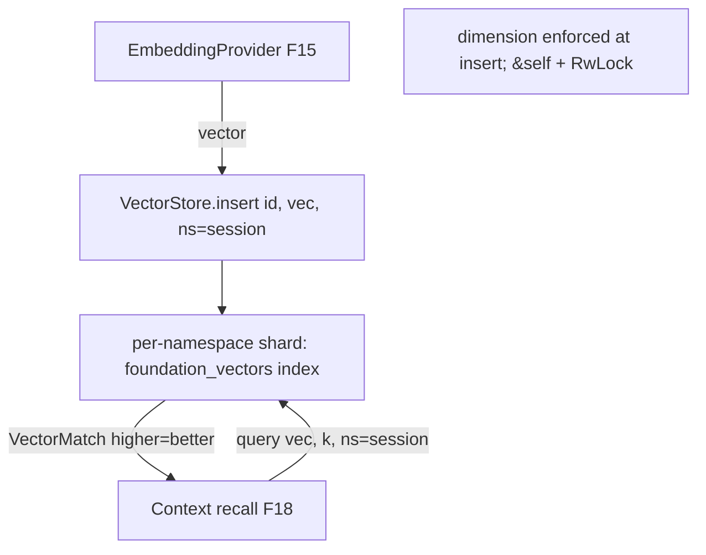

# Feature 12: VectorStore trait + in-memory backend

> **Review status (2026-06-14) — folded:** (1) `FlatIndex`/`VectorIndex` are **F09** deliverables,
> not F08 (F08 has only `flat_top_k`) — `depends_on` now includes F09; the shard uses F09's
> `FlatIndex`. (2) **`delete` needs a namespace** (`delete(ns, ids)`) — id-only forces an O(all-shards)
> scan. (3) **Conform to foundation_db conventions**: use `StorageResult`/`StorageError` (+ vector
> variants) not a bespoke `VectorStoreError`; decide `query` stream-vs-`Vec` explicitly (Decision 07
> uses `Vec` — record the deviation from the `StorageItemStream` norm). (4) **Add `AsyncVectorStore`**
> (`#[async_trait(?Send)]`) — F14's CF/D1 backends need it (biggest omission). (5) **Two-level
> locking**: outer `RwLock` for shard lookup + inner lock for shard mutation (a single
> `RwLock<HashMap>` serializes all inserts). (6) **F12 owns** adding `foundation_vectors` to root
> `[workspace.dependencies]` + `foundation_db/Cargo.toml` (absent today). (7) **metadata-on-match**:
> `flat_top_k` returns only `id+score`; define how `query` returns metadata / filters by `record_type`
> for F18 (return `VectorEntry` refs or post-filter). (8) define `VectorStoreStats`, `flush` no-op,
> query/`insert_batch` dimension checks; state "volatile — persistence is F13/F14". See OD-12-5..9.

> Implements Decision 07's `foundation_db::VectorStore` storage contract + the in-memory backend.
> Storage lives in `foundation_db`; the *algorithms* come from `foundation_vectors` (F08/F09).
> Resolves the gaps' **cross-session isolation** issue: `query` takes a **namespace** so multiple
> sessions sharing one store don't contaminate each other's recall.

## WHY: Problem Statement

The Message API (F16) and memory (F18/F19) need to insert embeddings and query nearest neighbors.
No `VectorStore` exists in `foundation_db` (verified). Decision 07 splits algorithms
(`foundation_vectors`) from storage (`foundation_db::VectorStore`). This feature adds the trait +
the in-memory backend (the default, and the fallback every other backend reuses). Two correctness
requirements from the gaps analysis: **dimension consistency** (mixing dims breaks similarity) and
**namespace scoping** (per-session isolation when one physical store is shared).

## WHAT: Solution

### Trait (in `foundation_db`)

```rust
pub struct VectorEntry { pub id: String, pub vector: Vec<f32>, pub metadata: VectorMetadata }
pub struct VectorMetadata { pub namespace: String, pub record_type: Option<String>, /* small */ }
// VectorMatch + DistanceMetric are RE-EXPORTED from foundation_vectors (F08 OD-08-8), not redefined.

pub struct VectorStoreConfig { pub dimensions: u16, pub metric: DistanceMetric }

pub trait VectorStore: Send + Sync {
    fn insert(&self, id: &str, vector: &[f32], metadata: VectorMetadata) -> Result<(), VectorStoreError>;
    fn insert_batch(&self, entries: &[VectorEntry]) -> Result<(), VectorStoreError>;
    /// Nearest neighbors, scoped to `namespace` (session isolation). top_k via foundation_vectors.
    fn query(&self, vector: &[f32], top_k: usize, namespace: Option<&str>) -> Result<Vec<VectorMatch>, VectorStoreError>;
    fn delete(&self, ids: &[&str]) -> Result<(), VectorStoreError>;
    fn flush(&self) -> Result<(), VectorStoreError>;
    fn stats(&self) -> VectorStoreStats;
}

/// Async mirror for Promise-based backends (CF D1/KV/Vectorize, external HTTP) — F13/F14 consume it.
/// Mirrors the crate's other `Async*Store` traits. THIS IS A REAL F12 DELIVERABLE (not just a note).
#[async_trait::async_trait(?Send)]
pub trait AsyncVectorStore {
    async fn insert_async(&self, id: &str, vector: &[f32], metadata: VectorMetadata) -> Result<(), VectorStoreError>;
    async fn query_async(&self, vector: &[f32], top_k: usize, namespace: Option<&str>) -> Result<Vec<VectorMatch>, VectorStoreError>;
    async fn delete_async(&self, namespace: Option<&str>, ids: &[&str]) -> Result<(), VectorStoreError>;
    async fn flush_async(&self) -> Result<(), VectorStoreError>;
}
```

> **`delete` takes a namespace** on both traits (`delete(namespace, ids)`) — id-only would force an
> O(all-shards) scan and external providers (Pinecone) require it. (Convention note: the crate's
> stores use `StorageResult`/`StorageError`; Decision 07 uses a bespoke `Vec`/error — F12 reconciles
> by extending `StorageError` with vector variants; see OD-12-5.)

- **Dimension enforcement:** `insert` validates `vector.len() == config.dimensions` → error on mismatch
  (Decision 06/07). The store is created with a fixed dimension.
- **Namespace scoping:** entries carry a `namespace` (the `SessionId` string); `query` filters to it.
  `None` = search all (admin/global). This is the gaps' cross-session-isolation fix.
- **`&self` everywhere** (Decision 08): interior mutability (`RwLock`) — the Embedding task inserts
  while the Agent loop queries.

### In-memory backend — `InMemoryVectorStore`

```rust
pub struct InMemoryVectorStore {
    config: VectorStoreConfig,
    inner: RwLock<HashMap<String /*namespace*/, NamespaceShard>>,  // per-namespace entries + index
}
// NamespaceShard holds the foundation_vectors index (FlatIndex now; IVF/HNSW when F09 lands)
```

- Per-namespace `foundation_vectors` index (F08 `FlatIndex`; swappable to IVF/HNSW per F09's
  `VectorIndex` + config). `query` runs the index `search` within the namespace shard.
- Optional global normalization on insert (F08 OD-08-1) so cosine==dot.
- The default store (Decision 18) and the **fallback** every persistent backend (F13/F14) reuses for
  the compute path.

### Relationship to embeddings & message API

`EmbeddingProvider` (F15) produces vectors; `Message API` (F16) inserts them keyed by message id with
`namespace = session_id`; `Context` (F18) queries with the session namespace for semantic recall.

## Architecture



## Fundamentals Documentation (zero-to-expert) — REQUIRED

Author `fundamentals/` covering: the algorithms-vs-storage split (why `foundation_vectors` owns math,
`foundation_db` owns persistence); vector store design (namespaces/partitions, dimension consistency,
metadata filtering); interior mutability for concurrent `&self` insert/query (`RwLock` granularity);
re-exporting types across crates to avoid double-definition; how embeddings flow from model → store →
recall. (Task — see list.)

## HOW: Implementation Steps

1. `VectorStore` trait + `VectorEntry`/`VectorMetadata`/`VectorStoreConfig`/`VectorStoreError` in
   `foundation_db`; re-export `VectorMatch`/`DistanceMetric` from `foundation_vectors`.
2. `InMemoryVectorStore` with per-namespace shards + `foundation_vectors` index.
3. Dimension enforcement on insert; namespace scoping on query.
4. `insert_batch`/`delete`/`flush`/`stats`.
5. Tests: insert/query correctness vs flat ground truth; dimension-mismatch error; **namespace
   isolation** (two namespaces, queries don't cross); concurrent insert+query; wasm build.

## Open Decisions

- **OD-12-1 — index choice per store:** `FlatIndex` default; config selects IVF/HNSW (F09). Rec:
  config-driven, flat default.
- **OD-12-2 — `foundation_db` → `foundation_vectors` dep:** add it (algorithms). Confirm no cycle
  (foundation_vectors is leaf). Add `foundation_vectors` to `[workspace.dependencies]` (F08 OD-08-8).
- **OD-12-3 — namespace as metadata vs separate shard:** separate shard (rec — cleaner isolation +
  per-namespace index) vs a metadata filter on one index. Rec: shard.
- **OD-12-4 — normalization:** normalize on insert (cosine==dot) vs per-query. Rec: on insert.

## Target Files

- `backends/foundation_db/src/core/storage_provider.rs` — `VectorStore` trait + types
- `backends/foundation_db/src/core/backends/in_memory_vector_store.rs` (new)
- `backends/foundation_db/Cargo.toml` — `foundation_vectors` dep

## Tests

```bash
cargo test -p foundation_db -- vector_store
cargo build -p foundation_db --target wasm32-unknown-unknown
```

## Verification

```bash
cargo build -p foundation_db
cargo build -p foundation_db --target wasm32-unknown-unknown
cargo clippy -p foundation_db -- -D warnings
cargo test  -p foundation_db -- vector_store
```

## Done When

- `VectorStore` trait + `InMemoryVectorStore` work over `foundation_vectors`; dimension enforced;
  **namespace isolation** verified; `&self` concurrent insert/query safe; builds native + wasm.
- `VectorMatch`/`DistanceMetric` are re-exported from `foundation_vectors` (no double-definition).
- OD-12-1..4 resolved; fundamentals authored.
