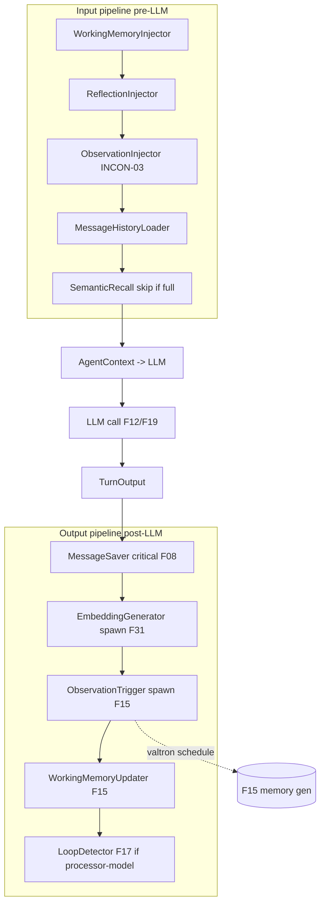

# Feature 14: Input/Output Processors

> **Review status (2026-06-14) — self-review against code (subagent unavailable):**
> 1. **Decision 11 sketches but does NOT fully specify the trait.** It shows `InputProcessorWorkflow`
>    with dedup-by-`id()` + priority order (lines 109-128) and tables of processors, but leaves the
>    `process` return type, the *skip* mechanism, and the output-processor trait undefined. F14 owns the
>    **full** spec (the requirements §F30 task: "Input/output processor interface fully specified (return
>    type, skip, dedup)").
> 2. **Processors operate on F16's `AgentContext`** (input) and on the turn's new `SessionRecord`s
>    (output). `AgentContext` is F16's assembled-context type (`16-context-provider-assembly/
>    feature.md:38` `assemble(..) -> AgentContext`). Input processors *mutate* it pre-LLM; output
>    processors *consume* the LLM result + emit side effects. F14 does NOT re-implement memory/recall —
>    it sequences F16 (assembly), F15 (memory triggers), F08 (save/index), F17 (loop detect) as
>    processors. (Boundary: F14 = the pipeline, F16/F15/F08/F17 = the work.)
> 3. **The input processors largely DUPLICATE F16's `assemble` order** (Decision 11 §Input Processors:
>    WorkingMemoryInjector/MessageHistoryLoader/SemanticRecall/ReflectionInjector/ObservationInjector vs
>    F16's exact assembly order). **OD-14-1 (load-bearing):** decide whether F16 `assemble` IS the input
>    pipeline (processors are just its named, reorderable steps) OR processors wrap a bare context and
>    F16 is one processor. Rec: **`assemble` is the default input pipeline; processors let callers
>    insert/replace steps** — so the deterministic Decision 03 order (which F16+F20 resume depend on) is
>    preserved unless a caller deliberately overrides. Flag (this affects replay determinism).
> 4. **`process` must be fallible + skippable + non-blocking.** Return
>    `ProcessorOutcome` = `{ Applied, Skipped(reason), Failed(AgenticError) }` rather than `Result<()>`
>    so a processor can *cleanly skip* (e.g. SemanticRecall when recent messages already fill the budget)
>    distinct from *failing*. A failed non-critical processor (recall, embedding) logs + continues
>    (Decision 16 "memory/vector error → continue"); a failed critical processor (MessageSaver) escalates.
>    (OD-14-2.)
> 5. **Output processors that do real work run as valtron sub-tasks, not inline.** ObservationTrigger →
>    F15 generate (a `schedule`d task, F15 OD-15-4); EmbeddingGenerator → F31 (non-blocking, F31 OD-31-6);
>    LoopDetector → F17. So an output processor's `process` either does cheap synchronous work (save id,
>    check a counter) OR **spawns** a valtron task and returns `Applied` immediately — it must NEVER block
>    `next_status`. (OD-14-3.)
> 6. **Dedup by `id()` + priority order** (Decision 11 lines 116-124): `HashSet<&str>` of processor ids,
>    first occurrence wins; execute sorted by `priority()`. Both `id()` and `priority()` are trait methods.
> 7. **`LoopDetector` as an output processor is the Decision 08-vs-11 conflict** (Decision 08 line 25:
>    LoopDetector = a *sequenced parallel task*; Decision 11 line 141: LoopDetector = an *output
>    processor*). **F17 resolves which.** F14 exposes a `LoopDetectorProcessor` ONLY if F17 picks the
>    processor model; otherwise the loop detector is a sibling task F19 composes. **NEEDS USER RULING —
>    deferred to F17.** F14 keeps the output-processor list open so either wiring works.

> Fully specifies Decision 11's Mastra-style processor interface: an **input** pipeline that transforms
> the `AgentContext` before each LLM call and an **output** pipeline that handles side effects after
> each response, both composable, deduplicated by id, ordered by priority, fallible, skippable, and
> non-blocking. Owns the pipeline; F16/F15/F08/F17 own the work each processor does.

## WHY: Problem Statement

The agent loop must, before each LLM call, inject working memory + reflections + recent + recalled
messages, and after each response, save messages, index embeddings, check memory/loop triggers, and
update working memory. Hard-coding this into the loop makes it rigid and untestable. Decision 11's
answer (from Mastra) is **processors**: small, composable, named units the loop runs in order. But
Decision 11 left the trait under-specified (no return type, skip, or output trait). This feature pins
it down.

## WHAT: Solution

```rust
// backends/foundation_ai/src/agentic/processors.rs
pub enum ProcessorOutcome {
    Applied,                 // processor ran and changed state
    Skipped(&'static str),   // deliberately did nothing (e.g. recall not needed) — NOT an error
    Failed(AgenticError),    // ran and errored
}

pub trait InputProcessor: Send + Sync {
    fn id(&self) -> &'static str;          // dedup key
    fn priority(&self) -> i32;             // execution order (lower = earlier)
    fn critical(&self) -> bool { false }   // if true, Failed aborts the turn; else logs + continues
    /// Transform the context in place before the LLM call.
    fn process(&self, ctx: &mut AgentContext) -> ProcessorOutcome;
}

pub trait OutputProcessor: Send + Sync {
    fn id(&self) -> &'static str;
    fn priority(&self) -> i32;
    fn critical(&self) -> bool { false }
    /// React to the LLM result + the turn's new records. May SPAWN a valtron task and
    /// return Applied immediately — must NOT block.
    fn process(&self, turn: &TurnOutput, spawn: &mut SpawnSink) -> ProcessorOutcome;
}

pub struct InputPipeline  { processors: Vec<Box<dyn InputProcessor>> }
pub struct OutputPipeline { processors: Vec<Box<dyn OutputProcessor>> }

impl InputPipeline {
    pub fn run(&self, ctx: &mut AgentContext) -> Vec<(&'static str, ProcessorOutcome)> {
        let mut seen = HashSet::new();
        let mut ps: Vec<_> = self.processors.iter().filter(|p| seen.insert(p.id())).collect();
        ps.sort_by_key(|p| p.priority());
        ps.into_iter().map(|p| {
            let out = p.process(ctx);
            if let ProcessorOutcome::Failed(ref e) = out { if p.critical() { /* abort */ } else { log(e) } }
            (p.id(), out)
        }).collect()
    }
}
// OutputPipeline::run mirrors this, threading a SpawnSink so processors can schedule valtron tasks.
```

### The default processors (Decision 11 tables)

**Input** (priority order): `WorkingMemoryInjector` (always) → `ReflectionInjector` (if reflections) →
`ObservationInjector` (only if obs newer than latest reflection — F16 INCON-03) → `MessageHistoryLoader`
(recent N) → `SemanticRecall` (fills remaining budget; `Skipped` when recent already fills it). All
delegate into F16's assembly surfaces (OD-14-1: these ARE F16's `assemble` steps, named + reorderable).

**Output** (priority order): `MessageSaver` (critical — F08 append) → `EmbeddingGenerator` (F31, spawns)
→ `ObservationTrigger` / `ReflectionTrigger` (F15 `check_triggers` → spawn generate) →
`WorkingMemoryUpdater` (F15, on new fact) → `LoopDetectorProcessor` (F17 — only if F17 picks the
processor model; else omitted).

### Non-blocking output (OD-14-3)

```rust
impl OutputProcessor for ObservationTrigger {
    fn process(&self, _t: &TurnOutput, spawn: &mut SpawnSink) -> ProcessorOutcome {
        match self.memory.check_triggers() {            // F15 — cheap counter read
            MemoryAction::None => ProcessorOutcome::Skipped("below threshold"),
            action => { spawn.schedule(self.memory.generate(action)); ProcessorOutcome::Applied }  // valtron, not inline
        }
    }
}
```

## Architecture



## Fundamentals Documentation (zero-to-expert) — REQUIRED

Author `fundamentals/` covering: the processor/middleware pattern (composable pipelines, ordering,
dedup, separation of pipeline from work); input vs output processors (context transformation vs side
effects); the three-state outcome (Applied/Skipped/Failed) and why *skip* ≠ *fail*; critical vs
non-critical processors and graceful degradation (Decision 16); **non-blocking output processors**
(spawn a valtron task, return immediately — never block `next_status`); priority ordering & determinism
(why input order must stay stable for resume replay); how the default processors map onto F16/F15/F08/
F31/F17. (Task — see list.)

## HOW: Implementation Steps

1. `ProcessorOutcome`; `InputProcessor`/`OutputProcessor` traits (`id`/`priority`/`critical`/`process`).
2. `InputPipeline`/`OutputPipeline` (`run`: dedup by id, sort by priority, critical-vs-log handling).
3. `SpawnSink` so output processors schedule valtron tasks (F15/F31) without blocking.
4. Default input processors over F16 assembly (resolve OD-14-1: assemble == default pipeline).
5. Default output processors: MessageSaver (F08, critical) / EmbeddingGenerator (F31) / Observation+
   ReflectionTrigger (F15) / WorkingMemoryUpdater (F15) / LoopDetector slot (F17-gated).
6. Tests: dedup keeps first by id; priority ordering; `Skipped` vs `Failed` distinct; critical failure
   aborts, non-critical logs+continues; output processor spawns (doesn't block); input pipeline
   reproduces Decision 03 order (replay determinism); wasm build.

## Open Decisions

- **OD-14-1 — input pipeline vs F16 assemble (load-bearing):** `assemble` is the default input pipeline
  (named reorderable steps) — rec; preserves Decision 03 deterministic order for resume. Flag (replay
  determinism).
- **OD-14-2 — outcome type:** three-state `ProcessorOutcome` (rec) vs `Result<bool>`. Rec: three-state
  (skip ≠ fail).
- **OD-14-3 — output non-blocking:** processors spawn valtron tasks via `SpawnSink`, never block (rec).
- **OD-14-4 — LoopDetector placement:** output processor vs sibling sequenced task — **deferred to F17**
  (Decision 08-vs-11). F14 leaves the slot open. NEEDS USER RULING (in F17).
- **OD-14-5 — pipeline mutability:** can callers add/remove processors at runtime, or fixed at build?
  Rec: fixed at session build (Decision 11 composes once); runtime mutation deferred.

## Target Files

- `backends/foundation_ai/src/agentic/processors.rs` (new) — traits, pipelines, default processors
- coordinates F16 (`AgentContext`, assembly), F15 (memory triggers/updates), F08 (save/index), F31
  (embedding), F17 (loop detector), F19 (the loop that runs the pipelines)

## Tests

```bash
cargo test -p foundation_ai -- agentic::processors
cargo build -p foundation_ai --no-default-features --features agentic --target wasm32-unknown-unknown
```

## Verification

```bash
cargo build -p foundation_ai
cargo build -p foundation_ai --no-default-features --features agentic --target wasm32-unknown-unknown
cargo clippy -p foundation_ai -- -D warnings
cargo test  -p foundation_ai -- agentic::processors
```

## Done When

- `InputProcessor`/`OutputProcessor` fully specified (Applied/Skipped/Failed outcome, dedup by id,
  priority order, critical handling); input pipeline reproduces Decision 03 assembly order
  deterministically; output processors spawn valtron work without blocking; default processors wire to
  F16/F15/F08/F31; LoopDetector slot deferred to F17; builds native + wasm.
- OD-14-1..5 resolved (OD-14-1 flagged; OD-14-4 deferred to F17); fundamentals authored.
