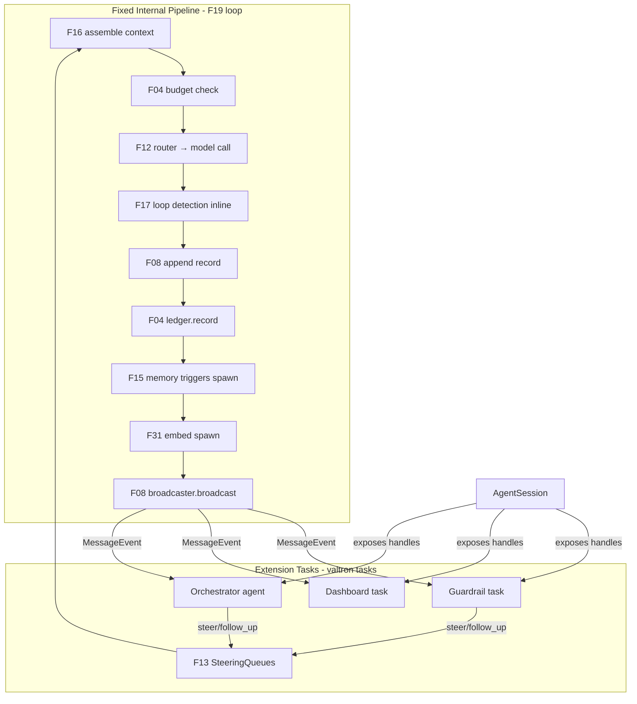

# Feature 14: Internal Pipeline & Extension Hooks

> **Major rewrite (2026-06-15; Item #11).** The `InputProcessor`/`OutputProcessor` trait abstraction is
> **removed entirely**. It mixed two concerns: (1) the framework's internal sequencing (which is fixed
> and deterministic) and (2) user extension points (which are valtron tasks, not processors). The new
> design:
> - **Internal pipeline = fixed, not a trait.** F19 calls F16/F15/F08/F31/F17 directly in Decision 03's
>   deterministic order. No `ProcessorOutcome`, no priority numbers, no dedup-by-id.
> - **User extensions = valtron tasks** that observe via F08 pub/sub and steer via F13 queues.
>   `AgentSession` exposes all handles (`message_api()`, `ledger()`, `steering_queues()`,
>   `memory_coordinator()`) so extension tasks can hook in.
> - **Pub/sub broadcaster** (F08, elevated into `foundation_core::synca::mpp`) with bounded per-subscriber
>   queues, slowest-consumer pacing, delivery tracking, and eviction on max-retry failure.

## WHY: Problem Statement

The agent loop must, before each LLM call, assemble context (working memory + reflections +
observations + history + recall) and, after each response, save records, index embeddings, and check
memory triggers. These are the framework's **fixed internal responsibilities** — they run in a
deterministic order that resume depends on. Wrapping them in a processor trait adds complexity without
value: nobody should reorder the core sequence.

But users DO need to **observe** what the agent does and **steer** it from outside — a monitoring
dashboard, a safety guardrail, an orchestrator agent, a custom RAG injector. These are **separate
valtron tasks** that read the session's event stream and inject steering/follow-up messages. They don't
need to be "processors" inside the loop — they need handles to the session's pub/sub and queues.

## WHAT: Solution

### 1. Fixed internal pipeline (no trait, no abstraction)

F19's agent loop calls its dependencies directly in Decision 03's deterministic order:

```text
PRE-LLM (every turn):
  1. F16 assemble context:
     system prompt → working memory (F15) → reflections (F15, SCRU128-latest) →
     observations (only if newer than reflection — INCON-03) →
     recent messages (F08) → semantic recall (F08, fills remaining budget)
  2. F04 budget check (is_exhausted? → halt)

MODEL CALL:
  3. F12 router → provider.stream(model_id, interaction, params)
  4. F17 loop detection check (synchronous, inline — Item #3)

POST-LLM (every turn):
  5. F08 message_api.append(record)        — buffered, returns immediately
  6. F04 ledger.record(usage)              — once per turn (not per message)
  7. F15 memory triggers (check_triggers → spawn generate if threshold hit)
  8. F31 embed (spawned, non-blocking)
  9. F08 broadcaster.broadcast(event)      — fans out to all subscribers
```

This is **not configurable**. The order is fixed. The loop calls these directly — no trait
indirection, no priority sorting, no dedup. Deterministic by construction.

### 2. Extension hooks via `AgentSession`

`AgentSession` (F20) owns all the internal components and exposes them via methods. An extension task
gets a clone of the session handle (it's `Arc`-backed, cheap) and hooks in:

```rust
impl AgentSession {
    // --- Existing (F20) ---
    pub fn steer(&self, msg: Messages);               // F13 PriorityQueue (interrupt)
    pub fn follow_up(&self, msg: Messages);            // F13 FollowUpQueue (defer)

    // --- Extension handles (NEW — F14) ---
    pub fn message_api(&self) -> &MessageApi;          // subscribe to events, read records
    pub fn ledger(&self) -> &TokenLedger;              // read token/budget state
    pub fn steering_queues(&self) -> &SteeringQueues;  // low-level queue access
    pub fn memory_coordinator(&self) -> &MemoryCoordinator; // read memory state
}
```

An extension task is a plain valtron task:

```rust
fn my_guardrail_task(session: AgentSession) -> impl TaskIterator {
    let rx = session.message_api().subscribe();   // per-subscriber bounded queue
    move |_| {
        match rx.pop() {
            Ok(MessageEvent::Appended { id, variant }) => {
                let record = session.message_api().scan_from(&id, 1);
                if looks_dangerous(&record) {
                    session.steer(Messages::User {
                        role: MessageRole::System,
                        content: "Stop — safety violation detected".into(),
                        ..
                    });
                }
                Some(TaskStatus::Ignore)  // keep running
            }
            Err(PopError::Empty) => {
                // Park until the subscriber queue has something:
                Some(TaskStatus::Depends(session.message_api().subscriber_readiness(&rx)))
            }
            Err(PopError::Closed) => None,  // session ended, clean up
        }
    }
}
```

### 3. Pub/sub broadcaster — bounded fan-out with eviction

The `&self`-safe broadcaster (F08, elevated into `foundation_core::synca::mpp`) fans out
`MessageEvent`s to all subscribers. Design:

```rust
pub struct Broadcaster<T> {
    subscribers: Mutex<Vec<SubscriberSlot<T>>>,
}

struct SubscriberSlot<T> {
    queue: Arc<ConcurrentQueue<T>>,    // bounded, per-subscriber
    delivered_up_to: u64,              // index tracking
    consecutive_failures: u32,         // push failures (queue full)
}

impl<T: Clone> Broadcaster<T> {
    /// Create a new subscriber. Returns the receiver end (the queue).
    pub fn subscribe(&self, capacity: usize) -> Arc<ConcurrentQueue<T>>;

    /// Fan out to all subscribers. NEVER blocks — try-push only.
    ///
    /// For each subscriber, attempt `try_push`. If the queue is full, increment
    /// `consecutive_failures` and move to the next subscriber. After pushing to
    /// all, advance. Optional brief wait (micro/nanoseconds) before re-trying a
    /// skipped subscriber, but never block the hot path (prevents single-threaded
    /// wasm deadlock where the consumer can't drain while broadcaster holds the lock).
    ///
    /// After `max_retries` consecutive failures, EVICT that subscriber from the list
    /// (the queue is closed so the extension task sees PopError::Closed and cleans up).
    /// Healthy consumers are never blocked by a dead/slow one beyond the retry window.
    pub fn broadcast(&self, event: T);
}
```

**Backpressure policy:**
- **Per-subscriber bounded queue** — each `subscribe(capacity)` creates a `ConcurrentQueue::bounded(capacity)`.
- **Never blocks** — `try_push` only. If a queue is full, increment failure counter, skip to next.
  Optional brief wait before retrying skipped subscribers, but the broadcaster never holds up the hot path.
- **Delivery tracking** — each slot tracks `delivered_up_to` (the index of the last successfully delivered event).
- **Eviction on max-retry failure** — if a subscriber's queue is full and `consecutive_failures >= max_retries`, the broadcaster **evicts** that subscriber: closes its queue and removes it from the list. The extension task sees `PopError::Closed` and cleans up. Healthy consumers continue unblocked.
- **Success resets the counter** — a successful push resets `consecutive_failures` to 0.

### 4. Lifecycle — session end closes all queues

When `AgentSession::end()` runs (Decision 01 teardown):
1. Close the broadcaster — all subscriber queues are closed → extension tasks see `PopError::Closed` → they return `None` from `next_status` → valtron cleans them up.
2. Close F13 steering queues (PriorityQueue + FollowUpQueue) — any pending `Depends` wakes up and sees the closed queue.
3. Standard F20 teardown continues (flush F08, drain queues, persist memory, etc.).

Extension tasks don't need explicit shutdown signals — queue closure IS the signal.

## Architecture



## Fundamentals Documentation (zero-to-expert) — REQUIRED

Author `fundamentals/` covering: **fixed vs configurable pipelines** (why an internal pipeline should
be deterministic and not exposed as a trait when resume/replay depends on ordering); the
**observe-and-steer extension pattern** (subscribe to events, inject steering messages — vs the
processor/middleware pattern and why it's a better separation of concerns for an agentic loop);
**bounded fan-out pub/sub** (per-subscriber queues, slowest-consumer pacing, delivery tracking,
eviction on failure — why this beats a shared queue or unbounded broadcast); **queue closure as
lifecycle signal** (cooperative shutdown via `PopError::Closed`); how `AgentSession` as the
handle-exposing facade enables extension composition without coupling. (Task — see list.)

## HOW: Implementation Steps

1. Remove `InputProcessor`/`OutputProcessor`/`ProcessorOutcome`/`InputPipeline`/`OutputPipeline` —
   these no longer exist.
2. Document the fixed internal pipeline order in F19's loop (the sequence above — this IS the spec for
   what F19 calls and in what order).
3. Add extension handle methods to `AgentSession` (F20): `message_api()`, `ledger()`,
   `steering_queues()`, `memory_coordinator()`.
4. Build the bounded fan-out `Broadcaster<T>` in `foundation_core::synca::mpp`:
   `subscribe(capacity)` → per-subscriber `ConcurrentQueue::bounded`; `broadcast(event)` →
   slowest-consumer push with delivery tracking + eviction on `max_retries` consecutive failures.
5. Integrate broadcaster into F08 `MessageApi` — `broadcast(MessageEvent)` after each append/flush.
6. Wire `AgentSession::end()` to close all subscriber queues + steering queues (lifecycle cleanup).
7. Tests: broadcaster fans out to N subscribers; slow subscriber evicted after max_retries; evicted
   subscriber sees `PopError::Closed`; healthy subscribers continue after eviction; session end
   closes all queues; extension task observes events and steers successfully; fixed pipeline order
   matches Decision 03; wasm build.

## Open Decisions

- **OD-14-1 — input pipeline: RESOLVED (user, 2026-06-15; Item #11).** No input pipeline trait. F16
  `assemble` runs directly in F19 in Decision 03's fixed order. Not configurable.

- **OD-14-2 — outcome type: DISSOLVED (2026-06-15; Item #11).** No `ProcessorOutcome` — there are no
  processors. Internal steps return their natural types (`AgentContext`, `Result`, etc.).

- **OD-14-3 — output non-blocking: DISSOLVED (2026-06-15; Item #11).** No output processor trait.
  F15 memory generation and F31 embedding are spawned as valtron tasks directly by F19 (already the
  design from Item #3). No `SpawnSink` abstraction needed.

- **OD-14-4 — LoopDetector placement: RESOLVED (user, 2026-06-15; Item #3 / §H1).** Inline in F19's
  tight loop. Unchanged.

- **OD-14-5 — pipeline mutability: DISSOLVED (2026-06-15; Item #11).** No pipeline to mutate. The
  internal sequence is fixed. Extension tasks are independent valtron tasks — they're added/removed
  by spawning/stopping them, not by mutating a pipeline.

- **OD-14-6 — extension hook contract: RESOLVED (user, 2026-06-15; Item #11).** `AgentSession`
  exposes `message_api()` / `ledger()` / `steering_queues()` / `memory_coordinator()`. Extensions
  subscribe via `message_api().subscribe(capacity)`, steer via `session.steer()` /
  `session.follow_up()`. Lifecycle: session end closes all queues → `PopError::Closed`.

- **OD-14-7 — pub/sub backpressure: RESOLVED (user, 2026-06-15; Item #11).** Per-subscriber bounded
  `ConcurrentQueue`; slowest consumer paces delivery; delivery index tracking; eviction after
  `max_retries` consecutive push failures (queue closes, extension sees `PopError::Closed`, healthy
  consumers continue). Success resets the failure counter.

## Target Files

- `foundation_core::synca::mpp` — bounded fan-out `Broadcaster<T>` (elevated from F08)
- `backends/foundation_ai/src/agentic/session.rs` — extension handle methods on `AgentSession`
- coordinates F08 (pub/sub events), F13 (steering queues), F19 (fixed pipeline), F20 (session facade)

## Tests

```bash
cargo test -p foundation_core -- synca::mpp::broadcaster
cargo test -p foundation_ai -- agentic::session::extension
cargo build -p foundation_ai --target wasm32-unknown-unknown
```

## Verification

```bash
cargo build -p foundation_core
cargo build -p foundation_ai
cargo build -p foundation_ai --target wasm32-unknown-unknown
cargo clippy -p foundation_core -- -D warnings
cargo clippy -p foundation_ai -- -D warnings
cargo test -p foundation_core -- synca::mpp
cargo test -p foundation_ai -- agentic::session
```

## Done When

- Internal pipeline is fixed and deterministic (F19 calls F16/F08/F15/F31/F17/F04 directly — no
  processor traits, no priority ordering).
- `AgentSession` exposes `message_api()` / `ledger()` / `steering_queues()` / `memory_coordinator()`
  for extension tasks.
- Bounded fan-out `Broadcaster<T>` in `foundation_core::synca::mpp` with per-subscriber queues,
  slowest-consumer pacing, delivery tracking, and eviction on max-retry failure.
- Session end closes all subscriber + steering queues (lifecycle cleanup).
- Extension tasks can observe events and steer without touching the internal pipeline.
- OD-14-1..7 resolved; fundamentals authored.
