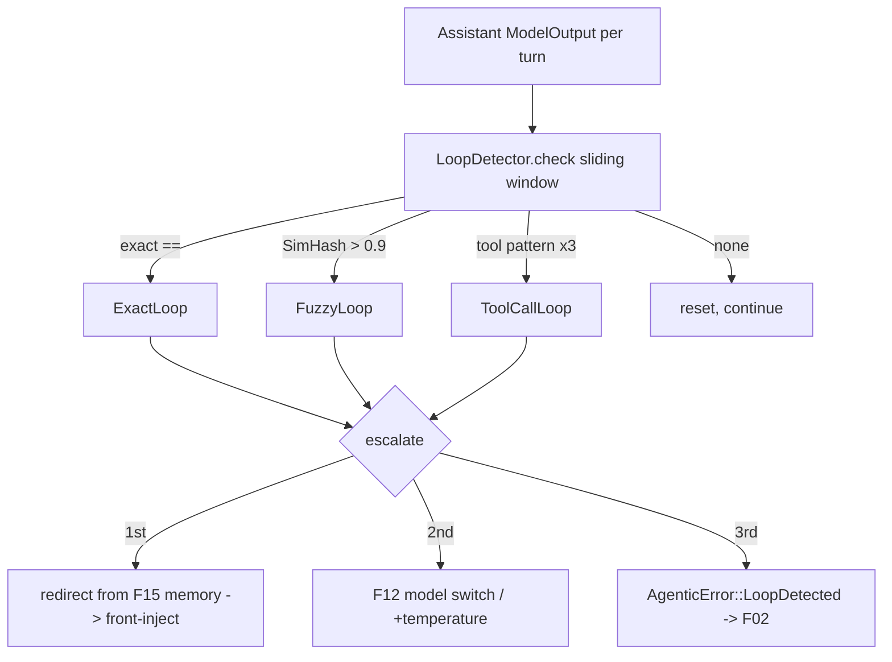

# Feature 17: Loop Detection

> **Review status (2026-06-14) — self-review against code (subagent unavailable):**
> 1. **NEEDS USER RULING — Decision 08 vs Decision 11 conflict on the detector's execution model.**
>    Decision 08 (`08-valtron-integration.md:25`) lists LoopDetector as a **`sequenced` parallel valtron
>    task** running alongside the loop; Decision 11 (`11-agentic-loop-architecture.md:141`) lists it as an
>    **output processor** ("LoopDetector | Checks for repetition loops | Always"). These are mutually
>    exclusive wirings and F14 OD-14-4 explicitly defers the choice here. **Recommendation: output
>    processor (Decision 11).** Rationale: detection is a cheap, synchronous `check(&ModelOutput)` over a
>    sliding window — it needs the assistant message the loop just produced, which the F14 output pipeline
>    hands it directly; a separate sequenced task would need a shared output buffer + cross-task sync for
>    no benefit (Decision 09's embedding-based semantic detection, the only expensive path, is deferred).
>    A processor is simpler, deterministically ordered, and trivially testable. **Flag for the user; F14
>    keeps the slot open either way.**
> 2. **The window holds `ModelOutput`** (Decision 09 line 46 `window: VecDeque<ModelOutput>`), the real
>    enum (`types/mod.rs:863`). Exact match = `ModelOutput` `PartialEq` (it derives `PartialEq`, :862) —
>    `last == prev` works as Decision 09 line 80 assumes. Tool-call detection compares
>    `ModelOutput::ToolCall{name, arguments}` (a `ToolCallSignature{ tool_name, argument_hash: u64 }`,
>    Decision 09 line 59) — `arguments` is `Option<HashMap<String,ArgType>>`; hashing needs a stable
>    order (sort keys) since `HashMap` iteration is unordered. (OD-17-2.)
> 3. **SimHash needs a hasher; `foundation_rng` has none** (F31 review #5 noted "no general hasher").
>    SimHash tokenizes the text, hashes each token (64-bit), and sums signed bit-vectors → Hamming
>    distance ≈ similarity. Pick a non-crypto 64-bit hasher (xxhash/ahash) — same dep F31 adds (OD-31-2).
>    F17 reuses it; do not add a second hasher. (OD-17-3.)
> 4. **Redirect is built from memory (F15), as `Messages::User { role: MessageRole::System }`** (Decision
>    09 §build_redirect line 161 — note it uses the **F01 `MessageRole` enum**, not the old `String`
>    role). It pulls `working_memory.summary()` + `reflection.latest_summary()` (+ observation if newer,
>    F16 INCON-03). So F17 reads F15's latest snapshots (`latest_working`/`latest_reflection`). The
>    redirect is injected at the FRONT of the next turn's messages (like a steering message).
> 5. **Escalation ladder** (Decision 09 §Response): 1st detect → redirect from memory; 2nd (loop persists)
>    → switch model (F12 fallback) OR bump temperature (`ModelParams.temperature`, real field
>    `types/mod.rs:382`) by `temperature_delta`; 3rd → terminate with
>    `AgenticError::LoopDetected(LoopDetection)` (F02, Decision 16 line 61). `LoopDetection` must be
>    `Clone+PartialEq+Debug` so it embeds in `AgenticError` (F02 stream derives). (OD-17-4.)
> 6. **Semantic detection is DEFERRED** (Decision 09 §Alternatives "Deferred to optimization phase —
>    start with SimHash"). F17 ships exact + fuzzy(SimHash) + tool-call; the description includes a
>    `Semantic` variant stub but it is not implemented in v1. State this clearly.
> 7. **Config from `LoopDetectorConfig`** (Decision 09 line 191): `window_size=5`,
>    `similarity_threshold=0.9`, `tool_call_max_repeats=3`, `max_redirects=3`, `try_model_change=true`,
>    `temperature_delta=+0.3`. Matches `AgentConfig` loop fields (Decision 18 line 125-127).

> Implements Decision 09. Detects repetition loops (exact / fuzzy SimHash / tool-call; semantic
> deferred), redirects the LLM using F15 memory, escalates (model switch / temperature) on persistence,
> and terminates after `max_redirects`. **Resolves the Decision 08-vs-11 execution-model question:
> recommended as an OUTPUT PROCESSOR (F14) — flagged for the user.**

## WHY: Problem Statement

LLMs loop — repeating the same text or tool calls, burning tokens and money (Decision 09). The agent
must notice early and break the loop: first nudge it with distilled memory ("you're repeating; based on
your reflections, do X instead"), then escalate to a different model or higher temperature, and finally
give up cleanly rather than spin forever. F19 needs a detector it can run each turn; this feature is it.

## WHAT: Solution

```rust
// backends/foundation_ai/src/agentic/loop_detection.rs
pub struct LoopDetector {
    window: VecDeque<ModelOutput>,          // Decision 09 — sliding window of assistant outputs
    window_size: usize,
    similarity_threshold: f32,
    exact_match_count: usize,
    tool_call_history: VecDeque<Vec<ToolCallSignature>>,
    redirect_count: usize,
    config: LoopDetectorConfig,
}

#[derive(Debug, Clone, PartialEq)]
pub struct ToolCallSignature { pub tool_name: String, pub argument_hash: u64 }

#[derive(Debug, Clone, PartialEq)]              // Clone+PartialEq+Debug for AgenticError (F02)
pub enum LoopDetection {
    NoLoop,
    ExactLoop    { repeated: ModelOutput, repetitions: usize },
    FuzzyLoop    { similarity: f32 },
    ToolCallLoop { pattern: Vec<ToolCallSignature>, repetitions: usize },
    // Semantic — DEFERRED (Decision 09); variant reserved, not produced in v1.
}

impl LoopDetector {
    /// Cheap synchronous check over the latest assistant output. Called by F14's output pipeline.
    pub fn check(&mut self, output: &ModelOutput) -> LoopDetection;
    /// Build a redirect Messages::User{ System } from F15 memory (Decision 09 build_redirect).
    pub fn build_redirect(&self, memory: &MemoryHierarchy) -> Messages;
    /// Escalation decision given how many redirects have already fired.
    pub fn escalate(&mut self) -> Escalation;
    pub fn reset(&mut self);   // on a non-loop turn
}

pub enum Escalation {
    Redirect,                              // 1st: inject memory redirect
    SwitchModelOrTemperature { delta: f32 }, // 2nd: F12 fallback or +temperature_delta
    Terminate,                             // 3rd: AgenticError::LoopDetected
}

pub struct LoopDetectorConfig {            // Decision 09 defaults
    pub window_size: usize,            // 5
    pub similarity_threshold: f32,     // 0.9
    pub tool_call_max_repeats: usize,  // 3
    pub max_redirects: usize,          // 3
    pub try_model_change: bool,        // true
    pub temperature_delta: f32,        // 0.3
}
```

### Detection methods (Decision 09 table)

1. **Exact** — last two window entries `==` → `exact_match_count`; ≥2 consecutive → `ExactLoop`.
2. **Fuzzy (SimHash)** — SimHash the text of the last 3 entries; average pairwise Hamming-similarity >
   `similarity_threshold` → `FuzzyLoop`.
3. **Tool-call** — `ToolCallSignature{ name, argument_hash }` (sorted-key hash) repeated ≥
   `tool_call_max_repeats` → `ToolCallLoop`.
4. **Semantic** — deferred (embedding cost); stub only.

### Redirect + escalation

```text
detect -> Escalation:
  redirect_count == 0 -> Redirect: inject build_redirect(memory) at front of next turn
  redirect_count == 1 -> SwitchModelOrTemperature: F12 fallback model OR ModelParams.temperature += delta
  redirect_count >= max_redirects -> Terminate: Stream::Next(SessionRecord::FailedAction{ error: AgenticError::LoopDetected(detection), trace })
```

`build_redirect` (Decision 09): `Messages::User { role: MessageRole::System, content: Text("You appear
to be in a repetition loop. Working memory: {…}. Recent reflection: {…}. Change your approach.") }` from
F15 `latest_working()` / `latest_reflection()`.

## Architecture



## Fundamentals Documentation (zero-to-expert) — REQUIRED

Author `fundamentals/` covering: LLM repetition loops (why they happen, the cost); detection methods
(exact equality, **SimHash/locality-sensitive hashing** for near-duplicate text, Hamming-distance
similarity, tool-call pattern hashing with stable key ordering); the escalation ladder (memory redirect
→ model/temperature change → terminate) and why memory-grounded redirects beat generic nudges; the
execution-model choice (output processor vs sequenced task — the tradeoffs); making detection types
`Clone+PartialEq` to ride the error stream; why semantic (embedding) detection is deferred. (Task — see
list.)

## HOW: Implementation Steps

1. `LoopDetector` + `LoopDetection` (`Clone+PartialEq+Debug`) + `LoopDetectorConfig` (Decision 09 defaults).
2. Exact detection (window `==`, consecutive count).
3. SimHash fuzzy detection (reuse F31's 64-bit hasher; tokenization → signed bit-vector → similarity).
4. Tool-call detection (`ToolCallSignature` with sorted-key argument hash; pattern repeat count).
5. `build_redirect` from F15 memory as `Messages::User{ System }`.
6. `escalate` ladder (redirect → switch/temperature → terminate) + `redirect_count`.
7. **Resolve execution model (OD-17-1): output processor (rec) — provide `LoopDetectorProcessor`
   implementing F14's `OutputProcessor`.** (Flag for the user.)
8. Tests: exact loop fires after 2 identical outputs; SimHash fires on near-identical (and NOT on
   distinct) text; tool-call loop after N identical patterns; redirect pulls real memory text;
   escalation switches model then terminates after max_redirects; `LoopDetection` is `Clone+PartialEq`;
   wasm build.

## Open Decisions

- **OD-17-1 — execution model (NEEDS USER RULING):** output processor (Decision 11, **rec**) vs sequenced
  parallel task (Decision 08). Rec: output processor — cheap sync check, gets the output directly from
  F14, no cross-task sync. **Flag for the user.**
- **OD-17-2 — tool-call arg hashing:** sort `HashMap` keys before hashing for determinism (rec) — raw
  iteration order is unstable.
- **OD-17-3 — SimHash hasher:** reuse F31's non-crypto 64-bit hasher (rec); don't add a second.
- **OD-17-4 — termination error:** `AgenticError::LoopDetected(LoopDetection)` (Decision 16) — requires
  `LoopDetection: Clone+PartialEq+Debug` (done). Confirm.
- **OD-17-5 — semantic detection:** deferred (Decision 09). Confirm v1 ships exact+fuzzy+tool-call only.

## Target Files

- `backends/foundation_ai/src/agentic/loop_detection.rs` (new) — `LoopDetector`, `LoopDetection`,
  `LoopDetectorProcessor` (if OD-17-1 = processor)
- coordinates F01 (`ModelOutput`/`Messages`/`MessageRole`), F15 (memory for redirect), F12 (model
  switch), F14 (output processor host), F19 (escalation handling), F02 (`AgenticError::LoopDetected`),
  F31 (shared hasher)

## Tests

```bash
cargo test -p foundation_ai -- agentic::loop_detection
cargo build -p foundation_ai --no-default-features --features agentic --target wasm32-unknown-unknown
```

## Verification

```bash
cargo build -p foundation_ai
cargo build -p foundation_ai --no-default-features --features agentic --target wasm32-unknown-unknown
cargo clippy -p foundation_ai -- -D warnings
cargo test  -p foundation_ai -- agentic::loop_detection
```

## Done When

- Exact / fuzzy (SimHash) / tool-call detection over a sliding `ModelOutput` window; memory-grounded
  redirect (F15) as a `System` message; escalation ladder (redirect → model/temperature → terminate
  with `AgenticError::LoopDetected`); `LoopDetection` is `Clone+PartialEq+Debug`; semantic deferred;
  execution model resolved to an output processor (flagged); builds native + wasm.
- OD-17-1..5 resolved (OD-17-1 NEEDS USER RULING); fundamentals authored.
