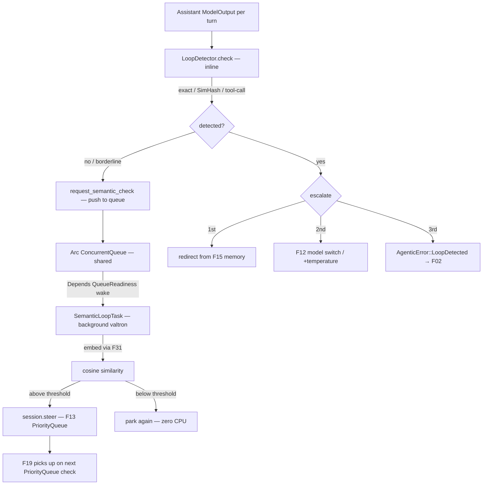

# Feature 17: Loop Detection

> **Review status (2026-06-14) — self-review against code (subagent unavailable):**
> 1. **RESOLVED (user, 2026-06-15; Item #3 / §H1) — neither Decision 08 nor Decision 11's wiring.**
>    Decision 08 listed LoopDetector as a `sequenced` parallel valtron task; Decision 11 as an output
>    processor. **Both are superseded:** the detector is a **synchronous check called directly by F19's
>    tight inner loop**. F17 owns the detector (`check(&ModelOutput) -> Option<LoopDetection>` over the
>    sliding window + the `LoopDetection` type); F19 calls it inline after each model turn and handles
>    redirect/escalate in-line — max control, no cross-task sync, deterministic, trivially testable. The
>    F14 output-pipeline slot is removed (OD-14-4). (Decision 09's embedding semantic detection, the only
>    expensive path, stays deferred.)
> 2. **The window holds `ModelOutput`** (Decision 09 line 46 `window: VecDeque<ModelOutput>`), the real
>    enum (`types/mod.rs:863`). Exact match = `ModelOutput` `PartialEq` (it derives `PartialEq`, :862) —
>    `last == prev` works as Decision 09 line 80 assumes. Tool-call detection compares
>    `ModelOutput::ToolCall{name, arguments}` (a `ToolCallSignature{ tool_name, argument_hash: u64 }`,
>    Decision 09 line 59) — `arguments` is `Option<HashMap<String,ArgType>>`; hashing needs a stable
>    order (sort keys) since `HashMap` iteration is unordered. (OD-17-2.)
> 3. **SimHash needs a hasher; `foundation_rng` has none** (F31 review #5 noted "no general hasher").
>    SimHash tokenizes the text, hashes each token (64-bit), and sums signed bit-vectors → Hamming
>    distance ≈ similarity. Pick a non-crypto 64-bit hasher (xxhash/ahash) — same dep F31 adds (OD-31-2).
>    F17 reuses it; do not add a second hasher. (OD-17-3.)
> 4. **Redirect is built from memory (F15), as `Messages::User { role: MessageRole::System }`** (Decision
>    09 §build_redirect line 161 — note it uses the **F01 `MessageRole` enum**, not the old `String`
>    role). It pulls `working_memory.summary()` + `reflection.latest_summary()` (+ observation if newer,
>    F16 INCON-03). So F17 reads F15's latest snapshots (`latest_working`/`latest_reflection`). The
>    redirect is injected at the FRONT of the next turn's messages (like a steering message).
> 5. **Escalation ladder** (Decision 09 §Response): 1st detect → redirect from memory; 2nd (loop persists)
>    → switch model (F12 fallback) OR bump temperature (`ModelParams.temperature`, real field
>    `types/mod.rs:382`) by `temperature_delta`; 3rd → terminate with
>    `AgenticError::LoopDetected(LoopDetection)` (F02, Decision 16 line 61). `LoopDetection` must be
>    `Clone+PartialEq+Debug` so it embeds in `AgenticError` (F02 stream derives). (OD-17-4.)
> 6. **Semantic detection is DEFERRED** (Decision 09 §Alternatives "Deferred to optimization phase —
>    start with SimHash"). F17 ships exact + fuzzy(SimHash) + tool-call; the description includes a
>    `Semantic` variant stub but it is not implemented in v1. State this clearly.
> 7. **Config from `LoopDetectorConfig`** (Decision 09 line 191): `window_size=5`,
>    `similarity_threshold=0.9`, `tool_call_max_repeats=3`, `max_redirects=3`, `try_model_change=true`,
>    `temperature_delta=+0.3`. Matches `AgentConfig` loop fields (Decision 18 line 125-127).

> Implements Decision 09. Two-tier detection: **inline** (exact + SimHash + tool-call, microseconds)
> checked synchronously in F19's tight inner loop, plus **background** (semantic embedding) as a
> valtron task parked via `Depends(QueueReadiness)` on a shared `ConcurrentQueue` — zero CPU while
> idle, instant wake when F19 pushes work. If the semantic task detects a loop, it steers via F13's
> `PriorityQueue` — F19 picks it up on its next steering check. Redirects from F15 memory, escalates
> (model switch / temperature), terminates after `max_redirects`.

## WHY: Problem Statement

LLMs loop — repeating the same text or tool calls, burning tokens and money (Decision 09). The agent
must notice early and break the loop: first nudge it with distilled memory ("you're repeating; based on
your reflections, do X instead"), then escalate to a different model or higher temperature, and finally
give up cleanly rather than spin forever. F19 needs a detector it can run each turn; this feature is it.

Two speed tiers: cheap pattern checks (exact/SimHash/tool-call) run inline every turn. Expensive
semantic checks (embedding similarity) run in a background task that wakes only when needed and steers
via the PriorityQueue — the tight loop is never blocked.

## WHAT: Solution

### Tier 1 — Inline detector (synchronous, in F19's tight loop)

```rust
// backends/foundation_ai/src/agentic/loop_detection.rs
pub struct LoopDetector {
    window: VecDeque<ModelOutput>,          // Decision 09 — sliding window of assistant outputs
    window_size: usize,
    similarity_threshold: f32,
    exact_match_count: usize,
    tool_call_history: VecDeque<Vec<ToolCallSignature>>,
    redirect_count: usize,
    config: LoopDetectorConfig,
    // Shared queue to the background semantic task — F19 pushes, semantic task pops.
    semantic_queue: Arc<ConcurrentQueue<Vec<ModelOutput>>>,
}

/// Sort keys at detection boundary (OD-17-2). ModelOutput::ToolCall.arguments stays HashMap.
#[derive(Debug, Clone, PartialEq)]
pub struct ToolCallSignature {
    pub tool_name: String,
    pub arguments: Vec<(String, ArgType)>,   // sorted by key — deterministic PartialEq/Hash
}

impl ToolCallSignature {
    pub fn from_tool_call(name: &str, args: &Option<HashMap<String, ArgType>>) -> Self {
        let mut sorted: Vec<_> = args.as_ref()
            .map(|m| m.iter().map(|(k, v)| (k.clone(), v.clone())).collect())
            .unwrap_or_default();
        sorted.sort_by(|a, b| a.0.cmp(&b.0));
        Self { tool_name: name.to_string(), arguments: sorted }
    }
}

#[derive(Debug, Clone, PartialEq)]              // Clone+PartialEq+Debug for AgenticError (F02)
pub enum LoopDetection {
    NoLoop,
    ExactLoop    { repeated: ModelOutput, repetitions: usize },
    FuzzyLoop    { similarity: f32 },
    ToolCallLoop { pattern: Vec<ToolCallSignature>, repetitions: usize },
    SemanticLoop { similarity: f32 },            // produced by background task, reported via steering
}

impl LoopDetector {
    /// Cheap synchronous check (exact + SimHash + tool-call). Called INLINE by F19 every turn.
    pub fn check(&mut self, output: &ModelOutput) -> LoopDetection;

    /// After inline check, optionally push the window to the semantic task for deeper analysis.
    /// Called when SimHash is borderline or every N turns. Non-blocking (just a queue push).
    pub fn request_semantic_check(&self) {
        let _ = self.semantic_queue.push(self.window.iter().cloned().collect());
    }

    /// Build a redirect Messages::User{ System } from F15 memory (Decision 09 build_redirect).
    pub fn build_redirect(&self, memory: &MemoryHierarchy) -> Messages;
    /// Escalation decision given how many redirects have already fired.
    pub fn escalate(&mut self) -> Escalation;
    pub fn reset(&mut self);   // on a non-loop turn
}

pub enum Escalation {
    Redirect,                              // 1st: inject memory redirect
    SwitchModelOrTemperature { delta: f32 }, // 2nd: F12 fallback or +temperature_delta
    Terminate,                             // 3rd: AgenticError::LoopDetected
}

pub struct LoopDetectorConfig {            // Decision 09 defaults
    pub window_size: usize,            // 5
    pub similarity_threshold: f32,     // 0.9
    pub semantic_threshold: f32,       // 0.85 (cosine similarity)
    pub tool_call_max_repeats: usize,  // 3
    pub max_redirects: usize,          // 3
    pub try_model_change: bool,        // true
    pub temperature_delta: f32,        // 0.3
    pub semantic_check_interval: usize,// check every N turns (0 = disabled)
}
```

### Tier 2 — Background semantic task (valtron, non-blocking)

```rust
/// Spawned by F19 at session start. Parks via Depends(QueueReadiness) until work arrives.
pub struct SemanticLoopTask {
    queue: Arc<ConcurrentQueue<Vec<ModelOutput>>>,   // shared with LoopDetector
    readiness: QueueReadiness<Vec<ModelOutput>>,     // for TaskStatus::Depends
    embedder: Arc<dyn EmbeddingProvider>,            // F31
    session: AgentSession,                           // for session.steer() on detection
    threshold: f32,                                  // cosine similarity threshold
}

impl TaskIterator for SemanticLoopTask {
    type Ready = ();           // no stream output — steers via PriorityQueue
    type Pending = ();
    type Action = /* executor action */;

    fn next_status(&mut self) -> Option<TaskStatus<..>> {
        match self.queue.pop() {
            Ok(window) => {
                // Embed each ModelOutput's text via F31
                let embeddings = window.iter()
                    .filter_map(|o| extract_text(o))
                    .map(|text| self.embedder.embed(text))
                    .collect::<Vec<_>>();
                // Pairwise cosine similarity
                if avg_pairwise_similarity(&embeddings) > self.threshold {
                    // Loop detected — steer via PriorityQueue
                    let redirect = build_semantic_redirect();
                    self.session.steer(redirect);
                }
                Some(TaskStatus::Ignore)  // done with this batch, park again
            }
            Err(PopError::Empty) => {
                // Park until F19 pushes the next window — zero CPU
                Some(TaskStatus::Depends(Arc::new(self.readiness.clone())))
            }
            Err(PopError::Closed) => None,  // session ended
        }
    }
}
```

**Flow:**
1. F19 calls `detector.check(output)` inline (microseconds) — exact/SimHash/tool-call.
2. Every N turns (or when SimHash is borderline), F19 calls `detector.request_semantic_check()` —
   pushes the sliding window onto the shared `ConcurrentQueue`. Non-blocking.
3. The `SemanticLoopTask` wakes (was parked via `Depends(QueueReadiness)`), pops the window, embeds
   via F31, computes cosine similarity.
4. If loop detected → `session.steer(redirect)` injects a PriorityQueue message.
5. F19 picks it up on its next PriorityQueue check — standard steering path (F13).
6. If no loop → task parks again. Zero CPU between checks.
7. Session end closes the queue → `PopError::Closed` → task terminates.

Degrades gracefully: if no `EmbeddingProvider` is configured, the semantic task is never spawned —
inline detection only.

### Detection methods

| Method | Tier | Cost | Catches |
|--------|------|------|---------|
| **Exact** — last two `==` → `ExactLoop` | Inline | O(1) | Identical outputs |
| **SimHash** — Hamming similarity > threshold (ahash per token) | Inline | O(n tokens) | Near-identical text |
| **Tool-call** — sorted-key `ToolCallSignature` pattern ≥ N repeats | Inline | O(n calls) | Repeated tool patterns |
| **Semantic** — embedding cosine similarity > threshold | Background | O(embed) | Rephrased same-meaning |

### Redirect + escalation

```text
detect -> Escalation:
  redirect_count == 0 -> Redirect: inject build_redirect(memory) at front of next turn
  redirect_count == 1 -> SwitchModelOrTemperature: F12 fallback model OR ModelParams.temperature += delta
  redirect_count >= max_redirects -> Terminate: SessionRecord::FailedAction{ error: AgenticError::LoopDetected(detection), trace }
```

`build_redirect` (Decision 09): `Messages::User { role: MessageRole::System, content: Text("You appear
to be in a repetition loop. Working memory: {…}. Recent reflection: {…}. Change your approach.") }` from
F15 `latest_working()` / `latest_reflection()`.

The semantic task's redirect also uses PriorityQueue steering, so F19's escalation ladder applies to it
the same way — if the semantic redirect doesn't break the loop, inline detection catches the continued
repetition and escalates further.

## Architecture



## Fundamentals Documentation (zero-to-expert) — REQUIRED

Author `fundamentals/` covering: LLM repetition loops (why they happen, the cost); **two-tier
detection** (inline cheap checks + background expensive checks — why splitting by cost keeps the
loop fast); detection methods (exact equality, **SimHash/locality-sensitive hashing** for near-duplicate
text with `ahash`, Hamming-distance similarity, tool-call pattern hashing with sorted-key determinism,
**embedding cosine similarity** for semantic loops); the **shared `ConcurrentQueue` +
`Depends(QueueReadiness)` pattern** for zero-CPU background tasks in valtron; the escalation ladder
(memory redirect → model/temperature change → terminate) and why memory-grounded redirects beat generic
nudges; **steering as the reporting channel** (background task → PriorityQueue → F19, reusing the
existing steering infrastructure); making detection types `Clone+PartialEq` to ride the error stream.
(Task — see list.)

## HOW: Implementation Steps

1. `LoopDetector` + `LoopDetection` (`Clone+PartialEq+Debug`) + `LoopDetectorConfig` (defaults).
2. `ToolCallSignature::from_tool_call` — sort HashMap keys at detection boundary (OD-17-2).
3. Exact detection (window `==`, consecutive count).
4. SimHash fuzzy detection (`ahash` per token, OD-17-3; signed bit-vector → Hamming similarity).
5. Tool-call detection (sorted-key `ToolCallSignature`; pattern repeat count).
6. `request_semantic_check` — push sliding window to shared `ConcurrentQueue` (non-blocking).
7. `SemanticLoopTask`: valtron `TaskIterator`, parks via `Depends(QueueReadiness)`, embeds via F31,
   cosine similarity, steers via `session.steer()` on detection. Graceful degradation if no embedder.
8. `build_redirect` from F15 memory as `Messages::User{ System }`.
9. `escalate` ladder (redirect → switch/temperature → terminate) + `redirect_count`.
10. Tests: exact loop fires after 2 identical outputs; SimHash fires on near-identical (NOT on
    distinct) text; tool-call loop after N identical sorted-key patterns; semantic task wakes on
    queue push + steers on high similarity + parks on low; redirect pulls real memory text;
    escalation switches model then terminates after max_redirects; `LoopDetection` is
    `Clone+PartialEq`; session end closes queue → task terminates; wasm build (semantic task
    gracefully absent without embedder).

## Open Decisions

- **OD-17-1 — execution model: RESOLVED (user, 2026-06-15; Item #3 + Item #12).** Two tiers:
  (a) **Inline** (exact + SimHash + tool-call) — synchronous check in F19's tight inner loop, no
  cross-task sync. (b) **Background semantic task** — valtron `TaskIterator` parked via
  `Depends(QueueReadiness)` on a shared `Arc<ConcurrentQueue<Vec<ModelOutput>>>`. F19 pushes the
  sliding window when it wants a semantic check; the task wakes, embeds, checks cosine similarity,
  steers via `session.steer()` (F13 PriorityQueue) if loop detected, then parks again. Tight loop
  never blocked. The F14 output-pipeline slot is removed (processors no longer exist — Item #11).

- **OD-17-2 — tool-call arg hashing: RESOLVED (user, 2026-06-15; Item #12) → sort at detection
  boundary.** `ModelOutput::ToolCall.arguments` stays `HashMap<String, ArgType>` (provider's natural
  shape). `ToolCallSignature` sorts keys when constructed — deterministic `PartialEq` and `Hash`
  for free. Only loop detection needs ordered args today; switching to `BTreeMap` later is compatible.

- **OD-17-3 — SimHash hasher: RESOLVED (user, 2026-06-15; Item #12) → `ahash`.** Fastest on native
  (AES-NI hardware), good fallback on wasm, excellent distribution, `no_std` compatible. Workspace
  dep in `foundation_ai`, shared by F17 (SimHash) and F31 (vector hashing). Single dep.

- **OD-17-4 — termination error: RESOLVED (user, 2026-06-15; Item #12).** Confirmed.
  `AgenticError::LoopDetected(LoopDetection)` (F02); `LoopDetection` derives `Clone+PartialEq+Debug`.
  Flows as `SessionRecord::FailedAction { error, trace }`. Emitted by F19 when `escalate()` returns
  `Terminate` (after `max_redirects`).

- **OD-17-5 — semantic detection: RESOLVED (user, 2026-06-15; Item #12) → background valtron task
  with shared `ConcurrentQueue`, NOT deferred.** The semantic task parks via
  `Depends(QueueReadiness)` — zero CPU until F19 pushes the sliding window. On wake: embed via F31,
  pairwise cosine similarity, steer via PriorityQueue if above threshold, park again if below.
  Session end closes the queue → `PopError::Closed` → task terminates. Degrades gracefully: if no
  `EmbeddingProvider` is configured, the task is never spawned — inline-only detection.

## Target Files

- `backends/foundation_ai/src/agentic/loop_detection.rs` (new) — `LoopDetector`, `LoopDetection`,
  `ToolCallSignature`, `SemanticLoopTask`, `LoopDetectorConfig`, `Escalation`
- coordinates F01 (`ModelOutput`/`Messages`/`MessageRole`), F15 (memory for redirect), F12 (model
  switch), F13 (PriorityQueue — semantic task steers via it), F19 (escalation handling),
  F02 (`AgenticError::LoopDetected`), F31 (embedding for semantic + shared `ahash`),
  valtron (`QueueReadiness`/`Depends`/`ConcurrentQueue`)

## Tests

```bash
cargo test -p foundation_ai -- agentic::loop_detection
cargo build -p foundation_ai --target wasm32-unknown-unknown
```

## Verification

```bash
cargo build -p foundation_ai
cargo build -p foundation_ai --target wasm32-unknown-unknown
cargo clippy -p foundation_ai -- -D warnings
cargo test  -p foundation_ai -- agentic::loop_detection
```

## Done When

- **Two-tier detection:** inline (exact + SimHash/`ahash` + sorted-key tool-call, microseconds) +
  background semantic (valtron task, `Depends(QueueReadiness)` on shared `ConcurrentQueue`, embeds
  via F31, steers via F13 PriorityQueue, zero CPU while parked).
- Memory-grounded redirect (F15) as a `System` message; escalation ladder (redirect →
  model/temperature → terminate with `AgenticError::LoopDetected`).
- `LoopDetection` is `Clone+PartialEq+Debug`; `ToolCallSignature` sorts keys at detection boundary.
- Semantic task degrades gracefully (not spawned without an embedder); session end closes queue →
  task terminates.
- Builds native + wasm. OD-17-1..5 all resolved; fundamentals authored.
