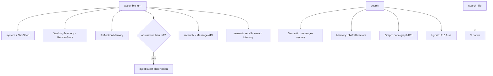

# Feature 18: Context Provider & Assembly

> Implements Decision 03's context assembly + Decision 14's **split search** (TODO #6:
> `search()` = semantic/memory/graph vs `search_file()` = fff). Owns how a turn's LLM context is
> built and how the agent searches. Resolves **INCON-03** (when are observations injected?).

## WHY: Problem Statement

Each LLM call needs context assembled deterministically from the memory hierarchy + recall, within
the token budget. And the agent needs two distinct searches: **semantic/structural** (`search()` over
vectors + memory + code-graph) and **filesystem** (`search_file()` over fff). Decision 14's TODO #6
splits these (they were conflated). Decision 03's context order must be exact (replayable).

## WHAT: Solution

### Context assembly (Decision 03, exact order)

```rust
impl ContextProvider {
    /// Build the ModelInteraction context for a turn, within token budget (F03).
    fn assemble(&self, budget: &TokenLedger) -> AgentContext;
}
```

Order (Decision 03 §Context Assembly):
1. **System prompt** (instructions + tool definitions / ToolShed F21).
2. **Working Memory** (always present, ~500 tokens) — from MemoryStore (F07) fast hydrate.
3. **Reflection Memory** (summarized observations, ~3-5k) — MemoryStore.
4. **Recent raw messages** (last N) — Message API `recent(N)` (F16).
5. **Semantically recalled messages** — fill remaining budget via `search(Memory/Semantic)`.

**INCON-03 resolution (the transitional state):** observations are **NOT** injected when reflections
exist (reflections supersede them). **But** when observations exist and have **not yet been reflected
on** (the transitional window), the latest observation IS injected (else that recent context is
invisible). So: inject `reflection` always; inject `observation` only if newer than the latest
reflection (or no reflection yet). This makes Decision 03 + Decision 11 consistent.

### Split search (TODO #6)

```rust
impl ContextProvider {
    /// Semantic + memory + code-graph search (NOT the filesystem).
    fn search(&self, query: &str, mode: SearchMode, k: usize) -> SearchResult;
    /// Filesystem search via fff (native) — separate tool (F22 owns the tool surface).
    fn search_file(&self, query: &str, kind: FileSearchKind) -> SearchResult;  // native; wasm = unsupported
}
pub enum SearchMode { Semantic /*messages vectors*/, Memory /*obs/refl vectors*/, Graph /*code-graph F11*/, Hybrid /*F10 fuse*/ }
```

- `search(Semantic)` → Message API `semantic_search` (F16 → VectorStore namespace=session).
- `search(Memory)` → observation/reflection vector recall (F12 + F07).
- `search(Graph)` → code-graph `find_entity`/`callers`/`neighborhood` (F11) — "which file defines X".
- `search(Hybrid)` → F10 fusion (vector + BM25 [+ graph proximity]).
- `search_file()` → fff (native, F22). This is the Decision 14 split — `search` is knowledge,
  `search_file` is the real filesystem.

### Owns / coordinates

The ContextProvider owns the EmbeddingProvider (F15), the memory hierarchy (F19), and the search
surfaces; the Memory generation logic itself is F19 (this feature consumes its outputs + triggers it).

## Architecture



## Fundamentals Documentation (zero-to-expert) — REQUIRED

Author `fundamentals/` covering: context window management & deterministic assembly; the working/
reflection/observation hierarchy & when each is injected (the transitional-state problem); RAG &
semantic recall pipelines; **hybrid retrieval** orchestration (vector+BM25+graph); knowledge search vs
filesystem search (why split); token-budgeted context packing; replayability of assembled context.
(Task — see list.)

## HOW: Implementation Steps

1. `ContextProvider` + `assemble` (exact Decision 03 order, budget-aware via F03).
2. INCON-03: inject-observation-if-newer-than-reflection logic.
3. `search` (Semantic/Memory/Graph/Hybrid) over F16/F12/F11/F10.
4. `search_file` (fff, native; wasm unsupported — graceful).
5. Wire EmbeddingProvider (F15) for query embedding; MemoryStore (F07) hydrate.
6. Tests: assembly order + budget truncation; INCON-03 transitional injection; each search mode;
   search_file native + wasm-absent; recall correctness.

## Open Decisions

- **OD-18-1 — INCON-03:** inject observation only if newer than latest reflection (rec). Confirm.
- **OD-18-2 — budget packing:** when recall + recent exceed budget, drop oldest recall first
  (rec) vs summarize. Rec: drop recall, keep recent + working + reflection.
- **OD-18-3 — graph search availability:** code-graph (F11) is native-build; on wasm, `search(Graph)`
  queries a prebuilt graph (F11 query path) or is unavailable. Rec: prebuilt-graph query if present.
- **OD-18-4 — search_file on wasm:** fff is native-only (Decision 14). wasm `search_file` returns a
  clear "unsupported on wasm" result. Confirm.
- **OD-18-5 — ContextProvider ownership boundary:** it consumes F19's memory outputs + triggers F19;
  F19 owns generation. Confirm the split.

## Target Files

- `backends/foundation_ai/src/agentic/context.rs` (new)
- coordinates F03 (budget), F07 (MemoryStore), F12 (VectorStore), F15 (Embedding), F16 (Message API),
  F11 (code-graph), F10 (hybrid), F19 (memory gen), F22 (fff tool)

## Tests

```bash
cargo test -p foundation_ai -- agentic::context
cargo build -p foundation_ai --no-default-features --features agentic --target wasm32-unknown-unknown
```

## Verification

```bash
cargo build -p foundation_ai
cargo build -p foundation_ai --no-default-features --features agentic --target wasm32-unknown-unknown
cargo clippy -p foundation_ai -- -D warnings
cargo test  -p foundation_ai -- agentic::context
```

## Done When

- `assemble` builds context in the exact Decision 03 order within budget; INCON-03 transitional
  injection resolved; `search()` (semantic/memory/graph/hybrid) + `search_file()` (fff) split per
  TODO #6; wasm degrades gracefully (no fff).
- OD-18-1..5 resolved; fundamentals authored.
