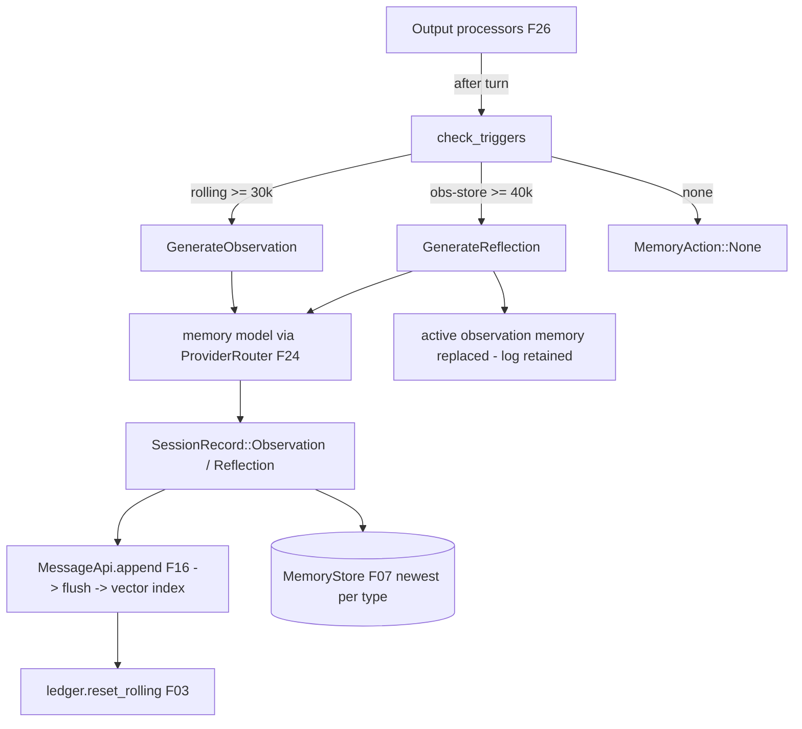

# Feature 19: Memory Hierarchy

> **Review status (2026-06-14) — self-review against code (subagent unavailable):**
> 1. **Trigger split is load-bearing and must NOT both read `rolling()`.** F03 (`03-token-accounting-budget/feature.md:129`, OD-03-8) is explicit: the **30k observation trigger** reads `TokenLedger::rolling()`; the **40k reflection trigger** is *observation-memory size* — a different quantity this feature measures over the **observation store itself**, NOT `rolling`. After an observation condenses, F19 calls `TokenLedger::reset_rolling()` (`03-…/feature.md:86-87`). Wired below.
> 2. **`SessionRecord` memory variants already exist in F01** (`01-message-model/feature.md:235-247`): `WorkingMemory { facts: Vec<MemoryFact>, version: u64, timestamp }`, `Observation { observations: Vec<ObservationEntry>, token_count: u64, timestamp }`, `Reflection { reflections: Vec<ReflectionEntry>, .. }`. F19 **constructs** these and appends them via the Message API — it does NOT define new message types. `MemoryFact`/`ObservationEntry`/`ReflectionEntry` are F01 deliverables (`01-…/feature.md:259-267`).
> 3. **Push path is the F16 append→flush→index path**, not a side store. F16 (`16-message-api/feature.md:42`) already routes `SessionRecord::{WorkingMemory,Observation,Reflection}` through `append`→flush→vector-index with `record_type` set. F19 also writes the *newest* snapshot to the **MemoryStore (F07)** for O(1) resume hydration (F07 stores newest Working/Observation/Reflection per `SessionId`). So a snapshot lands in **both** the append-only log (audit/replay) and MemoryStore (fast latest).
> 4. **Generation uses a SMALLER memory model** via the F24 ProviderRouter (Decision 03 §Triggers + Decision 16 §Memory Generation). `AgentConfig::memory_model: Option<ModelId>`; falls back to the primary model if unset. This is a **`Model::generate`** call (single-shot, no streaming needed) — it must run as a valtron sub-task (`schedule`/`lift` per Decision 08) so it never blocks the agent loop's `next_status` (memory-model OD-19-4).
> 5. **Reflections REPLACE observation content** (Decision 03 §Tier 3, "Replaces the entire observation memory"). The audit trail is preserved (the old observation snapshots stay in the append-only log forever); only the *active* observation memory that Context (F18) injects is reset. Reflections carry `observation_refs: Vec<Scru128>` back to the replaced observations.
> 6. **This is the generator; F18 is the consumer.** F18 OD-18-5 confirms the split: F18 assembles + injects, F19 generates + triggers. The INCON-03 "inject observation only if newer than latest reflection" rule lives in **F18**; F19 just produces snapshots with timestamps F18 compares.
> 7. **`reset_rolling` ordering**: reset only AFTER the observation snapshot is durably appended (F16 `append` returns the minted `Scru128`), else a crash between generate and reset double-counts. Append first, then reset.

> Implements Decision 03 (the memory hierarchy). Owns the **generation** side: turning the raw
> message audit trail into distilled Working / Observation / Reflection snapshots on the right
> triggers, with a smaller/cheaper memory model, and pushing every snapshot to both the Message API
> (F16, audit + recall) and the MemoryStore (F07, fast resume). Resolves the gaps' INCON-03
> *generation* half (F18 owns the *injection* half).

## WHY: Problem Statement

Long sessions overflow the context window. Decision 03's answer is progressive distillation: raw
messages → observations (what we're working on now) → reflections (condensed summaries) → working
memory (permanent facts), never destroying the audit trail. Something must *generate* those tiers at
the right moment, using a cheap model, and persist them so resume (F31) and context assembly (F18)
can load them instantly. Today nothing generates memory — F03 only counts tokens, F18 only consumes
memory, F07 only stores it. This feature is the missing generator.

## WHAT: Solution

```rust
// backends/foundation_ai/src/agentic/memory.rs
pub struct MemoryHierarchy { inner: Arc<MemoryInner> }   // &self, Arc-shared (Decision 08)

struct MemoryInner {
    session_id: SessionId,
    message_api: MessageApi,                 // F16 — append snapshots + recent(N) source rows
    memory_store: Arc<dyn MemoryStore>,      // F07 — newest snapshot per type, fast hydrate
    ledger: TokenLedger,                     // F03 — rolling() trigger + reset_rolling()
    router: ProviderRouter,                  // F24 — resolves the memory model
    config: MemoryConfig,
}

pub struct MemoryConfig {
    pub observation_trigger_tokens: u64,   // default 30_000 (Decision 03)
    pub reflection_trigger_tokens: u64,    // default 40_000 (observation-store size, NOT rolling)
    pub memory_model: Option<ModelId>,     // smaller/cheaper; falls back to primary
}

impl MemoryHierarchy {
    /// Called by the agent loop's output processors (F26) after each turn. Cheap when no
    /// threshold is crossed: just reads counters, returns `MemoryAction::None`.
    pub fn check_triggers(&self) -> MemoryAction;

    /// Run a triggered generation as a valtron sub-task (NEVER inline in next_status).
    /// Returns the task so the loop (F27) schedules it via `schedule`/`lift` (Decision 08).
    pub fn generate(&self, action: MemoryAction) -> MemoryGenTask;

    /// Update working memory when a new fact is asserted (user request OR memory-model scan).
    pub fn update_working_memory(&self, facts: Vec<MemoryFact>) -> Result<Scru128, AgenticError>;

    /// Fast latest snapshots for resume (F31) / assembly (F18) — reads MemoryStore (F07).
    pub fn latest_working(&self) -> Option<WorkingSnapshot>;
    pub fn latest_reflection(&self) -> Option<ReflectionSnapshot>;
    pub fn latest_observation(&self) -> Option<ObservationSnapshot>;
}

pub enum MemoryAction {
    None,
    GenerateObservation,   // rolling() crossed 30k
    GenerateReflection,    // observation-store size crossed 40k
}
```

### Trigger logic (Decision 03 §Generation Triggers — split per F03 OD-03-8)

```rust
impl MemoryHierarchy {
    pub fn check_triggers(&self) -> MemoryAction {
        // 30k: recent-interaction rolling counter (F03 rolling()).
        if self.inner.ledger.rolling() >= self.inner.config.observation_trigger_tokens {
            return MemoryAction::GenerateObservation;
        }
        // 40k: size of the ACTIVE observation memory (this feature measures it; NOT rolling()).
        if self.observation_memory_tokens() >= self.inner.config.reflection_trigger_tokens {
            return MemoryAction::GenerateReflection;
        }
        MemoryAction::None
    }
}
```

### Generation (smaller memory model, valtron sub-task)

1. **Observation**: gather the source rows (Message API `recent(N)` since the last observation), build
   a memory-model prompt per Decision 03's "Generation Goals" (precise verbs, preserve unusual
   phrasing, distinguish assertion vs question, keep timestamps + source `Scru128` refs), call
   `router.memory_model().generate(...)`, parse into `Vec<ObservationEntry>`, build a
   `SessionRecord::Observation { observations, token_count, timestamp }`, **append via F16** (mints +
   returns the `Scru128`), write it to MemoryStore (F07), then `ledger.reset_rolling()` — in that
   order (banner #7).
2. **Reflection**: gather the current observation snapshots, build a reflection prompt (Decision 03
   "reorganize completely, condense older more aggressively, retain recent detail, keep
   `observation_refs`"), generate, parse into `Vec<ReflectionEntry>`, build
   `SessionRecord::Reflection { reflections, observation_refs, .. }`, append via F16, write to
   MemoryStore, and **mark the active observation memory as replaced** (the appended observation rows
   remain in the log; only the active window resets — banner #5).
3. **Working memory**: smaller-model scan OR explicit user request detects a new fact →
   `SessionRecord::WorkingMemory { facts, version: prev+1, timestamp }`, append + MemoryStore.

### Persistence (dual sink)

| Sink | Why | Path |
|------|-----|------|
| **Message API (F16)** | audit + replay + semantic recall | `append(SessionRecord::*)` → flush → vector index (`record_type` set) |
| **MemoryStore (F07)** | O(1) "newest snapshot per type" for resume/assembly | `put_latest(session_id, kind, snapshot)` |

Memory is never the only copy — the append-only log is the source of truth (Decision 03 §Rationale).

## Architecture



## Fundamentals Documentation (zero-to-expert) — REQUIRED

Author `fundamentals/` covering: the three-tier memory model (working/observation/reflection) and why
progressive distillation beats single-shot summarization; **compaction-by-distillation vs deletion**
(why the audit trail is never destroyed); token-threshold triggers (the 30k rolling vs 40k
observation-size distinction and why they read different counters); using a **smaller/cheaper memory
model** (cost/latency tradeoff, fallback to primary); prompt design for memory generation (preserving
verbatim phrasing, assertion-vs-question, timestamp + source-id provenance); "reflections replace
observations" semantics and `observation_refs` recovery; the dual-sink persistence pattern
(append-only log for replay + MemoryStore for fast latest); running generation as a non-blocking
valtron sub-task. (Task — see list.)

## HOW: Implementation Steps

1. `MemoryHierarchy`/`MemoryInner` (Arc, `&self`); wire F16/F07/F03/F24 + `MemoryConfig`.
2. `check_triggers` (30k rolling via F03; 40k observation-store size measured here — banner #1).
3. `observation_memory_tokens()` — size of the active observation memory.
4. Observation generation: prompt build → memory-model generate → parse → `SessionRecord::Observation`
   → F16 append → F07 put_latest → `reset_rolling` (ordering, banner #7).
5. Reflection generation: prompt build → generate → parse → `SessionRecord::Reflection` (with
   `observation_refs`) → F16 append → F07 put_latest → mark observation replaced.
6. `update_working_memory` (version bump) → `SessionRecord::WorkingMemory` → F16 append → F07.
7. `latest_*` snapshot getters over MemoryStore (F07) for F18/F31.
8. `MemoryGenTask` as a valtron `TaskIterator` (single `generate` step, `Pending(AgentProgress::Observing/Reflecting)` while running, `Ready` on done) — Decision 08 `schedule`/`lift`.
9. Tests: trigger boundaries (30k/40k); reset_rolling fires only after append; reflection replaces
   active observation but log rows survive; working-memory version increments; memory-model fallback
   to primary; snapshots land in both F16 and F07; wasm build.

## Open Decisions

- **OD-19-1 — observation-size measurement:** sum `token_count` of active observation snapshots vs
  re-tokenize. Rec: track a running `observation_tokens` counter updated on each observation append
  (cheap, exact at append time), reset to 0 on reflection.
- **OD-19-2 — observation source window:** generate from `recent(N)` since last observation vs a token
  span. Rec: token span = the rolling window F03 just measured (since-last-reset messages), via
  `scan_from(last_obs_id, …)` so the source is exactly what triggered it.
- **OD-19-3 — working-memory detection:** explicit user request only, or also a per-turn memory-model
  scan. Rec: explicit-request-now; periodic scan behind a config flag (cost). Confirm.
        Sure, the point is to make this seamless, where possible we use memory model to extract these especially if the model responding can also mark where it finds explict things to be put in working memory and also explict user requests.

- **OD-19-4 — generation scheduling:** `schedule` (deferred, bottom of local queue — non-urgent) vs
  `lift` (priority). Rec: `schedule` for observation/reflection (non-urgent, Decision 08 row), so the
  agent keeps responding; the loop reads the result on a later boundary.
        Can also broadcast to other workers in multi-threading so it works in background and does not block.

- **OD-19-5 — reflection failure:** if the memory model errors mid-reflection, keep the existing
  observation memory (do NOT replace) and emit a `MessageEvent::Error`; retry next trigger. Confirm.
      Correct.

## Target Files

- `backends/foundation_ai/src/agentic/memory.rs` (new)
- coordinates F01 (`SessionRecord` memory variants + entry types), F03 (`TokenLedger`), F07
  (`MemoryStore`), F16 (Message API append/recent/scan_from), F18 (consumer), F24 (ProviderRouter),
  F26 (output-processor trigger), F31 (resume hydration)

## Tests

```bash
cargo test -p foundation_ai -- agentic::memory
cargo build -p foundation_ai --no-default-features --features agentic --target wasm32-unknown-unknown
```

## Verification

```bash
cargo build -p foundation_ai
cargo build -p foundation_ai --no-default-features --features agentic --target wasm32-unknown-unknown
cargo clippy -p foundation_ai -- -D warnings
cargo test  -p foundation_ai -- agentic::memory
```

## Done When

- Observation generation fires at the 30k `rolling()` boundary; reflection at the 40k
  observation-store boundary (distinct counters); reflections replace the active observation memory
  while the log is retained; working memory versions increment; every snapshot is pushed to both F16
  (audit/recall) and F07 (fast latest); generation runs on a smaller memory model as a non-blocking
  valtron sub-task; `reset_rolling` ordered after durable append.
- OD-19-1..5 resolved; fundamentals authored.
