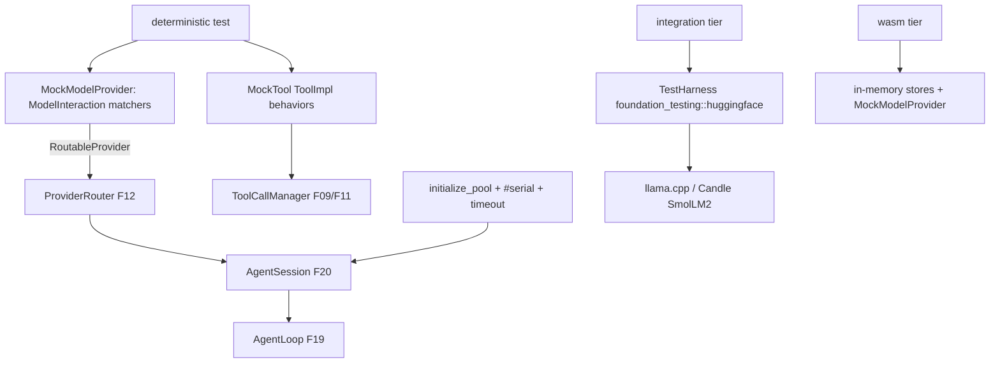

# Feature 21: Testing Strategy

> **Review status (2026-06-14) — self-review against code (subagent unavailable):**
> 1. **`MockModelProvider` must be `ModelInteraction`-driven, NOT regex** (the user's explicit
>    correction; requirements §F15 task "driven by `ModelInteraction` (not regex)"). Decision 17's
>    sketch (`17-testing-strategy.md:65-93`) matches a `Regex` over input *strings* — wrong: the real
>    model input is **`ModelInteraction`** (`types/mod.rs:1080`: `system_prompt`, `tools_shed`,
>    `messages: Vec<Messages>`, `tool_choice`). The mock matches on the structured interaction (e.g.
>    "last message is a `Messages::User` containing X", "tools_shed has tool Y", "Nth call") via a
>    **`Fn(&ModelInteraction) -> bool`** matcher, returning a scripted `Vec<Messages>`. (OD-21-1.)
> 2. **Implementing `ModelProvider` for a mock is HARD** (same object-safety wall as F12): `ModelProvider`
>    has `type Config: AuthProvider`, `type Model: Model`, `fn create(self,..) -> Result<Self>`
>    (`types/mod.rs:1461-1503`), and `Model` has `type Formatter` + `fn stream -> impl StreamIterator`.
>    So `MockModel` must be a REAL concrete `Model` (with a `Formatter = TextBasedFormatter`, the existing
>    `:1234`) and `MockModelProvider` a real `ModelProvider` — OR, simpler, the mock implements **F12's
>    object-safe `RoutableProvider`** directly and is fed to `ProviderRouter` (bypassing the assoc-type
>    trait). **Rec: implement `RoutableProvider`** — F19/F20 take a `ProviderRouter` anyway, so the mock
>    never needs the full `ModelProvider`. (OD-21-2, load-bearing.)
> 3. **`Messages::Assistant` is heavy to construct** (`types/mod.rs:899-910`: `model`, `timestamp`,
>    `usage: UsageReport`, `content: ModelOutput`, `stop_reason`, `provider`, `error_detail`, `signature`,
>    `metadata`). The mock needs **builder helpers** (`mock_text("hi")`, `mock_tool_call("read",
>    args)`, `mock_assistant_with_usage(..)`) so tests stay readable and `UsageReport` flows into F04's
>    ledger (so budget/memory-trigger tests work). (OD-21-3.)
> 4. **Existing infra is REAL and reused** (verified): `TestHarness` lives in
>    **`foundation_testing::huggingface`** (`tests/llamacpp_integration.rs:12`
>    `use foundation_testing::huggingface::TestHarness;`), downloads SmolLM2 GGUF; Candle is behind
>    `feature = "candle"`. Pool init is **`foundation_core::valtron::initialize_pool(seed, Some(threads))`**
>    (`executors/non_sendables.rs:35`) — Decision 17's `init_pool()`/`valtron::initialize_pool(42, Some(4))`
>    maps to it. Use the existing `valtron_test`/`initialize_pool` macros (`valtron/mod.rs:19`).
> 5. **Pool annotations are mandatory + exact** (Decision 17 §Test Annotations): `#[serial_test::serial]`
>    (global pool), `#[ntest::timeout(60_000)]`, `#[tracing_test::traced_test]`, and `let _guard =
>    initialize_pool(seed, Some(n));` as the FIRST line. Tests that touch the valtron pool MUST serialize.
>    (Memory `feedback_no_bespoke_test_machinery`: build mocks from foundation capabilities, don't invent
>    parallel test infra.)
> 6. **Mock tools implement F09's `ToolImpl`** (sync `execute`, F09 OD-09-1): `MockTool { name,
>    behavior: ToolBehavior }` with `Returns / Fails / FailsThenSucceeds` (Decision 17 lines 116-128) —
>    drives F11 retry/DAG tests. `FailsThenSucceeds` validates F11's non-blocking `Delayed` backoff.
> 7. **wasm tests** use in-memory stores (no fjall, F22/F07), `MockModelProvider` (no native model load),
>    and the CF/Turso path where relevant (F23/F30). The whole agentic surface must
>    `cargo build --target wasm32-unknown-unknown` (F00c) AND run wasm tests for the deterministic tier.

> Implements Decision 17, corrected: a `ModelInteraction`-driven `MockModelProvider` (not regex), mock
> tools, the four test tiers, the existing Candle/llama.cpp/`TestHarness` infra, the standard valtron
> pool annotations, and wasm testing. This is the substrate every other agentic feature's tests build on.

## WHY: Problem Statement

The agentic loop, memory triggers, tool DAG, steering, loop detection, circuit breaker, and resume all
need **deterministic** tests — real LLMs are non-deterministic and slow. Decision 17's answer is a mock
provider + mock tools + tiers + the existing model-test infra. But its mock matched a regex over input
strings, which doesn't fit the real `ModelInteraction` input. This feature builds the corrected,
structured mock substrate so every feature 19–31 has reliable tests.

## WHAT: Solution

### `MockModelProvider` — `ModelInteraction`-driven (OD-21-1/2)

```rust
// backends/foundation_ai/src/agentic/testing.rs  (or a foundation_testing module)
type Matcher = Box<dyn Fn(&ModelInteraction) -> bool + Send + Sync>;

pub struct MockModelProvider {
    scripts: Vec<(Matcher, Vec<Messages>)>,        // matched interaction -> scripted assistant messages
    failures: Vec<(Matcher, AgenticError)>,        // matched interaction -> error
    call_count: AtomicUsize,
}

impl MockModelProvider {
    pub fn new() -> Self;
    /// Respond when the interaction matches (structured, NOT a string regex).
    pub fn on(&mut self, m: impl Fn(&ModelInteraction) -> bool + Send + Sync + 'static, reply: Vec<Messages>) -> &mut Self;
    pub fn fail_with(&mut self, m: impl Fn(&ModelInteraction) -> bool + Send + Sync + 'static, e: AgenticError) -> &mut Self;
    /// Convenience matchers.
    pub fn on_nth_call(&mut self, n: usize, reply: Vec<Messages>) -> &mut Self;   // e.g. loop/circuit tests
    pub fn on_any(&mut self, reply: Vec<Messages>) -> &mut Self;
}

/// Object-safe — fed straight to ProviderRouter (bypasses the assoc-type ModelProvider). OD-21-2.
impl RoutableProvider for MockModelProvider {           // F12's trait
    fn serves(&self, _m: &ModelId) -> bool { true }
    fn generate(&self, _m: &ModelId, mi: ModelInteraction, _p: Option<ModelParams>) -> GenerationResult<Vec<Messages>> {
        /* increment call_count; first matching failure -> Err; else first matching script */
    }
    fn stream(&self, _m: &ModelId, mi: ModelInteraction, _p: Option<ModelParams>)
        -> GenerationResult<Box<dyn StreamIterator<D = Messages, P = ModelState>>> { /* replay scripted */ }
    fn descriptor(&self) -> ModelProviderResult<ModelProviderDescriptor> { /* mock descriptor */ }
}
```

### Message builder helpers (OD-21-3)

```rust
pub fn mock_text(s: &str) -> Messages;                          // Assistant{ Text } with zeroed UsageReport
pub fn mock_text_usage(s: &str, usage: UsageReport) -> Messages; // for ledger/budget/memory-trigger tests
pub fn mock_tool_call(name: &str, args: HashMap<String, ArgType>) -> Messages; // Assistant{ ToolCall }
```

### Mock tools (OD-21-6) — `ToolImpl` (F09)

```rust
pub struct MockTool { pub name: String, pub behavior: ToolBehavior }
pub enum ToolBehavior {
    Returns(ToolCallResult),
    Fails(ToolError),
    FailsThenSucceeds { failures: u32, error: ToolError, result: ToolCallResult },  // F11 retry tests
}
impl ToolImpl for MockTool { /* definition + async execute per behavior */ }
```

### Test tiers (Decision 17)

| Tier | What | How | Run |
|------|------|-----|-----|
| **Unit** | types, builders, config, traits | `#[test]`, no model | always |
| **Deterministic** | loop, memory triggers, tool DAG, steering, loop detect, circuit breaker, resume | `MockModelProvider` + `MockTool` | always |
| **Integration** | model load + generation | Candle / llama.cpp + `TestHarness` (SmolLM2) | `#[ignore]` |
| **E2E** | full agentic loop on a real local model + mock tools | llama.cpp + SmolLM2 | `#[ignore]` |

### Valtron pool annotations (Decision 17, exact)

```rust
#[test]
#[ntest::timeout(60_000)]
#[serial_test::serial]                       // global pool — serialize
#[tracing_test::traced_test]
fn test_agent_turn() {
    let _guard = foundation_core::valtron::initialize_pool(42, Some(4));   // FIRST line
    let mut mock = MockModelProvider::new();
    mock.on(|mi| last_user_contains(mi, "fix the bug"), vec![mock_text("on it")]);
    let router = ProviderRouter::from_routable(Box::new(mock));   // F12
    // build session (F20), run_turn, assert SessionRecord stream
}
```

## Architecture



## Fundamentals Documentation (zero-to-expert) — REQUIRED

Author `fundamentals/` covering: deterministic LLM testing (why real models can't be asserted on, the
scripted-mock pattern); **structured-input matching vs string regex** (matching on `ModelInteraction`
shape, why it's more robust); the test pyramid for agentic systems (unit/deterministic/integration/e2e);
testing a valtron-based system (the global pool, `initialize_pool`, `#[serial]`, timeouts, why
serialization is required); reusing existing model-test infra (`TestHarness`, Candle vs llama.cpp,
`#[ignore]` for slow downloads); mock tools for DAG/retry/error paths; wasm test constraints (in-memory
stores, no native model). (Task — see list.)

## HOW: Implementation Steps

1. `MockModelProvider` implementing **F12 `RoutableProvider`** (OD-21-2), `ModelInteraction`-matcher
   scripting + failures + call-count (OD-21-1).
2. Message builder helpers (`mock_text`/`mock_text_usage`/`mock_tool_call`) carrying real `UsageReport`.
3. `MockTool: ToolImpl` with `Returns/Fails/FailsThenSucceeds`.
4. Standard matchers (`last_user_contains`, `tools_shed_has`, `on_nth_call`).
5. Pool-annotation helper / documented template (`initialize_pool` + `#[serial]` + timeout + traced).
6. Wire integration/e2e tiers to the existing `foundation_testing::huggingface::TestHarness` + Candle.
7. wasm test path (in-memory stores, MockModelProvider; build + run deterministic tier on wasm).
8. Tests (the mock substrate is itself tested): mock returns scripted reply on interaction match;
   `on_nth_call` cycles (loop/circuit tests); failure injection surfaces `AgenticError`;
   `FailsThenSucceeds` drives F11 retry; `UsageReport` from a mock reply increments F04's ledger;
   builds + runs on wasm.

## Open Decisions

- **OD-21-1 — match on ModelInteraction, not regex (load-bearing):** `Fn(&ModelInteraction) -> bool`
  matchers (rec, user requirement) replacing Decision 17's `Regex`. Confirm the matcher closure shape.
        Lets lay it out in a discussion to discuss so you can show me the API options to choose the best

- **OD-21-2 — mock implements `RoutableProvider`: RESOLVED (user, Item #8 / §H6).** **`ModelProvider` is
  NOT object-safe** — it has associated types (`type Config`/`type Model`) and `generate`/`stream` return
  `impl StreamIterator` (RPIT), so it can't be `dyn`-ed. The mock therefore implements F12's object-safe
  **`RoutableProvider`** (concrete signatures, boxed stream), which is what F19/F20 take (an
  `Arc<dyn RoutableProvider>` router) — not the assoc-typed `ModelProvider`.

- **OD-21-3 — message builders: RESOLVED (user, 2026-06-15).** Do the full work — provide verbose
  builders (`mock_text`/`mock_tool_call`/`mock_text_usage`) with default `UsageReport` that can be
  overridden/updated, especially for testing session budget controls. Helpers make construction easy
  but carry real `UsageReport` so F04 ledger/budget/memory-trigger tests work.

- **OD-21-4 — mock location: RESOLVED (user, 2026-06-15).** `foundation_ai::agentic::testing` behind
  a `testing` feature. Reuse `foundation_testing` only for `TestHarness`.

- **OD-21-5 — wasm test runner: RESOLVED (user, 2026-06-15).** We own our own wasm test runners in
  testbed — **no `wasm-bindgen-test`**. The deterministic tier (MockModelProvider + in-memory stores)
  builds for wasm and runs on our testbed infrastructure. Build-only verification via
  `cargo build --target wasm32-unknown-unknown`; actual test execution via the owned testbed runners.

## Target Files

- `backends/foundation_ai/src/agentic/testing.rs` (new, `testing` feature) — `MockModelProvider`,
  `MockTool`, builders, matchers
- coordinates F12 (`RoutableProvider`/`ProviderRouter`), F09 (`ToolImpl`), F04 (`UsageReport`→ledger),
  F19/F20 (the systems under test), `foundation_testing::huggingface::TestHarness`, valtron
  `initialize_pool`

## Tests

```bash
cargo test -p foundation_ai --features testing -- agentic
cargo test -p foundation_ai --features testing,candle -- agentic        # Candle tier
cargo test -p foundation_ai --features testing -- --ignored             # llama.cpp / TestHarness tier
cargo build -p foundation_ai --features testing --target wasm32-unknown-unknown
```

## Verification

```bash
cargo build -p foundation_ai --features testing
cargo build -p foundation_ai --features testing --target wasm32-unknown-unknown
cargo clippy -p foundation_ai --features testing -- -D warnings
cargo test  -p foundation_ai --features testing -- agentic
```

## Done When

- `MockModelProvider` is driven by `ModelInteraction` matchers (not regex), implements F12's object-safe
  `RoutableProvider`, scripts replies + failures + nth-call, and carries real `UsageReport`; `MockTool`
  (`Returns/Fails/FailsThenSucceeds`) drives F11 retry/DAG tests; the four tiers + the exact valtron pool
  annotations (`initialize_pool`/`#[serial]`/timeout/traced) are in place; existing
  `TestHarness`/Candle/llama.cpp reused; deterministic tier builds + runs on wasm.
- OD-21-1..5 resolved (OD-21-1 + OD-21-2 flagged); fundamentals authored.
