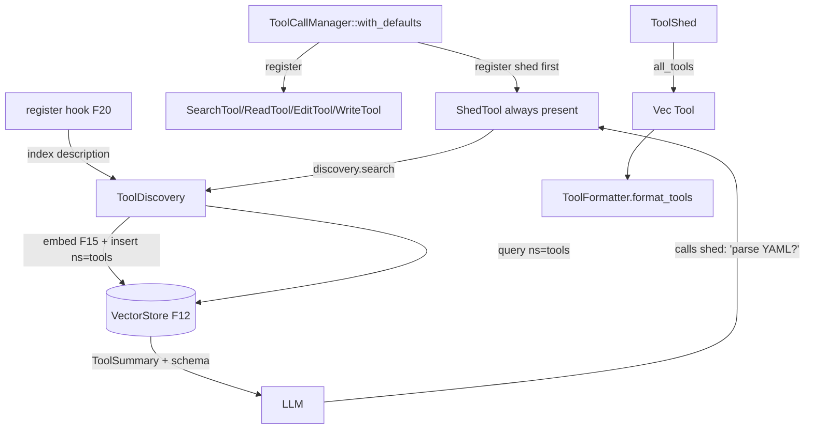

# Feature 21: ToolShed & the `shed` meta-tool

> **Review status (2026-06-14) — self-review against code (subagent unavailable):**
> 1. **`ToolShed.others` removal is F01's job, not F21's.** The real struct
>    (`types/mod.rs:1067-1077`) still has `others: Option<Vec<Tool>>` (:1076); F01 removes it (F01
>    feature.md resolves CRIT-04). F21 *consumes* the post-F01 `ToolShed` and must NOT reintroduce a
>    catch-all — discovery is the `shed` tool's job (Decision 15 §"Why no others"). F21's contribution
>    is the **`shed` tool + the discovery index**, and the `default()` wiring.
> 2. **ToolShed shape — RESOLVED (user, 2026-06-15):**
>    - **Zero-tool sessions** are handled by the **whole `ToolShed` being optional at the session
>      level** (`ModelInteraction.tools_shed: Option<ToolShed>`, `types/mod.rs:1083`) — a zero-tool
>      session passes **`None`**. No per-field `Option<Tool>` change.
>    - `ToolShed` gains a first-class **`search_files`** field (fff filesystem tool, F22) beside
>      `search` (knowledge), and **`bash: Option<Tool>` → `shell: Tool`** (bash on linux/macOS,
>      PowerShell on Windows, OS-selected at runtime) — both via F01.
>    - So when a `ToolShed` is present, `ToolShed::default()` honestly wires
>      **`read/edit/write/search/search_files/shell`** (+ always-present `shed`).
> 3. **The `shed` tool's search uses the SAME VectorStore the registry indexed into** (F20 register
>    hook → F12 insert with a tool-description namespace). `shed` embeds the LLM's NL query via F15 and
>    calls `VectorStore::query(vec, k, Some("tools"))`. So F21 hard-depends on **F15 (Embedding) + F12
>    (VectorStore)** — the embedding the F20 register-hook deferred is realized here. (OD-21-2.)
> 4. **`shed` is a `ToolImpl` like any other** — it implements F20's trait; `definition()` returns the
>    `ShedQuery` schema, `execute()` runs the vector search and returns a `ShedResult` serialized into
>    `ToolCallResult.content` (`UserModelContent::Text(json)`). It is registered FIRST by `default()`
>    and is the one tool present even in a zero-tool session (Decision 15 §Always Present).
> 5. **`shed` returns summaries, not full schemas, by default** (Decision 15 `ToolSummary { name,
>    description, category }`). To actually *call* a discovered tool the LLM still needs its schema —
>    so `ShedResult` SHOULD optionally include the full `Tool` schema for top hits (so the LLM can
>    immediately call it) OR a follow-up "activate this tool into the ToolShed" step. **OD-21-3:** rec —
>    include the full `Tool` schema for the top-k hits in `ShedResult` (one round trip, the LLM can call
>    immediately). Flag the round-trip-vs-inline tradeoff.
> 6. **`ToolFormatter` (`types/mod.rs:1140`) flattens `ToolShed` → `Vec<Tool>` → provider JSON.** F21
>    must define the `ToolShed -> Vec<Tool>` flattening (today there's `build_toolshed` in F20 producing
>    the struct, but the struct→`[Tool]` flatten that feeds `format_tools(&[Tool])` (:1147) is
>    unimplemented). F21 owns `ToolShed::all_tools(&self) -> Vec<Tool>`.

> Implements Decision 15 (the `ToolShed` discovery layer). Owns the **`shed` meta-tool** (always
> present, vector-backed tool discovery), the **`ToolShed::default()` / default-wiring** helper, and
> the **`ToolShed → Vec<Tool>` flatten** that feeds `ToolFormatter`. Depends on F20 (registry) for the
> `ToolImpl` contract and the description index hook.

## WHY: Problem Statement

An agent may have hundreds of tools; sending every definition to the LLM wastes context and limits
tool count (Decision 15 §Alternatives, "can't fit all in context"). The fix: the LLM sees a small,
curated `ToolShed` plus an always-present **`shed`** tool it can call to discover more — "is there a
tool to parse YAML?" — via semantic search over tool descriptions. F20 built the registry; this
feature builds the discovery surface on top of it, plus the convenience `default()` wiring so a basic
session has the standard tools without manual registration.

## WHAT: Solution

### `ToolShed::default()` / default wiring

```rust
impl ToolCallManager {
    /// Register the default tool set (Decision 15 build_toolshed defaults) + the shed tool.
    /// `shed` is registered first and is always present, even with no other tools.
    pub fn with_defaults(session_id: SessionId, vs: Arc<dyn VectorStore>, emb: Arc<dyn EmbeddingProvider>) -> Self {
        let mgr = Self::new(session_id, vs, emb);
        mgr.register(Arc::new(ShedTool::new(mgr.discovery())));   // always present
        mgr.register(Arc::new(SearchTool::default()));           // F22 search() — knowledge
        mgr.register(Arc::new(SearchFilesTool::default()));      // F22 search_files() — fff filesystem
        mgr.register(Arc::new(ReadTool::default()));
        mgr.register(Arc::new(EditTool::default()));
        mgr.register(Arc::new(WriteTool::default()));
        mgr.register(Arc::new(ShellTool::default()));            // bash (unix) / PowerShell (windows)
        // memory/delegate are opt-in (Option fields in ToolShed)
        mgr
    }
}
```

### The `shed` meta-tool (a `ToolImpl`)

```rust
pub struct ShedTool { discovery: ToolDiscovery }   // shares the registry's vector index

#[derive(Serialize, Deserialize)]
pub struct ShedQuery { pub description: String, pub limit: usize }   // "I need a tool to parse YAML"

#[derive(Serialize, Deserialize)]
pub struct ShedResult { pub tools: Vec<ToolSummary> }

#[derive(Serialize, Deserialize)]
pub struct ToolSummary {
    pub name: String,
    pub description: String,
    pub category: String,
    pub schema: Option<serde_json::Value>,   // full Args schema for top hits (OD-21-3)
}

impl ToolImpl for ShedTool {
    fn definition(&self) -> ToolDefinition { /* name="shed", ShedQuery JSON Schema */ }
    fn execute(&self, args: HashMap<String, ArgType>) -> Result<ToolCallResult, ToolError> {
        let q: ShedQuery = parse(args)?;
        let hits = self.discovery.search(&q.description, q.limit)?;   // embed + VectorStore.query(ns="tools")
        Ok(ToolCallResult { content: UserModelContent::Text(TextContent { content: json(hits), signature: None }), error_detail: None })
    }
}
```

### Tool discovery index (the F20 register-hook, realized)

```rust
pub struct ToolDiscovery { vector_store: Arc<dyn VectorStore>, embedder: Arc<dyn EmbeddingProvider> }

impl ToolDiscovery {
    /// Called by ToolCallManager::register — embed the tool's description, insert under ns="tools".
    pub fn index(&self, def: &ToolDefinition) -> Result<(), AgenticError>;
    /// shed's search: embed query, VectorStore.query(vec, k, Some("tools")), load summaries.
    pub fn search(&self, query: &str, k: usize) -> Result<Vec<ToolSummary>, ToolError>;
}
```

The tool-description vectors live in their **own namespace** (`"tools"`) in the same VectorStore (F12),
isolated from session message vectors (which use `namespace = session_id`).

### `ToolShed → Vec<Tool>` flatten (feeds `ToolFormatter`)

```rust
impl ToolShed {
    /// Flatten the structured shed into the flat [Tool] the provider ToolFormatter consumes.
    pub fn all_tools(&self) -> Vec<Tool>;   // shed + read + edit + write + search + bash? + memory? + delegate?
}
```

## Architecture



## Fundamentals Documentation (zero-to-expert) — REQUIRED

Author `fundamentals/` covering: tool-discovery-at-scale (why hundreds of tools can't all sit in
context, the meta-tool pattern); semantic tool search (embedding tool descriptions, namespacing the
index away from message vectors); the "always-present discovery tool" invariant (Decision 15) and why
even a zero-tool session has `shed`; default-wiring conveniences vs explicit registration; flattening a
structured `ToolShed` into the provider's flat `[Tool]` list; the discovery→activate round trip (summary
vs full schema) and its token tradeoff. (Task — see list.)

## HOW: Implementation Steps

1. `ToolDiscovery` (embed via F15 + insert/query F12 under ns=`"tools"`); wire to F20's register hook.
2. `ShedTool: ToolImpl` (`ShedQuery`/`ShedResult`/`ToolSummary`, with optional full schema per OD-21-3).
3. `ToolCallManager::with_defaults` — register `shed` first, then standard tools.
4. `ToolShed::all_tools()` flatten for `ToolFormatter::format_tools`.
5. Reconcile non-`Option` `read/edit/write/search` fields (OD-21-1): default-wire real tools.
6. Tests: `shed` present with zero other tools; register indexes a description, `shed` finds it by NL
   query; namespace isolation (tool vectors don't pollute message recall); `all_tools` flatten shape;
   shed result includes schema for top hit; wasm build (in-memory VectorStore, no fjall).

## Open Decisions

- **OD-21-1 — ToolShed field optionality:** make `read/edit/write/search` `Option<Tool>` in F01 (rec)
  vs `default()` always installs real defaults. Rec: `default()` installs real defaults so the
  non-`Option` fields are honestly filled; coordinate with F01/F20 OD-20-4. Flag.
        We said if ToolShed is option then ToolShed is Option<T>, if supplied then bloddy supply this important tools always, we can have defaults.

- **OD-21-2 — discovery deps:** `shed` hard-requires F15 + F12. On wasm both work (in-memory). Confirm
  the `"tools"` namespace convention.
        Yes, tools should work in wasm, and whatever implementation is used knows the context and environment and how to work, implementation details.

- **OD-21-3 — summary vs schema:** include full `Tool` schema for top-k hits in `ShedResult` (rec, one
  round trip) vs name/description only (LLM must re-discover to call). Flag the tradeoff.
      The point of the ToolShed is the mandatory always avaiable tools, so AI knows how to work with it, the toolshed then lets it discover and know more about other tools, the ToolShed toolset is very small, full schema is good, put once and then AI knows it all already, we just ensure not to printy print and remove useless spacing or better yet provide a more compact format it will understand.

- **OD-21-4 — re-index on update:** re-embed a tool's description on re-register (last-wins, F20
  OD-20-5). Rec: re-index.
        If we dont let re-registeration then we dont need to re-embed, see 20 point on not allowing it.

- **OD-21-5 — category source:** `ToolDefinition.category` is implementer-supplied; default `"general"`.
  Confirm.
        Sure, if we have a standard category then make it an Enum with a Custom state for user supplied types.

## Target Files

- `backends/foundation_ai/src/agentic/tools/shed.rs` (new) — `ShedTool`, `ToolDiscovery`, `with_defaults`
- `backends/foundation_ai/src/agentic/tools/mod.rs` — `ToolShed::all_tools`
- coordinates F01 (`ToolShed` no-`others`/optionality), F20 (registry + register hook), F12
  (VectorStore), F15 (EmbeddingProvider), F22 (the default `search`/`search_file` tools)

## Tests

```bash
cargo test -p foundation_ai -- agentic::tools::shed
cargo build -p foundation_ai --no-default-features --features agentic --target wasm32-unknown-unknown
```

## Verification

```bash
cargo build -p foundation_ai
cargo build -p foundation_ai --no-default-features --features agentic --target wasm32-unknown-unknown
cargo clippy -p foundation_ai -- -D warnings
cargo test  -p foundation_ai -- agentic::tools::shed
```

## Done When

- `shed` is an always-present `ToolImpl` doing vector-backed tool discovery (own `"tools"` namespace);
  `with_defaults` wires the standard tool set + `shed`; `ToolShed::all_tools` flattens for the provider
  formatter; `others` stays removed (F01); builds native + wasm.
- OD-21-1..5 resolved (OD-21-1 + OD-21-3 flagged); fundamentals authored.
