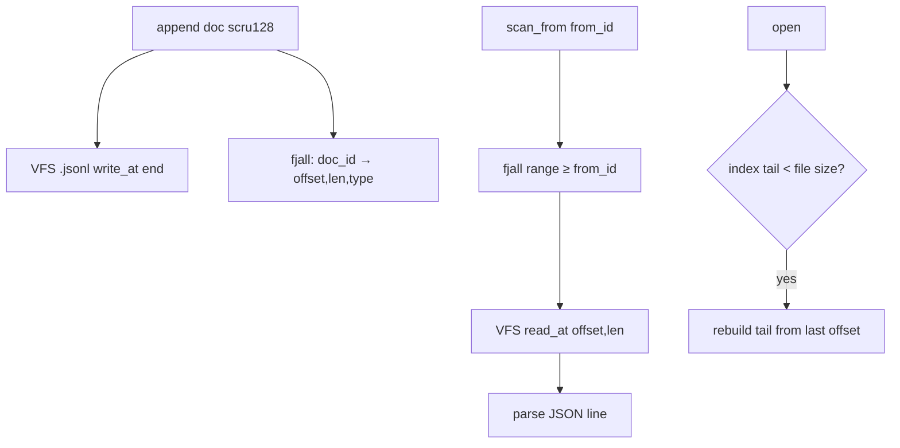

# Feature 22: DocumentStore — VFS (NDJSON) + fjall offset index

> **RESOLVED (user, 2026-06-15) — rename the fake fjall, build the real one, single-writer batched
> appends. No half-assed work.**
>
> 1. **Honest naming (Part A).** The current `FjallFs` is an **in-memory HashMap shim**, not fjall — so
>    **rename it to what it is** (`InMemoryVfsFileSystem` / `MemoryFs`) and stop pretending it's fjall.
>    Then **build the real fjall-backed `VfsFileSystem`** properly (fjall LSM as the durable substrate),
>    no shim. (Resolves the `vfs-fjall` "declared-but-never-used" gap the review flagged.)
> 2. **Single writer + batch write (Part B) — supersedes the per-collection mutex (OD-22-6).** Exactly
>    **one writer can ever write** a collection, so there is **no concurrent append and no race** by
>    construction. Writes are **batched**. Because the single writer owns all state, **offset computation
>    is trivial**: the next offset = current persisted file size + the byte-length of everything ahead of
>    this record in the in-flight batch. So **`append` returns the computed `offset` on submit** — the
>    writer already knows it from `current_file_offset + accumulated_batch_bytes`; no `size()`-then-`write`
>    check-then-act, no reservation lock.
> 3. **Last-N reads (Part C).** To serve "last N records": **copy the current (un-flushed) batch first**;
>    if it has fewer than N, **pull the remaining `N - batch.len()` from the persisted store** (fjall
>    reverse-range + `read_at`). Newest data (still in the batch) needs no disk hit; only the shortfall
>    touches the store. (New OD-22-10.)
>
> **RESOLVED (user, 2026-06-15) — multi-partition fjall indexes.** fjall supports **multiple keyspaces /
> partitions**, so we use **one partition per index** to make retrieval fast: a primary `doc_id → (offset,
> len)` partition **plus** secondary index partitions (e.g. `record_type → doc_ids`, `title`-prefix, time
> buckets) — each an ordered LSM giving range scans for free. This expands OD-22-1/OD-22-3 from a single
> offset index to a small **index family**. (New OD-22-11.)

> **Review status (2026-06-14):** the VFS offset-I/O substrate is real (`read_at`/`write_at`/`seek`/
> `size`), but two dependency facts were wrong: (1) there is **no `Vfs` trait** — the surface is
> `VfsFile` + `SeekableVfsFile` + `VfsFileSystem` (`shared/vfs/traits.rs:6,15,98`), so the bound is
> `V: VfsFileSystem` holding `V::File`; (2) **`fjall` is declared but never used** — `vfs-fjall`'s
> `FjallFs` is an in-memory HashMap shim, so F22 adds the crate's **first real `use fjall`**, and the
> index handle is a `fjall::Partition` (via `Keyspace::open_partition`), not a bare `Keyspace`. Also
> folded: explicit Cargo wiring (foundation_db + serde_json + foundation_compact), single-writer batch
> appends (user-resolved — supersedes the earlier mutex idea), key→filename encoding, and
> materialization strategy. See OD-22-6..11.

> Implements Decision 13's VFS-backed DocumentStore and Decision 03's TODO (a fjall sidecar index
> beside the file store so a scru128 → "this is at offset X" lookup makes `scan_from` a fast seek
> instead of a full file scan). Native-only (target-gated). Builds on the F06 trait contract
> (`scan_from`, doc_id = authoritative scru128).

## WHY: Problem Statement

`MemoryDocumentStore` and `SqlDocumentStore` exist (F06), but the agentic layer wants a **local
filesystem** store that is human-inspectable (NDJSON — `cat`/`jq`/`fff`-friendly, Decision 10) and
**fast to seek**. A plain NDJSON file gives append + human-readability but `scan_from(from_id)` would
require scanning every line. Decision 03's TODO: keep a **fjall index beside the file** mapping
`doc_id → byte offset`, so `scan_from` seeks directly. SQL/Turso don't need this (they have indexes);
file-backed stores do.

The substrate already exists: `foundation_nativeapis` has a VFS with **offset I/O** (`read_at`,
`write_at`, `seek(SeekFrom)` — `native/vfs/native_fs.rs:167,188,342`) and `fjall` wired behind the
`vfs-fjall` feature (`Cargo.toml:35,290`, with a `fjall_vfs` test).

## WHAT: Solution

### DurabilityWriteConfig (session-level, shared)

The session owns a `DurabilityWriteConfig` and passes it (via `Arc`) to every component that performs
durable disk writes (`FjallDocumentStore`, embedding cache, etc.). This makes the durability vs
throughput trade-off explicit and configurable rather than baked into each component.

```rust
/// Controls when batched writes flush to durable storage.
/// The session owns this and shares it (Arc) with all durable-write components.
pub struct DurabilityWriteConfig {
    /// Maximum bytes to accumulate before flushing. 0 = flush every write (immediate durability).
    /// Default: 0 (immediate). Users who want throughput set this higher (e.g. 64KB, 256KB).
    pub batch_size_bytes: u64,
    /// Maximum time since the first unflushed write before forcing a flush, regardless of batch size.
    /// Caps the durability window — even with a large batch_size_bytes, data is never more than
    /// this duration behind disk. Default: 2 seconds.
    pub flush_timeout: Duration,
}

impl Default for DurabilityWriteConfig {
    fn default() -> Self {
        Self {
            batch_size_bytes: 0,       // immediate flush — maximum durability, no batching
            flush_timeout: Duration::from_secs(2),  // safety net even when batching is enabled
        }
    }
}
```

**Design rationale:**
- **Default = immediate (batch_size_bytes: 0).** Every `append` triggers a flush — the batch never
  holds more than zero unflushed bytes. This means the durability window is zero: a crash loses nothing.
  This is the safe default for agent sessions where losing even one record (a tool result, a memory
  write) can break replay consistency.
- **Opt-in batching.** Users who want throughput (bulk ingestion, batch embedding writes, high-volume
  logging) set `batch_size_bytes` to a higher value (e.g. `65_536` for 64KB batches). Now appends
  accumulate in memory until the batch crosses the threshold, then flush.
- **Flush timeout (default 2s).** When batching is enabled, the timeout is the **maximum durability
  window** — the longest data can sit unflushed. If the batch hasn't reached `batch_size_bytes` but
  `flush_timeout` has elapsed since the first unflushed write, flush immediately. This prevents the
  "trickle of writes never reaches the batch threshold" stall. With the default `batch_size_bytes: 0`,
  the timeout is moot (every write flushes immediately), but it's the safety net when batching is on.
- **Session-scoped, not per-component.** One config governs all durable writers in the session.
  Components receive `Arc<DurabilityWriteConfig>` at construction — they don't independently decide
  their flush policy. This means the user sets durability posture once (in session config) and every
  durable component respects it.

### Storage layout (Decision 13)

```
{vfs_root}/
├── {encoded_collection_key}.jsonl        # one NDJSON line per document (append-only)
└── .index/{encoded_collection_key}/      # fjall keyspace: doc_id → (offset, len)
```

- **Append (single writer + config-driven flush):** `DocumentStore::append` is `&self`, but a
  collection has **exactly one writer ever** (the `SingleWriter`), so there is **no concurrent append
  and no race** — no `size()`-then-`write_at` check-then-act, no reservation lock. Offset is computed,
  not reserved: the writer holds the persisted file high-water-mark and the in-flight batch, so the
  next offset = `current_file_offset + accumulated_batch_bytes`. `append` **returns the computed
  `offset`** immediately.

  **Flush is governed by `DurabilityWriteConfig`** (received as `Arc` from the session):
  - **`batch_size_bytes: 0` (default):** flush fires **on every append** — no batching, immediate
    durability. The "batch" is conceptually always empty after each write.
  - **`batch_size_bytes > 0`:** records accumulate; flush fires when `accumulated_batch_bytes >=
    batch_size_bytes`. Each flush writes the concatenated NDJSON lines (`write_at(EOF)`) + inserts
    index entries into fjall partitions atomically.
  - **`flush_timeout`:** when batching is enabled and the batch is non-empty, a timer starts from the
    first unflushed write. If `flush_timeout` elapses before the size threshold is reached, flush
    immediately. Implemented as a valtron scheduled task (not a background thread): `append` checks
    `Instant::now() - first_unflushed_at >= flush_timeout` and flushes if true. The timeout is a
    ceiling, not a polling loop.
  - **Explicit `flush()`:** always available — callers can force a flush regardless of thresholds (e.g.
    before session teardown, before a checkpoint).
  - **Durable sync on flush:** every flush path (`write_at` the NDJSON lines, then sync) ensures data
    reaches durable storage, not just the OS page cache. `write()` alone only guarantees the data is
    in the kernel buffer cache — a power loss can still lose it.

    **Use the highest-level API available:** the VFS trait's `VfsFile` exposes a `sync()` method. The
    native implementation uses **`std::fs::File::sync_all()`** (Rust's built-in, which issues
    `fsync(2)` under the hood) — no raw `libc::fsync` unless the platform lacks a high-level
    equivalent. If the `VfsFile` impl wraps a `BufWriter`, call `flush()` first (drains the userspace
    buffer), then `sync_all()` (pushes OS page cache to disk). For direct `write_at` (positioned I/O,
    no userspace buffer), `sync_all()` alone suffices.

    fjall handles its own sync internally for its WAL/SST writes, so only the NDJSON file needs the
    explicit call. Rust's `std::fs::File` does NOT auto-sync on write or drop — the call must be
    explicit. Cost: one syscall per flush; with the default immediate mode that's one sync per append
    (the price of durability). When batching is enabled, the sync is amortized across the batch.

  doc_id is the authoritative scru128 (F06 Part 0), so the fjall key order **is** chronological.
  (OD-22-6.)
- **`scan_from(from_id, limit)`:** fjall range-scan keys `>= from_id` (LSM keyspaces are ordered),
  for each hit `read_at(offset, len)` and parse the line. O(log n + k) instead of O(file).
- **`scan(last N)`:** fjall reverse-range from the largest key, N entries, seek+read each.
- **`scan_all`:** stream the NDJSON file start→end (no index needed), or iterate the index ascending.
- **`delete`:** append a tombstone / mark in the index; compaction rewrites the file (OD-22-2).
- **Promoted columns (F06):** the fjall index value can also carry `record_type` (and a short
  `title`) so `scan_documents`-style filtering by type avoids reading the file at all (OD-22-3).

### `FjallDocumentStore`

> **RESOLVED (user, 2026-06-15) — name it `FjallDocumentStore`, NOT `VfsDocumentStore`.** This store is
> the **fjall-indexed** one; a bare `VfsDocumentStore` would be "insanely generic" (any `VfsFileSystem`,
> no index) and is a *different*, broader thing. So the concrete type below is **`FjallDocumentStore`**
> (NDJSON file in a VFS **+** the fjall index family). If a plain generic VFS-only store is ever wanted,
> that is a separate `VfsDocumentStore<V>` — don't conflate them.

```rust
// foundation_nativeapis, behind feature = "vfs-fjall", #[cfg(not(target_family = "wasm"))]
// Real traits (shared/vfs/traits.rs): VfsFileSystem (open/create), VfsFile (read_at/write_at/size),
// SeekableVfsFile (seek). NOT a single `Vfs` trait.
pub struct FjallDocumentStore<V: VfsFileSystem> {
    vfs: V,
    root: String,
    // Index FAMILY — one fjall partition per index (OD-22-11): primary offset index + secondaries.
    indexes: FjallIndexSet,        // { primary: doc_id→(offset,len,..), by_type: record_type→doc_ids, .. }
    // Single-writer + batch state per collection (OD-22-6 superseded): exactly one writer, no race;
    // append returns the computed offset (current_file_size + accumulated_batch_bytes).
    writer: SingleWriter,          // owns file-offset high-water-mark + the in-flight batch
    // Session-level durability config — governs flush thresholds for all collections in this store.
    durability: Arc<DurabilityWriteConfig>,
}

impl<V: VfsFileSystem> DocumentStore for FjallDocumentStore<V> { /* ... */ }
```

It implements the **same `DocumentStore` trait** (F06, which adds `scan_from` — absent on the trait
today) so the Message API (F08) is backend-agnostic. `fjall::Partition` (via
`Keyspace::open_partition`, fjall 2.x) provides `range()`/`get`/`insert`; `scan` uses `range().rev()`.

> **Cargo wiring (explicit tasks):** `vfs-fjall` currently = `["vfs","dep:fjall","dep:hex"]` but
> never `use`s fjall. F22 must: add real `use fjall::{Config, Keyspace, PartitionCreateOptions}`;
> add `dep:foundation_db` (the `DocumentStore` trait + `Document`), `dep:serde_json` (NDJSON), and
> `dep:foundation_compact` (scru128 doc_ids) to the feature. No cycle: `foundation_db` does not depend on
> `foundation_nativeapis`.

### fjall index family (multi-partition — OD-22-11)

fjall keyspaces hold **multiple partitions**, so the store keeps an **index family**, one partition per
access pattern, each an ordered LSM:

| Partition | Key | Value | Serves |
|-----------|-----|-------|--------|
| **primary** | `doc_id` (scru128, 25 chars, lexicographically chronological) | `IndexEntry { offset: u64, len: u32, record_type: Option<String>, title: Option<String> }` | `scan_from`/`scan`/`scan_all` (offset seeks) |
| **by_type** | `{record_type}\0{doc_id}` | `()` (or offset) | `WHERE record_type = ?` without touching the file |
| **(extensible)** | e.g. `title`-prefix, time-bucket | … | typed/prefix/time queries |

The primary partition alone gives `scan_from`/`scan`/`scan_all` for free (LSM ordered iteration);
secondary partitions accelerate filtered retrieval. One keyspace per collection, or a single keyspace
with `{collection}\0…` composite keys — OD-22-1.

### Crash consistency

The file (NDJSON) is the source of truth; the index is a derived accelerator. On open, if the index
is missing/stale (last indexed offset < file size), **rebuild the tail** by scanning from the last
indexed offset to EOF and re-indexing. So a crash between file-append and index-write self-heals.
(OD-22-4.)

## Architecture



## HOW: Implementation Steps

0. **Rename** the in-memory `FjallFs` shim → `InMemoryVfsFileSystem`/`MemoryFs` (honest name), and build
   the **real fjall-backed `VfsFileSystem`** (no shim) — Part A.
1. `FjallDocumentStore<V: VfsFileSystem>` in `foundation_nativeapis` behind `vfs-fjall` + `cfg(not(wasm32))`.
2. `append` via the **`SingleWriter`** (one writer per collection, no lock): compute `offset =
   current_file_offset + accumulated_batch_bytes`, push the line into the batch, **return the computed
   `offset`** + the `Document` (F06 shape). Batch flush writes concatenated lines (`write_at(EOF)`) and
   the index-family inserts together.
3. `scan_from`/`scan`/`scan_all` via the **primary** fjall partition range + `read_at`. `scan(last N)`:
   serve from the **in-flight batch first**, then pull `N - batch.len()` from the store (OD-22-10).
4. `delete`/`delete_all`: tombstone + compaction policy (OD-22-2).
5. Carry `record_type`/`title` into `IndexEntry`; populate the **secondary index partitions** (`by_type`,
   …) for index-only filtering (OD-22-3/OD-22-11).
6. Open-time tail rebuild for crash consistency (OD-22-4).
7. Tests: append→scan_from seek correctness; `append` returns the right offset; batch flush correctness;
   single-writer invariant (a second writer is rejected/impossible); last-N served from batch+store
   (OD-22-10); secondary-index filtering (OD-22-11); ordering matches SQL/Memory backends; crash-rebuild
   (truncate index, reopen, verify); delete+compaction; large-file seek perf smoke.

## Open Decisions

- **OD-22-1 — keyspace layout:** one keyspace per collection vs one keyspace with `{collection}\0…`
  composite keys; either way each access pattern is its own **partition** (OD-22-11). Rec: composite
  collection keys, multiple partitions per index type.
          - Whats the advantages of both, present it to me, so we have clarity and decide once and for all

- **OD-22-2 — delete strategy: RESOLVED (user, 2026-06-15).** Tombstone-in-index + periodic file
  compaction at a threshold. Append-only friendly.

- **OD-22-3 — index value contents: RESOLVED (user, 2026-06-15).** Include `record_type`/`title` in
  `IndexEntry` (cheap, avoids file reads for typed scans).

- **OD-22-4 — crash recovery:** tail-rebuild on open (rec) vs full reindex vs fsync-per-append.

- **OD-22-5 — which `VfsFileSystem` impl: RESOLVED (user, 2026-06-15).** `native_fs` (real disk) + the
  real fjall-backed VFS (Part A). The old `FjallFs` shim is renamed to `InMemoryVfsFileSystem`
  (in-memory, test/ephemeral only — not durable).

- **OD-22-6 — append serialization: RESOLVED (user, 2026-06-15) — single writer + RwLock, detailed.**

  The "single writer" guarantee is enforced by a **`RwLock<CollectionState>`** per collection:

  ```rust
  struct CollectionState {
      file_high_water_mark: u64,       // persisted file size at last flush
      batch: Vec<(Scru128, Vec<u8>)>,  // in-flight records: (doc_id, serialized NDJSON line)
      accumulated_batch_bytes: u64,    // sum of all batch entries' byte lengths
      first_unflushed_at: Option<Instant>,  // set on first append after flush; cleared on flush
      durability: Arc<DurabilityWriteConfig>,  // session-level config (shared)
  }
  ```

  The `append` path after pushing to the batch: if `durability.batch_size_bytes == 0` → flush
  immediately. Else if `accumulated_batch_bytes >= durability.batch_size_bytes` → flush. Else if
  `first_unflushed_at` is set and `elapsed >= durability.flush_timeout` → flush. Otherwise, return
  (the timeout will catch it on the next append or via a scheduled valtron check).

  - **Writers** acquire a **write lock** (`RwLock::write()`) to call `append`. Because only one write
    lock can be held at a time, exactly one writer is active per collection — no concurrent append,
    no race. The write lock is held only for the duration of pushing to the in-memory batch (fast —
    no I/O), so contention is minimal.
  - **Offset computation** is trivial because the write lock holder has exclusive access to
    `file_high_water_mark` and `accumulated_batch_bytes`: `next_offset = file_high_water_mark +
    accumulated_batch_bytes`. The offset is **returned from `append`** before any flush — the caller
    knows exactly where the record will land.
  - **Readers** acquire a **read lock** (`RwLock::read()`) for `scan`/`scan_from`/`scan_all`. Multiple
    concurrent readers are allowed (standard RwLock semantics: many readers OR one writer). Readers
    see the batch snapshot at read-lock acquisition time.
  - **Flush** acquires a **write lock**, swaps out the batch (`std::mem::take`), releases the lock,
    then performs I/O (write NDJSON lines to VFS via `write_at(file_high_water_mark)`, insert index
    entries into fjall partitions). After I/O completes, re-acquires the write lock to update
    `file_high_water_mark += flushed_bytes`. This means I/O happens **outside** the lock — new
    appends can proceed into a fresh batch while the old batch flushes.
  - **No `size()`-then-`write_at` check-then-act**: offsets are computed from owned state, not from
    querying the file size. No reservation lock needed.

  The `FjallDocumentStore` holds a `HashMap<String, RwLock<CollectionState>>` (one entry per
  collection, created on first access via a separate `Mutex<HashMap>` for the collection map itself
  — two-level locking: outer Mutex for collection creation, inner RwLock for per-collection ops).

- **OD-22-7 — collection-key → filename encoding: RESOLVED (user, 2026-06-15).** Hex encoding via the
  already-pulled `hex` crate. Keys like `session:{id}:messages` are hex-encoded to filesystem-safe
  filenames.

- **OD-22-8 — `scan_from` materialization: RESOLVED (user, 2026-06-15).** Each backend decides its own
  internal materialization strategy — the trait surface returns `Vec<Document>` and does not dictate
  eager vs lazy. `FjallDocumentStore` uses eager materialization (read-lock → clone batch tail + seek
  persisted entries → build Vec → release lock) because it's simple and correct; a lazy seek-on-next
  optimization is a future perf follow-up if profiling shows contention.

- **OD-22-9 — tail-rebuild high-water-mark: RESOLVED (user, 2026-06-15) — explicit `__hwm` key,
  detailed.**

  The **high-water-mark (HWM)** is the byte offset in the NDJSON file up to which the fjall index has
  been populated. It is used on open to detect and repair index staleness after a crash.

  **In-memory:** the `SingleWriter`'s `file_high_water_mark` field tracks this. Updated after every
  successful flush (after the NDJSON `write_at` + fjall index inserts complete).

  **Persisted:** a dedicated `__hwm` key in the fjall **primary partition** stores the last
  successfully-indexed byte offset as a little-endian `u64`. Updated atomically with the index
  inserts on each flush (fjall batch write: index entries + HWM update together).

  **On open (crash recovery):**
  1. Read `__hwm` from fjall. If absent, HWM = 0 (fresh or corrupted — rebuild everything).
  2. Read the actual NDJSON file size via `VfsFile::size()`.
  3. If `file_size > __hwm`: the file has records the index doesn't know about (crash between
     file-append and index-write). **Tail rebuild:** seek to `__hwm`, scan NDJSON lines from there to
     EOF, parse each, insert into the index, update `__hwm`.
  4. If `file_size == __hwm`: index is current; nothing to do.
  5. If `file_size < __hwm`: file was truncated (corruption or external modification). **Full
     rebuild:** delete index entries, re-scan from offset 0, reset `__hwm`.

  This self-heals the most common crash scenario (records written to file but index update lost) with
  a fast tail scan instead of a full reindex.

- **OD-22-10 — last-N read strategy:** **Resolved (user, 2026-06-15)** → serve "last N" by **copying the
  in-flight batch first**; if `batch.len() < N`, pull the remaining `N - batch.len()` from the persisted
  store (fjall reverse-range + `read_at`). Newest records (still batched) need no disk read.
        Sweet

- **OD-22-11 — multi-partition index family:** **Resolved (user, 2026-06-15)** → use **one fjall
  partition per index** (primary `doc_id→offset`, secondary `record_type→doc_ids`, optional title/time
  partitions) for fast filtered retrieval, rather than a single offset index. Each partition is an
  ordered LSM; the batch flush updates all relevant partitions atomically with the file write.
        Cool

## Target Files

- `backends/foundation_nativeapis/src/native/vfs/` — new `fjall_document_store.rs`; rename the in-memory
  `FjallFs` shim → `InMemoryVfsFileSystem`; add the real fjall-backed `VfsFileSystem` impl
- `backends/foundation_nativeapis/Cargo.toml` — ensure `vfs-fjall` covers it; `foundation_db` dep for
  the `DocumentStore` trait (or the trait is re-exported)
- coordinates with F06 (trait, doc_id ordering, `Document` shape)

## Tests

```bash
cargo test -p foundation_nativeapis --features vfs-fjall -- document_store
```

## Verification

```bash
cargo build -p foundation_nativeapis --features vfs-fjall
cargo clippy -p foundation_nativeapis --features vfs-fjall -- -D warnings
cargo test  -p foundation_nativeapis --features vfs-fjall
```

## Fundamentals Documentation (zero-to-expert) — REQUIRED

Author `fundamentals/` covering: virtual filesystems (VFS abstractions, `read_at`/`write_at`/`seek`/
**`sync`**); NDJSON append logs; **LSM trees** & fjall (keyspaces, **multiple partitions / index
families**, ordered range scans, compaction); byte-offset sidecar indexing & fast seeks; crash
consistency & tail-rebuild (high-water-marks); **`fsync` and the write-durability gap** (`write()` →
kernel buffer cache, `fsync()` → durable storage; power-loss window; Rust's `File::sync_all()`);
**`DurabilityWriteConfig`** (immediate vs batched flush, timeout safety net, session-scoped);
**single-writer + batched append** (why one writer makes offsets computable and race-free, batch flush,
returning the computed offset, last-N from batch+store). (Task — see list.)

## Done When

- `FjallDocumentStore<V: VfsFileSystem>` implements `DocumentStore` over NDJSON + a fjall **index
  family**; `scan_from` is a seek, not a scan; ordering matches the SQL/Memory backends (doc_id/scru128).
- The in-memory `FjallFs` shim is **renamed** to `InMemoryVfsFileSystem`; a **real fjall-backed
  `VfsFileSystem`** exists (no shim).
- Appends go through a **single writer** governed by **`DurabilityWriteConfig`** (session-level,
  `Arc`-shared); default = immediate flush + `sync_all()` per write (max durability); opt-in batching
  with timeout safety net. `append` **returns the computed offset**; no mutex/check-then-act; last-N
  reads come from batch+store.
- Every flush calls `VfsFile::sync()` (`sync_all()` on native) — data is durable, not just page-cached.
- Crash between file-append and index-write self-heals on open.
- Native-only, target-gated; `vfs-fjall` feature; existing VFS tests updated to the renamed type.
- OD-22-1..11 resolved.
