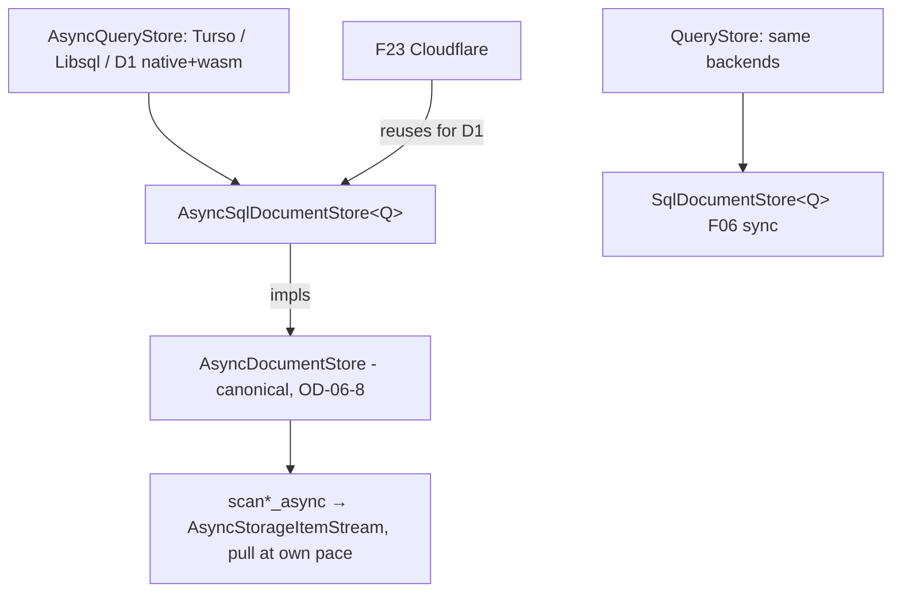

# Feature 22b: DocumentStore — SQL async backend (Turso/Libsql/D1)

> **Implementation status (2026-06-18).** **Landed:** `AsyncSqlDocumentStore<Q: AsyncQueryStore>`
> (`core/backends/async_sql_document_store.rs`) implementing `AsyncDocumentStore` with scans returning
> `AsyncStorageItemStream` (never `Vec`); the async promotable/`scan_documents` trait parity (OD-22b-1)
> on the trait + `MemoryDocumentStore` + the SQL impl; the shared `sql` builder module so sync + async
> never drift (OD-22b-3); **Turso async conformance** (`tests/async_sql_document_store_tests.rs`, 5
> tests); a **Libsql genericity check** (`tests/libsql_document_store_tests.rs`, feature-gated, OD-22b-4)
> proving `SqlDocumentStore<LibsqlStore>` + `AsyncSqlDocumentStore<LibsqlStore>` instantiate; and the
> `fundamentals/` doc. Since every backend (native D1, wasm D1) implements `AsyncQueryStore`, the generic
> works for them too.
>
> Note on Libsql: behavioural conformance (ordering / `scan_from` / promoted columns) is covered by the
> Turso suite — all SQL backends share the same `sql` builder module, so the statements are identical.
> Libsql is additionally **tokio**-based, so *driving* it at runtime needs a tokio harness (unlike
> pure-Rust Turso, driven directly with `block_on`); a behavioural libsql run is a tokio-harnessed
> follow-up. The libsql test here is therefore a compile-time genericity guard.
>
> **Remaining:** the `wasm32-unknown-unknown` build check for the document-store path. The generic itself
> is target-agnostic, but the wasm build is currently blocked **upstream** by the `multi` executor's
> `Send`-vs-`!Send`-JS-future problem (pulled in via `d1`/`r2` → `foundation_netio/multi` →
> `foundation_core/multi`), which is feature **00e**'s scope (unified `Send` async traits + `SendWrapper`).
> Two prerequisites for that build were fixed along the way: the upstream `getrandom 0.3` wasm leak
> (foundation_core/netio now use `foundation_compact` RNG) and the `FairGate` condvar/mutex pairing
> (now via `compati`'s gated `Condvar`/`CondVarMutex`).

> **Why this exists (gap found 2026-06-17).** After F06, `DocumentStore` (sync) is generic over
> `QueryStore` (`SqlDocumentStore<Q>`), so Turso/Libsql/native-D1 already have the **sync** document
> store for free. But `AsyncDocumentStore` has **exactly one** impl — `MemoryDocumentStore` — even
> though **Turso, Libsql, native D1, and wasm D1 all implement `AsyncQueryStore`**. There is no async
> SQL document store, and no feature scheduled one (F22 is the sync VFS/Fjall backend; F23 is
> Cloudflare-specific). This feature fills that gap with one generic async impl that every SQL backend
> reuses, and pins native Turso/Libsql conformance (sync **and** async).

## WHY: Problem Statement

- `AsyncDocumentStore` is the **canonical** async surface (F06 OD-06-8: async holds the real logic,
  sync wraps via valtron). Yet no SQL backend implements it — the agentic layer cannot persist/scan
  sessions asynchronously on native (Turso/Libsql) or serverless (D1) without it.
- The sync `SqlDocumentStore<Q: QueryStore>` is generic but only exercised against Turso in F06;
  **Libsql is unvalidated** for the document store.
- F23 (Cloudflare) needs an async D1 document store; without a generic async SQL impl it would
  re-implement the same SQL by hand. CF D1 is SQLite — it should reuse this.

## WHAT: Solution

### 1. `AsyncSqlDocumentStore<Q: AsyncQueryStore>` — canonical async impl

A new async document store generic over `AsyncQueryStore`, implementing `AsyncDocumentStore`. SQL is
**identical** to F06's sync `SqlDocumentStore` (single source of truth for the schema/queries):

- `append_async` / `append_with_id_async` — INSERT incl. promoted columns (NULL when absent).
- `scan_async` / `scan_all_async` / `scan_from_async` — return **`AsyncStorageItemStream<'_, V>`**
  (lazily pulled via `.next().await`, **never a `Vec`** — OD-06-8), `ORDER BY doc_id` (scru128),
  `scan_from` is `doc_id >= ?` inclusive, `limit 0 = unlimited` (`-1`).
- `delete_async` / `delete_all_async` / `count_async`.
- The query path wraps the backend's `AsyncQueryStream` (the same one `QueryStore::query` bridges for
  sync) — promoted columns read back via `Option<String>` (NULL ≠ `""`, F06 fix).

### 2. Promoted-column parity on the async trait (OD-22b-1)

F06 added `append_promotable*` / `scan_documents*` to the **sync** trait only. To populate/observe
promoted columns asynchronously, add the async mirrors — `append_promotable_async`,
`append_promotable_with_id_async`, `scan_documents_async`, `scan_documents_from_async` — to
`AsyncDocumentStore`, and implement them here + in `MemoryDocumentStore` (and the conformance suite).

### 3. Native backend coverage (Turso + Libsql), sync + async

- **Sync** (already generic via `SqlDocumentStore<Q>`): pin a Libsql conformance test alongside the
  existing Turso one.
- **Async**: `AsyncSqlDocumentStore<TursoStorage>` and `AsyncSqlDocumentStore<LibsqlStore>` pass the
  same scan / scan_from / promoted-column / round-trip conformance suite the in-memory + SQL backends
  pass. Migrations 020/021 apply via the (F06-fixed) runner.

### 4. Reuse map (no duplication)

| Backend | sync `DocumentStore` | async `AsyncDocumentStore` |
|---------|----------------------|----------------------------|
| Memory | F06 | F06 |
| Turso (native) | F06 `SqlDocumentStore<TursoStorage>` (test here) | **22b** `AsyncSqlDocumentStore<TursoStorage>` |
| Libsql (native) | F06 generic (test here) | **22b** `AsyncSqlDocumentStore<LibsqlStore>` |
| D1 (native) | F06 generic | **22b** `AsyncSqlDocumentStore<D1Store>` |
| D1 (wasm/CF) | sync = valtron wrap | **22b** generic; **F23** adds R2-for-large-blobs on top |
| VFS/Fjall (native) | F22 | — |

## Architecture



## HOW: Implementation Steps

1. Add the async promotable/scan_documents mirrors to `AsyncDocumentStore` (OD-22b-1); implement them
   for `MemoryDocumentStore` (delegating to its neutral helpers — the in-memory exception, F06 OD-06-8).
2. Add `AsyncSqlDocumentStore<Q: AsyncQueryStore>` (new `async_sql_document_store.rs`), factoring the
   SQL strings so sync `SqlDocumentStore` and this async impl share them (no drift).
3. Implement every `AsyncDocumentStore` method; scans build `AsyncStorageItemStream` from the backend
   `AsyncQueryStream` (map rows → deserialized `V` / `Document`); promoted columns via `Option<String>`.
4. Conformance suite (shared test module) parameterized over: Memory, `SqlDocumentStore<Turso>` (sync),
   `AsyncSqlDocumentStore<Turso>`, `AsyncSqlDocumentStore<Libsql>`.
5. Wire migrations 020/021 (reuse the F06-fixed `MigrationRunner` / `init_schema`).
6. Confirm builds on native and `wasm32-unknown-unknown` (the generic compiles for wasm D1; F23 owns the
   CF wiring).
7. Update F23 to **reuse** `AsyncSqlDocumentStore<D1>` for its D1 path (drop any hand-rolled D1 SQL).
8. Author `fundamentals/` (below).

## Open Decisions

- **OD-22b-1 — async promotable/scan_documents parity:** add the 4 async mirror methods to
  `AsyncDocumentStore` now (rec: yes — promoted columns are core F06; async backends must populate them).
- **OD-22b-2 — sync↔async relationship for SQL:** keep `SqlDocumentStore<Q: QueryStore>` (sync) and
  `AsyncSqlDocumentStore<Q: AsyncQueryStore>` (async) as **parallel generics** rather than forcing the
  sync one to valtron-wrap the async one — because not every `QueryStore` has an `AsyncQueryStore`
  (e.g. the in-memory SQL). Where a backend has both, **async is canonical** (OD-06-8) and the sync
  generic is the convenience wrapper a caller may use. Rec: parallel generics; document the canonical-async rule.
- **OD-22b-3 — shared SQL strings:** extract the INSERT/SELECT builders into one place shared by the
  sync + async impls so the schema/query never drifts. Rec: yes.
- **OD-22b-4 — Libsql availability:** `libsql` is an optional feature; gate the Libsql conformance test
  behind it (Turso is default). Rec: cfg/feature-gate.

## Target Files

- `backends/foundation_db/src/core/storage_provider.rs` — async promotable/scan_documents trait methods (OD-22b-1).
- `backends/foundation_db/src/core/backends/async_sql_document_store.rs` — new `AsyncSqlDocumentStore<Q>`.
- `backends/foundation_db/src/core/backends/sql_document_store.rs` — extract shared SQL builders.
- `backends/foundation_db/src/core/backends/memory_document_store.rs` — async promotable mirrors.
- `backends/foundation_db/tests/` — async + Libsql conformance.

## Tests

```bash
cargo test -p foundation_db --test document_store_tests          # turso sync + async
cargo test -p foundation_db --features libsql -- document_store  # libsql sync + async
cargo build -p foundation_db --target wasm32-unknown-unknown     # generic compiles for wasm D1
```

## Verification

```bash
cargo build -p foundation_db
cargo clippy -p foundation_db --all-targets
cargo test -p foundation_db
```

## Fundamentals Documentation (zero-to-expert) — REQUIRED

Author `fundamentals/` covering: `AsyncQueryStore` vs `QueryStore` and why both exist; async streams
(`futures_core::Stream`) vs valtron sync iterators; pull-at-your-own-pace back-pressure and OOM
avoidance; the async-canonical / sync-wraps-via-valtron house rule (F06 OD-06-8); generic-over-backend
design; SQLite-family parity (Turso/Libsql/D1). (Task — see list.)

## Done When

- `AsyncSqlDocumentStore<Q: AsyncQueryStore>` implements `AsyncDocumentStore`; scans return
  `AsyncStorageItemStream` (never `Vec`); SQL matches F06's sync `SqlDocumentStore` (scru128 ordering,
  inclusive `scan_from`, promoted columns) via shared builders.
- Async promotable/scan_documents parity exists on the trait + Memory + SQL impls (OD-22b-1).
- Turso (sync+async) and Libsql (sync+async) pass the shared conformance suite; the generic compiles for
  wasm D1.
- F23 reuses `AsyncSqlDocumentStore<D1>` for D1 (no duplicated SQL).
- OD-22b-1..4 resolved.
