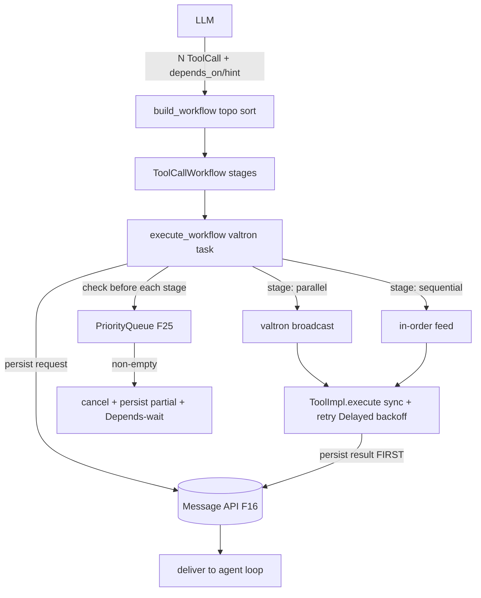

# Feature 23: ToolCall Execution DAG

> **Review status (2026-06-14) — self-review against code (subagent unavailable):**
> 1. **The DAG fields are F01 deliverables on `ModelOutput::ToolCall`.** The real enum
>    (`types/mod.rs:870-875`) has only `{ id, name, arguments, signature }` — **no `depends_on` /
>    `execution_hint` yet**. F01 adds them (`01-message-model/feature.md` task: "`ModelOutput::ToolCall`
>    gains `depends_on: Vec<String>` + `execution_hint: ExecutionHint`"). F23 *consumes* those fields;
>    if F01 hasn't landed them, F23 is blocked. The `ExecutionHint` enum (`Unspecified/Parallel/
>    Sequential`) is Decision 04's, defined in F01.
> 2. **`ToolCallManager` is split F20 (registry) ⊕ F23 (execution).** F20 owns `register`/`get`/
>    `execute_one`/`build_toolshed`; F23 adds the workflow builder, the valtron execution task, the
>    persist-before-deliver invariant, retry, and interruption. Same `Arc<ToolCallManagerInner>`,
>    extended fields (Decision 04 line 28-34: `execution_queue`, `results_store`, `cancellation_signal`,
>    `message_store`, `task_entry`).
> 3. **Persist-before-deliver is the CRITICAL invariant** (Decision 04 §Persistence Guarantee): each
>    `ToolCallRequest` is appended to the Message API (as `SessionRecord::Conversation{ Messages::
>    Assistant{ ToolCall } }`) AND each result (`Messages::ToolResult`) is appended BEFORE it is handed
>    to the agent loop. F16 `append` is buffered (returns immediately) — so "persisted" means *enqueued
>    to the durable write buffer*, not flushed-to-disk per call. **OD-23-3:** for the crash-safety claim
>    Decision 04 makes ("if the agent crashes, results are already persisted"), a tool result append may
>    need a forced flush, OR we accept F16's buffered semantics (crash-before-flush loss, F16 OD-16-3).
>    Rec: accept F16 buffered semantics + rely on F16's short flush interval; document the gap. Flag.
> 4. **`ToolCallStage` / `FailMode` come from Decision 04** (`Parallel{calls, fail_mode}` /
>    `Sequential{calls, fail_fast}`; `FailMode::{CollectAll, CancelOnFailure}`). Stage grouping is a
>    topological sort by `depends_on` depth. Stage 0 = no deps; default for no-dep calls is **Parallel**
>    (Decision 04 §Dependency detection: "Default: Parallel").
> 5. **Parallelism uses valtron, not threads/async.** Decision 04/08: parallel stage → valtron
>    `broadcast` (global queue → may run on another thread in multi-thread mode; single-thread executor
>    interleaves). Sequential stage → run in order, feed prior results. `ToolImpl::execute` is **sync**
>    (F20 OD-20-1), so a stage's calls are driven as valtron sub-tasks; the manager's own task yields
>    `Pending(AgentProgress::ExecutingTools{ completed, total })` between completions (no blocking in
>    `next_status`).
> 6. **Interruption reads the PriorityQueue + cancel signal from F25** (Decision 04 §Interruption +
>    Decision 05): before starting each stage, check `priority_queue.is_empty()`; if not, set
>    `cancel_signal = CancelCode::PauseForPriority` (F25's `Arc<AtomicU32>`), cancel in-progress calls,
>    persist partial results, return control. **Use `TaskStatus::Depends`** to wait on results/queue
>    readiness rather than `Pending`-spinning (F25 owns the `EventReadiness` impls; F23 consumes them).
> 7. **Retry lives here** (Decision 16 §ToolCallManager Retry): `ToolRetryConfig{ max_retries,
>    initial_backoff, backoff_multiplier, max_backoff, retry_on }` per tool. **Backoff MUST NOT
>    `sleep()`** (Decision 16's `sleep(backoff)` is illustrative and would block the valtron executor) —
>    use `TaskStatus::Delayed(backoff)` (the executor handles the wait; on wasm the valtron engine yields
>    to the JS event loop — never `SleepIterator`/blocking). (OD-23-4, load-bearing.)
> 8. **Tool errors ALWAYS go back to the LLM** as a `Messages::ToolResult{ error_detail: Some(..) }`
>    (Decision 16 §Error Surfacing) — not a stream `Err`. The loop continues; the LLM adapts. Only
>    auth/unexpected escalate to `Stream::Next(Err(AgenticError))` (F30).

> Implements Decision 04 (DAG execution) + Decision 16 (retry/error surfacing). Owns the
> `ToolCallManager` **execution** path: staging from `depends_on`/`execution_hint`, valtron-parallel/
> sequential runs, the persist-before-deliver invariant, per-tool retry with non-blocking backoff,
> tool-error-to-LLM, and PriorityQueue interruption via `TaskStatus::Depends`.

## WHY: Problem Statement

When the LLM returns several tool calls, some are independent (read 3 files) and some depend on others
(analyze the 3 reads). Running them all sequentially is slow; running dependent ones in parallel is
wrong. They must also be durably recorded before results reach the loop (crash safety + replay), retry
transient failures, surface failures to the LLM so it can adapt, and yield instantly when the user
steers. F20 can run one tool; this feature runs *many*, correctly ordered, durably, interruptibly.

## WHAT: Solution

```rust
// extends backends/foundation_ai/src/agentic/tools/mod.rs (ToolCallManager execution half)
pub struct ToolCallWorkflow { pub stages: Vec<ToolCallStage> }       // Decision 04

pub enum ToolCallStage {
    Parallel   { calls: Vec<ToolCallRequest>, fail_mode: FailMode },
    Sequential { calls: Vec<ToolCallRequest>, fail_fast: bool },
}
pub enum FailMode { CollectAll, CancelOnFailure }

impl ToolCallManager {
    /// Topologically group calls into stages by depends_on depth (+ execution_hint).
    pub fn build_workflow(&self, calls: Vec<ToolCallRequest>) -> Result<ToolCallWorkflow, ToolError>;

    /// Drive the workflow as a valtron task: persist req → run stage → persist results →
    /// deliver. Yields AgentProgress::ExecutingTools between completions.
    pub fn execute_workflow(&self, wf: ToolCallWorkflow) -> ToolCallExecTask;

    /// Per-tool retry config (default + per-name overrides).
    pub fn set_retry_config(&self, tool: &str, cfg: ToolRetryConfig);
}

pub struct ToolRetryConfig {     // Decision 16
    pub max_retries: u32,                 // default 3
    pub initial_backoff: Duration,        // default 1s
    pub backoff_multiplier: f64,          // default 2.0
    pub max_backoff: Duration,            // default 30s
    pub retry_on: Vec<ToolErrorKind>,     // default [Timeout, Network]
}
pub enum ToolErrorKind { Timeout, Network, Execution, InvalidArguments }
```

### Staging (topological sort)

1. Build a dependency graph from each `ToolCallRequest.depends_on`.
2. Stage 0 = calls with no deps → **Parallel** (default), unless a call's `execution_hint == Sequential`.
3. Stage N = calls whose deps are all satisfied by stages < N.
4. A `Sequential` stage with multiple calls feeds each result into the next (`fail_fast`).
5. Cycle / missing-dep → `ToolError::InvalidArguments` (reject the workflow; surface to LLM).

### Persist-before-deliver (the invariant)

```text
for stage in workflow.stages:
    for call in stage.calls:
        message_api.append(SessionRecord::Conversation{ Assistant{ ToolCall{call} } })  // request persisted
    results = run_stage(stage)            // valtron broadcast (parallel) | in-order (sequential)
    for (call, result) in results:
        message_api.append(SessionRecord::Conversation{ ToolResult{ from result } })    // result persisted
    deliver(results) -> agent loop        // ONLY after persist
    if priority_queue not empty: cancel + persist partial + return     // interruption
```

### Retry (non-blocking backoff — OD-23-4)

```text
attempt 0..=max_retries:
    match execute_one(call):
        Ok(r) -> deliver
        Err(e) if attempt < max && retry_on.contains(e.kind):
            yield TaskStatus::Delayed(backoff)   // NOT sleep() — executor waits; wasm yields to JS loop
            backoff = min(backoff * mult, max_backoff)
        Err(e) -> ToolResult{ error_detail: Some(e) }   // give the error to the LLM (Decision 16)
```

### Interruption (F25)

Before each stage, check `priority_queue` (F25). If non-empty: set `cancel_signal =
CancelCode::PauseForPriority`, signal in-progress calls to abort, persist whatever partial results
exist, and return so the loop drains the steering message. Waiting on stage completion / queue uses
`TaskStatus::Depends(Arc<dyn EventReadiness>)` (F25's readiness signals) — never a `Pending` spin.

## Architecture



## Fundamentals Documentation (zero-to-expert) — REQUIRED

Author `fundamentals/` covering: tool-call DAGs (dependency graphs, topological staging, parallel vs
sequential stages, fail modes); **persist-before-deliver** & why the audit log must lead delivery
(crash safety, replay) and the buffered-write caveat; valtron concurrency for tools (`broadcast` for
parallel, sequenced feed for dependent) vs threads/async; **non-blocking retry/backoff** with
`TaskStatus::Delayed` (why `sleep()` deadlocks the executor; wasm JS-loop yielding); cooperative
interruption with a cancel signal + `TaskStatus::Depends` (avoiding `Pending` spin); tool-error-to-LLM
as the resilience strategy (vs terminating). (Task — see list.)

## HOW: Implementation Steps

1. `ToolCallWorkflow`/`ToolCallStage`/`FailMode`; `build_workflow` (topo sort, cycle/missing-dep error).
2. `execute_workflow` as a valtron `TaskIterator`: stage loop, `Pending(ExecutingTools)` between
   completions, `Ready` per result.
3. Parallel stage via valtron `broadcast`; sequential stage in-order with result feed + `fail_fast`.
4. Persist-before-deliver: append request, run, append result, deliver (order enforced).
5. `ToolRetryConfig` (+ per-tool overrides); non-blocking backoff via `TaskStatus::Delayed` (OD-23-4).
6. Tool-error → `Messages::ToolResult{ error_detail }` back to the loop (Decision 16).
7. Interruption: pre-stage PriorityQueue check (F25) → cancel signal → persist partial → `Depends`-wait.
8. Tests: topo staging (the Decision 04 5-call example); parallel independence; sequential feed +
   fail_fast; persist-before-deliver ordering (result in store before delivered); retry on
   timeout/network with Delayed (no real sleep); non-retriable surfaces immediately; tool error goes to
   LLM; interruption cancels mid-stage + persists partial; wasm build.

## Open Decisions

- **OD-23-1 — default fail mode:** parallel stages default `CollectAll` (Decision 04). Confirm.
- **OD-23-2 — sequential result feed shape:** how a prior result is injected into the next call's args
  (by tool-call id reference). Rec: results keyed by `call.id`; the next tool reads referenced ids from
  a results map. Confirm the reference mechanism.
- **OD-23-3 — persist durability:** accept F16 buffered append (crash-before-flush loss, F16 OD-16-3)
  vs force-flush tool results. Rec: accept buffered + short flush interval; document the residual gap.
  Flag.
- **OD-23-4 — backoff mechanism (load-bearing):** `TaskStatus::Delayed(backoff)` (rec) — NEVER
  `sleep()`/`SleepIterator` (blocks executor; breaks wasm). Confirm.
- **OD-23-5 — cancel granularity:** can an in-flight sync `execute` be aborted mid-call? Sync tools
  can't be preempted; cancel applies *between* calls/stages + sets the signal future calls observe.
  Rec: between-call cancellation; document that a long sync tool finishes its current call.

## Target Files

- `backends/foundation_ai/src/agentic/tools/mod.rs` — `ToolCallManager` execution half, workflow types
- coordinates F01 (`ModelOutput::ToolCall` DAG fields, `ExecutionHint`), F16 (persist req/result), F25
  (PriorityQueue, `CancelCode`, `EventReadiness`/`Depends`), F30 (`AgenticError`), F27 (the loop driver)

## Tests

```bash
cargo test -p foundation_ai -- agentic::tools::exec
cargo build -p foundation_ai --no-default-features --features agentic --target wasm32-unknown-unknown
```

## Verification

```bash
cargo build -p foundation_ai
cargo build -p foundation_ai --no-default-features --features agentic --target wasm32-unknown-unknown
cargo clippy -p foundation_ai -- -D warnings
cargo test  -p foundation_ai -- agentic::tools::exec
```

## Done When

- Multi-call workflows are topologically staged (parallel default, sequential on deps/hint, fail
  modes); each request + result is persisted to the Message API before delivery; per-tool retry uses
  non-blocking `TaskStatus::Delayed` backoff (no `sleep`); tool errors return to the LLM; PriorityQueue
  steering interrupts between stages via cancel signal + `TaskStatus::Depends`; builds native + wasm.
- OD-23-1..5 resolved (OD-23-3 + OD-23-4 flagged); fundamentals authored.
