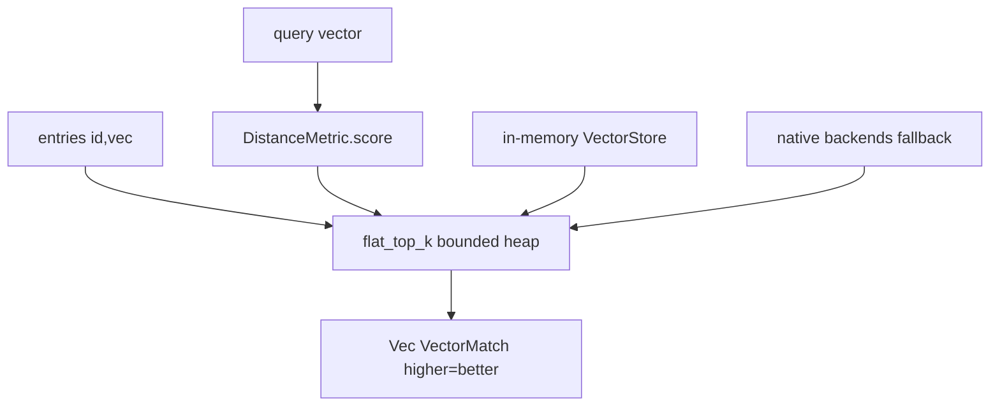

# Feature 24: foundation_vectors — core + distance + flat scan

> **Review status (2026-06-14):** folded — (1) **`f32` is not `Ord`**, so the top-k heap needs an
> `OrderedScore(f32)` newtype with a manual `Ord` via `f32::total_cmp` (NaN sorts as least), which
> also implements the NaN guard; (2) **`f32::sqrt` is `std`-only** → the `no_std` goal needs `libm`
> or a squared-norm/normalized-dot formulation (revised OD-24-5); (3) cosine needs a **zero-vector
> policy** (NaN→never-selected); (4) `VectorMatch`/`DistanceMetric` are **owned here and re-exported
> by `foundation_db`** (Decision 07 double-defines them); (5) add `foundation_vectors` to
> `[workspace.dependencies]` (F28 needs it), `serde = { workspace = true }`, `[lints] workspace =
> true`, `edition.workspace = true` (2021). See OD-24-6/7/8.

> **RESOLVED (user, Item #16 / OD-24-8):** `foundation_vectors` owns everything — `VectorStore` trait,
> `VectorEntry`, `VectorMetadata`, `VectorStoreConfig`, `VectorMatch`, `DistanceMetric`, and the
> in-memory backend. `foundation_db` re-exports for convenience. No type leakage.

> First feature of the new **`foundation_vectors`** crate (verified: does not exist; `backends/*`
> workspace glob auto-includes it). Implements Decision 07's "algorithms owned by us" — starting with
> the core types, distance metrics, and flat (brute-force) scan. IVF/HNSW (F25), BM25/hybrid (F26),
> and code-graph (F27) build on this. Pure Rust + WASM-safe (no native-only deps).

## WHY: Problem Statement

Decision 07: vector search algorithms live in `foundation_vectors` (owned by us) so behavior is
consistent across every backend, there's always a fallback when a DB lacks native vector search, and
it works in WASM. Nothing exists yet (no `VectorStore`, no `cosine`, no `hnsw` anywhere). This
feature lays the foundation: the vector representation, the distance metrics, and the simplest
correct search (flat scan) — enough for the in-memory `VectorStore` (F28) and as the fallback path
for all backends.

## WHAT: Solution

### Crate setup

```
backends/foundation_vectors/
├── Cargo.toml      # pure Rust; libm (unconditional default); NO rayon (Item #16)
└── src/
    ├── lib.rs
    ├── metric.rs   # DistanceMetric + the math
    ├── vector.rs   # Vector + dimension handling
    ├── flat.rs     # flat-scan top-k (sequential)
    ├── store.rs    # VectorStore trait + VectorEntry + in-memory backend (moved from foundation_db, Item #16)
    └── sqrt.rs     # SqrtStrategy enum + 3 implementations: NormalizedVectors, Libm, FastInvSqrt (OD-24-5)

// foundation_ai uses vectors via optional feature-gated dep:
// [features] vectors = ["dep:foundation_vectors"]  (hole #14)
// If not enabled, semantic indexing is simply not used.
```

WASM-safe: no `fjall`/`memmap2`/`rayon` in the default build. **No rayon at all (Item #16):** rayon
saturates all CPU cores via work-stealing, starving valtron's thread pool. Instead:
- **Multi-threaded targets (native + emscripten):** chunk the scan and spawn to valtron's background
  thread queue. Workers pick up chunks alongside other valtron tasks — no core starvation.
- **Single-threaded wasm (unknown-unknown, wasip1/p2):** sequential scan (no threads exist).
- **One concurrency substrate — valtron — everywhere.**

### Vector + metrics

```rust
/// A dense embedding. Dimension is carried for validation (cross-model mixing is a bug — F23).
#[derive(Debug, Clone, PartialEq)]
pub struct Vector { pub data: Vec<f32> }

#[derive(Debug, Clone, Copy, PartialEq, Eq, Serialize, Deserialize)]
pub enum DistanceMetric { Cosine, L2, Dot }

impl DistanceMetric {
    /// Similarity score where HIGHER = more similar (so top-k is a max-heap for all metrics).
    /// Cosine → cosine similarity; Dot → dot product; L2 → negative squared L2 (so higher=closer).
    pub fn score(&self, a: &[f32], b: &[f32]) -> f32;  // debug-asserts a.len()==b.len()
}
```

- **Cosine** is primary for text embeddings; precompute norms where possible (OD-24-1: store
  normalized vectors so cosine == dot, avoiding per-query norm).
- All metrics return a **higher-is-better** score so `flat`/IVF/HNSW share one top-k convention.
- Dimension mismatch is a `debug_assert!` + a checked `try_score` returning `Err` (OD-24-2).

### Flat scan (brute force)

```rust
pub struct VectorMatch { pub id: String, pub score: f32 }

/// Brute-force top-k over an iterator of (id, vector). O(n·d). Correct for any n; the baseline +
/// the universal fallback. Uses a bounded min-heap of size k.
pub fn flat_top_k<'a>(
    query: &[f32],
    entries: impl Iterator<Item = (&'a str, &'a [f32])>,
    k: usize,
    metric: DistanceMetric,
) -> Vec<VectorMatch>;
```

- Bounded min-heap of size k keyed by `OrderedScore` — **NOT** raw `f32` (`BinaryHeap<T>` needs
  `T: Ord`; `f32` is only `PartialOrd`). `OrderedScore(f32)` impls `Ord` via `f32::total_cmp`
  (available in `core`, so no_std-safe) with **NaN ordered as least** (so NaN scores are never
  selected — the NaN guard lives here). Memory O(k), one pass. `k == 0` → empty `Vec`.
- **No rayon (Item #16).** Parallel scan uses valtron background threads on multi-threaded targets;
  sequential on single-threaded wasm. Identical results.
- This is what the in-memory `VectorStore` (now in this crate, Item #16) uses, and the fallback for
  backends without native ANN (F29/F30).

### Numerics & determinism

- f32 throughout (embeddings are f32; matches `ModelOutput::Embedding.values: Vec<f32>`).
- NaN guard: treat NaN scores as -inf (never selected). Ties broken by id for determinism (OD-24-3).
- No SIMD intrinsics in the portable path (WASM); an optional native SIMD feature is a later perf
  follow-up (OD-24-4).

## Architecture



## HOW: Implementation Steps

1. Create the crate (`backends/foundation_vectors`, pure Rust, libm dep, no rayon).
2. `Vector` + `DistanceMetric` + `score`/`try_score` with the higher-is-better convention.
3. `SqrtStrategy` enum + 3 implementations (OD-24-5): `NormalizedVectors` (no sqrt at query),
   `Libm` (default, pure Rust, everywhere), `FastInvSqrt` (DOOM trick, included). Config-driven — all
   three always present, selected at construction via `VectorStoreConfig.sqrt_strategy`.
4. Normalized-vector handling for cosine (OD-24-1) — normalize on insert when strategy requests it.
5. `flat_top_k` with bounded min-heap; NaN/tie handling. Sequential by default.
6. Parallel scan via valtron background threads (multi-threaded targets); sequential on single-threaded wasm.
7. `VectorStore` trait + `VectorEntry` + in-memory backend (moved from F28/foundation_db, Item #16).
7. Tests: metric correctness (known vectors), top-k correctness vs naive sort, k>n, empty, NaN,
   tie-determinism, sequential==parallel; wasm build.

## Open Decisions

- **OD-24-1 — normalized storage:** store L2-normalized vectors so cosine == dot (faster queries) vs
  normalize per-query. Rec: normalized storage (the store normalizes on insert).
- **OD-24-2 — dimension mismatch:** `debug_assert!` + checked `try_score(-> Result)`; the VectorStore
  (F28) enforces a fixed dimension at insert (Decision 07). Rec: both.
- **OD-24-3 — tie-breaking:** by id ascending for deterministic results. Rec: yes.
- **OD-24-4 — SIMD: deferred, block explained.** The block is **portability**: Rust's `std::arch`
  SIMD intrinsics are target-specific (`x86_64::_mm256_*` for AVX2, `aarch64::*` for NEON,
  `wasm32::*` for wasm SIMD). Writing a single SIMD implementation that works everywhere requires
  either (a) multiple target-gated implementations (x86 + ARM + wasm = 3 codepaths), or (b) using
  `std::simd` (the portable SIMD API, currently nightly-only as of Rust 1.82+). Neither is blocking
  for correctness — the scalar path is correct and fast enough for typical agent session sizes
  (hundreds to low-thousands of vectors). SIMD is a **perf optimization** for the >10k vector case
  (IVF/HNSW flat scan within a cluster). Rec: ship scalar now; add SIMD behind a `simd` feature
  gate when `std::simd` stabilizes or when benchmarks show it matters.

- **OD-24-5 — no_std sqrt: RESOLVED (user, 2026-06-15) — all three implemented, config-driven,
  default `libm`.** Not feature-flagged — a config enum selects the strategy at runtime per store.
  The DOOM / fast inverse square root (`0x5f3759df`) was designed for 1999 CPUs without hardware
  sqrt. On modern targets (x86/SSE, ARM/NEON, wasm), hardware sqrt is faster and the DOOM trick
  is both slower and less accurate (1-3% error). Benchmarks confirm this
  ([rust-isqrt](https://github.com/k0nserv/rust-isqrt)).

  ```rust
  /// How to compute sqrt (needed for L2 distance, cosine normalization).
  /// Config-driven — all three implementations are present; default is Libm.
  pub enum SqrtStrategy {
      /// Normalize vectors on insert → cosine = dot product at query. No sqrt needed at query time.
      NormalizedVectors,
      /// libm::sqrtf — pure Rust, works everywhere, accurate (glibc-level precision).
      Libm,
      /// Fast inverse square root (0x5f3759df + 1 Newton iteration). Educational; not faster on modern hardware.
      FastInvSqrt,
  }
  ```

  - **`NormalizedVectors`**: store L2-normalized vectors so cosine = dot product. No sqrt at query.
    This is what Elasticsearch, Milvus, Pinecone do. For embeddings this is correct (direction, not magnitude).
  - **`Libm`** (default): `libm::sqrtf` — pure Rust, works everywhere including wasm32-unknown-unknown,
    accurate. The Rust project's own no_std math library. Used for normalizing on insert, L2 distance.
  - **`FastInvSqrt`**: DOOM/Quake trick. Included for completeness/educational value; slower + less
    accurate on modern hardware.
  - All three are always present — no feature flags. The strategy is set in `VectorStoreConfig` at
    construction. `libm` is an unconditional dependency (needed by the default).

- **OD-24-6 (mandatory) — f32 ordering:** `OrderedScore(f32)` newtype, manual `Ord` via
  `total_cmp`, NaN = least. The heap key + NaN guard in one place. (Not `ordered-float` dep — keep it
  ours/no_std.)

- **OD-24-7 — cosine zero/empty-vector policy: RESOLVED.** Concrete policy:

  When either vector has zero magnitude (`‖a‖ == 0` or `‖b‖ == 0`), the cosine formula produces
  `0/0 = NaN`. The policy:

  1. **`score(Cosine, a, b)`** checks if either norm is zero. If so, returns `f32::NEG_INFINITY`
     (which `OrderedScore` sorts as least — the NaN guard). A zero-magnitude vector is semantically
     "no direction" and should never match anything.
  2. **Insert-time rejection:** `VectorStore::insert` rejects zero-magnitude vectors with a
     `VectorStoreError::ZeroVector` error. This catches the problem at the source (embedding models
     should never produce zero vectors; if they do, it's a bug worth surfacing).
  3. **Query-time guard:** if a zero vector somehow gets past insert (e.g. loaded from a pre-existing
     store), the `score` function returns `NEG_INFINITY` — it's never selected in top-k.
  4. **When `NormalizedVectors` (OD-24-1) is on:** vectors are L2-normalized on insert (dividing by
     `‖v‖`). A zero vector can't be normalized (division by zero), so insert-time rejection catches
     it before normalization is attempted.

  This is what Elasticsearch, Milvus, and Pinecone do: reject zero vectors at insert, treat any
  that leak through as non-matching. The fundamentals docs will cover this in depth.

- **OD-24-8 — type ownership: RESOLVED (user, 2026-06-15; Item #16) → `foundation_vectors` owns it
  all.** `VectorStore` trait, `VectorEntry`, `VectorMetadata`, `VectorStoreConfig`, `VectorMatch`,
  `DistanceMetric` — all live in `foundation_vectors`. `foundation_db` re-exports for convenience.
  The in-memory backend (formerly F28's scope) also lives here. F28 becomes "VectorStore in-memory
  backend" within `foundation_vectors`, not a `foundation_db` deliverable.

- **OD-24-9 — borrowed vs owned iterator: RESOLVED (user, 2026-06-15) — two functions (Option A).**
  Users pick whichever fits their environment:

  ```rust
  /// In-memory: zero-copy borrowed iterator.
  pub fn flat_top_k<'a>(query: &[f32], entries: impl Iterator<Item = (&'a str, &'a [f32])>, k: usize, metric: DistanceMetric) -> Vec<VectorMatch>;
  /// Fetch-based backends (D1/KV/R2): owned iterator — deserialize on the fly.
  pub fn flat_top_k_owned(query: &[f32], entries: impl Iterator<Item = (String, Vec<f32>)>, k: usize, metric: DistanceMetric) -> Vec<VectorMatch>;
  ```
  Same internal logic (bounded min-heap, NaN guard, tie-breaking), identical results. No trait
  gymnastics — two clear functions.

## Target Files

- `backends/foundation_vectors/` (new crate): `Cargo.toml`, `src/{lib,metric,vector,flat}.rs`
- root `Cargo.toml` — picked up by `backends/*` glob (verify)

## Tests

```bash
cargo test -p foundation_vectors
cargo build -p foundation_vectors --target wasm32-unknown-unknown
```

## Verification

```bash
cargo build -p foundation_vectors
cargo build -p foundation_vectors --target wasm32-unknown-unknown
cargo clippy -p foundation_vectors -- -D warnings
cargo test  -p foundation_vectors
```

## Fundamentals Documentation (zero-to-expert) — REQUIRED

Author `fundamentals/` covering: embeddings & vector spaces; **distance metrics** (cosine, L2, dot —
geometry, when each applies, normalization making cosine==dot); top-k selection & bounded heaps;
**`f32` is not `Ord`** (`total_cmp`, NaN handling); zero-vector/division-by-zero; `no_std`+`alloc`
& `f32::sqrt`/`libm`; SIMD basics. (Task — see list.)

## Done When

- `foundation_vectors` builds (native + wasm, no rayon); `DistanceMetric` (cosine/L2/dot) and
  `flat_top_k` are correct (tested vs naive) with deterministic ties and NaN safety.
- `VectorStore` trait + in-memory backend live here (Item #16); `foundation_db` re-exports.
- Parallel scan uses valtron background threads (multi-threaded), sequential on single-threaded wasm.
- The higher-is-better score convention is uniform (ready for IVF/HNSW in F25).
- OD-24-1..8 resolved.
